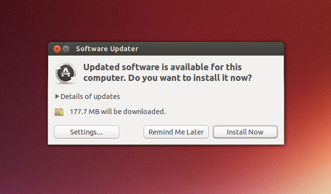

<!-- PA0 is a guide to GNU/Linux development environment configuration.
You are guided to install a GNU/Linux development environment.
All PAs and Labs are done in this environment.
 If you are new to GNU/Linux, and you encounter some troubles during the configuration,
which are not mentioned in this lecture note (such as "No such file or directory"), that is your fault.
Go back to read this lecture note carefully.
 Remember, the machine is always right! -->

PA0 — руководство по настройке среды разработки GNU/Linux.
Вас проводят через установку среды разработки GNU/Linux.
Все PA и лабораторные работы выполняются в этой среде.
 Если вы новичок в GNU/Linux и во время настройки сталкиваетесь с проблемами,
которые не упомянуты в этих материалах (например, "No such file or directory"), это ваша вина.
Вернитесь и внимательно перечитайте эти материалы.
 Помните: машина всегда права!

<!-- > #### hint::Infobox description
> There are information boxes in the handouts, whose color and icon in the upper left corner indicate the type of information.
> For example, this infobox is for tips and hints. Other categories include
> > #### flag::Tips related to the progress of the experiment
>
>
> > #### comment::Further Reading
>
>
> > #### question::optional questionnaire
>
>
> > #### option::optional programming question
>
>
> > #### todo::Mandatory contents of the lab
>
>
> > #### danger::Must-read information related to the progress of the lab
>
>
> > #### caution::Principles and Methods of Importance Beyond Labs -->

> #### hint::Описание информационных блоков
> В хендаутах встречаются информационные блоки: их цвет и значок в левом верхнем углу указывают тип информации.
> Например, этот блок — для подсказок. Другие категории включают
> > #### flag::Подсказки, связанные с ходом эксперимента
>
>
> > #### comment::Дополнительное чтение
>
>
> > #### question::необязательный опросник
>
>
> > #### option::необязательная задача по программированию
>
>
> > #### todo::Обязательное содержание лабораторной
>
>
> > #### danger::Обязательная к прочтению информация, связанная с ходом лабораторной
>
>
> > #### caution::Принципы и методы, важность которых выходит за рамки лабораторных

<!-- > #### caution::Yes, you read that right, except for some important information, the PA0 lab handouts are all in English!
> With the development of science and technology, the use of English in international academic exchanges has become the norm.
> Top papers are invariably written in English, and internationally recognized classics in the field of computing are written in English.
> Top papers are not translated into Chinese; if you need information, you should read it in English rather than wait for a translation to be published.
> "I'm Chinese, I only read Chinese" is no longer the trend of the times, and it is important to be on the cutting edge of the times.
> The ability to read materials in English is indispensable to stay at the forefront of the times.
>
> Reading English materials is simply a matter of "looking up words you don't know in the dictionary, and reading sentences you don't understand over and over again".
> Nowadays, there are all kinds of dictionaries available on the Internet, but improving your English reading skills is a matter of persistence.
> "At first, I felt inefficient in reading English" is an unavoidable experience for all Chinese people.
> If you find yourself surrounded by great readers who can read English materials with ease, it's because they've already overcome these difficulties.
> To quote Mr. Chen Daoxu: stick with it for one year, and you'll see a difference; stick with it for two years, and you'll see a big difference.
>
> Leaving aside these lofty topics, what does reading English materials have to do with you?
> Yes! Because what accompanies you in PA is that there are no Chinese versions of various manuals (e.g. [riscv manual](https://github.com/riscv/riscv-isa-manual/releases/download/draft-20210813-7d0006e/riscv-spec. pdf)).
> And of course `man': if you are not willing to read English materials, you are not destined to complete PA on your own.
>
> As a transition, we have prepared a full English version of PA0.
> The purpose of PA0 is to configure the environment and familiarize yourself with how things work under GNU/Linux.
> The steps involved are operational, and you don't need to think about deep questions in order to complete PA0.
> You need to complete PA0 on your own, so please read each character in the handout carefully and follow the instructions:
> When the handout mentions searching for something on the Internet, you search for it on the Internet.
> If you make a mistake, please read the handout carefully and repeatedly, <u>The machine is always right</u>.
> If you are a first time user of GNU/Linux, you will need to consult a lot of information or tutorials to learn how to use some of the new tools.
> This takes a lot of time (e.g. you might need to spend an afternoon, just to type two lines in a file using `vim`).
> It's like reading material in English, you'll feel inefficient at first, but over time you'll become more and more proficient with these tools.
> On the contrary, if you complete your PA0 by "tricking" yourself, you will immediately run into trouble in PA1.
> As etone said, your professional inferiority will come back to haunt you sooner or later.
>
> Also, PA0's handouts only give procedures, they do not explain the details and principles of these operations.
> If you want to know about them, please search for them on the Internet. -->

> #### caution::Да, вы прочитали правильно: кроме некоторой важной информации, хендауты лабораторной PA0 целиком на английском!
> С развитием науки и техники использование английского в международном академическом общении стало нормой.
> Лучшие статьи неизменно пишутся на английском, и международно признанная классика в области вычислительной техники написана на английском.
> Лучшие статьи не переводят на китайский; если вам нужна информация, вы должны читать её на английском, а не ждать публикации перевода.
> «Я китаец, я читаю только по-китайски» больше не соответствует духу времени, и важно быть на переднем крае эпохи.
> Умение читать материалы на английском необходимо, чтобы оставаться в авангарде времени.
>
> Чтение английских материалов сводится к тому, чтобы «незнакомые слова смотреть в словаре, а непонятные предложения читать снова и снова».
> Сейчас в интернете полно всевозможных словарей, но улучшение навыка чтения по-английски — дело настойчивости.
> «Сначала я чувствовал, что читаю по-английски неэффективно» — неизбежный опыт для всех китайцев.
> Если вокруг вас крутые ребята, которые легко читают английские материалы, это потому, что они уже преодолели эти трудности.
> Процитируем господина Чэнь Даосюя: продержитесь год — и увидите разницу; продержитесь два года — и увидите огромную разницу.
>
> Отложив эти возвышенные темы, какое отношение чтение английских материалов имеет к вам?
> Имеет! Потому что в PA вас сопровождают различные руководства, у которых нет китайских версий (например, [руководство riscv](https://github.com/riscv/riscv-isa-manual/releases/download/draft-20210813-7d0006e/riscv-spec. pdf)).
> И конечно `man`: если вы не готовы читать английские материалы, вам не суждено самостоятельно завершить PA.
>
> В качестве перехода мы подготовили полностью английскую версию PA0.
> Цель PA0 — настроить среду и освоиться с тем, как всё устроено в GNU/Linux.
> Задействованные шаги — операционные, и вам не нужно размышлять над глубокими вопросами, чтобы выполнить PA0.
> Вам нужно выполнить PA0 самостоятельно, поэтому внимательно прочитайте каждый символ в хендауте и следуйте инструкциям:
> Когда хендаут упоминает поиск чего-либо в интернете, вы ищете это в интернете.
> Если вы допустили ошибку, внимательно и многократно перечитайте хендаут, <u>Машина всегда права</u>.
> Если вы впервые пользуетесь GNU/Linux, вам потребуется обратиться ко множеству материалов или руководств, чтобы научиться пользоваться некоторыми новыми инструментами.
> На это уходит много времени (например, вы можете потратить полдня, только чтобы набрать две строки в файле с помощью `vim`).
> Это как чтение материалов на английском: сначала будет казаться неэффективно, но со временем вы будете всё свободнее владеть этими инструментами.
> Напротив, если вы выполните PA0, «обманывая» себя, вы сразу столкнётесь с проблемами в PA1.
> Как сказал etone, ваша профессиональная отсталость рано или поздно настигнет вас.
>
> Кроме того, хендауты PA0 дают только процедуры, они не объясняют детали и принципы этих операций.
> Если вы хотите узнать о них, ищите их в интернете.

<!-- We are going to install the [Ubuntu 22.04][ubuntu] distribution directly over your physical machine.
If you already have one copy of GNU/Linux distribution,
and you want to use your copy as the development environment, just use it!
But if you encounter some troubles because of platform disparity,
please search the Internet for trouble-shooting.

It is also OK to use virtual machines, such as VMWare or VirtualBox.
If you decide to do this and you do not have a copy of GNU/Linux,
please install [Ubuntu][ubuntu] distribution in the virtual machine.
Also, please search the Internet for trouble-shooting if you have any problems about virtual machines. -->

Мы собираемся установить дистрибутив [Ubuntu 22.04][ubuntu] напрямую на вашу физическую машину.
Если у вас уже есть копия дистрибутива GNU/Linux
и вы хотите использовать её как среду разработки — просто используйте её!
Но если вы столкнётесь с проблемами из-за различий платформ,
ищите в интернете способы устранения неполадок.

Также допустимо использовать виртуальные машины, такие как VMWare или VirtualBox.
Если вы решите так сделать и у вас нет копии GNU/Linux,
установите дистрибутив [Ubuntu][ubuntu] на виртуальную машину.
Также ищите в интернете способы устранения неполадок, если у вас возникнут проблемы с виртуальными машинами.

[ubuntu]: https://ubuntu.com

<!-- > #### danger::You must use 64-bit GNU/Linux with a GUI.
> If you plan to use an existing GNU/Linux platform, make sure it is 64-bit. Some features of PA will depend on 64-bit platforms and graphical displays. -->

> #### danger::Вы должны использовать 64-битный GNU/Linux с GUI.
> Если вы планируете использовать уже имеющуюся платформу GNU/Linux, убедитесь, что она 64-битная. Некоторые возможности PA зависят от 64-битных платформ и графического отображения.

<!-- > #### hint::Some reasons to use a native GNU/Linux machine(not a VM).
> * A real machine is more stable than a virtual machine (e.g. [crash consistency](https://en.wikipedia.org/wiki/Data_consistency), etc.).
> * The performance of a real machine will be higher than a virtual machine (but it doesn't affect the experiment score),
> * The real machine is a good choice if you want to get a smoother gaming experience in the later stages of the experiment. -->

> #### hint::Некоторые причины использовать нативную машину GNU/Linux (не VM).
> * Реальная машина стабильнее виртуальной (например, [crash consistency](https://en.wikipedia.org/wiki/Data_consistency) и т.п.).
> * Производительность реальной машины будет выше, чем у виртуальной (но это не влияет на оценку за эксперимент),
> * Реальная машина — хороший выбор, если вы хотите более плавный игровой опыт на поздних этапах эксперимента.

<!-- > #### hint::Recommended to experience the OS installation on real machine
> Although you don't study computer science to fix computers and install systems, it's not a good idea to tell your relatives you're in computer science program while you've never installed an OS.
> Now is your chance, if you have never installed an operating system before,
> We strongly recommend that you try install an OS on a real computer to get a feel for what it takes to install an operating system. -->

> #### hint::Рекомендуется пройти установку ОС на реальной машине
> Хотя вы изучаете информатику не для того, чтобы чинить компьютеры и ставить системы, не очень хорошо говорить родственникам, что вы на программе по информатике, если вы никогда не устанавливали ОС.
> Сейчас ваш шанс: если вы раньше никогда не устанавливали операционную систему,
> мы настоятельно рекомендуем попробовать установить ОС на реальный компьютер, чтобы прочувствовать, что нужно для установки операционной системы.

<!-- > #### hint::Mac users' misfortune
> The digital circuits lab course offered in conjunction with ICS requires the `Vivado/Quartus` tools to perform the labs, but unfortunately neither of these tools is available for the Mac.
> Unfortunately, neither of these tools is available for Mac.
> In order to use them, you have to install Windows or GNU/Linux.
> So, why not kill two birds with one stone, and install a real GNU/Linux machine now, and solve all the above problems.
>
> If you don't have to take the NJU course, you can ignore this problem. -->

> #### hint::Несчастье пользователей Mac
> Лабораторный курс по цифровым схемам, который идёт вместе с ICS, требует инструменты `Vivado/Quartus` для выполнения лабораторных, но к сожалению ни один из этих инструментов недоступен для Mac.
> К сожалению, ни один из этих инструментов недоступен для Mac.
> Чтобы ими пользоваться, вам нужно установить Windows или GNU/Linux.
> Так почему бы не убить двух зайцев одним выстрелом: поставить сейчас реальную машину GNU/Linux и решить все перечисленные проблемы.
>
> Если вам не нужно проходить курс NJU, можете проигнорировать эту проблему.

<!-- ## Preparation -->

## Подготовка

<!-- > #### danger:: First of all, of course, backup your important data!
> If you are installing an operating system for the first time, you may have deleted important files on your disk by mistake.
> Backing up your data is definitely a very important operation, so that later on you can experiment with the installation process and do whatever you want with it.
>
> Of course, even if your installation appears to be correct, it is possible that a hardware compatibility issue may prevent the operating system from booting.
> If this does happen, search the Internet for a solution.
> Therefore, it's important to get started with PA0 as soon as possible. -->

> #### danger:: Прежде всего, разумеется, сделайте резервную копию важных данных!
> Если вы устанавливаете операционную систему впервые, вы можете по ошибке удалить важные файлы на диске.
> Резервное копирование данных — безусловно очень важная операция, чтобы потом вы могли экспериментировать с процессом установки и делать с ним всё, что захотите.
>
> Конечно, даже если ваша установка выглядит правильной, проблема совместимости оборудования может помешать загрузке операционной системы.
> Если это всё же случится, ищите решение в интернете.
> Поэтому важно как можно скорее приступить к PA0.

<!-- Please reserve at least one partitions (20GB ~ 50GB) on the disk for Ubuntu to install.
If you want to install `Vivado/Quartus` in Ubuntu,
please reserve about 100GB of disk space.
For how to do this, please search the Internet.
For example, if you use Windows, you can search for `压缩卷 Windows`. -->

Зарезервируйте на диске как минимум один раздел (20GB ~ 50GB) для установки Ubuntu.
Если вы хотите установить `Vivado/Quartus` в Ubuntu,
зарезервируйте около 100GB дискового пространства.
Как это сделать — ищите в интернете.
Например, если вы используете Windows, можете поискать `压缩卷 Windows`.

<!-- ## Installing Ubuntu -->

## Установка Ubuntu

<!-- Please search the Internet for "Ubuntu 22.04 installation" and follow the tutorial. -->

Ищите в интернете "Ubuntu 22.04 installation" и следуйте руководству.

<!-- > #### hint::Can I choose another version of Ubuntu?
> Yes, you can. However, the version of tools in different versions of Ubuntu may differ slightly, especially the compiler GCC.
> If you choose a different version, you may encounter a few problems with it, but this will not significantly affect the experiment. -->

> #### hint::Могу ли я выбрать другую версию Ubuntu?
> Да, можете. Однако версии инструментов в разных версиях Ubuntu могут немного отличаться, особенно компилятор GCC.
> Если вы выберете другую версию, можете столкнуться с небольшим числом проблем из-за этого, но это существенно не повлияет на эксперимент.

<!-- > #### danger::Select English, not Chinese, when choosing a language.
> Using Chinese system environment will bring inconvenience to some command line operations, and even increase the difficulty of troubleshooting errors.
> Every year, some students who choose Chinese environment are unable to find effective solutions on the Internet when the tool reports errors, which affects the progress of the experiment.
>
> In fact, even in an English system, it is possible to type in Chinese by installing a Chinese output method. -->

> #### danger::При выборе языка выберите English, а не Chinese.
> Использование китайского системного окружения создаст неудобства для некоторых операций командной строки и даже усложнит поиск ошибок.
> Каждый год некоторые студенты, выбравшие китайское окружение, не могут найти в интернете рабочие решения, когда инструмент сообщает об ошибках, что влияет на ход эксперимента.
>
> На самом деле даже в английской системе можно вводить китайский, установив китайский метод вывода.

<!-- > #### danger::Do not use Ubuntu's Software Updater
> After completing the installation and logging in to Ubuntu for the first time, Software Updater will pop up a reminder box to remind the user to update the software (as shown in the figure below)
> Be sure to ignore the prompt and do not click "Install".
> Otherwise the installation will change the state of the package manager in Ubuntu.
> This will conflict with the subsequent instructions in the handout, and will eventually cause the system to crash and not be accessible again.
>
> 
>
> It is recommended to disable the Software Updater function so that it does not prompt you, please search for a solution on the Internet.
> Thank you to Ho-Lun Peng, Class of 2020, for identifying this issue. -->

> #### danger::Не используйте Software Updater Ubuntu
> После завершения установки и первого входа в Ubuntu Software Updater покажет напоминание обновить ПО (как показано на рисунке ниже)
> Обязательно проигнорируйте подсказку и не нажимайте "Install".
> Иначе установка изменит состояние менеджера пакетов в Ubuntu.
> Это войдёт в конфликт с последующими инструкциями в хендауте и в итоге приведёт к падению системы, после которого в неё нельзя будет войти снова.
>
> 
>
> Рекомендуется отключить функцию Software Updater, чтобы она больше не предлагала обновления; ищите решение в интернете.
> Спасибо Хо-Лунь Пэну, выпуск 2020, за обнаружение этой проблемы.
