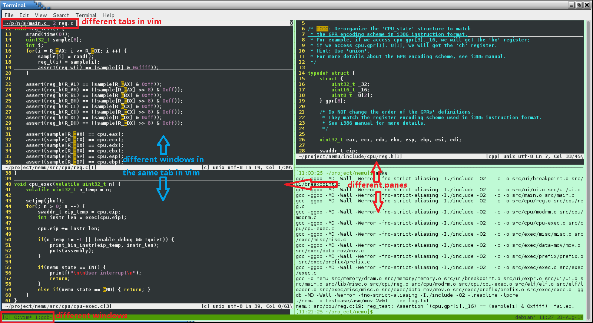

<!-- ## More Exploration -->

## Дальнейшее знакомство

<!-- ### Learning to use basic tools -->

### Изучение базовых инструментов

<!-- After installing tools for PAs, it is time to explore GNU/Linux again!
[Here](linux.md) is a small tutorial for GNU/Linux written by jyy.
If you are new to GNU/Linux, read the tutorial carefully,
and most important, try every command mentioned in the tutorial.
 <font color=red>Remember, you can not learn anything by only reading the tutorial.</font>
Besides, [鸟哥的Linux私房菜][vbird] is a book suitable for freshman in GNU/Linux.
Another book recommended by us is [Harley Hahn's Guide to Unix and Linux][Harley Hahn]. -->

После установки инструментов для PA пора снова исследовать GNU/Linux!
[Здесь](linux.md) небольшое руководство по GNU/Linux, написанное jyy.
Если вы новичок в GNU/Linux, внимательно прочитайте руководство
и, самое важное, попробуйте каждую команду, упомянутую в руководстве.
 <font color=red>Помните: вы ничему не научитесь, только читая руководство.</font>
Кроме того, [鸟哥的Linux私房菜][vbird] — книга, подходящая для новичка в GNU/Linux.
Ещё одна книга, которую мы рекомендуем, — [Harley Hahn's Guide to Unix and Linux][Harley Hahn].

[vbird]: http://linux.vbird.org/linux_basic
[Harley Hahn]: http://www.harley.com/books/sg3.html

<!-- > #### caution::RTFM
> The most important command in GNU/Linux is `man` - the on-line manual pager.
> This is because `man` can tell you how to use other commands.
> [Here](man.md) is a small tutorial for `man`.
> Remember, <font color=red>learn to use `man`, learn to use everything.</font>
> Therefore, if you want to know something about GNU/Linux (such as shell commands,
> system calls, library functions, device files, configuration files...), [RTFM][rtfm]. -->

> #### caution::RTFM
> Самая важная команда в GNU/Linux — `man` — постраничник онлайн-руководства.
> Потому что `man` может сказать вам, как пользоваться другими командами.
> [Здесь](man.md) небольшое руководство по `man`.
> Помните: <font color=red>научитесь пользоваться `man` — научитесь пользоваться всем.</font>
> Поэтому, если вы хотите узнать что-то о GNU/Linux (например, команды оболочки,
> системные вызовы, библиотечные функции, файлы устройств, конфигурационные файлы...), [RTFM][rtfm].

[rtfm]: http://en.wikipedia.org/wiki/RTFM

<!-- > #### caution::Why RTFM?
> RTFM is the elder of STFW, and was an effective way to solve problems in the days when the Internet wasn't very popular.
> This is because the manual contains <font color="red">all</font> information about the object being looked up.
> The answers to <font color="red">everything</font> about the objects can be found in the manual.
>
> You may find it too much of a hassle to go through the manual, so you may try to find a solution by searching a random blog on Baidu.
> However, you need to be clear about the following.
> * The blog you found may be a reprint of someone else's, and may be full of flaws.
> * The blogger is just sharing his experience, and some of the claims may not be accurate.
> * If you find something relevant, it may not be a comprehensive description.
>
> Most importantly, when you try the above and it doesn't solve the problem
> you need to make it clear that "I was just trying to take a shortcut, looks like I need to try RTFM". -->

> #### caution::Зачем RTFM?
> RTFM — старший родственник STFW и был эффективным способом решать проблемы в дни, когда интернет ещё не был очень популярен.
> Потому что руководство содержит <font color="red">всю</font> информацию об искомом объекте.
> Ответы на <font color="red">всё</font> об объектах можно найти в руководстве.
>
> Вам может казаться слишком хлопотным листать руководство, поэтому вы можете попытаться найти решение, поискав случайный блог на Baidu.
> Однако нужно ясно понимать следующее.
> * Блог, который вы нашли, может быть перепечаткой чужого и может быть полон изъянов.
> * Блогер просто делится своим опытом, и некоторые утверждения могут быть неточными.
> * Если вы нашли что-то релевантное, это может быть неполное описание.
>
> Самое важное: когда вы пробуете вышеперечисленное и это не решает проблему,
> вам нужно ясно сказать себе: «Я просто пытался срезать путь, похоже, нужно попробовать RTFM».

<!-- > #### todo::Write a "Hello World" program under GNU/Linux
> Write a "Hello World" program, compile it, then run it under GNU/Linux.
> If you do not know what to do, refer to the GNU/Linux tutorial above. -->

> #### todo::Напишите программу "Hello World" в GNU/Linux
> Напишите программу "Hello World", скомпилируйте её, затем запустите в GNU/Linux.
> Если не знаете, что делать, обратитесь к руководству по GNU/Linux выше.


<!-- > #### todo::Write a Makefile to compile the "Hello World" program
> Write a Makefile to compile the "Hello World" program above.
> If you do not know what to do, refer to the GNU/Linux tutorial above. -->

> #### todo::Напишите Makefile для компиляции программы "Hello World"
> Напишите Makefile для компиляции программы "Hello World" выше.
> Если не знаете, что делать, обратитесь к руководству по GNU/Linux выше.

<!-- Now, stop here. [Here][gdb tutorial] is a small tutorial for GDB.
GDB is the most common used debugger under GNU/Linux.
If you have not used a debugger yet (even in Visual Studio),
blame the Fundamentals of Programming course first, then blame yourself,
and finally, <font color=red>read the tutorial to learn to use GDB</font>. -->

Теперь остановитесь здесь. [Здесь][gdb tutorial] небольшое руководство по GDB.
GDB — самый распространённый отладчик в GNU/Linux.
Если вы ещё не пользовались отладчиком (даже в Visual Studio),
сначала вините курс «Основы программирования», потом вините себя
и наконец <font color=red>прочитайте руководство, чтобы научиться пользоваться GDB</font>.

[gdb tutorial]: https://linuxconfig.org/gdb-debugging-tutorial-for-beginners

<!-- > #### todo::Learn to use GDB
> Read the GDB tutorial above and use GDB following the tutorial.
> In PA1, you will be required to implement a simplified version of GDB.
> If you have not used GDB, you may have no idea to finish PA1. -->

> #### todo::Научитесь пользоваться GDB
> Прочитайте руководство по GDB выше и пользуйтесь GDB по этому руководству.
> В PA1 от вас потребуют реализовать упрощённую версию GDB.
> Если вы не пользовались GDB, у вас может не быть идей, как закончить PA1.


<!-- > #### danger::Hey! Don't be lazy!
> We tell you above to write a "Hello World" program, then write a Makefile to compile it
> And watch the tutorial to learn the basics of GDB! -->

> #### danger::Эй! Не ленитесь!
> Выше мы говорим вам написать программу "Hello World", затем написать Makefile, чтобы её скомпилировать
> И посмотреть руководство, чтобы выучить основы GDB!

<!-- ### Installing tmux -->

### Установка tmux

<!-- `tmux` is a terminal multiplexer.
With it, you can create multiple terminals in a single screen.
It is very convenient when you are working with a high resolution monitor.
To install `tmux`, just issue the following command: -->

`tmux` — мультиплексор терминалов.
С ним вы можете создать несколько терминалов на одном экране.
Это очень удобно, когда вы работаете с монитором высокого разрешения.
Чтобы установить `tmux`, просто выполните следующую команду:
```
apt-get install tmux
```
<!-- Now you can run `tmux`, but let's do some configuration first.
Go back to the home directory: -->

Теперь вы можете запустить `tmux`, но сначала давайте немного настроим.
Вернитесь в домашний каталог:
```
cd ~
```
<!-- New a file called `.tmux.conf`: -->

Создайте файл с именем `.tmux.conf`:
```
vim .tmux.conf
```
<!-- Append the following content to the file: -->

Допишите в файл следующее содержимое:
```
bind-key c new-window -c "#{pane_current_path}"
bind-key % split-window -h -c "#{pane_current_path}"
bind-key '"' split-window -c "#{pane_current_path}"
```
<!-- These three lines of settings make `tmux` "remember" the current working directory
of the current pane while creating new window/pane.

Maximize the terminal windows size, then use `tmux`
to create multiple normal-size terminals within single screen.
For example, you may edit different files in different directories simultaneously.
You can edit them in different terminals, compile them or execute other commands in another terminal,
without opening and closing source files back and forth.
You can scroll the content in a `tmux` terminal up and down.
For how to use `tmux`, please STFW. -->

Эти три строки настроек заставляют `tmux` «запоминать» текущий рабочий каталог
текущей панели при создании нового окна/панели.

Разверните окно терминала на весь экран, затем используйте `tmux`,
чтобы создать несколько терминалов обычного размера на одном экране.
Например, вы можете одновременно редактировать разные файлы в разных каталогах.
Можете редактировать их в разных терминалах, компилировать их или выполнять другие команды в другом терминале,
не открывая и не закрывая исходные файлы туда-сюда.
Вы можете прокручивать содержимое терминала `tmux` вверх и вниз.
Как пользоваться `tmux` — пожалуйста, STFW.

<!-- > #### caution::STFW again?
> Yes.
>
> In addition to consolidating your knowledge in ICS theory classes, PA has an important mission:
> To train you to be a qualified CSer.
> In fact, a qualified CSer needs to be able to search for solutions independently.
> This is one of the basic requirements for programmers in IT companies and research organizations.
> Your future boss will probably give you a task directly
> If you ask for help whenever you have a problem, your boss will think that you can't create value.
>
> PA is trying to get you to focus on these basic requirements that are valued by both industry and academia, so that you can develop these skills and mindsets.
> When you encounter a problem, your first thought is not to find a master to help you solve it, but "Let me try STFW and RTFM, see if I can solve it by myself".
> So PA is not a step-by-step middle school lab, and <font color=red>don't complain that the handout wasn't clear and caused you to go off on a tangent</font>, we did it on purpose.
> We'll try to keep the road from getting too curvy, and if you're in the right frame of mind, you're capable of solving these problems on your own.
> What's important is that you accept the fact that the detours you've taken are indicative of your improvement.
> The only way to minimize your future mistakes, is if you take the journey seriously now. -->

> #### caution::Опять STFW?
> Да.
>
> Помимо закрепления знаний с теоретических занятий ICS, у PA есть важная миссия:
> воспитать из вас квалифицированного CS-ера.
> На самом деле квалифицированному CS-ера нужно уметь самостоятельно искать решения.
> Это одно из базовых требований к программистам в IT-компаниях и научных организациях.
> Ваш будущий начальник, вероятно, просто даст вам задачу
> Если вы будете просить помощи всякий раз, когда возникнет проблема, начальник решит, что вы не можете создавать ценность.
>
> PA пытается заставить вас сосредоточиться на этих базовых требованиях, которые ценят и индустрия, и академия, чтобы вы развили эти навыки и установки.
> Когда вы сталкиваетесь с проблемой, первая мысль — не найти мастера, который поможет решить, а «Дай-ка я попробую STFW и RTFM, посмотрю, смогу ли решить сам».
> Так что PA — не пошаговая школьная лабораторная, и <font color=red>не жалуйтесь, что хендаут был неясным и из-за этого вы свернули не туда</font>, мы сделали это нарочно.
> Мы постараемся, чтобы дорога не была слишком извилистой, и если у вас правильный настрой, вы способны решать эти проблемы самостоятельно.
> Важно принять тот факт, что крюки, которые вы наделали, указывают на то, что вам есть куда расти.
> Единственный способ меньше ошибаться в будущем — если вы сейчас серьёзно пройдёте этот путь.

<!-- > #### caution::The Wisdom of Asking Questions / Don't Ask Questions Like a Retard
> Another criterion for a qualified CSer is to know how to ask questions.
>
> As a CSer, I'm sure you've been asked how to fix computers before.
> For example, if you have a liberal arts partner who QQ's you and says "I'm having trouble with my computer" and asks you to fix it for him
> Then you have to ask questions to find out what the problem is, and then you ask him to try various options, and then you ask him to give you feedback on what he's tried.
> If you had 10 of these guys, you'd be sick of it.
> Now you know what it's like to be a TA.
>
> In fact, if one wants to increase the probability of getting an answer, the questioner should learn how to ask better questions.
> In other words, the questioner should think seriously on what they asked.
> "<font color=blue>What I can do proactively to make it easier for the other person to help me diagnose the problem</font>".
> It's true that your liberal arts partner isn't a computer science major, and you can choose to forgive him
> But you're a CSer, so at least describe the symptoms and what you've tried to do
> Instead of just throwing in "my program is down" and waiting for someone else to save the day.
> You'll probably need to ask for help in your future career, such as posting an issue on github
> or posting on a forum like stackoverflow, or emailing a technical engineer, etc.
>  <font color=red>If you ask a question in a very unprofessional way, it's likely that no one will want to pay attention to your question.
> Because not only does it make it seem like your random questions aren't that important.
> And people don't want to spend a lot of time consulting back and forth with you.</font>.
>
> A recommended way of asking the question is as follows.
> ```
> I encountered the error xxx at xxx. This error can be reproduced by the following steps: (describe the specific situation)
> 1. My system version is xxx, and the relevant tool version is xxx.
> 2. I did xxx (post a picture if necessary)
> 3. then xxx (post a picture if necessary)
> ...
> In order to troubleshoot this error, I made the following attempts: (to show that I really hope to solve the problem, really have no choice but to ask the question)
> 1. I did xxx and got xxx results (post a picture if necessary)
> 2. I also did xxx, and got xxx results (post a picture if necessary)
> ...
> If finally the problem is not solved, what else do I need to do?
> ```
> Also be sure to read [how to ask][how to ask] and [stop ask][stop ask]
> There are a number of examples in there for you to look at. -->

> #### caution::Мудрость задавания вопросов / Не задавайте вопросы как идиот
> Ещё один критерий квалифицированного CS-ера — уметь задавать вопросы.
>
> Как CS-ер, вы наверняка уже сталкивались с просьбами починить компьютер.
> Например, если у вас есть знакомый-гуманитарий, который пишет вам в QQ «у меня проблемы с компьютером» и просит починить
> Тогда вам приходится задавать вопросы, чтобы понять, в чём проблема, потом просить его пробовать разные варианты, потом просить обратную связь по тому, что он пробовал.
> Если бы у вас было 10 таких ребят, вам бы это надоело.
> Теперь вы знаете, каково быть ассистентом (TA).
>
> На самом деле, если хочется повысить вероятность получить ответ, спрашивающий должен научиться лучше задавать вопросы.
> Другими словами, спрашивающий должен серьёзно подумать о том, что он спросил.
> «<font color=blue>Что я могу сделать заранее, чтобы другому человеку было проще помочь мне диагностировать проблему</font>».
> Да, ваш знакомый-гуманитарий не учится на информатике, и вы можете его простить
> Но вы CS-ер, так что как минимум опишите симптомы и что вы уже пробовали
> А не просто бросайте «моя программа упала» и ждите, пока кто-то спасёт ситуацию.
> В будущей карьере вам, вероятно, тоже придётся просить помощи: например, открывать issue на github,
> писать на форуме вроде stackoverflow или писать инженеру и т.д.
>  <font color=red>Если вы задаёте вопрос очень непрофессионально, скорее всего никто не захочет обращать на него внимание.
> Потому что это не только создаёт впечатление, что ваши случайные вопросы не так уж важны.
> И люди не хотят тратить много времени на переписку с вами туда-сюда.</font>.
>
> Рекомендуемый способ задать вопрос таков.
> ```
> Я столкнулся с ошибкой xxx в xxx. Эту ошибку можно воспроизвести следующими шагами: (опишите конкретную ситуацию)
> 1. Версия моей системы — xxx, версия соответствующего инструмента — xxx.
> 2. Я сделал xxx (при необходимости приложите картинку)
> 3. затем xxx (при необходимости приложите картинку)
> ...
> Чтобы разобраться с этой ошибкой, я предпринял следующие попытки: (чтобы показать, что я действительно хочу решить проблему и спрашиваю только потому, что другого выхода нет)
> 1. Я сделал xxx и получил результат xxx (при необходимости приложите картинку)
> 2. Я также сделал xxx и получил результат xxx (при необходимости приложите картинку)
> ...
> Если в итоге проблема не решена, что ещё мне нужно сделать?
> ```
> Также обязательно прочитайте [how to ask][how to ask] и [stop ask][stop ask]
> Там есть ряд примеров, на которые можно посмотреть.

[how to ask]: https://github.com/ryanhanwu/How-To-Ask-Questions-The-Smart-Way/blob/master/README-zh_CN.md
[stop ask]: https://github.com/tangx/Stop-Ask-Questions-The-Stupid-Ways/blob/master/README.md

<!-- The following picture shows a scene working with multiple terminals within single screen.
Is it COOL? -->

Следующая картинка показывает сцену работы с несколькими терминалами на одном экране.
Круто?



<!-- > #### caution::Why use tmux?
> This is actually an example of "using the right tool for the job".
>
> Computers are built for users, and whenever you have a need, you can think, "Is there a tool that can help me do that?
> We want each terminal to do different things, to be able to see everything on the screen, and to be able to switch between terminals quickly.
> In fact, with STFW and RTFM you can learn how to use the right tool. You just have to search for it on a search engine.
> You can find `tmux` as a result by searching for "Linux terminal split screen"
> Then search for "tmux tutorials" to learn the basics of using `tmux'.
> Type `man tmux` in the terminal to check any questions about `tmux`.
>
> Of course, learning doesn't come at no cost. A former student suggested a way to split the screen at no cost.
> Open four terminals, and drag them to the four corners of the screen,
> Since Alt+Tab shortcut does not allow you to select a window easily(because all four windows look the same), he switch between them by clicking with the mouse.
> Then he described installing and learning `tmux` as a redundant.
>
> The whole point of `tmux` is to save the user the cost of doing this.
> If you're not willing to pay any learning costs, you won't be able to enjoy the tool. -->

> #### caution::Зачем пользоваться tmux?
> Это на самом деле пример «использовать правильный инструмент для работы».
>
> Компьютеры созданы для пользователей, и когда у вас есть потребность, вы можете подумать: «Есть ли инструмент, который поможет мне это сделать?»
> Мы хотим, чтобы каждый терминал делал разное, чтобы всё было видно на экране и чтобы можно было быстро переключаться между терминалами.
> На самом деле с STFW и RTFM вы можете научиться пользоваться правильным инструментом. Нужно просто поискать его в поисковике.
> Вы можете найти `tmux` в результате, поискав "Linux terminal split screen"
> Затем поищите "tmux tutorials", чтобы выучить основы использования `tmux`.
> Введите `man tmux` в терминале, чтобы разобрать любые вопросы о `tmux`.
>
> Конечно, обучение не даётся бесплатно. Бывший студент предложил способ разделить экран без затрат на обучение.
> Откройте четыре терминала и перетащите их в четыре угла экрана,
> поскольку сочетание Alt+Tab не позволяет легко выбрать окно (потому что все четыре окна выглядят одинаково), он переключался между ними кликом мыши.
> Затем он описал установку и изучение `tmux` как лишнее.
>
> Весь смысл `tmux` — сэкономить пользователю стоимость таких действий.
> Если вы не готовы платить никакую цену обучения, вы не сможете насладиться инструментом.

<!-- > #### question::Things behind scrolling
> You should have used scroll bars in GUI.
> You may take this for granted.
> So you may consider the original un-scrollable terminal (the one you use when you just log in) the hell.
> But think of these: why the original terminal can not be scrolled?
> How does `tmux` make the terminals scrollable?
> And last, do you know how to implement a scroll bar?
>
> GUI is not something mysterious.
> Remember, behind every elements in GUI, there is a story about it.
> Learn the story, and you will learn a lot.
> You may say "I just use GUI, and it is unnecessary to learn the story."
> Yes, you are right.
> The appearance of GUI is to hide the story for users.
> But almost everyone uses GUI in the world,
> and that is why you can not tell the difference between you and them. -->

> #### question::Что стоит за прокруткой
> Вы наверняка пользовались полосами прокрутки в GUI.
> Вы можете принимать это как само собой разумеющееся.
> Поэтому исходный непрокручиваемый терминал (тот, которым вы пользуетесь сразу после входа) можете считать адом.
> Но подумайте вот о чём: почему исходный терминал нельзя прокручивать?
> Как `tmux` делает терминалы прокручиваемыми?
> И наконец, знаете ли вы, как реализовать полосу прокрутки?
>
> GUI — не что-то таинственное.
> Помните: за каждым элементом GUI стоит своя история.
> Изучите историю — и узнаете многое.
> Вы можете сказать: «Я просто пользуюсь GUI, учить историю незачем».
> Да, вы правы.
> Появление GUI как раз для того, чтобы спрятать историю от пользователей.
> Но GUI пользуется почти весь мир,
> и поэтому вы не можете отличить себя от них.

<!-- ### Why GNU/Linux and How to -->

### Почему GNU/Linux и как им пользоваться

<!-- > #### caution::Why use Linux?
> Let's start with two examples.
>
> **How to compare if two files are identical?**
> This example looks very simple and can be realized under Linux using the `diff` command.
> If the files are large, it is useful to use `md5sum` to calculate and compare their MD5.
> For a Linux user, it takes about 3 seconds to type these commands.
> But on Windows, this is not so easy to do.
> Maybe you downloaded an MD5 calculator, but how many mouse clicks do you need to do the comparison?
> Maybe you're thinking it won't save you much time.
> The truth is, however, <font color=red>that's how your development efficiency decreases</font>.
>
> **How to List All Included Header Files in a C Project?**
> This example is slightly more complicated than the one just described, but you can hardly do it efficiently on Windows.
> In Linux, we can do this with a single line of command:
> ```
> find . -name "*.[ch]" | xargs grep "#include" | sort | uniq
> ```
> By looking at `man`, you should have no trouble understanding how the above command accomplishes the desired function.
> This example is another example of the Unix philosophy.
> * Each tool does one thing, but does it well.
> * Tools are easy to use by using text-based inputs and outputs.
> * Solve complex problems by combining tools.
>
> The last point of the Unix philosophy best describes the difference between Linux and Windows: <font color=blue>Programability</font>.
> If you compare tools to functions in code, combining tools is a form of programming.
> But Windows tools are almost impossible to combine, because Windows for the average user needs to emphasize ease of use.
>
> So, the reason you should use Linux is very simple. <font color=red>As a coder.
> Windows has always been an obstacle to your ability to think, act, and be productive.</font> -->

> #### caution::Зачем пользоваться Linux?
> Начнём с двух примеров.
>
> **Как сравнить, идентичны ли два файла?**
> Этот пример выглядит очень простым и в Linux реализуется командой `diff`.
> Если файлы большие, полезно использовать `md5sum`, чтобы вычислить и сравнить их MD5.
> Пользователю Linux нужно около 3 секунд, чтобы набрать эти команды.
> Но в Windows это сделать не так легко.
> Может, вы скачали калькулятор MD5, но сколько кликов мыши нужно, чтобы выполнить сравнение?
> Может, вы думаете, что это не сильно сэкономит время.
> Однако правда в том, что <font color=red>именно так снижается ваша эффективность разработки</font>.
>
> **Как перечислить все подключённые заголовочные файлы в проекте на C?**
> Этот пример чуть сложнее предыдущего, но в Windows вы почти не сможете сделать это эффективно.
> В Linux мы можем сделать это одной строкой команды:
> ```
> find . -name "*.[ch]" | xargs grep "#include" | sort | uniq
> ```
> Заглянув в `man`, вы без труда поймёте, как приведённая команда выполняет нужную функцию.
> Этот пример — ещё один пример философии Unix.
> * Каждый инструмент делает одно дело, но делает его хорошо.
> * Инструменты легко использовать благодаря текстовым входу и выходу.
> * Сложные задачи решаются комбинацией инструментов.
>
> Последний пункт философии Unix лучше всего описывает разницу между Linux и Windows: <font color=blue>Programability</font>.
> Если сравнить инструменты с функциями в коде, комбинирование инструментов — это форма программирования.
> Но инструменты Windows почти невозможно комбинировать, потому что Windows для обычного пользователя должен подчёркивать простоту использования.
>
> Так что причина, по которой вам стоит пользоваться Linux, очень проста. <font color=red>Как кодеру.
> Windows всегда был препятствием для вашей способности думать, действовать и быть продуктивным.</font>

<!-- > #### caution::How to use Linux in an effective way?
> 1. ~~Uninstall Windows~~, free your mind, get rid of the obstacles of Windows.
> Instead of defaulting to "<font color=red>No way, that's the way it has to be</font>,"
> You should try "<font color=green>See if you can get this right</font>".
>    * Linux also has the corresponding common software, such as Chrome, WPS, Chinese input method, mplayer...
>    * You can live without Windows.
>    * If you can't, you can install a Windows VM as a backup.
> 1. Familiarize yourself with some common command-line tools and force yourself to use them in your daily operations.
>    * Document management - `cd`, `pwd`, `mkdir`, `rmdir`, `ls`, `cp`, `rm`, `mv`, `tar`
>    * Document search - `cat`, `more`, `less`, `head`, `tail`, `file`, `find`
>    * Input/Output Control - Redirection, Piping, `tee`, `xargs`
>    * text processing - `vim`, `grep`, `awk`, `sed`, `sort`, `wc`, `uniq`, `cut`, `tr`
>    * regular expression
>    * System monitoring - `jobs`, `ps`, `top`, `kill`, `free`, `dmesg`, `lsof`
>    * The above tools cover the vast majority of a programmer's needs
>    * You can start by trying simple ones, and memorize them if you use them more, or if you can't remember them.`man`
> 1. RTFM + STFW
> 1. perseverance.
>   * Mindset, believing that <font color=blue>there's always the right tool to help me do better</font>.
>   * Actions, willingness to take the time to <font color=blue>find it, learn it, use it</font>. -->

> #### caution::Как эффективно пользоваться Linux?
> 1. ~~Удалите Windows~~, освободите разум, избавьтесь от препятствий Windows.
> Вместо того чтобы по умолчанию говорить «<font color=red>Никак, так и должно быть</font>»,
> вы должны пробовать «<font color=green>Посмотрим, получится ли сделать это хорошо</font>».
>    * В Linux тоже есть соответствующее обычное ПО, например Chrome, WPS, китайский метод ввода, mplayer...
>    * Вы можете жить без Windows.
>    * Если никак, можете поставить Windows VM про запас.
> 1. Освойте некоторые обычные инструменты командной строки и заставьте себя пользоваться ими в повседневных операциях.
>    * Управление документами - `cd`, `pwd`, `mkdir`, `rmdir`, `ls`, `cp`, `rm`, `mv`, `tar`
>    * Поиск документов - `cat`, `more`, `less`, `head`, `tail`, `file`, `find`
>    * Управление вводом/выводом - перенаправление, конвейеры, `tee`, `xargs`
>    * обработка текста - `vim`, `grep`, `awk`, `sed`, `sort`, `wc`, `uniq`, `cut`, `tr`
>    * регулярные выражения
>    * Мониторинг системы - `jobs`, `ps`, `top`, `kill`, `free`, `dmesg`, `lsof`
>    * Перечисленные инструменты покрывают подавляющее большинство потребностей программиста
>    * Можно начать с простых, и запоминать их, если пользуетесь чаще, а если не помните — `man`
> 1. RTFM + STFW
> 1. настойчивость.
>   * Установка: вера, что <font color=blue>всегда есть правильный инструмент, который поможет сделать лучше</font>.
>   * Действия: готовность потратить время, чтобы <font color=blue>найти его, выучить, использовать</font>.

<!-- > #### caution::The Missing Semester of Your CS Education
> [The Missing Semester of Your CS Education][missing] is a series of tutorials on Linux tools recommended by jyy.
>
> This tutorial is available in Chinese, check it out. -->

> #### caution::The Missing Semester of Your CS Education
> [The Missing Semester of Your CS Education][missing] — серия руководств по инструментам Linux, рекомендованная jyy.
>
> Это руководство доступно на китайском, посмотрите.

[missing]: https://missing.csail.mit.edu/

<!-- > #### hint::Overcoming Fear, Gaining Initial Confidence
> The fact is, learning to use Linux is a low-cost, high-success exercise.
> If you are willing to STFW and RTFM, you can solve most problems.
> In contrast, the problems you will encounter later (in subsequent PAs/in subsequent courses/at work) will be more difficult.
> So, by solving these small, simple problems independently, you will start to build up your initial confidence in your ability to solve more difficult problems. -->

> #### hint::Преодоление страха, набор первоначальной уверенности
> Факт в том, что учиться пользоваться Linux — упражнение с низкой ценой и высоким успехом.
> Если вы готовы STFW и RTFM, вы можете решить большинство проблем.
> В отличие от этого, проблемы, с которыми вы столкнётесь позже (в последующих PA / в последующих курсах / на работе), будут сложнее.
> Так что, самостоятельно решая эти маленькие простые проблемы, вы начнёте набирать первоначальную уверенность в своей способности решать более трудные проблемы.
