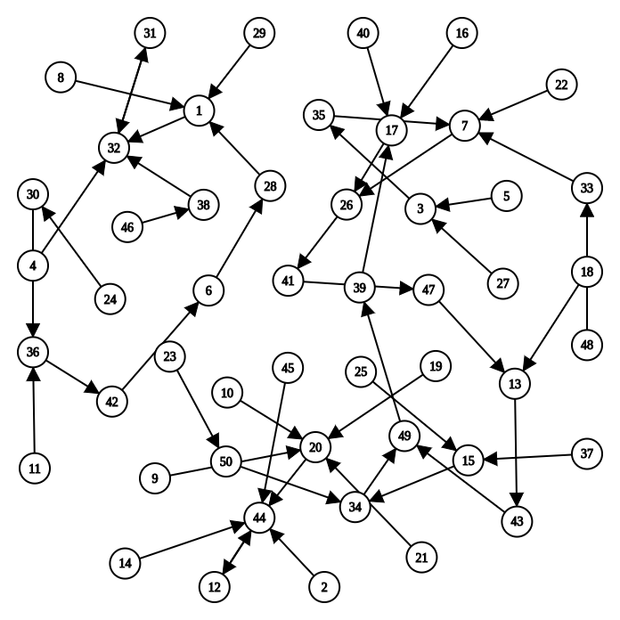

<!-- ## The Opening Chapter -->
## Открывающая глава

<!-- The Pioneer wanted to create a world of computers and gave it the mission of executing programs. Let's help him and experience the joy of creation. -->
Первопроходец хотел создать мир компьютеров и дал ему миссию выполнять программы. Давайте поможем ему и испытаем радость творения.

<!-- As you know from your programming classes, a program is made up of code and data. For example, a program to find `1+2+... +100`, you can write a program to do this without much effort. It's easy to understand that the data is what the program is dealing with, and the code describes what the program wants to do with the data. Not to mention the complex games, what would the simplest computer look like in order to execute even the simplest program? -->
Как вы знаете из курсов программирования, программа состоит из кода и данных. Например, программу, чтобы найти `1+2+... +100`, вы можете написать без особых усилий. Легко понять, что данные — то, с чем программа имеет дело, а код описывает, что программа хочет делать с данными. Не говоря уже о сложных играх, как выглядел бы простейший компьютер, чтобы выполнить даже самую простую программу?

<!-- ### The simplest computer -->
### Простейший компьютер

<!-- In order to execute a program, the first problem to be solved is where to put it. Obviously, we don't want to create a computer that can only execute small programs. Therefore, we need a large enough component to hold a wide variety of programs, and that component is memory. So, the pioneers created memory, and put programs in memory, waiting for the CPU to execute them. -->
Чтобы выполнить программу, первая проблема — куда её положить. Очевидно, мы не хотим создать компьютер, который может выполнять только маленькие программы. Поэтому нужен достаточно большой компонент, чтобы вместить самые разные программы, и этот компонент — память. Итак, первопроходцы создали память и положили программы в память, ожидая, пока CPU их выполнит.

<!-- Wait, who's the CPU? You've probably heard of it before, but let's reintroduce it now. The CPU is the greatest creation of the pioneers, and its Chinese name "中央处理器" (Centrally Processing Unit) shows that it has been bestowed with the highest honor: the CPU is the core unit of circuitry responsible for processing the data, i.e., the execution of the program is all dependent on it. But a computer with only memory cannot perform calculations. Naturally, the CPU had to take on the task of computing, and the pioneers created operators for the CPU so that data could be processed in a variety of ways. If operators are too complicated, consider an adder. -->
Подождите, кто такой CPU? Вы, вероятно, слышали о нём раньше, но давайте представим его заново. CPU — величайшее творение первопроходцев, и его китайское имя "中央处理器" (Centrally Processing Unit) показывает, что ему оказана высшая честь: CPU — ядро схем, отвечающее за обработку данных, то есть выполнение программы целиком зависит от него. Но компьютер только с памятью не может считать. Естественно, CPU пришлось взять на себя задачу вычислений, и первопроходцы создали ALU (арифметико-логическое устройство) для CPU, чтобы данные можно было обрабатывать разными способами. Если ALU слишком сложен, рассмотрите сумматор как пример.

<!-- Pioneer found that sometimes a program needs to process the same data in a continuous manner. For example, to calculate `1+2+... +100`, you have to add the number and `sum`, and it would be inconvenient to write it back to memory every time you finish adding, and then read it out of memory to add again. At the same time there is no free lunch, the large capacity of the memory is also necessary to pay the corresponding price, that is, slow, which is the pioneer can not violate the law of material properties. So the pioneers created registers for the CPU, allowing the CPU to temporarily store the data being processed in them. -->
Первопроходец обнаружил, что иногда программе нужно непрерывно обрабатывать одни и те же данные. Например, чтобы вычислить `1+2+... +100`, нужно складывать число и `sum`, и неудобно каждый раз после сложения записывать это обратно в память, а потом снова читать из памяти, чтобы продолжить сложение. В то же время бесплатного обеда не бывает: за большую ёмкость памяти нужно платить соответствующую цену, то есть медленность, и это закон свойств материалов, который первопроходец не может нарушить. Поэтому первопроходцы создали регистры для CPU, позволяя CPU временно хранить в них обрабатываемые данные.

<!-- Registers are fast, but small, and complement the properties of memory, so there may be a new story to be told between them, but for now, let's just go with the flow. -->
Регистры быстрые, но маленькие, и дополняют свойства памяти, так что между ними, возможно, сплетётся новая история, но пока пойдём по течению.

<!-- > #### question::Can a computer have no registers? (Suggested thinking for the second round)
>
> Can a computer work without registers? And if so, how does this affect the programming model provided by the hardware?
>
> Even if you've been thinking about this for two weeks, it's possible that this is the first time you've heard of the concept of a "programming model". But if you've read the ISA Handbook carefully in round 1, you'll remember that there is such a concept. So, if you want to know what a programming model is, RTFM it. -->

> #### question::Может ли компьютер быть без регистров? (Предлагается подумать на втором проходе)
>
> Может ли компьютер работать без регистров? И если да, как это влияет на модель программирования, которую даёт железо?
>
> Даже если вы думаете об этом на втором проходе, возможно, концепцию «модели программирования» вы слышите впервые. Но если вы внимательно читали руководство ISA на первом проходе, вы помните, что такое понятие есть. Так что если хотите знать, что такое модель программирования, RTFM.

<!-- In order to make the mighty CPU a loyal servant, the pioneers also designed "instructions", which instructed the CPU what to do with the data. In this way, we can control the CPU through instructions and make it do what we want it to do. -->
Чтобы сделать могучий CPU верным слугой, первопроходцы также спроектировали «инструкции», которые указывали CPU, что делать с данными. Так мы можем управлять CPU через инструкции и заставлять его делать то, что хотим.

<!-- With instructions, Pioneer came up with an epoch-making idea: can we let the program automatically control the execution of the computer? In order to realize this idea, the pioneers and the CPU made a simple agreement: after executing an instruction, it would continue to execute the next instruction. But how does the CPU know which instruction has been executed? For this reason, the pioneers created a special counter for the CPU, called "Program Counter" (PC). In x86, it has a special name, called `EIP` (Extended Instruction Pointer).

From now on, the computer only has to do one thing: -->
С инструкциями Первопроходец придумал эпохальную идею: можем ли мы дать программе автоматически управлять выполнением компьютера? Чтобы это осуществить, первопроходцы и CPU заключили простое соглашение: после выполнения инструкции продолжать выполнять следующую. Но как CPU знает, какая инструкция выполнена? Поэтому первопроходцы создали для CPU специальный счётчик под названием "Program Counter" (PC). В x86 у него особое имя — `EIP` (Extended Instruction Pointer).

С этих пор компьютеру нужно делать только одно:

<!-- ```c
while (1) {
  retrieve the instruction from the memory location indicated by the PC;
  Execute the instruction;
  update the PC;
}
``` -->
```c
while (1) {
  извлечь инструкцию из позиции памяти, указанной PC;
  Выполнить инструкцию;
  обновить PC;
}
```

<!-- Thus, we have a simple enough computer. All we have to do is to place a sequence of instructions in memory, and let the PC point to the first instruction, and the computer will automatically execute this sequence of instructions, without ever stopping. -->
Так у нас достаточно простой компьютер. Нужно лишь поместить последовательность инструкций в память и дать PC указать на первую инструкцию, и компьютер автоматически будет выполнять эту последовательность инструкций, никогда не останавливаясь.

<!-- For example, the following sequence of instructions calculates `1+2+... +100`, where `r1` and `r2` are two registers, and there is an implicit program counter `PC`, whose initial value is `0`. To help you understand, we have translated the semantics of the instructions into C code on the right, where each line of C code is preceded by a statement tag -->
Например, следующая последовательность инструкций вычисляет `1+2+... +100`, где `r1` и `r2` — два регистра, и есть неявный счётчик программы `PC` с начальным значением `0`. Чтобы помочь понять, мы перевели семантику инструкций в код C справа, где перед каждой строкой C стоит метка оператора
```
// PC: инструкция     | // метка: оператор
0: mov  r1, 0         |  pc0: r1 = 0;
1: mov  r2, 0         |  pc1: r2 = 0;
2: addi r2, r2, 1     |  pc2: r2 = r2 + 1;
3: add  r1, r1, r2    |  pc3: r1 = r1 + r2;
4: blt  r2, 100, 2    |  pc4: if (r2 < 100) goto pc2;   // переход если меньше
5: jmp 5              |  pc5: goto pc5;
```
<!-- The computer executes the above sequence of instructions, and the last instruction at `PC=5` is in a dead loop, at which point the calculation is finished, and the result of `1+2+...` The result of `1+2+... +100` is stored in register `r1`. -->
Компьютер выполняет последовательность инструкций выше, и последняя инструкция при `PC=5` находится в мёртвом цикле; в этот момент вычисление закончено, и результат `1+2+...` Результат `1+2+... +100` хранится в регистре `r1`.

<!-- > #### todo::Trying to understand how computers calculate
>
> Before seeing the above example, you might have thought that instructions were a mysterious and difficult concept to understand. But when you look at the corresponding C code, you realize that instructions do something so simple! It's also a bit silly, as you can write a for loop that looks more advanced than this C code.
>
> But put yourself in the shoes of a computer, and you'll see how it's possible for a computer to calculate `1+2+... + 100`. This understanding will give you an initial idea of how a program works on a computer. -->
> #### todo::Попытаться понять, как компьютеры считают
>
> До примера выше вы могли думать, что инструкции — таинственное и трудное понятие. Но когда смотрите на соответствующий код C, понимаете, что инструкции делают что-то настолько простое! Это ещё и немного глупо: вы запросто сможете написать цикл for, который выглядит продвинутее этого С кода.
>
> Но поставьте себя на место компьютера, и вы увидите, как компьютеру возможно вычислить `1+2+... + 100`. Это понимание даст вам первоначальное представление о том, как программа работает на компьютере.

<!-- This fully automated process is wonderful! In fact, Turing, the pioneer, had already formulated [a similar core idea](https://en.wikipedia.org/wiki/Universal_Turing_machine) in 1936, making him the "father of the computer". The core idea, which has been passed down to this day, is the "stored program". In honor of Turing, we call the simplest computer above the "Turing Machine" (TRM). Perhaps you have already heard of the concept of "Turing Machine" as a model of computation, but here we will only emphasize the conditions that need to be fulfilled by the simplest real computer:

* structurally, the TRM has memory, a PC, registers, and adders
* the way it works, the TRM repeats the following process over and over again: it takes an instruction from the memory location indicated by the PC, executes the instruction, and then updates the PC. -->
Этот полностью автоматический процесс прекрасен! На самом деле Тьюринг, первопроходец, уже сформулировал [похожую стержневую идею](https://en.wikipedia.org/wiki/Universal_Turing_machine) в 1936, что делает его «отцом компьютера». Стержневая идея, дошедшая до наших дней, — «хранимая программа». В честь Тьюринга мы называем простейший компьютер выше «машиной Тьюринга» (TRM). Возможно, вы уже слышали о понятии «машина Тьюринга» как модели вычислений, но здесь мы подчеркнём только условия, которым должен удовлетворять простейший реальный компьютер:

* структурно у TRM есть память, PC, регистры и сумматоры
* по способу работы TRM снова и снова повторяет следующий процесс: берёт инструкцию из позиции памяти, указанной PC, выполняет инструкцию, затем обновляет PC.

<!-- Huh? Memory, counters, registers, adders, aren't these the same parts you learned about in digital circuits class? You may find this hard to believe, but the computer you're looking at, the computer that does everything, is made of digital circuits! But the programs we wrote in programming class were in C code. if a computer is really a giant digital circuit that only understands zeros and ones, how can this cold circuit understand the C code that is the fruit of human ingenuity? The pioneer said that in the early years of computers, there was no C language, and everyone wrote machine instructions that were obscure and difficult for humans to understand, and that was the earliest way he had ever seen to program a computer. Later on, people invented high-level languages and compilers, which can take the high-level language code we write and process it in various ways, and finally generate functionally equivalent instructions that the CPU can understand. When the CPU executes these instructions, it is executing the code we wrote. Today's computers are still essentially "stored programs", a naturally obtuse way of working, and it's only through the efforts of countless computer scientists that we are able to use computers today with ease. -->
А? Память, счётчики, регистры, сумматоры — разве это не те же части, которые вы изучали на курсе цифровых схем? Вам может быть трудно поверить, но компьютер, на который вы смотрите, компьютер, который умеет всё, сделан из цифровых схем! Но программы, которые мы писали на курсе программирования, были на C. если компьютер и правда гигантская цифровая схема, которая понимает только нули и единицы, как эта холодная схема может понять код C — плод человеческой изобретательности? Первопроходец сказал, что в ранние годы компьютеров языка C не было, и все писали машинные инструкции, тёмные и трудные для людей, и это был самый ранний способ программировать компьютер, который он видел. Позже люди изобрели языки высокого уровня и компиляторы, которые берут код на языке высокого уровня и обрабатывают его разными способами, и наконец порождают функционально эквивалентные инструкции, которые CPU понимает. Когда CPU выполняет эти инструкции, он выполняет код, который мы написали. Сегодняшние компьютеры по сути всё ещё «хранимые программы», естественно тупой способ работы, и только усилиями бесчисленных учёных-информатиков мы сегодня можем легко пользоваться компьютерами.

<!-- > #### caution::A computer is a state machine.
>
> Since a computer is an assembly of logic circuits, we can divide the computer into two parts, one consisting of all the sequential logic components (memories, counters, registers), and the other consisting of the remaining combinational logic components (e.g., adders, etc.). In this way, we can understand the process of a computer from the perspective of the state machine model: at each clock cycle, the computer calculates and transfers to a new state for the next clock cycle based on the current state of the timing logic components, and the action of the combinational logic components.
>
> What's the point of this view of the computer? Well, it doesn't seem to do much except make you realize that computer hardware isn't so mysterious. After all, ICS classes don't require you to implement computer hardware in a hardware description language, you just have to believe that it can be done.
>
> But for programs, this perspective can be more useful than you might think. -->
> #### caution::Компьютер — конечный автомат.
>
> Поскольку компьютер — сборка логических схем, мы можем разделить компьютер на две части: одна состоит из всех компонентов последовательной логики (память, счётчики, регистры), другая — из оставшихся компонентов комбинационной логики (например, сумматоров и т.д.). Так мы можем понять процесс компьютера с точки зрения модели конечного автомата: на каждом такте компьютер вычисляет и переходит в новое состояние следующего такта на основе текущего состояния компонентов временной логики и действия компонентов комбинационной логики.
>
> В чём смысл этого взгляда на компьютер? Похоже, он мало что даёт, кроме осознания, что компьютерное железо не так уж таинственно. В конце концов, занятия ICS не требуют реализовывать компьютерное железо на языке описания аппаратуры, нужно лишь верить, что это можно сделать.
>
> Но для программ эта перспектива может быть полезнее, чем вы думаете.

<!-- ### Re-conceptualizing Programs: A Program is a State Machine -->
### Переосмысление программ: программа — конечный автомат

<!-- If you think of a computer as a state machine, what is the program that runs on it? -->
Если мыслить, что компьютер это конечный автомат, что такое программа, которая на нём работает?

<!-- We know that programs are made up of instructions, so let's look at what an instruction is in the state machine model. It is easy to understand that the computer changes its state by executing instructions, such as executing an addition instruction, which adds the values of two registers and updates the result in a third register; or executing a jump instruction, which modifies the value of the PC, so that the computer starts executing the new instruction from the location of the new PC. So in the state machine model, an instruction can be viewed as an input stimulus for the computer to perform a state transfer. -->
Мы знаем, что программы состоят из инструкций, так что посмотрим, что такое инструкция в модели конечного автомата. Легко понять, что компьютер меняет своё состояние, выполняя инструкции: например, выполняет инструкцию сложения, которая складывает значения двух регистров и обновляет результат в третьем; или выполняет инструкцию перехода, которая изменяет значение PC, так что компьютер начинает выполнять новую инструкцию с позиции нового PC. Так что в модели конечного автомата инструкцию можно рассматривать как входной стимул для компьютера, чтобы выполнить переход состояния.

<!-- A very simple computer is described in Section 1.1.3 of the ICS textbook. This computer has four 8-bit registers, a 4-bit PC, and 16 bytes of memory, so the total number of bits that can be represented by this computer is `B = 4*8 + 4 + 16*8 = 164`, and so the computer can have a total of `N = 2^B = 2^164` different states. Assuming that the behavior of all instructions in this computer is determined, then given any of the `N` states, the new state after the transfer is also uniquely determined. In general, `N` is very large, and the following figure shows the state transfer diagram for a computer with `N=50`. -->
Очень простой компьютер описан в разделе 1.1.3 учебника ICS. У этого компьютера четыре 8-битных регистра, 4-битный PC и 16 байт памяти, так что общее число бит, которые может представлять этот компьютер, — `B = 4*8 + 4 + 16*8 = 164`, и поэтому компьютер может иметь всего `N = 2^B = 2^164` разных состояний. Предполагая, что поведение всех инструкций в этом компьютере определено, для любого из `N` состояний новое состояние после перехода также однозначно определено. Вообще `N` очень велико, и следующий рисунок показывает диаграмму переходов состояний для компьютера с `N=50`.



<!-- Now we can explain the nature of "running a program on a computer" through the perspective of a state machine: given a program, placing it in the computer's memory is equivalent to specifying an initial state in a state transfer diagram with the number of states `N`, from which the program runs, with a definite transfer of state at the end of each instruction. In other words, a program can be viewed as a state machine! This state machine is a subset of the large state machine (`N`) mentioned above. -->
Теперь мы можем объяснить природу «работы программы на компьютере» через перспективу конечного автомата: данную программу положить в память компьютера — всё равно что задать начальное состояние на диаграмме переходов с числом состояний `N`, с которого программа работает, с определённым переходом состояния в конце каждой инструкции. Другими словами, программу можно рассматривать как конечный автомат! Этот конечный автомат — подмножество большого конечного автомата (`N`), упомянутого выше.

<!-- For example, suppose a program is running in the computer shown in the figure above, and its initial state is state 8 in the upper left corner, then the corresponding state machine of this program is -->
Например, предположим, программа работает в компьютере, показанном на рисунке выше, и её начальное состояние — состояние 8 в верхнем левом углу, тогда соответствующий конечный автомат этой программы —

```
8->1->32->31->32->31->...
```
<!-- This program could be： -->
Эта программа могла бы быть：
```
// PC: инструкция     | // метка: оператор
0: addi r1, r2, 2     |  pc0: r1 = r2 + 2;
1: subi r2, r1, 1     |  pc1: r2 = r1 - 1;
2: nop                |  pc2: ;  // нет операции
3: jmp 2              |  pc3: goto pc2;
```

<!-- > #### todo::Understanding Program Operations from a State Machine Perspective
>
> As an example, try to draw the state machine of the program in the previous subsection `1+2+... +100` instruction sequence in the previous subsection as an example, try to draw the state machine of this program.
>
> The program is relatively simple, and the only state that needs to be updated is `PC` and the two registers `r1` and `r2`, so we can represent all the states of the program with a triple `(PC, r1, r2)`, without having to draw the exact state of the memory. The initial state is `(0, x, x)`, where `x` means uninitialized. The instruction at program `PC=0` is `mov r1, 0`, after which `PC` points to the next instruction, so the next state is `(1, 0, x)`. By analogy, we can sketch the state transfer process for the first 3 instructions:
> ```
> (0, x, x) -> (1, 0, x) -> (2, 0, 0) -> (3, 0, 1)
> ```
> Please try to finish drawing the state machine, For the loop in the program you only need to draw first 2 and last 2 iterations. -->
> #### todo::Понять работу программы с точки зрения конечного автомата
>
> Как пример, попробуйте нарисовать конечный автомат программы в предыдущем подразделе `1+2+... +100` последовательность инструкций в предыдущем подразделе как пример, попробуйте нарисовать конечный автомат этой программы.
>
> Программа относительно простая, и единственное состояние, которое нужно обновлять, — `PC` и два регистра `r1` и `r2`, так что все состояния программы можно представить тройкой `(PC, r1, r2)`, не рисуя точное состояние памяти. Начальное состояние — `(0, x, x)`, где `x` значит неинициализировано. Инструкция при `PC=0` — `mov r1, 0`, после чего `PC` указывает на следующую инструкцию, так что следующее состояние — `(1, 0, x)`. По аналогии можно набросать процесс перехода состояний для первых 3 инструкций:
> ```
> (0, x, x) -> (1, 0, x) -> (2, 0, 0) -> (3, 0, 1)
> ```
> Попробуйте дорисовать конечный автомат. Для цикла в программе нужно нарисовать только первые 2 и последние 2 итерации.


<!-- With the above example of a required question, you should have a better understanding of how a program runs on a computer. We can look at the same program from two complementary perspectives. -->
С примером обязательного вопроса выше у вас должно быть лучшее понимание того, как программа работает на компьютере. На одну и ту же программу можно смотреть с двух взаимодополняющих перспектив.

<!-- * A static view of code (or sequences of instructions), often referred to as "writing a program"/"looking at code", is actually a static view. One of the benefits of this perspective is that it is a compact description, and the combination of branching, loops, and function calls makes it possible to achieve complex functionality with a small amount of code. But it can also make understanding program behavior difficult. -->
* Статический взгляд на код (или последовательности инструкций), часто называемый «писать программу»/«смотреть код», на самом деле статический взгляд. Одно из достоинств этой перспективы — компактное описание, и сочетание ветвлений, циклов и вызовов функций позволяет достичь сложной функциональности малым количеством кода. Но это также может затруднить понимание поведения программы.

<!-- * The other is the dynamic view of state machine state transfer as an effect of operation, which directly portrays the nature of the "program running on the computer". However, the number of states in this perspective is very large, and all the loops and function calls in the program code are fully expanded at the granularity of instructions, making it difficult to grasp the overall semantics of the program. However, the state-machine perspective gives us a clear understanding of the details of the local behavior of a program, especially the behavior that is difficult to understand from a static point of view. -->
* Другой — динамический взгляд на переходы состояний конечного автомата как эффект работы, который напрямую изображает природу «программы, работающей на компьютере». Однако число состояний в этой перспективе очень велико, и все циклы и вызовы функций в коде программы полностью развёрнуты на гранулярности инструкций, из-за чего трудно ухватить общую семантику программы. Не смотря на это, перспектива конечного автомата даёт ясное понимание деталей локального поведения программы, особенно поведения, которое трудно понять со статической точки зрения.

<!-- > #### comment::What are the benefits of the state machine perspective of a program?
>
> Some programs may look simple, but their behavior is less intuitive, such as recursion. To get a good understanding of how a recursive program works on a computer, it is most effective to look at the program's behavior from a state-machine perspective, which helps you understand how each instruction modifies the state of the computer, and thus the semantics of recursion at the macro level. Chapter 3 of the ICS theory course is devoted to the details of this, so we won't go into the specific behavior of recursion here. -->
> #### comment::Каковы преимущества перспективы конечного автомата для программы?
>
> Некоторые программы могут выглядеть просто, но их поведение менее интуитивно, например рекурсия. Чтобы хорошо понять, как рекурсивная программа работает на компьютере, эффективнее всего смотреть на поведение программы с точки зрения конечного автомата: это помогает понять, как каждая инструкция изменяет состояние компьютера и тем самым семантику рекурсии на макроуровне. Глава 3 теоретического курса ICS посвящена этим деталям, так что конкретное поведение рекурсии здесь разбирать не будем.

<!-- > #### caution::A microscopic view of "programs running on computers": the program as a state machine
>
> The "program as a state machine" perspective is important for both ICS and PA, because "understanding how programs run on computers" is the fundamental goal of both ICS and PA. The macro view of this problem will be introduced in the middle of PA.
>
> The text in this subsection should be easy for you to understand, but if you don't develop a sense of understanding program behavior from a state machine perspective in the future, you may find PA very difficult because you will be dealing with code constantly in PA. If you can't understand the behavior of some key code from a micro perspective, you won't be able to fully understand how a program works from a macro perspective. -->
> #### caution::Микроскопический взгляд на «программы, работающие на компьютерах»: программа как конечный автомат
>
> Перспектива «программа как конечный автомат» важна и для ICS, и для PA, потому что «понять, как программы работают на компьютерах» — фундаментальная цель и ICS, и PA. Макровзгляд на эту проблему будет введён в середине PA.
>
> Текст этого подраздела должен быть вам понятен, но если в будущем вы не выработаете привычку понимать поведение программы с точки зрения конечного автомата, PA может показаться очень трудным, потому что в PA вы постоянно будете иметь дело с кодом. Если вы не можете понять поведение какого-то ключевого кода с микроперспективы, вы не сможете полностью понять, как программа работает, с макроперспективы.
