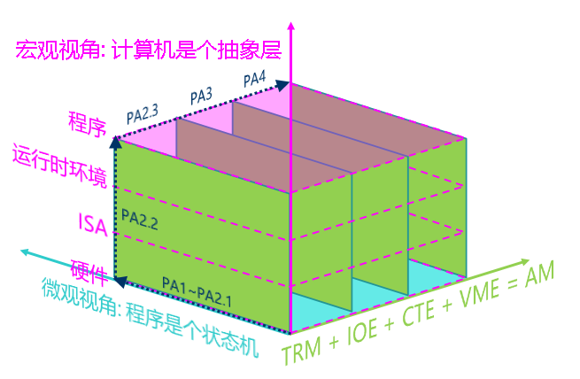

<!-- ## Programs, Runtime, and the Abstract Machine (AM) -->
## Программы, среда выполнения и абстрактная машина (AM)

<!-- ### Runtime -->
### Среда выполнения

<!-- In order to making NEMU support the execution of most programs, you have already implemented a lot of instructions. However we need to do more to run additional programs other than implement all instruction. We mentioned before that "not every program can be run in NEMU", now let's explain the reason behind it. -->
Чтобы NEMU поддерживал выполнение большей части программ, вы уже реализовали немало инструкций. Но не из-за одних инструкций заработают ещё программы. Раньше мы говорили: «не всякая программа может работать в NEMU» — сейчас объясним, почему.

<!-- As an intuition, it is unrealistic to let a TRM that only "computes" to support the execution of a fully functional operating system. Just like computers that also have different level of capability. The more "powerful" a computer is, the more complex programs it can run. In other words, running a program need the compute to met certain requirements. When you run the Hello World program, you type a command (or click the mouse) and the program runs successfully, but behind the scene are the countless hours of operating system developers and system library developers spends. In fact, the execution of the application requires the support of the [runtime environment](http://en.wikipedia.org/wiki/Runtime_system), including loading, destroying the program, and providing various dynamic link libraries when the program is running (the library functions you often use are provided by the runtime environment). For helping client programs to run in NEMU, it is now your turn to provide corresponding runtime environment support. -->
Интуитивно: дать TRM, который умеет только «считать», поддерживать полноценную ОС всё же нереалистично. Ощущение такое, что у компьютеров тоже есть «сила функций»: чем компьютер «мощнее», тем сложнее программы он может гонять. Иначе говоря, выполнение программы предъявляет требования к функциям компьютера. Когда вы запускаете Hello World, вводите команду (или кликаете мышью) — программа успешно работает, но за этим скрыт бесконечный пот разработчиков ОС и библиотек. Факт: выполнение приложений нуждается в поддержке [среды выполнения (runtime)](http://en.wikipedia.org/wiki/Runtime_system): загрузка, уничтожение программы, динамические библиотеки во время работы (библиотечные функции, которыми вы часто пользуетесь, как раз даёт среда выполнения) и т.д. Чтобы гостевые программы работали в NEMU, теперь ваша очередь дать соответствующую поддержку среды выполнения.

<!-- According to the KISS principal, let's first consider what the simplest runtime environment looks like. In other words, what do we need to provide to run the simplest program? In fact, the answer is already in PA1: Just put the program in the correct memory location, and then let the PC point to the first instruction, and the computer will automatically execute the program and never stop. -->
По правилу KISS сначала рассмотрим, какой бывает самая простая среда выполнения. Иначе говоря, что нужно дать, чтобы работала самая простая программа? Ответ уже был в PA1: достаточно положить программу в правильное место памяти, дать PC указать на первую инструкцию — и компьютер сам будет выполнять программу, никогда не останавливаясь.

<!-- However, although the computer can keep executing instructions for ever. In general, programs need to end, so the runtime environment needs to provide a method for the program to end the execution. You may already think about the manually added nemu_trap instruction we mentioned in PA1 which is to let the program end the execution. -->
Однако хотя компьютер может бесконечно выполнять инструкции, обычные программы заканчиваются, поэтому среда выполнения должна дать программе способ завершиться. Догадливый читатель уже вспомнит искусственно добавленную в PA1 инструкцию `nemu_trap` — как раз чтобы программа могла закончить выполнение.

<!-- Therefore, with memory, a way to terminate the program, and the implementation of correct instructions, it can support the execution of the simplest program. And this can also be treated as the simplest runtime environment. -->
Итак, если есть память, способ завершить выполнение и верно реализованные инструкции, можно поддержать работу самых простых программ. И это тоже можно считать самой простой средой выполнения.

<!-- ### Encapsulate the runtime environment into library functions -->
### Упаковать среду выполнения в библиотечные функции

<!-- The runtime environment we just discussed is located directly on the computer hardware, so the implementation of the runtime environment is also architecture related. We use the "ISA-platform" pair to represent an architecture, such as `mips32-nemu`. Taking program termination as an example, NEMU uses a special `nemu_trap` instruction, and the format of the `nemu_trap` instruction in different ISAs is different: consider if we use verilog to design a riscv32 CPU, this `riscv32-mycpu` architecture may terminate the program through a `mycpu_trap` instruction, which may be different from the `nemu_trap` instruction. Termination of program is a common requirement. To allow `n` programs to run on `m` architectures, do we have to maintain `n*m` pieces of code? Is there a better way? -->
Среда выполнения, о которой только что говорили, лежит прямо на железе компьютера, поэтому и её реализация связана с архитектурой. Архитектуру обозначаем парой «ISA-платформа», например `mips32-nemu`. Возьмём завершение программы: в NEMU это особая инструкция `nemu_trap`, и формат `nemu_trap` у разных ISA наверняка разный; а если сами на verilog спроектируем CPU riscv32, архитектура `riscv32-mycpu` может завершать программу инструкцией `mycpu_trap`, и она может отличаться от `nemu_trap`. Завершение — общая потребность программ. Чтобы `n` программ работали на `m` архитектурах, неужели поддерживать `n*m` копий кода? Есть ли способ лучше?

<!-- For the same program, if we can convert `m` architect specific code path to a single entry point then we only need to maintain one entry. The way to achieve this goal is by abstraction which you should have learned in programming class! We only need to define an API to terminate the program, such as `void halt()`, which abstracts the architecture specific termination code. The program can terminate the execution as long as it calls `halt()`, without caring about which architecture it is running on. After abstracting the termination of a program to a single API entry, the previous `m` architecture specific versions of the same program now all terminate their execution through `halt()`. And only left us one version to maintain. Then, different architectures implement their own `halt()` respectively, which can support the execution of `n` different programs! In this way, we can decouple the program and the architecture: we only need to maintain `n+m` pieces of code (`n` programs and `m` architecture-related `halt()`), instead of the previous `n*m` versions. -->
Для одной программы, если `m` разных частей разных версий превратить в один и тот же код, достаточно сопровождать одну версию. Козырь для этой цели — абстракция, которую вы учили на курсе программирования! Достаточно определить API завершения, например `void halt()`, который абстрагирует разные способы завершения на разных архитектурах: программе достаточно вызвать `halt()`, не заботясь, на какой архитектуре она работает. После абстракции прежние `m` версий программы все завершаются через `halt()`, и сопровождать нужно только эту одну версию, завершающуюся через `halt()`. Затем разные архитектуры реализуют свой `halt()` — и можно поддержать `n` программ! Так программу и архитектуру развязываем: сопровождаем `n+m` копий кода (`n` программ и `m` связанных с архитектурой `halt()`), а не прежние `n*m`.

<!-- This example also shows how runtime environment usually gets implemented: Library. By using libraries, the common elements required to run the program are abstracted into APIs. Each architecture now only need to implement those APIs to provide the runtime. This improves the efficiency of developing: when needed, we only need to call these APIs to use the corresponding functions provided by the runtime environment. -->
Этот пример также показывает обычный способ существования среды выполнения: библиотека. Через библиотеку общие элементы, нужные для работы программы, абстрагируются в API; разным архитектурам достаточно реализовать эти API — и среда выполнения, поддерживающая программы, уже есть. Это повышает эффективность разработки программ: когда нужно, вызываете API — и пользуетесь соответствующей функцией среды выполнения.

<!-- > #### question::Now what?
> Think about it. What are the other benefits of this abstraction? You'll soon realize the benefits.. -->
> #### question::И что с того?
> Подумайте: какие ещё выгоды даёт такая абстракция? Эти выгоды вы скоро ощутите.

<!-- ### AM - bare-metal runtime environment -->
### AM — среда выполнения на голом железе (bare-metal)

<!-- On the one hand, as mentioned above, execution of applications requires the support from the runtime environment; On the other hand, programs that only perform pure computational tasks can be run on TRM. However, complex applications have more requirements on the runtime environment: for example, the Super Mario game you played before needs to interact with the user through the input/output interface provided by the runtime. To run a modern operating system, more advanced features must be added on top of this. -->
С одной стороны, как сказано выше, выполнение приложений нуждается в поддержке среды выполнения; с другой — программы с чисто вычислительными задачами могут работать уже на TRM. У более сложных приложений к среде выполнения наверняка есть и другие требования: например, Super Mario, в которую вы играли, нужно взаимодействовать с пользователем — среде выполнения как минимум нужна поддержка ввода-вывода. Чтобы запустить современную ОС, поверх этого нужны ещё более продвинутые возможности.

<!-- If we collects all the requirements and abstract them into a unified API to provide to the program, then we will get a library that can support various programs running on various architectures! Specifically, each architecture implements this set of APIs according to their characteristics; applications only need to call the same set of APIs, and do not need to worried about which architecture they will be running on in the future. Since this set of unified abstract APIs represents the requirement for executing a program, we call this set of APIs an abstract computer. -->
Если собрать эти потребности и абстрагировать их в единый API для программ, получится библиотека, которая может поддерживать разные программы на разных архитектурах! Конкретно каждая архитектура реализует этот набор API по своим свойствам; приложению достаточно вызывать этот набор API, не заботясь, на какой архитектуре оно потом будет работать. Поскольку этот единый абстрактный API выражает потребности программы к компьютеру, мы называем этот набор API абстрактным компьютером.

<!-- This is how the AM (Abstract machine) project was born. As a library that provides a runtime environment for programs, AM divides the library into the following modules according to the needs of the program: -->
Так родился проект AM (Abstract machine). Как библиотека, дающая программам среду выполнения, AM по потребностям программ делит библиотеку на модули:
```
AM = TRM + IOE + CTE + VME + MPE
```
<!-- * TRM (Turing Machine) - Turing machine, the simplest runtime environment, provides basic computing functionality for programs.
* IOE (I/O Extension) - Input and output extension, providing the program with the ability to input and output.
* CTE (Context Extension) - Context extension, providing context management capabilities for programs.
* VME (Virtual Memory Extension) - Virtual memory extension, providing programs with the ability to manage virtual memory.
* MPE (Multi-Processor Extension) - Multi-processor extension, providing programs with the ability to communicate across multiple processors (MPE is beyond the scope of the ICS course and will not be covered in PA) -->
* TRM (Turing Machine) — машина Тьюринга, самая простая среда выполнения, даёт программе базовую способность считать
* IOE (I/O Extension) — расширение ввода-вывода, даёт программе способность ввода и вывода
* CTE (Context Extension) — расширение контекста, даёт программе способность управлять контекстом
* VME (Virtual Memory Extension) — расширение виртуальной памяти, даёт программе способность управлять виртуальной памятью
* MPE (Multi-Processor Extension) — расширение многопроцессорности, даёт программе способность общаться между процессорами (MPE за рамками ICS, в PA не будет)

<!-- AM showed us the relationship between programs and computers: using computer hardware's feature implement AM to provide the runtime environment of guest programs. Thanks to the AM project, the boundaries between NEMU and guest programs have becomes more clear. It also improves the PA process: -->
AM показывает отношение программы и компьютера: функциями компьютерного железа реализовать AM и дать программам нужную среду выполнения. Благодаря рождению AM граница между NEMU и программами стала чётче, а процесс PA — яснее:
<!-- ```
(In NEMU) Implement hardware functionality -> (In AM) Provide runtime environment -> (In application layer) Execute programs
(In NEMU) Implement more powerful hardware functionality -> (In AM) Provide a richer runtime environment -> (In application layer) Execute more complex programs
``` -->
```
(в NEMU) реализовать функции железа -> (в AM) дать среду выполнения -> (на слое приложения) запустить программу
(в NEMU) реализовать более мощные функции железа -> (в AM) дать более богатую среду выполнения -> (на слое приложения) запустить более сложную программу
```
<!-- This process echoes the ground-breaking story in PA1: the pioneer hopes to create a world of computers and give it the mission of executing programs. Building the bridge between hardware(NEMU) and software(AM) to support the execution of the program is a good choice for the ultimate goal of "How computer executes a program". -->
Этот процесс перекликается с историей сотворения в PA1: Первопроходец хотел создать мир компьютеров и дать ему миссию выполнять программы. Самому построить мост между NEMU (железо) и AM (ПО), чтобы поддержать работу программ, — лучший выбор для конечной цели «понять, как программы работают на компьютере».

<!-- > #### caution::The birth of AM and the story of Project-N
> Before the birth of AM, the main components of Project-N already existed:
> 
> NEMU - NJU EMUlator (basic computer system lab)
> Nanos - Nanjing U OS (operating system lab)
> NOOP - NJU Out-of-Order Processor (computer architecture lab)
> NCC - NJU C Compiler (compiler principle lab)
> 
> But we have never thought about how to integrate these components into a complete teaching ecosystem.
> 
> In the computer system course in spring 2017, [jyy](http://moon.nju.edu.cn/~jyy/) first proposed the idea of AM to decouple programs and architecture. After decoupling, AM became a key to Project-N: As long as AM is implemented, we can run various AM programs on NEMU and NOOP; as long as Nanos is implemented on AM, we can run Nanos on NEMU and NOOP; as long as NCC compiles the program to AM, we can run the NCC-compiled program on NOOP.
> 
> After several months of trying, we soon believed that this was the right path. So we decided to make a major revision of PA in the fall of 2017, and reusing ideas from AM to design NEMU, expecting everyone can better understand "How computer executes a program" Therefore, in 2017 autumn semester NEMU has been officially included as a sub-project in the Project-N teaching ecosystem.
> 
> We have formed a team to participate in the computer system design competition "Loongson Cup" for two consecutive years. We demonstrated our unique Project-N ecosystem in the competition and won second place. The competition will also provide valuable feed back to PA to close the loop. These are actually not far away from you. The methods and principles we emphasis in PA are all golden experiences for winning in the competition.
> 
> If you are interested in AM and Project-N, please contact jyy or yzh. -->
> #### caution::Рождение AM и история Project-N
> До рождения AM главные части Project-N уже существовали:
> * NEMU - NJU EMUlator (лабораторная по основам систем)
> * Nanos - Nanjing U OS (лабораторная по ОС)
> * NOOP - NJU Out-of-Order Processor (лабораторная по организации компьютера)
> * NCC - NJU C Compiler (лабораторная по компиляторам)
>
> Но мы всё не придумывали, как собрать эти части в полную учебную экосистему.
>
> Весной 2017 на комплексном лабораторном курсе компьютерных систем [jyy](http://moon.nju.edu.cn/~jyy/) первым предложил идею AM — развязать программу и архитектуру.
> После развязки AM стала ключом Project-N:
> стоит реализовать AM — и разные программы AM можно запускать на NEMU и NOOP;
> стоит реализовать Nanos на AM — и Nanos можно запускать на NEMU и NOOP;
> стоит NCC скомпилировать программу на AM — и программу, скомпилированную NCC, можно запускать на NOOP.
>
> После нескольких месяцев попыток мы быстро поверили: путь верный.
> Тогда срочно решили осенью 2017 сильно переделать PA и проектировать NEMU, опираясь на идеи AM, чтобы лучше понять «как программы работают на компьютере».
> Поэтому осенняя версия NEMU 2017 впервые официально вошла в учебную экосистему Project-N как подпроект.
>
> Мы уже два года подряд собирали команду на конкурс проектирования компьютерных систем «Кубок Loongson»: показывали нашу уникальную экосистему Project-N и оба раза брали второе место.
> Хорошие методы, найденные на конкурсе, тоже возвращаются в PA.
> Это от вас не так далеко: методы и принципы, которые мы передаём в PA, — золотой опыт призов того конкурса.
>
> Если AM и Project-N интересны, пишите jyy или yzh.

<!-- > #### hint::Travel through the time
> With AM, we can connect the labs between courses and do some interesting things that we couldn't do before: for example, in the operating system class this spring, your seniors wrote their own small games on AM. In the later part of this year’s PA, you will have the opportunity to seamlessly port the games written by your seniors to NEMU as part of the final system demonstration, which is an exciting thing to think about. -->
> #### hint::Узы сквозь время и пространство
> С AM можно связать лабораторные разных курсов и делать интересное, чего раньше нельзя было: например, этой весной на курсе ОС ваши старшие писали свои маленькие игры на AM. В поздней части PA в этом году у вас будет шанс бесшовно перенести игры старших на NEMU как часть финальной демонстрации системы — даже думать об этом уже волнующе.

<!-- > #### question::Why AM? (It is recommended to think about it in the second cycle)
> The operating system also has its own runtime environment. What is the difference between the runtime environment provided by AM and the operating system? Why those differences present? -->
> #### question::Зачем AM? (Предлагается подумать на втором проходе)
> У операционной системы тоже своя среда выполнения.
> Чем среда выполнения AM отличается от среды, которую даёт ОС? Почему эти отличия есть?


<!-- ### RTFSC(3) -->
### RTFSC(3)

<!-- You have obtained the AM sub-project `abstract-machine` at the end of PA0. Let's briefly introduce the code of the AM project. The source files in the abstract-machine/ directory in the code are organized as follows (the files in some directories are not listed): -->
Подпроект AM `abstract-machine` вы уже получили в конце PA0; кратко представим код проекта AM. Исходные файлы в каталоге `abstract-machine/` организованы так (файлы в части каталогов не перечислены):

```
abstract-machine
├── am                                  # связанное с AM
│   ├── include
│   │   ├── amdev.h
│   │   ├── am.h
│   │   └── arch                        # определения заголовков, связанные с архитектурой
│   ├── Makefile
│   └── src
│       ├── mips
│       │   ├── mips32.h
│       │   └── nemu                    # реализация, связанная с mips32-nemu
│       ├── native
│       ├── platform
│       │   └── nemu                    # реализация AM с платформой NEMU
│       │       ├── include
│       │       │   └── nemu.h
│       │       ├── ioe                 # IOE
│       │       │   ├── audio.c
│       │       │   ├── disk.c
│       │       │   ├── gpu.c
│       │       │   ├── input.c
│       │       │   ├── ioe.c
│       │       │   └── timer.c
│       │       ├── mpe.c               # MPE, сейчас пусто
│       │       └── trm.c               # TRM
│       ├── riscv
│       │   ├── nemu                    # реализация, связанная с riscv32(64)
│       │   │   ├── cte.c               # CTE
│       │   │   ├── start.S             # вход в программу
│       │   │   ├── trap.S
│       │   │   └── vme.c               # VME
│       │   └── riscv.h
│       └── x86
│           ├── nemu                    # реализация, связанная с x86-nemu
│           └── x86.h
├── klib                                # библиотека часто используемых функций
├── Makefile                            # общие правила Makefile
└── scripts                             # Makefile сборки/запуска двоичных файлов/образов
    ├── isa
    │   ├── mips32.mk
    │   ├── riscv32.mk
    │   ├── riscv64.mk
    │   └── x86.mk
    ├── linker.ld                       # скрипт линковки
    ├── mips32-nemu.mk
    ├── native.mk
    ├── platform
    │   └── nemu.mk
    ├── riscv32-nemu.mk
    ├── riscv64-nemu.mk
    └── x86-nemu.mk
```

<!-- The entire AM project is divided into two parts:
*	`abstract-machine/am/` - AM API implementations targeting different architectures. Currently we only need to focus on NEMU-related content. In addition, abstract-machine/am/include/am.h lists all APIs in AM, we will introduce them one by one later.
*	`abstract-machine/klib/` - Some architecture-independent library functions to facilitate application development -->
Весь проект AM делится на две большие части:
* `abstract-machine/am/` — реализации AM API разных архитектур; сейчас достаточно смотреть связанное с NEMU.
Кроме того, `abstract-machine/am/include/am.h` перечисляет все API в AM, их представим по очереди позже.
* `abstract-machine/klib/` — некоторые библиотечные функции, не зависящие от архитектуры, для удобства разработки приложений

<!-- By reading the code in `abstract-machine/am/src/platform/nemu/trm.c`, you will find that only a few APIs need to be implemented to support the program running on TRM:
*	`Area heap` struct is used to indicate the start and end of the heap area
*	`void putch(char ch)` is used to print a character
*	`void halt(int code)` is used to end the running of the program
*	`void _trm_init()` is used for TRM-related initialization work -->
Прочитав код в `abstract-machine/am/src/platform/nemu/trm.c`, увидите: чтобы программа работала на TRM, достаточно реализовать очень мало API:
* структура `Area heap` указывает начало и конец области кучи
* `void putch(char ch)` выводит один символ
* `void halt(int code)` завершает выполнение программы
* `void _trm_init()` делает инициализацию, связанную с TRM

<!-- The heap area is a memory block that can be freely used by the program, providing the program with the ability of dynamically allocating memory. The API of TRM only provides the start and end address of the heap area, the program is required to maintain all the allocations. Of course, programs can also choose not use the heap area, such as `dummy`. Using `putch()` as an API for TRM is a very interesting consideration. We will discuss it later. For now, we are not planning to run programs that need to call `putch()`. -->
Куча — участок памяти, которым программа может свободно пользоваться, даёт динамическое выделение памяти. API TRM даёт только начало и конец кучи; выделение и управление кучей программа ведёт сама. Разумеется, программу можно и без кучи, например `dummy`. Сделать `putch()` API TRM — занятное решение, обсудим в ближайшем будущем; пока программы, которым нужен `putch()`, запускать не собираемся.

<!-- Finally, let’s take a look at `halt()`. The `nemu_trap()` macro (defined in `abstract-machine/am/src/platform/nemu/include/nemu.h`) is called in `halt()`. The macro expands to an [inline asm](http://www.ibiblio.org/gferg/ldp/GCC-Inline-Assembly-HOWTO.html) statement. Inline assembly statements allow us to embed assembly statements in C code. Taking riscv32 as an example, after macro expansion, we will get: -->
Наконец посмотрим на `halt()`. Внутри `halt()` вызывается макрос `nemu_trap()`
(определён в `abstract-machine/am/src/platform/nemu/include/nemu.h`);
после раскрытия это оператор [встроенного ассемблера](http://www.ibiblio.org/gferg/ldp/GCC-Inline-Assembly-HOWTO.html).
Встроенный ассемблер позволяет вставлять операторы ассемблера в код C.
На примере riscv32 после макроподстановки получится:
```c
asm volatile("mv a0, %0; ebreak" : :"r"(code));
```
<!-- Obviously, the definition of this macro is ISA related. If you look at `nemu/src/isa/$ISA/inst.c`, you will find that this instruction is the special `nemu_trap`! The `nemu_trap()` macro will also put an end code that marks the end of program execution into to a general purpose register. Now the asm instruction and `nemu_trap` in `nemu/src/isa/$ISA/inst.c` are linked together: the value in the general register will be passed to `set_nemu_state()` as a parameter, and the end code in `halt()` will be set to the NEMU monitor. The monitor will report the reason for the end of the program based on the end code. In addition, `volatile` is a keyword in C language. If you want to know more about `volatile`, please check the relevant information. -->
Очевидно, определение макроса связано с ISA; если посмотреть `nemu/src/isa/$ISA/inst.c`, увидите: эта инструкция и есть та особая `nemu_trap`!
Макрос `nemu_trap()` ещё перенесёт код завершения в регистр общего назначения,
так что эта сборка соответствует поведению `nemu_trap` в `nemu/src/isa/$ISA/inst.c`:
значение регистра передадут как параметр в `set_nemu_state()`,
код завершения из `halt()` установят в monitor NEMU, и monitor по коду сообщит причину окончания программы.
Кроме того, `volatile` — ключевое слово C; если хотите узнать о `volatile` больше, сверьтесь с материалами.

<!-- The `am-kernels` subproject is a collection of test sets and simple programs that can be run on AM: -->
Подпроект `am-kernels` собирает тестовые наборы и простые программы, которые можно запускать на AM:

```
am-kernels
├── benchmarks                  # бенчмарки для оценки производительности
│   ├── coremark
│   ├── dhrystone
│   └── microbench
├── kernels                     # приложения, которые можно показать
│   ├── hello
│   ├── litenes                 # простой эмулятор NES
│   ├── nemu                    # NEMU
│   ├── slider                  # простой просмотрщик картинок
│   ├── thread-os               # ОС с потоками ядра
│   └── typing-game             # игра на набор текста
└── tests                       # целевые тестовые наборы
    ├── am-tests                # тесты реализации AM API
    └── cpu-tests               # тесты реализации инструкций CPU
```

<!-- Before letting NEMU run the client program, we need to compile the code of the client program into an executable file. It should be noted that we cannot use the default options of gcc to compile directly, because the default options will compile the code into an executable file running under GNU/Linux according to the GNU/Linux runtime environment. However, NEMU at this time cannot provide a GNU/Linux runtime environment for client programs. The above executable file cannot be run correctly in NEMU, so we cannot use the default options of gcc to compile user programs. -->
Прежде чем NEMU запустит гостевую программу, её код нужно скомпилировать в исполняемый файл.
Важно: нельзя компилировать опциями gcc по умолчанию, потому что по умолчанию код соберут в исполняемый файл под GNU/Linux, под среду выполнения GNU/Linux.
Но сейчас NEMU не даёт гостевой программе среду GNU/Linux, такой исполняемый файл в NEMU корректно не запустится, поэтому пользовательские программы нельзя компилировать опциями gcc по умолчанию.

<!-- The way to solve this problem is to [cross-compile](http://en.wikipedia.org/wiki/Cross_compiler). We need to compile an executable file under GNU/Linux based of AM runtime environment that can run under `$ISA-nemu` environment. In order to prevent the linker `ld` from using the default linking method, we also need to provide a linker script describing the runtime environment of $ISA-nemu. The framework code of AM has prepared the corresponding configuration. The above compilation and linking options are mainly located in the `abstract-machine/Makefile` and the relevant `.mk` files in the `abstract-machine/scripts/` directory. The steps of compiling and linking an executable that can run under the NEMU runtime environment is listed below:
*	`gcc` compiles the AM source codes of `$ISA-nemu` into object files, and then uses `ar` to pack these object files as a static library archieve `abstract-machine/am/build/am-$ISA-nemu.a`
*	`gcc` compiles guest program source code (such as `am-kernels/tests/cpu-tests/tests/dummy.c`) into object files
*	Using `gcc` and `ar` to compile and archive all the dependency library (such as `abstract-machine/klib/`)
*	Based on the rules defined in the Makefile `abstract-machine/scripts/$ISA-nemu.mk`, let `ld` link all the object files and static library into an executable using the linker script `abstract-machine/scripts/linker.ld` -->
Решение — [кросс-компиляция](http://en.wikipedia.org/wiki/Cross_compiler).
Нужно под GNU/Linux по среде выполнения AM собрать исполняемый файл, который сможет работать в новой среде `$ISA-nemu`.
Чтобы линковщик ld не линковал способом по умолчанию, нужен ещё скрипт линковки, описывающий среду выполнения `$ISA-nemu`.
Каркас AM уже подготовил соответствующую конфигурацию; опции компиляции и линковки выше в основном в `abstract-machine/Makefile` и связанных `.mk` в `abstract-machine/scripts/`.
Процесс сборки программы, которая может работать в среде выполнения NEMU, примерно такой:
* gcc компилирует исходники реализации AM `$ISA-nemu` в объектные файлы, затем через ar упаковывает их как библиотеку в архив `abstract-machine/am/build/am-$ISA-nemu.a`
* gcc компилирует исходники приложения (например `am-kernels/tests/cpu-tests/tests/dummy.c`) в объектные файлы
* через gcc и ar зависящие библиотеки времени выполнения (например `abstract-machine/klib/`) тоже компилируют и упаковывают в архив
* по указаниям Makefile `abstract-machine/scripts/$ISA-nemu.mk` ld по скрипту линковки `abstract-machine/scripts/linker.ld` связывает указанные объектные файлы и архивы в исполняемый файл

<!-- Based on the linker script provided, the sections of the executable program after relocation starts from `0x100000` or `0x80000000` (depending on the values of `_pmem_start` and `_entry_offset`). The first is the `.text` section, which starts with the customized `entry` section defined in `abstract-machine/am/src/$ISA/nemu/start.S`, and then follows the `.text` section of all other object files. In this way, the code of `start.S` is always placed at the beginning of the executable program, this ensures the correct start from `start.S` for all guest programs. The linker script also defines the link order of other sections (including `.rodata`, `.data`, `.bss`), it also defines some symbols for location information, including the end of each section, the top of the stack, and the beginning and end of the heap area. -->
По этому скрипту линковки секции исполняемого файла после перемещения начинаются с `0x100000` или `0x80000000` (зависит от `_pmem_start` и `_entry_offset`); сначала секция `.text`, внутри неё сначала пользовательская секция `entry` из `abstract-machine/am/src/$ISA/nemu/start.S`, затем `.text` остальных объектных файлов. Так в начале исполняемого файла всегда код `start.S`, а не другой код, и гостевая программа всегда сможет корректно начаться с `start.S`.
Скрипт также задаёт порядок линковки других секций (включая `.rodata`, `.data`, `.bss`) и символы с информацией о позициях: конец каждой секции, вершина стека, начало и конец кучи.

<!-- Let’s briefly sort out the behavior of the compiled executable file:
1.	The first instruction starts from `abstract-machine/am/src/$ISA/nemu/start.S`. After setting the top of the stack, jump to the `_trm_init()` function of `abstract-machine/am/src/platform/nemu/trm.c` to start the execution.
2.	The `main()` function is called in `_trm_init()` to execute the main function of the program. The `main()` function also takes a parameter, which we are not using currently and will be introduced later.
3.	After returning from the `main()` function, call `halt()` to end the execution. -->
Кратко разберём поведение полученного исполняемого файла:
1. Первая инструкция начинается с `abstract-machine/am/src/$ISA/nemu/start.S`;
задав вершину стека, переходят к функции `_trm_init()` в `abstract-machine/am/src/platform/nemu/trm.c`.
2. В `_trm_init()` вызывают `main()` — основную функцию программы;
у `main()` ещё есть параметр, сейчас им не пользуемся, представим позже.
3. После возврата из `main()` вызывают `halt()` и заканчивают выполнение.

<!-- With TRM - a simple runtime environment, we can easily run various "simple" programs on it. Of course, we can also run "not simple" programs: we can implement arbitrarily complex algorithms, and even various theoretically computable problems can be solved on TRM. -->
С TRM — простой средой выполнения — на ней легко запускать всевозможные «простые» программы.
Разумеется, можно запускать и «непростые»: реализовать сколь угодно сложный алгоритм, даже любые теоретически вычислимые задачи можно решить на TRM.

<!-- > #### todo::Read Makefile
> The Makefiles of the `abstract-machine` project are very cleverly designed. You need to RTFSC them as some kind of code to understand how they work. With AM makefile as an example, you will know how to write decent Makefiles. At the same time, if the Makefile behaves unexpectedly one day, you can try to debug the Makefile yourself. Of course, this requires RTFM.[RTFM][make]. -->
> #### todo::Прочитать Makefile
> Makefile проекта `abstract-machine` спроектирован очень ловко;
> их нужно RTFSC как код, чтобы понять, как они работают.
> Тогда вы будете знать, как писать Makefile определённого качества;
> и если Makefile вдруг поведёт себя непредвиденно, сможете попробовать его отладить.
> Конечно, без [RTFM](http://www.gnu.org/software/make/manual/make.pdf) не обойтись.

<!-- > #### todo::Run NEMU via batch mode
> We know that most students are likely to think this way: Even if I don’t read the Makefile, the teacher and teaching assistant don’t know about it, It’s doesn’t matter if I don’t read it.
>
> So here we add a required question: when we started NEMU before, we had to manually type `c` every time to execute the guest program. However this is purely for using `sdb` in NEMU. NEMU implements a batch mode, which can execute the guest program directly after starting NEMU. Please read the source code of NEMU and modify the Makefile appropriately so that NEMU in batch mode can be started by default through AM's Makefile.
>
> You can still skip this mandatory question for now, but soon you'll find it less convenient. -->
> #### todo::Запускать NEMU в пакетном режиме (batch mode)
> Мы знаем: большинство студентов, скорее всего, подумают:
> всё равно Makefile я не читаю, преподаватель и ассистент не узнают, вроде и не страшно не смотреть.
>
> Поэтому здесь обязательное задание:
> раньше, запуская NEMU, каждый раз нужно было вручную ввести `c`, чтобы выполнить гостевую программу.
> Но если не ради sdb в NEMU, ввод `c` можно сэкономить.
> В NEMU реализован пакетный режим: после старта NEMU сразу выполнять гостевую программу.
> Прочитайте код NEMU и подходяще измените Makefile, чтобы через Makefile AM по умолчанию запускался NEMU в пакетном режиме.
>
> Это обязательное задание всё ещё можно пропустить, но скоро станет менее удобно.

<!-- ### Implement Library for common functions -->
### Реализовать часто используемые библиотечные функции

<!-- We have already run many simple programs on TRM, but if we want to write some slightly more complex programs on TRM, we will find it a bit inconvenient. Currently, the simplest runtime environment TRM only provides the heap area and `halt()`, but the library functions we often use like `memcpy()` are not provided. Since they are not provided, let us implement them. -->
На TRM мы уже запускали немало простых программ, но если писать на TRM чуть сложнее, станет неудобно.
Сейчас самая простая среда TRM даёт только кучу и `halt()`, а привычные библиотечные функции вроде `memcpy()` не даны.
Раз не даны — давайте реализуем.

<!-- Since they can be called library functions, it means that many programs can use them, so we can organize them into a library like AM. However, unlike AM, the specific implementation of these library functions can be architecture-independent: unlike `halt()`, `memcpy()` can be implemented in the same way on NEMU, or on the CPU you will implement using verilog in the future, or even other architectures. Therefore, if these commonly used functions are implemented in AM Library functions will introduce unnecessary duplication of code. -->
Раз их зовут библиотечными функциями, ими могут пользоваться многие программы, так что можно, как AM, собрать их в библиотеку.
Однако в отличие от AM конкретная реализация этих функций может не зависеть от архитектуры:
не как `halt()` — на NEMU, на CPU, который вы потом напишете на verilog, даже на других архитектурах `memcpy()` можно реализовать одним способом.
Поэтому если реализовывать эти часто используемые функции в AM, появится ненужное дублирование кода.

<!-- A good approach is to divide the runtime environment into two parts: one is the architecture-related runtime environment, which is the AM we introduced before; the other is the architecture-independent runtime environment, such as commonly used functions like `memcpy()`. `abstract-machine/klib/` directory contains those architecture-independent library functions. `klib` means `kernel library` and is used to provide some basic functions compatible with `libc`. The framework code lists library functions that may be used in the future in `abstract-machine/klib/src/string.c` and `abstract-machine/klib/src/stdio.c`, but does not provide corresponding implementations. -->
Хороший подход — разделить среду выполнения на две части:
одна — связанная с архитектурой, то есть AM, о котором говорили;
другая — не зависящая от архитектуры: часто используемые функции вроде `memcpy()` относятся сюда.
`abstract-machine/klib/` собирает эти не зависящие от архитектуры библиотечные функции.
`klib` значит `kernel library`, даёт базовые функции, совместимые с libc.
Каркас перечислил функции, которые могут понадобиться, в `abstract-machine/klib/src/string.c` и `abstract-machine/klib/src/stdio.c`, но реализаций не дал.

<!-- > #### todo::Implement string processing functions
> Implement the string processing functions listed in `abstract-machine/klib/src/string.c` as needed so that the test case `string` in `cpu-tests` can run successfully. Please be sure to RTFM about the specific behavior of these library functions. -->
> #### todo::Реализовать функции обработки строк
> По потребности реализуйте функции обработки строк, перечисленные в `abstract-machine/klib/src/string.c`, чтобы тестовый случай `string` в `cpu-tests` успешно работал.
> Конкретное поведение этих библиотечных функций обязательно RTFM.

<!-- > #### caution::Rules and undefined behavior in computer system
> The ubiquitous manual reflects a basic principle of computer system work: follow rules.
>
> What will happen if rules are violated? The most common thing is that the program cannot yield the correct result. For example, if the `strcpy()` you implemented did not copy the `\0` at the end, which violates the convention of the manual. According to the convention of the C language standard, calling this wrong `strcpy()` is likely to get a very long target string. Of course, it is also possible that there is just happened to be a lot of `'\0'` near the end of target string, and you will be lucky enough to get the correct result. In short, program behaivor after violating rules is undefined and what exactly will happen depends on implementation.
>
> Since it’s not defined, let’s don't try to figure out what exactly may happen, so there is the concept of [Undefined Behavior (UB, Undefined Behavior)](https://en.wikipedia.org/wiki/Undefined_behavior): if you follow rules, you can ensure that the program has the characteristics of rules; if it violates rules, then there is no guarantee what will happen
>
> This is how computer systems work: The interface between abstraction layers of a computer system is a convention. For example, instructions are the interface between software and hardware, so there is an ISA manual to standardize the behavior of each instruction.
> * On the one hand, the compiler needs to generate code that can be executed correctly according to the rules in the ISA manual. If the compiler does not generate code according to the manual rules, then the behavior of the compiled program is undefined.
> * On the other hand, hardware developers also need to design a processor that can correctly execute instructions according to the rules in the ISA manual. If the processor does not execute instructions according to the rules in the manual, the behavior of the processor running the program is undefined.
>
> Another benefit of introducing undefined behavior is that it brings a certain degree of freedom to implementations. For example, the C language standard states that when the divisor of integer division is 0, the result is undefined. When the x86 division instruction detects that the divisor is 0, it will throw an exception signal to the CPU. The MIPS division instructions are simpler and more brute force: First, it is stated in the MIPS instruction set manual that when the divider is 0, the result is undefined, then when implementing the divider circuit on hardware, the division by 0 operation can be ignored. However, given a divider circuit, even if the divisor is 0, the output of the circuit will always have a value. But what value would that be? We don't really know nor care. Anyway, the C language standard states that the behavior of division by 0 itself is undefined. So whatever value been returned will be acceptable.
>
> Undefined behavior is all around you. For example, when wild pointers are dereferenced, what will happen is completely unpredictable. And `memcpy()`, which you often use, how will it behave if the source range and destination range overlap? If you have never thought about this problem, you should go to `man` and think about why this is the case. Another trick that some people like and some people worry about is compilation optimization based on undefined behavior: since the behavior of the source code is undefined, it certainly does not violate the rules if the compiler performs various weird optimizations based on this. This [article](https://homes.cs.washington.edu/~akcheung/papers/apsys12.pdf) lists some eye-opening examples of fancy compilation optimization. After reading this, you will refresh your understanding of program behavior.
>
> <font color=red>So, this is why we emphasize RTFM.</font>
> RTFM is the process of understanding interface behavior and rules: What is the meaning of each input? What is the exact behavior of the object? What is the output? What constraints must be obeyed? What errors will be reported under which circumstances? Which behaviors are UB? We can use the feature correctly only if we fully understand the behavior and obey all the rules. From system design principles to as small as the behavior of a `memcpy()`, they all contain certain rules. Understanding these rules is an important way to understand computer systems. -->
> #### caution::Соглашения и неопределённое поведение в компьютерных системах
> Повсюду руководства отражают базовый принцип работы компьютерных систем: соблюдать соглашения.
>
> Что будет, если соглашение нарушить? Чаще всего программа не получит верный результат.
> Например, ваш `strcpy()` не скопировал завершающий `\0` — нарушил соглашение руководства;
> по соглашению стандарта C вызов этого неверного `strcpy()` с большой вероятностью даст очень длинную строку назначения.
> Конечно, рядом с целевой строкой может случайно оказаться море `'\0'`, и повезёт получить верный результат.
> Короче, что будет при нарушении соглашения, надо разбирать по месту, ясно сказать трудно.
>
> Раз ясно не сказать — тогда и не будем, так появилось понятие [неопределённого поведения (UB, Undefined Behavior)](https://en.wikipedia.org/wiki/Undefined_behavior):
> пока соглашение соблюдено, у программы гарантированы свойства после соблюдения;
> если нарушили, не сделали как договорились — корректность поведения не гарантируется.
>
> Компьютерные системы так и работают: интерфейсы между слоями абстракции — тоже соглашение;
> например, инструкции — интерфейс ПО и железа, поэтому есть руководство ISA, нормирующие поведение каждой инструкции.
> * С одной стороны, компилятор должен по соглашениям руководства ISA порождать код, который можно корректно выполнить.
> Если компилятор порождает код не по руководству, поведение скомпилированной программы неопределено.
> * С другой стороны, разработчик железа должен по соглашениям руководства ISA проектировать процессор, корректно выполняющий инструкции.
> Если процессор выполняет инструкции не по руководству, поведение процессора при выполнении программы неопределено.
>
> У введения неопределённого поведения есть ещё плюс: определённая свобода реализации соглашения.
> Например, стандарт C говорит: если делитель целочисленного деления — 0, результат неопределён.
> Инструкция деления x86, обнаружив делитель 0, бросит CPU сигнал исключения.
> Инструкция деления MIPS проще и грубее: сначала в руководстве набора инструкций MIPS заявлено, что при делителе 0 результат неопределён;
> затем при реализации схемы делителя на железе деление на 0 можно не замечать.
> Однако у конкретной схемы делителя, даже если делитель 0, на выходе всё равно какое-то значение —
> какое именно, уж как получится. Стандарт C и так говорит, что деление на 0 — UB;
> пусть инструкция деления вернёт что угодно — соглашение стандарта C это не нарушает.
>
> Неопределённое поведение рядом с вами. Например, разыменование дикого указателя — что будет, совершенно непредсказуемо.
> И часто используемый `memcpy()`: если исходный и целевой интервалы пересекаются, каким будет поведение?
> Если вы об этом никогда не думали, стоит `man` и подумать, почему так.
> Есть ещё явление, кому радость, кому горе: оптимизации компилятора на основе UB:
> раз поведение исходного кода неопределено, компилятор на этом может выделывать странные оптимизации — и это тоже не нарушение соглашения.
> [Эта статья](https://homes.cs.washington.edu/~akcheung/papers/apsys12.pdf) приводит примеры причудливых оптимизаций, от которых глаза на лоб; после неё понимание поведения программ обновится.
>
> <font color=red>Поэтому мы и подчёркиваем: нужно научиться RTFM.</font>
> RTFM — процесс узнать поведение интерфейса и соглашения: что значит каждый вход? Каково конкретное поведение объекта? Что на выходе? Какие ограничения обязательно соблюдать? В каких случаях какие ошибки? Какие поведения — UB?
> Только полностью поняв и соблюдая их, можно без ошибок пользоваться объектом справки;
> от принципов проектирования систем до поведения одного `memcpy()` — везде соглашения и их соблюдение.
> Понять эти законы — верный путь понять компьютерные системы.

<!-- > #### comment::UB, compilation optimization and datalab
> The lab1 (datalab) once had massive issues because it used the new version of `gcc` of debian10. Later we learned that it was because the reference code of datalab contained a UB with int integer overflow, and Debian 10's `gcc` used this UB for compilation optimization, causing the reference code to generate wrong reference answers.
>
> The C language standard states that the behavior of signed int overflow is undefined, but most programmers do not know this rule. Even popular C language textbooks on the market believe that the result of int integer overflow is wrap around. Datalab is an experiment designed by CMU, but the original author will also write code containing UB, which shows that the original author's understanding of UB is not in place. In the old version of the compiler, these UBs were not triggered. But UB is UB after all, which only shows that the author did not fully understand the C language standard when writing the code.
>
> This [paper](http://www.cs.utah.edu/~regehr/papers/overflow12.pdf) sorts out different kinds of integer overflow and finds many examples of integer overflow in practical applications for analysis. It is recommended that everyone read it. The paper mentions that `SafeInt`, a widely used library (including Office and Windows), is designed to avoid integer overflows. However, this library itself also contains UB caused by integer overflows. It can be said that `SafeInt is not safe`.
>
> What these examples give us is that: <font color=red>we not only need to write code that passes tests, but also write well-defined code that conforms to language specifications</font>. To take a step back, everyone makes mistakes, but we must at least know what is right when we make a mistake. -->
> #### comment::UB, оптимизации компиляции и datalab
> Слышали: lab1 большого потока (datalab) однажды развалилась из-за нового gcc в debian10.
> Потом выяснилось: в эталонном коде datalab было UB переполнения int, gcc Debian 10 использовал это UB для оптимизации, и эталон породил неверные эталонные ответы.
>
> Стандарт C говорит: поведение переполнения int неопределено, но большинство программистов этого соглашения не знает;
> даже популярные учебники C считают, что результат переполнения int — wrap around.
> datalab — эксперимент CMU, но и исходный автор написал код с UB, то есть понимание UB у автора тоже неполное. В старых компиляторах эти UB не срабатывали.
> Но UB есть UB: автор, когда писал код, недостаточно понимал стандарт C.
>
> [Эта статья](http://www.cs.utah.edu/~regehr/papers/overflow12.pdf) разбирает классификацию и поведение переполнения целых и находит в реальных приложениях массу примеров — рекомендуем прочитать.
> В статье упомянута широко используемая (включая Office и Windows) библиотека SafeInt против переполнения целых,
> но в коде самой библиотеки авторы статьи нашли UB из-за переполнения целых: можно сказать, `SafeInt is not safe`.
>
> Урок этих примеров: <font color=red>нужно писать не только код, проходящий тесты, но и well-defined код, соответствующий спецификации языка</font>.
> Отступая шаг: люди ошибаются, но хотя бы в момент ошибки нужно знать, что является правильным.

<!-- In order to run the test case `hello-str`, you also need to implement the library function `sprintf()`. Compared with other library functions, `sprintf()` is special because its number of parameters is variable. In order to obtain a variable number of parameters, you can use the macros provided in the C library `stdarg.h`. For specific usage, please refer to `man stdarg`. -->
Чтобы запустить тестовый случай `hello-str`, нужно ещё реализовать библиотечную функцию `sprintf()`.
По сравнению с другими она особая: число параметров переменное.
Чтобы получить переменное число параметров, можно использовать макросы библиотеки C `stdarg.h`; конкретное использование — `man stdarg`.

<!-- > #### todo::Implement sprintf
> Implement `sprintf()` in `abstract-machine/klib/src/stdio.c`. For exact behavior, please refer to `man 3 printf`. At present, you only need to implement `%s` and `%d` to pass the hello-str test. Other features (including bit width, precision, etc.) can be implemented by yourself when needed in the future. -->
> #### todo::Реализовать sprintf
> Реализуйте `sprintf()` в `abstract-machine/klib/src/stdio.c`;
> конкретное поведение можно смотреть в `man 3 printf`.
> Сейчас достаточно реализовать `%s` и `%d`, чтобы пройти тест `hello-str`;
> остальные возможности (включая ширину, точность и т.д.) можно реализовать самим, когда понадобятся.

<!-- > #### question::How is stdarg implemented?
> `stdarg.h` contains some macros for obtaining function parameters. They can be treat as the abstraction layer of the parameter passing convention. The ABI specifications of different ISAs will define different methods of passing function parameters. If you were asked to implement these macros, how would you implement them? -->
> #### question::Как реализован stdarg?
> В `stdarg.h` есть макросы получения аргументов вызова функции; их можно считать абстракцией способа передачи аргументов в соглашении о вызовах.
> Спецификации ABI разных ISA задают разные способы передачи аргументов функций. Если бы эти макросы реализовывали вы, как бы вы их реализовали?

<!-- ### Know computers once again: Computer is an abstraction layer -->
### Снова узнать компьютер: компьютер — слой абстракций

<!-- We introduced the micro perspective of "program running on a computer" in PA1: the program is a state machine. The state machine perspective can accurately describe every detail of the program running from the instruction level, but this loses the semantics of the program. For some simple programs, you can even draw the state machine, but for some complex programs, the state machine perspective cannot help us. To better understand complex programs, we need to approach it from a new perspective. -->
В PA1 мы представили микроскопический взгляд на «программу, работающую на компьютере»: программа — конечный автомат.
Взгляд конечного автомата с уровня инструкций точно описывает каждую деталь работы программы, но семантика программы при этом теряется.
Для простых программ автомат ещё можно нарисовать, для сложных взгляд конечного автомата уже не поможет.
Чтобы лучше понять сложные программы, нужен новый ракурс.

<!-- Let's first discuss the programs can run on TRM, classify the requirements of these programs, and see how our computer system supports these requirements. -->
Сначала обсудим программы, работающие на TRM, классифицируем их потребности и посмотрим, как наша компьютерная система эти потребности поддерживает.

<!-- |    TRM   |     compute   |     memory allocation     |    terminate   |       print      |
|:--------:|:----------:|:----------------:|:-------------:|:-------------------:|
| Runtime |     -      |  malloc()/free() |       -       |       printf()      |
|  AM API  |     -      |       heap       |     halt()    |       putch()       |
|  ISA Interface |    Instructions    | Physical memory address space | nemu_trapinstruction |       I/O       |
| Hardware module |   Processors   |  Physical memory  |    Monitor    |    serial port    |
| Circuit implementation | cpu_exec() |      pmem[]      |   nemu_state  | serial_io_handler() | -->
|    TRM   |     Вычисление   |     Запрос памяти     |    Завершение   |       Печать      |
|:--------:|:----------:|:----------------:|:-------------:|:-------------------:|
| Среда выполнения |     -      |  malloc()/free() |       -       |       printf()      |
|  AM API  |     -      |       heap       |     halt()    |       putch()       |
|  Интерфейс ISA |    инструкции    | адресное пространство физической памяти | инструкция nemu_trap |       способ I/O       |
| Аппаратный модуль |   процессор   |     физическая память     |    Monitor    |         последовательный порт        |
| Реализация схемой | cpu_exec() |      pmem[]      |   nemu_state  | serial_io_handler() |

<!-- * Compute. This is the most basic requirement of the program, so much so that it does not even belong to the scope of the runtime environment and AM. All calculation-related codes (sequential statements, branches, loops, function calls, etc.) will be compiled by the compiler into functionally equivalent instruction sequences, and finally executed on the CPU. In NEMU, we implement the "CPU execution instruction" function through the `cpu_exec()` function.
* Memory allocation. Some programs need to dynamically allocate memory at runtime. Similar to libc, `klib` provides `malloc()` and `free()` via the memory manager (you will implement them in the future), they will use the API `heap` provided in TRM to obtain the start and end of the heap area. The heap range is determined by the physical memory address space corresponding to the specific `ISA-platform` pair. This address space corresponds to the size of the physical memory. In NEMU, it is the size of the large array `pmem[]`.
* Terminate. Generally, when a program ends, TRM provides a `halt()` API to implement this function. Since this requirement is too simple, there is no need for the runtime environment to provide a more complex interface. The specific implementation of `halt()` is related to ISA. We use the artificially added `nemu_trap` instruction to achieve this. Executing the `nemu_trap` instruction will cause NEMU to jump out of the loop of CPU execution instructions and return to the Monitor. This is achieved by setting a state variable `nemu_state` in the Monitor.
* Print information. Output is another basic requirement of the program. The program can call `printf()` in `klib` to output information to the user, and it will output characters through TRM's API `putch()`. Different `ISA-platforms` have different character output methods. In `$ISA-nemu`, `putch()` writes characters to the serial port through I/O related instructions, then characters are printed to the terminal through `serial_io_handler()` in NEMU. More details about input and output will be introduced in the final part of PA2. -->
* Вычисление. Это самая базовая потребность программы, настолько, что она даже не относится к среде выполнения и AM.
  Весь связанный с вычислениями код (последовательные операторы, ветвления, циклы, вызовы функций и т.д.)
  компилятор компилирует в функционально эквивалентную последовательность инструкций, в итоге выполняемую на CPU.
  В NEMU функцию «CPU выполняет инструкции» мы реализуем функцией `cpu_exec()`.
* Запрос памяти. Некоторым программам нужно динамически запрашивать память во время работы.
  Подобно libc, klib даёт `malloc()` и `free()` для динамического управления памятью (вы реализуете их в будущем);
  они используют API `heap` в TRM, чтобы получить начало и конец кучи.
  Интервал `heap` определяется адресным пространством физической памяти пары ISA-платформа.
  Это пространство соответствует размеру физической памяти; в NEMU это размер большого массива `pmem[]`.
* Завершение. Обычные программы когда-нибудь заканчиваются; TRM даёт API `halt()` для этого.
  Потребность слишком проста, более сложный интерфейс среде выполнения не нужен.
  Конкретная реализация `halt()` связана с ISA; мы использовали искусственно добавленную инструкцию `nemu_trap`.
  Выполнение `nemu_trap` выведет NEMU из цикла выполнения инструкций CPU обратно в Monitor;
  это делается установкой переменной состояния `nemu_state` в Monitor.
* Печать информации. Вывод — ещё одна базовая потребность программы.
  Программа может вызвать `printf()` в klib для вывода; тот через API TRM `putch()` выводит символы.
  У разных пар ISA-платформа разные способы вывода символов; в $ISA-nemu `putch()` инструкциями I/O пишет символы в последовательный порт,
  в итоге в NEMU через `serial_io_handler()` символы печатаются в терминал.
  Больше деталей ввода-вывода — в последней части PA2.

<!-- > #### caution::A macro perspective of "programs running on computers": the computer is an abstraction laye
> In previous PAs, we have been emphasizing the micro perspective that "the program is a state machine" from the base level. Now we finally can look at the higher level and understand how the computer provide multiple layer of abstraction to support program execution.
> 
> Each level of abstraction has a reason for existing:
> * A hardware module under the same concept can be implemented differently. For example, the processor can be implemented through a simple interpretation method in NEMU, or through a high-performance binary translation method like QEMU, or even through a hardware description language such as Verilog to implement a real processor.
> * ISA is an interface provided by hardware to software for minipulate the hardware.
> * AM's API abstracts the interfaces of different ISAs (such as x86/mips32/riscv32), hiding ISA-related details for more abstracted programs above this layer.
> * The runtime environment wraps AM's API and provide convenitent feature for programs.
> 
> These abstractions are all to facilitate us in writing and running various programs in various computer systems. The Xian Jian Qi Xia Zhuan that you are going to run in PA3 is also decomposed into the most basic hardware operations through layers of abstraction, and finally runs in the form of a state machine. -->
> #### caution::Макроскопический взгляд на «программы, работающие на компьютерах»: компьютер — слой абстракций
> В предыдущих PA мы всё время подчёркивали микроскопический взгляд «программа — конечный автомат»,
> чтобы стоять на нижнем уровне и понимать, как работает этот автомат.
> Теперь наконец можно взглянуть наверх и понять, как компьютер через слои абстракций нижних функций в итоге поддерживает работу программ.
>
> У каждого слоя абстракции есть причина существовать:
> * один и тот же по понятию аппаратный модуль реализуют по-разному: процессор — простой интерпретацией в NEMU,
>   высокопроизводительной двоичной трансляцией как в QEMU,
>   или настоящим процессором на языке описания железа вроде verilog.
> * ISA — интерфейс, которым железо даёт ПО управлять железом
> * API AM абстрагирует интерфейсы разных ISA (x86/mips32/riscv32), скрывая от верхних программ детали, связанные с ISA
> * среда выполнения может дальше обернуть API AM и дать программам более удобные функции
>
> Все эти абстракции затем, чтобы удобно писать и запускать самые разные программы на самых разных компьютерных системах.
> Xian Jian Qi Xia Zhuan, которую вы запустите в PA3, тоже через слои абстракций разлагается в самые базовые операции железа и в итоге работает как конечный автомат.

<!-- > #### flag::What exactly is PA doing?
> So far, we have introduced the two most important perspectives of "program running on the computer" in PA:
> * Micro perspective: The program is a state machine
> * Macro perspective: Computer is an abstraction layer
>
> The remaining content of PA is to draw inspiration from AM, add various new features to computer hardware in the order of computer development history, strengthen the functions of the runtime environment, and finally run more complex programs. PA will use the process of adding new features as a case study, helping everyone to continuously understand "how the program runs on the computer" from these two perspectives. Specifically, at the end of PA2, we will add IOE to implement a von-Neumann computer system; in PA3, we will add CTE to support the operation of the batch system; in the final PA4, we will add VME to run a simple and cool time-sharing multitasking system.
>
> Here we give a global concept diagram of PA (the "runtime environment" in the diagram includes AM, klib, and even OS and libc). The three-dimensional coordinate axis of this figure summarizes the three most important conclusions in PA, and shows you the entire process of building a computer system in PA. You can also think more about it when doing the lab: Which abstraction layer is the code I am writing now located? What is the specific behavior of the code?
>  -->
> #### flag::Что же PA на самом деле делает?
> На этом мы представили два самых важных взгляда PA на «программы, работающие на компьютере»:
> * микроскопический взгляд: программа — конечный автомат
> * макроскопический взгляд: компьютер — слой абстракций
>
> Остальное содержимое PA — по вдохновению AM в порядке истории развития компьютеров добавлять железу новые свойства,
> усиливать среду выполнения и в итоге запускать всё более сложные программы.
> PA возьмёт добавление новых свойств как кейс, чтобы снова и снова с этих двух взглядов понимать «как программы работают на компьютере».
> Конкретно в конце PA2 добавим IOE и реализуем компьютерную систему фон Неймана;
> в PA3 добавим CTE, чтобы поддержать работу пакетной системы;
> в последнем PA4 добавим VME и запустим простую и крутую систему разделения времени с многозадачностью.
>
> Здесь даём глобальную концептуальную схему PA («среда выполнения» на схеме включает AM, klib, даже OS и libc);
> три оси координат на рисунке суммируют три самых важных вывода PA и показывают весь процесс построения компьютерной системы в PA.
> Делая эксперимент, тоже думайте: на каком слое абстракции сейчас лежит код, который я пишу?
> Каково конкретное поведение кода?
> 
