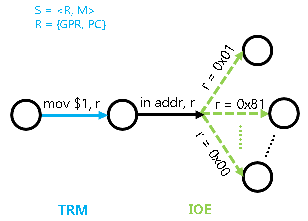

<!-- ## Input and Output -->
## Ввод и вывод

<!-- We have successfully run the various test cases in `cpu-tests`, but these test cases can only silently perform pure calculations.
Recalling the first program `hello` we wrote in the programming course, at least it output one line of information.
In fact, input and output are the basic means for computers to interact with the outside world.
If you still remember that the full name of the BIOS program executed when the computer starts up is Basic Input/Output System,
you will understand how important input and output is for computers.
In real computers, input and output are accomplished by accessing I/O devices. -->
Мы успешно запустили разные тестовые случаи из `cpu-tests`, но эти тесты умеют только молча делать чистые вычисления.
Вспомните первую программу `hello` с курса программирования: хотя бы одну строку она выводила.
На самом деле ввод и вывод — основное средство взаимодействия компьютера с внешним миром.
Если ещё помните, что полное имя программы BIOS, которая выполняется при старте компьютера, — Basic Input/Output System,
поймёте, насколько ввод и вывод важны для компьютера.
В настоящих компьютерах ввод и вывод делают через доступ к устройствам I/O.

<!-- ### Devices and CPU -->
### Устройства и CPU

<!-- The working principle of devices is actually not mysterious.
In the near future, you will see the Verilog code related to the keyboard controller module and VGA controller module in the digital circuit experiment.
Oh, it turns out that these devices are also digital circuits!
In fact, as long as some meaningful digital signals are sent to the device, the device will work according to the meaning of these signals.
Isn't it like "the instructions of the program guide how the CPU works" to let some signals guide how the device works? That's exactly it!
Devices also have their own status registers (equivalent to CPU registers) and their own functional units (equivalent to CPU arithmetic units).
Of course, different devices have different functional units,
for example, the keyboard has a component that converts the analog signal of the key press into a scan code,
while the VGA has a component that converts the pixel color information into an analog signal for the display.
The signal that controls the operation of the device is called a "command word", which can be understood as a "device instruction".
The job of the device is to receive the command word and perform decoding and execution...
You already know how the CPU works, all of this is too familiar to you. -->
Принцип работы устройств на самом деле не таинственен.
Вскоре на лабораторной по цифровым схемам вы увидите код verilog, связанный с модулем контроллера клавиатуры и модулем контроллера VGA.
О, так эти устройства тоже цифровые схемы!
На самом деле достаточно послать устройству осмысленные цифровые сигналы — и оно будет работать по смыслу этих сигналов.
Дать сигналам указывать устройству, как работать, — разве это не как «инструкции программы указывают CPU, как работать»? Именно так!
У устройства тоже свои регистры состояния (как регистры CPU) и свои функциональные блоки (как ALU CPU — арифметико-логическое устройство).
Разумеется, у разных устройств разные функциональные блоки:
например, у клавиатуры есть узел, который превращает аналоговый сигнал нажатия в скан-код,
а у VGA — узел, который превращает информацию о цвете пикселя в аналоговый сигнал дисплея.
Сигнал, который управляет работой устройства, называют «командным словом»; его можно понимать как «инструкцию устройства».
Работа устройства — принимать командное слово, декодировать и выполнять...
Вы уже знаете, как работает CPU, всё это вам слишком знакомо.

<!-- Since devices are used for input and output, accessing devices is simply to obtain data from devices (input), such as getting key scan codes from the keyboard controller,
or sending data to devices (output), such as writing color information of an image to the video memory.
But what if the user doesn't type on the keyboard, or the user wants to adjust the screen resolution?
This indicates that in addition to pure data reading and writing, we also need to control the devices:
for example, we need to get the status of the keyboard controller to see if a key is currently pressed;
or we need a way to query or set the resolution of the VGA controller.
So, from the perspective of the program, accessing devices = reading data + writing data + controlling status. -->
Раз устройства служат для ввода и вывода, доступ к устройству по сути — получить данные с устройства (ввод), например скан-код клавиши с контроллера клавиатуры,
или послать данные на устройство (вывод), например записать в видеопамять цветовую информацию изображения.
Но что, если пользователь не нажимал клавиши, или хочет сменить разрешение экрана?
Значит, кроме чистого чтения и записи данных, устройством ещё нужно управлять:
например, прочитать состояние контроллера клавиатуры и узнать, нажата ли сейчас клавиша;
или нужен способ запросить или задать разрешение контроллера VGA.
Итак, с точки зрения программы доступ к устройству = прочитать данные + записать данные + управлять состоянием.

<!-- We hope that the computer can control devices and make devices do what we want them to do. This task undoubtedly falls on the CPU.
In addition to performing calculations, the CPU also needs to access devices and cooperate with them to complete different tasks.
So from the CPU's perspective, what do these behaviors actually mean?
Specifically, where should data be read from? Where should data be written to? How to query/set the status of the device?
A fundamental question is, what is the interface between the CPU and devices? -->
Мы хотим, чтобы компьютер управлял устройствами и заставлял их делать то, что нам нужно; эта задача без сюрпризов ложится на CPU.
Кроме вычислений CPU ещё должен обращаться к устройствам и вместе с ними выполнять разные задачи.
Так что с точки зрения CPU что эти действия на самом деле значат?
Конкретно: откуда читать данные? куда писать данные? как запросить/задать состояние устройства?
Самый сущностный вопрос: каков интерфейс между CPU и устройством?

<!-- The answer may be much simpler than you imagine: since devices also have registers,
a simple way is to use the device's registers as the interface and let the CPU access these registers.
For example, the CPU can read/write data from/to the device's data register to perform input/output;
it can read the device's status from the device's status register to ask if the device is busy;
or it can write a command word to the device's command register to modify the device's status. -->
Ответ, возможно, гораздо проще, чем кажется: раз у устройства тоже есть регистры,
самый простой способ — взять регистры устройства как интерфейс и дать CPU к ним обращаться.
Например, CPU может читать/писать данные в регистр данных устройства — это ввод и вывод;
читать состояние из регистра состояния — спросить, занято ли устройство;
или записать командное слово в регистр команд — изменить состояние устройства.

<!-- So, how does the CPU access device registers?
Let's first review how the CPU accesses its own registers:
First, we assign a number to these registers, for example, `eax` is `0`, `ecx` is `1`...
Then in the instructions, we reference these numbers, and there will be corresponding selectors on the circuit to select the corresponding register and perform read/write operations.
Accessing device registers is similar:
We can also assign numbers to the registers in the device that the CPU is allowed to access, and then reference these numbers through instructions.
There may be some private registers in the device that are maintained by the device itself,
they do not have such numbers, and the CPU cannot directly access them. -->
Так как же CPU обращается к регистрам устройства?
Сначала вспомним, как CPU обращается к своим регистрам:
сначала регистрам дают номера, например `eax` — `0`, `ecx` — `1`...
затем в инструкции ссылаются на эти номера, на схеме есть соответствующий селектор, который выбирает регистр и читает/пишет.
Доступ к регистрам устройства похож:
регистрам устройства, к которым CPU разрешено обращаться, тоже можно дать номера и ссылаться на них из инструкций.
У устройства могут быть и частные регистры, которые оно ведёт само:
у них таких номеров нет, CPU к ним напрямую не обратиться.

<!-- This is called the I/O addressing method, and these numbers are also called device addresses. There are two commonly used addressing methods. -->
Это и есть способ адресации I/O, поэтому эти номера называют также адресами устройства. Обычно используют два способа адресации.

<!-- ### Port I/O -->
### Портовый I/O

<!-- One I/O addressing method is port-mapped I/O, where the CPU uses dedicated I/O instructions to access devices,
and the device address is called the port number.
Once we have the port number, we can specify the port number in the I/O instruction to know which device register to access.
Most computers on the market are IBM PC compatible,
and IBM PC compatible machines have [specific regulations][io port] for allocating port numbers to common devices. -->
Один способ адресации I/O — port-mapped I/O (портово-отображаемый I/O): CPU обращается к устройствам специальными инструкциями I/O,
а адрес устройства называют номером порта.
Когда номер порта есть, его указывают в инструкции I/O — и ясно, к какому регистру устройства обращаться.
Большинство компьютеров на рынке — совместимые с IBM PC,
и у совместимых с IBM PC есть [особые правила][io port] распределения номеров портов для обычных устройств.

[io port]: https://wiki.osdev.org/I/O_Ports#The_list

<!-- x86 provides the `in` and `out` instructions for accessing devices,
where the `in` instruction is used to transfer data from the device register to the CPU register,
and the `out` instruction is used to transfer data from the CPU register to the device register.
An example is using the `out` instruction to send a command word to the serial port: -->
x86 даёт инструкции `in` и `out` для доступа к устройствам:
`in` переносит данные из регистра устройства в регистр CPU,
`out` — из регистра CPU в регистр устройства.
Пример: инструкцией `out` послать командное слово на последовательный порт:

```asm
movl $0x41, %al
movl $0x3f8, %edx
outb %al, (%dx)
```

<!-- The above code sends the data 0x41 to the device register corresponding to port 0x3f8.
After the CPU executes the above code, it will send the data 0x41 to one of the serial port's registers.
After receiving it, the serial port will find that it needs to output the character `A`;
but from the CPU's perspective, it doesn't care how the device processes the data 0x41, it will simply send 0x41 to port 0x3f8.
In fact, the API and behavior of the device will be clearly defined in the corresponding documentation.
In PA, we don't need to understand these details, we only need to know that
driver developers can write corresponding programs to access devices by RTFM. -->
Код выше передаёт данные 0x41 в регистр устройства, соответствующий порту 0x3f8.
После выполнения CPU передаст 0x41 в один из регистров последовательного порта;
порт, приняв, обнаружит, что нужно вывести символ `A`;
но для CPU всё равно, как устройство обработает 0x41: оно честно передаст 0x41 на порт 0x3f8.
На самом деле API устройства и его поведение ясно определены в соответствующей документации;
в PA эти детали знать не нужно, достаточно знать:
разработчик драйвера может через RTFM написать программу, которая обращается к устройству.

<!-- > #### caution::Does this feel familiar?
> API, behavior, RTFM... That's right, we've seen another example of computer system design:
> The device exposes the interface of the device registers to the CPU, abstracting the complex behavior inside the device (even some characteristics of analog circuits).
> The CPU only needs to use this interface to access the device to achieve the desired functionality.
>
> The idea of abstraction is pervasive in computer systems. As long as you understand the principles behind it,
> and add the RTFM skill, you can master all computer systems! -->
> #### caution::Знакомое чувство?
> API, поведение, RTFM... Верно, снова пример дизайна компьютерных систем:
> устройство открывает CPU интерфейс своих регистров и абстрагирует сложное внутреннее поведение (даже свойства аналоговых схем),
> CPU достаточно этим интерфейсом обратиться к устройству — и получит ожидаемую функцию.
>
> В компьютерных системах повсюду идея абстракции; стоит понять принципы
> и добавить навык RTFM — и вы освоите компьютерные системы целиком!

<!-- ### Memory-mapped I/O -->
### I/O, отображённый на память

<!-- Port-mapped I/O takes the port number as part of the I/O instruction, which is a simple method, but also its biggest drawback.
The instruction set, in order to be compatible with already developed programs, can only be added but not modified.
This means that the size of the I/O address space that port-mapped I/O can access is determined at the moment the I/O instruction is designed.
The so-called I/O address space is actually the set of addresses of all accessible devices.
As more and more devices and functions become more and more complex, port-mapped I/O with a limited I/O address space has gradually become unable to meet the demand.
Some devices need the CPU to access a relatively large continuous storage space,
such as the video memory of VGA, which requires a 3MB addressing range for a 1024x768 resolution with 24-bit color plus an Alpha channel.
Hence, memory-mapped I/O (MMIO) was born. -->
Port-mapped I/O берёт номер порта как часть инструкции I/O: способ простой, и это же его главный минус.
Набор инструкций ради совместимости с уже написанными программами можно только расширять, но не менять.
Значит, размер адресного пространства I/O, доступного port-mapped I/O, решён в момент дизайна инструкции I/O.
Адресное пространство I/O — по сути множество адресов всех доступных устройств.
Устройств всё больше, функции всё сложнее — ограниченного пространства port-mapped I/O постепенно не хватает.
Некоторым устройствам нужно, чтобы CPU обращался к довольно большому непрерывному хранилищу,
например видеопамять VGA: при 24-битном цвете плюс канал Alpha и разрешении 1024x768 нужен диапазон адресации 3MB.
Так родился memory-mapped I/O (MMIO, I/O, отображённый на память).

<!-- This memory-mapped I/O addressing method is very ingenious, it addresses devices through different physical memory addresses.
This addressing method "redirects" the access to a portion of physical memory to the I/O address space,
when the CPU attempts to access this portion of physical memory, it actually ends up accessing the corresponding I/O device, but the CPU is unaware of this.
After that, the CPU can access devices through ordinary memory access instructions.
This is also the great advantage of memory-mapped I/O:
The physical memory address space and the CPU's bit width will continue to grow, and memory-mapped I/O never needs to worry about the I/O address space being exhausted.
In principle, the only drawback of memory-mapped I/O is that
the CPU cannot directly access the physical memory that is mapped to the I/O address space through normal channels.
However, as computers have developed, the only drawback of memory-mapped I/O has become less and less noticeable:
Modern computers are already 64-bit computers, with 48 physical address lines, meaning the physical address space is as large as 256TB,
carving out a 3MB address space for video memory is just a drop in the bucket. -->
Такая адресация MMIO очень изящна: устройства адресуют разными адресами физической памяти.
Этот способ «перенаправляет» доступ к части физической памяти в адресное пространство I/O:
когда CPU пытается обратиться к этой части физической памяти, на самом деле обращается к соответствующему устройству I/O, а CPU об этом не знает.
После этого CPU может обращаться к устройствам обычными инструкциями обращения к памяти.
В этом и уникальный плюс MMIO:
адресное пространство физической памяти и разрядность CPU будут расти, и MMIO никогда не нужно бояться, что пространство I/O кончится.
В принципе единственный минус MMIO:
CPU обычным путём уже не обратиться напрямую к той физической памяти, которая отображена в пространство I/O.
Но с развитием компьютеров этот единственный минус всё незаметнее:
современные компьютеры уже 64-битные, физических адресных линий 48, значит физическое адресное пространство — 256TB,
вырезать из него 3MB под видеопамять — вообще ни о чём.

<!-- Precisely because of this, memory-mapped I/O has become the mainstream I/O addressing method for modern computers:
RISC architectures only provide memory-mapped I/O addressing,
and mainstream devices such as PCI-e, network cards, and x86's APIC all support access through memory-mapped I/O. -->
Именно поэтому MMIO стал основным способом адресации I/O современных компьютеров:
архитектуры RISC дают только адресацию MMIO,
а PCI-e, сетевые карты, APIC x86 и другие основные устройства поддерживают доступ через MMIO.

<!-- As RISC architectures, both mips32 and riscv32 use the memory-mapped I/O addressing method.
For x86, an example of memory-mapped I/O is the physical address range `[0xa1000000, 0xa1800000)` in NEMU.
This physical address range is mapped to the video memory inside the VGA, reading and writing to this physical address range is equivalent to reading and writing data to the VGA video memory.
For example: -->
Как RISC-архитектуры, mips32 и riscv32 используют адресацию MMIO.
Для x86 пример MMIO — физический адресный интервал `[0xa1000000, 0xa1800000)` в NEMU.
Этот интервал отображён на видеопамять внутри VGA; чтение и запись этого интервала эквивалентны чтению и записи данных видеопамяти VGA.
Например:

```c
memset((void *)0xa1000000, 0, SCR_SIZE);
```

<!-- This will zero out a screen-sized data in the video memory, i.e., write black pixels to the entire screen, effectively clearing the screen.
We can see that the programming model of memory-mapped I/O is exactly the same as normal programming:
Programmers can directly access I/O devices as if they were memory. This feature is also deeply loved by driver developers. -->
обнулит в видеопамяти данные размером с экран, то есть запишет чёрные пиксели на весь экран — по сути очистка экрана.
Видно: модель программирования MMIO полностью совпадает с обычным программированием:
программист может обращаться к устройству I/O как к памяти. Эту черту разработчики драйверов очень любят.

<!-- > #### question::Understanding the volatile keyword
> Perhaps you've never heard of the `volatile` keyword in C, but it has existed since the birth of C.
> The `volatile` keyword has a very special purpose, which is to prevent the compiler from optimizing the corresponding code.
> You should try to experience the effect of `volatile` by writing the following code on GNU/Linux: -->
> #### question::Понять ключевое слово volatile
> Возможно, вы никогда не слышали о ключевом слове `volatile` в C, но оно есть с рождения языка.
> Назначение `volatile` особое: не давать компилятору оптимизировать соответствующий код.
> Стоит руками ощутить роль `volatile`: под GNU/Linux напишите следующий код:

```c
void fun() {
  extern unsigned char _end;  // что такое _end?
  volatile unsigned char *p = &_end;
  *p = 0;
  while(*p != 0xff);
  *p = 0x33;
  *p = 0x34;
  *p = 0x86;
}
```

<!-- > Then compile the code using `-O2`.
> Try removing the `volatile` keyword from the code, recompile using `-O2`, and compare the differences in the disassembly results before and after removing `volatile`.
>
> You may be puzzled, isn't code optimization a good thing? Why does such a weird thing as `volatile` exist?
> Think about it, if the address that `p` points to in the code is eventually mapped to a device register, what problems might removing `volatile` cause? -->
> Затем скомпилируйте код с `-O2`.
> Попробуйте убрать из кода ключевое слово `volatile`, снова скомпилировать с `-O2` и сравнить дизассемблирование до и после удаления `volatile`.
>
> Возможно, недоумение: оптимизация кода — разве не хорошо? Зачем существует такая странность, как `volatile`?
> Подумайте: если адрес, на который указывает `p`, в итоге отображён на регистр устройства, какие проблемы может принести удаление `volatile`?

<!-- ### Input/Output from a State Machine Perspective -->
### Ввод/вывод с взгляда конечного автомата

<!-- In PA1, we mentioned that both computers and programs can be viewed as state machines,
and the state of this state machine can be represented as `S = <R, M>`, where `R` is the state of the registers, and `M` is the state of the memory.
After adding input/output functionality to the computer, how should we understand the behavior of input/output? -->
В PA1 мы говорили: и компьютер, и программу можно рассматривать как конечный автомат,
состояние этого автомата можно записать как `S = <R, M>`, где `R` — состояние регистров, `M` — состояние памяти.
Когда компьютеру добавили ввод и вывод, как понимать поведение ввода и вывода?

<!-- We can divide the device into two parts, one part is the digital circuit.
We have briefly introduced some functions of device controllers, for example, our CPU can read key information from the keyboard controller.
Since it is a digital circuit, we can treat the sequential logic circuit within it as the state `D` of the digital circuit part of the device.
However, `D` is somewhat special, the computer can only access and modify `D` through port I/O instructions or memory access instructions for memory-mapped I/O. -->
Устройство можно разделить на две части; одна — цифровая схема.
Мы кратко представили некоторые функции контроллеров устройств: например, CPU может прочитать информацию о клавише из контроллера клавиатуры.
Раз это цифровая схема, последовательную логику внутри можно считать состоянием `D` цифровой части устройства.
Но `D` особое: компьютер может читать и менять `D` только инструкциями портового I/O или инструкциями обращения к памяти MMIO.

<!-- Interestingly, the other part of the device is the analog circuit, which can also change `D`.
For example, the keyboard determines whether a key is pressed by checking the capacitance change at the key position,
if so, it will write the key information to the register of the keyboard controller.
Whether the capacitance at the key position changes or not is determined by whether the user presses the key in the physical world.
So we say that the device is a bridge connecting the computer and the physical world. -->
Интересна другая часть устройства: аналоговая схема — она тоже может менять `D`.
Например, клавиатура по изменению ёмкости в позиции клавиши судит, нажата ли клавиша;
если да — записывает информацию о клавише в регистр контроллера клавиатуры.
А меняется ли ёмкость в позиции клавиши, решает, нажал ли пользователь клавишу в физическом мире.
Поэтому говорят: устройство — мост между компьютером и физическим миром.

```
  модель конечного автомата    |           вне модели конечного автомата
  S = <R, M>                   |                D
  компьютер/программа  <----инструкция I/O----> устройство <----аналоговая схема----> физический мир
                               |
                               |
```

<!-- Modeling the state and behavior of devices is a very difficult task,
not only are the behaviors of devices themselves diverse, but the state of devices is also constantly influenced by the physical world.
Therefore, when extending the behavior of the state machine model, we do not consider adding `D` to `S`,
but only model the behavior of input/output-related instructions: -->
Моделировать состояние и поведение устройств очень трудно:
кроме того что поведение самих устройств самое разное, на состояние устройства постоянно влияет физический мир.
Поэтому, расширяя поведение модели конечного автомата, мы не включаем `D` в `S`,
а моделируем только поведение инструкций, связанных с вводом и выводом:

<!-- * When executing ordinary instructions, the state machine transitions according to the TRM model
* When executing device output-related instructions (such as the `out` instruction in x86 or the MMIO write instruction in RISC architectures),
  the state machine remains unchanged except for updating the PC, but the state of the device and the physical world will change accordingly
* When executing device input-related instructions (such as the `in` instruction in x86 or the MMIO read instruction in RISC architectures),
  the state machine transition will "branch": the state machine no longer has a unique new state like in the TRM,
  which new state the state machine will transition to will depend on the state of the device when executing this instruction -->
* при выполнении обычных инструкций автомат переходит по модели TRM
* при выполнении инструкций вывода на устройство (например `out` в x86 или запись MMIO в архитектурах RISC)
  кроме обновления PC остальные состояния автомата не меняются, но состояние устройства и физический мир изменятся соответственно
* при выполнении инструкций ввода с устройства (например `in` в x86 или чтение MMIO в архитектурах RISC)
  переход автомата «разветвится»: у автомата больше нет единственного нового состояния, как у TRM;
  в какое новое состояние он перейдёт, зависит от состояния устройства в момент выполнения этой инструкции



<!-- For example, in the figure above, the program is about to execute the instruction `in addr, r`,
this instruction will read data from the device address `addr` into the CPU register `r`.
Let's assume that this device address corresponds to a keyboard controller,
after executing this instruction, the value in `r` may be `0x01`, indicating that it has read the information "key with scan code 1 is pressed";
it may also be `0x81`, indicating that it has read the information "key with scan code 1 is released";
or it may be `0x0`, indicating that there is no key information.
This uncertain state transition will affect the subsequent execution of the program,
for example, a game may decide how to respond based on the key information read,
but it is not difficult to understand that how the game responds is implemented through ordinary computational instructions in the TRM, and has nothing to do with input/output. -->
Например, на рисунке выше программа собирается выполнить инструкцию `in addr, r`:
она прочитает данные из адреса устройства `addr` в регистр CPU `r`.
Допустим, этот адрес устройства соответствует некоторому контроллеру клавиатуры;
после выполнения в `r` может быть `0x01` — прочитана информация «нажата клавиша со скан-кодом 1»;
может быть `0x81` — «отпущена клавиша со скан-кодом 1»;
может быть `0x0` — информации о клавишах нет.
Этот неопределённый переход состояния повлияет на дальнейшую работу программы:
например, игра по прочитанной информации о клавишах решит, как ответить;
но нетрудно понять: как игра отвечает, реализуют обычные вычислительные инструкции TRM, к вводу и выводу это не относится.

<!-- This extended state machine model tells us from a microscopic perspective that the input and output of devices are all done through data interaction with the CPU registers.
The impact of input/output on the program is only reflected in an uncertain state transition during input,
which is basically all there is to input/output from the program's perspective. -->
Эта расширенная модель конечного автомата с микроскопического взгляда говорит: ввод и вывод устройства обмениваются данными через регистры CPU.
Влияние ввода и вывода на программу проявляется лишь в том, что при вводе происходит один переход состояния, который нельзя заранее определить, —
по сути это и есть весь ввод и вывод глазами программы.

<!-- > #### comment::Input/Output through Memory Data Interaction
> We know that `S = <R, M>`, and the port I/O and memory-mapped I/O introduced above all perform data interaction through the register `R`.
> Naturally, we can consider whether there is an input/output method that performs data interaction through memory `M`.
>
> Actually, there is such a method called [DMA][DMA].
> To improve performance, most complex devices generally have DMA functionality.
> However, the devices in NEMU are relatively simple, so we will not go into the details of DMA. -->
> #### comment::Ввод/вывод с обменом данными через память
> Мы знаем `S = <R, M>`; портовый I/O и MMIO выше все обмениваются данными через регистры `R`.
> Естественно спросить: есть ли способ ввода/вывода с обменом через память `M`?
>
> На самом деле есть — это [DMA][DMA].
> Чтобы поднять производительность, у сложных устройств обычно есть функция DMA.
> Но устройства в NEMU довольно простые, детали DMA не разбираем.

[DMA]: http://en.wikipedia.org/wiki/Direct_memory_access

<!-- ## Input/Output in NEMU -->
## Ввод и вывод в NEMU

<!-- The NEMU framework code has already provided device-related code in the `nemu/src/device/` directory, -->
Каркасный код NEMU уже дал связанный с устройствами код в каталоге `nemu/src/device/`.

<!-- ### Mapping and I/O Methods -->
### Отображения и способы I/O

<!-- NEMU implements two I/O addressing methods: port-mapped I/O and memory-mapped I/O.
However, whether it is port-mapped I/O or memory-mapped I/O, their core is mapping.
Naturally, we can unify these two by managing the mapping. -->
NEMU реализовал два способа адресации I/O: port-mapped I/O и memory-mapped I/O.
Но и у того и у другого ядро — отображение (mapping).
Естественно, управляя отображениями, оба способа можно унифицировать.

<!-- Specifically, the framework code defines a structure type `IOMap` (defined in `nemu/include/device/map.h`) for mapping,
including the name, start and end addresses of the mapping, the target space of the mapping, and a callback function.
Then in `nemu/src/device/io/map.c`, the management of mapping is implemented,
including the allocation and mapping of the I/O space, as well as the access interface for mapping. -->
Конкретно каркас определил для отображения тип структуры `IOMap` (в `nemu/include/device/map.h`):
имя, начальный и конечный адреса отображения, целевое пространство отображения и callback.
Затем в `nemu/src/device/io/map.c` реализовано управление отображениями:
выделение пространства I/O и его отображение, а также интерфейс доступа к отображению.

<!-- Among them, `map_read()` and `map_write()` are used to map the address `addr` to the target space indicated by `map`, and perform access.
During access, the corresponding callback function may be triggered to update the state of the device and the target space.
Since NEMU is a single-threaded program, it can only simulate the operation of the entire computer system serially,
and the callback function (callback) provided by the device will only be called when performing I/O read/write.
Based on these two APIs, we can easily implement the simulation of port-mapped I/O and memory-mapped I/O. -->
Среди них `map_read()` и `map_write()` отображают адрес `addr` в целевое пространство, указанное `map`, и выполняют доступ.
При доступе может сработать соответствующий callback и обновить состояние устройства и целевого пространства.
Поскольку NEMU — однопоточная программа, всю компьютерную систему она может симулировать только последовательно:
callback устройства вызывается только при чтении/записи I/O.
На этих двух API легко реализовать симуляцию port-mapped I/O и MMIO.

<!-- `nemu/src/device/io/port-io.c` is the simulation of port-mapped I/O.
The `add_pio_map()` function is used to register a port-mapped I/O mapping relationship for device initialization.
`pio_read()` and `pio_write()` are the port I/O read/write interfaces facing the CPU,
they will eventually call `map_read()` and `map_write()` to access the I/O space registered through `add_pio_map()`. -->
`nemu/src/device/io/port-io.c` — симуляция port-mapped I/O.
Функция `add_pio_map()` при инициализации устройства регистрирует отображение port-mapped I/O.
`pio_read()` и `pio_write()` — интерфейс чтения/записи портового I/O со стороны CPU;
в итоге они вызовут `map_read()` и `map_write()` и обратятся к пространству I/O, зарегистрированному через `add_pio_map()`.

<!-- The simulation of memory-mapped I/O is similar, `paddr_read()` and `paddr_write()` will determine whether the address `addr` falls in the physical memory space or the device space.
If it falls in the physical memory space, it will access the real physical memory through `pmem_read()` and `pmem_write()`;
otherwise, it will access the corresponding device through `map_read()` and `map_write()`.
From this perspective, memory and peripherals are no different from the CPU's point of view, they are just byte-addressable objects. -->
Симуляция MMIO похожа: `paddr_read()` и `paddr_write()` решат, попадает ли адрес `addr` в пространство физической памяти или в пространство устройств.
Если в пространство физической памяти — обратятся к настоящей физической памяти через `pmem_read()` и `pmem_write()`;
иначе — к соответствующему устройству через `map_read()` и `map_write()`.
С этого взгляда память и периферия для CPU ничем не отличаются: и то и другое — объекты с байтовой адресацией.

<!-- ### Devices -->
### Устройства

<!-- NEMU implements seven devices: serial port, clock, keyboard, VGA, sound card, disk, and SD card,
among which the disk will be introduced at the end of PA, and the SD card will not be involved in PA.
To simplify the implementation, these devices are all non-programmable, and only the functions used in NEMU are implemented.
To enable device simulation, you need to select the relevant option in menuconfig: -->
NEMU реализовал семь устройств: последовательный порт, часы, клавиатура, VGA, звуковая карта, диск, SD-карта;
диск представим в конце PA, а SD-карта в PA не участвует.
Для упрощения эти устройства непрограммируемые, реализованы только функции, нужные в NEMU.
Чтобы включить симуляцию устройств, в menuconfig выберите связанную опцию:

```
[*] Devices  --->
```

<!-- After recompiling, you will see that a new window will pop up when running NEMU, which is used to display the VGA output (see below).
Note that the prompt `(nemu)` displayed in the terminal is still waiting for user input, and the window does not display any content at this time. -->
После перекомпиляции при запуске NEMU всплывёт новое окно — для вывода VGA (см. ниже).
Заметьте: приглашение `(nemu)` в терминале по-прежнему ждёт ввода, и окно пока ничего не показывает.

<!-- NEMU uses the SDL library to implement device simulation, and `nemu/src/device/device.c` contains code related to the SDL library.
The `init_device()` function mainly performs the following tasks:
* Call `init_map()` for initialization.
* Initialize the above devices, and during the initialization of VGA, some SDL-related initialization work will also be performed,
  including creating windows, setting display modes, etc.
* Then it will perform initialization work related to the timer (alarm).
  The timer function will not be used until the end of PA4, so it can be ignored for now. -->
NEMU симулирует устройства библиотекой SDL; связанный с SDL код — в `nemu/src/device/device.c`.
Функция `init_device()` в основном делает следующее:
* вызывает `init_map()` для инициализации
* инициализирует указанные выше устройства; при инициализации VGA ещё связанная с SDL работа:
  создание окна, задание режима отображения и т.д.
* затем инициализация, связанная с таймером (alarm).
  Функция таймера понадобится только в конце PA4, пока её можно игнорировать.

<!-- On the other hand, `cpu_exec()` will call the `device_update()` function after executing each instruction.
This function first checks whether a certain amount of time has elapsed since the last device update, if so, it will attempt to refresh the screen,
and further check whether any keys have been pressed/released, and whether the `X` button of the window has been clicked;
otherwise, it will return directly to avoid checking too frequently, because the above events occur at a very low frequency. -->
С другой стороны, `cpu_exec()` после каждой инструкции вызывает `device_update()`.
Эта функция сначала проверяет, прошло ли достаточно времени с прошлого обновления устройств; если да — попытается обновить экран
и дальше проверить, нажаты/отпущены ли клавиши и нажата ли кнопка `X` окна;
иначе сразу вернётся, чтобы не проверять слишком часто: указанные события происходят редко.

<!-- ## Abstracting Input/Output into IOE -->
## Абстрагировать ввод и вывод в IOE

<!-- The specific implementation of device access is architecture-dependent. For example, NEMU's VGA memory is located in the physical address range `[0xa1000000, 0xa1080000)`, but for `native` programs, this is an inaccessible illegal range. Therefore, `native` programs need to implement similar functionality in other ways. Naturally, this architecture-dependent functionality of device access should be included in AM. Unlike TRM, device access provides input and output functionality for computers, so we categorize them into a new API called IOE (I/O Extension). -->
Конкретная реализация доступа к устройствам связана с архитектурой.
Например, видеопамять VGA в NEMU лежит в физическом адресном интервале `[0xa1000000, 0xa1080000)`,
но для программ `native` это недоступный незаконный интервал,
поэтому программам `native` похожую функцию нужно реализовать иначе.
Естественно, связанный с архитектурой доступ к устройствам отнести в AM.
В отличие от TRM, доступ к устройствам даёт компьютеру ввод и вывод,
поэтому мы выделяем их в новый класс API под именем IOE (I/O Extension).

<!-- How can we abstract device access across different architectures into a unified API? Recall that from the program's perspective, accessing a device essentially wants to do the following: device access = read data + write data + control state. Furthermore, controlling the state is essentially an operation of reading/writing device registers, so device access = read/write operation. -->
Как абстрагировать доступ к устройствам разных архитектур в единый API?
Вспомните, чего с точки зрения программы доступ к устройству на самом деле хочет:
доступ к устройству = прочитать данные + записать данные + управлять состоянием.
Дальше: управление состоянием по сути тоже чтение/запись регистров устройства,
значит доступ к устройству = операции чтения/записи.

<!-- Yes, it's that simple! So IOE provides three APIs: -->
Да, вот так просто! Поэтому IOE даёт три API:

```c
bool ioe_init();
void ioe_read(int reg, void *buf);
void ioe_write(int reg, void *buf);
```

<!-- The first API is for performing IOE-related initialization operations. The latter two APIs are used to read content from the register numbered `reg` into the buffer `buf`, and to write the content of the buffer `buf` into the register numbered `reg`, respectively. Note that the `reg` register here is not the device register discussed earlier, because the numbering of device registers is architecture-dependent. In IOE, we want to adopt an architecture-independent "abstract register". This `reg` is actually a function number, and we agree that the meaning of the same function number is also the same across different architectures, thus achieving the abstraction of device registers. -->
Первый API — связанная с IOE инициализация.
Два последних — прочитать содержимое регистра с номером `reg` в буфер `buf`
и записать содержимое буфера `buf` в регистр с номером `reg`.
Заметьте: регистр `reg` здесь — не регистр устройства, о котором говорили выше, потому что нумерация регистров устройства связана с архитектурой.
В IOE мы хотим архитектуронезависимый «абстрактный регистр»;
этот `reg` на самом деле номер функции, и мы договариваемся: на разных архитектурах смысл одного номера функции одинаков —
так абстрагируются регистры устройства.

<!-- `abstract-machine/am/include/amdev.h` defines the "abstract register" numbers and corresponding structures for common devices. These definitions are architecture-independent, and each architecture needs to follow these definitions (conventions) when implementing its own IOE API. For convenient access to these abstract registers, klib provides the `io_read()` and `io_write()` macros, which further encapsulate the `ioe_read()` and `ioe_write()` APIs, respectively. -->
В `abstract-machine/am/include/amdev.h` определены номера «абстрактных регистров» обычных устройств и соответствующие структуры.
Эти определения не зависят от архитектуры; каждая архитектура, реализуя свой API IOE, должна следовать этим определениям (соглашению).
Чтобы удобно обращаться к этим абстрактным регистрам, klib даёт макросы `io_read()` и `io_write()`,
которые дальше упаковывают API `ioe_read()` и `ioe_write()`.

<!-- Particularly, as a platform, NEMU's device behavior is ISA-independent. Therefore, we only need to implement one IOE in the `abstract-machine/am/src/platform/nemu/ioe/` directory, which can be shared by all architectures on the NEMU platform. Among them, `abstract-machine/am/src/platform/nemu/ioe/ioe.c` implements the three IOE APIs mentioned above. Both `ioe_read()` and `ioe_write()` index to a handler function based on the abstract register number and then call it. The specific functionality of the handler function is related to the register number. Next, we will introduce the functionality of each device in NEMU one by one. -->
В частности, NEMU как платформа: поведение устройств не зависит от ISA,
поэтому достаточно реализовать один IOE в каталоге `abstract-machine/am/src/platform/nemu/ioe/`, чтобы архитектуры платформы NEMU им делились.
Там `abstract-machine/am/src/platform/nemu/ioe/ioe.c` реализует указанные три API IOE:
`ioe_read()` и `ioe_write()` по номеру абстрактного регистра индексируют функцию-обработчик и вызывают её.
Конкретная функция обработчика связана с номером регистра; ниже по очереди представим функции каждого устройства в NEMU.

<!-- ### Serial Port -->
### Последовательный порт

<!-- The serial port is the simplest output device. `nemu/src/device/serial.c` simulates the functionality of the serial port. Most of its functionality is also simplified, leaving only the data register. During serial port initialization, it registers an 8-byte port at `0x3F8` and an 8-byte MMIO space at `0xa00003F8`, both of which are mapped to the serial port's data register. Since NEMU simulates the operation of a computer system in series, the serial port's status register can always be in an idle state; whenever the CPU writes data to the data register, the serial port will send the data to the host's standard error stream for output. -->
Последовательный порт — самое простое устройство вывода. `nemu/src/device/serial.c` симулирует функцию последовательного порта.
Большая часть функций упрощена, оставлен только регистр данных.
При инициализации регистрируются порт длиной 8 байт в `0x3F8`
и пространство MMIO длиной 8 байт в `0xa00003F8`; оба отображаются на регистр данных порта.
Поскольку NEMU симулирует компьютерную систему последовательно, регистр состояния порта может всегда быть свободен;
когда CPU пишет данные в регистр данных, порт передаёт их в стандартный поток ошибок хоста.

<!-- In fact, in `$ISA-nemu`, the `putch()` function we mentioned earlier is output through the serial port. However, AM puts `putch()` in TRM instead of IOE, which seems a bit strange. Indeed, the most primitive TRM proposed in computational theory does not include the ability to output, but for a real computer system, output is a basic functionality. Without output, the user would not even know what the program is doing. Therefore, in AM, the addition of `putch()` gives TRM the ability to output characters, and the extended TRM is closer to a practical machine rather than just a mathematical model for computation. -->
На самом деле в `$ISA-nemu` упомянутая ранее функция `putch()` выводит как раз через последовательный порт.
Однако AM кладёт `putch()` в TRM, а не в IOE, — выглядит странно.
Действительно, самый исходный TRM теории вычислимости способности вывода не содержит,
но для реальной компьютерной системы вывод — самая базовая функция:
без вывода пользователь даже не узнает, что программа делает.
Поэтому в AM добавление `putch()` даёт TRM способность выводить символы;
расширенный TRM ближе к практической машине, а не только к математической модели, которая умеет лишь считать.

<!-- The `putch()` in `abstract-machine/am/src/platform/nemu/trm.c` will output the character to the serial port. If you choose x86, to allow the program to use the serial port for output, you also need to implement port-mapped I/O in NEMU. -->
`putch()` в `abstract-machine/am/src/platform/nemu/trm.c` выводит символ на последовательный порт.
Если выбрана x86, чтобы программа выводила через последовательный порт, в NEMU ещё нужно реализовать port-mapped I/O.

<!-- > #### todo::Run Hello World
> If you choose x86, you need to implement the `in` and `out` instructions. Specifically, you need to RTFSC, and then correctly call `pio_read()` and `pio_write()` in the implementation of the `in` and `out` instructions. If you choose mips32 or riscv32, you don't need to implement additional code, because the NEMU framework code already supports MMIO.
>
> After implementation, enter the following in the `am-kernels/kernels/hello/` directory: -->
> #### todo::Запустить Hello World
> Если выбрана x86, нужно реализовать инструкции `in` и `out`. Конкретно нужен RTFSC,
> затем в реализации `in` и `out` правильно вызвать `pio_read()` и `pio_write()`.
> Если выбраны mips32 или riscv32, дополнительного кода не нужно:
> каркас NEMU уже поддерживает MMIO.
>
> После реализации в каталоге `am-kernels/kernels/hello/` введите
> ```bash
> make ARCH=$ISA-nemu run
> ```
> Если реализация верна, программа выведет в терминал некоторую информацию (следите, чтобы вывод не утонул в отладочных сообщениях).
>
> Заметьте: этот hello и первая программа hello с курса программирования лежат на разных слоях абстракции:
> этот hello можно сказать работает прямо на голом железе и поверх абстракции AM может выводить прямо на устройство (последовательный порт);
> а hello с курса программирования лежит поверх ОС,
> устройствами напрямую не управляет, выводит только через службы ОС,
> и данные вывода проходят много слоёв абстракции, прежде чем дойти до слоя устройств.
> Роль ОС дальше ощутите в PA3.

<!-- > #### comment::Devices and DiffTest
> From the state machine perspective, executing an input instruction causes the state transition of the state machine to become non-unique, with the new state depending on the state of the device. Since the behavior of devices in NEMU is customized by us and is not exactly the same as the behavior of standard devices in REF (for example, the serial port in NEMU is always ready, but the serial port in QEMU may not be), this causes the result of executing input instructions in NEMU to be different from REF. To allow DiffTest to work properly, the framework code calls the `difftest_skip_ref()` function during device access (see the `find_mapid_by_addr()` function defined in `nemu/include/device/map.h`) to skip checking against REF. -->
> #### comment::Устройства и DiffTest
> С взгляда конечного автомата выполнение инструкции ввода делает переход состояния неоднозначным: новое состояние зависит от состояния устройства.
> Поскольку поведение устройств в NEMU мы задали сами и оно не полностью совпадает со стандартными устройствами REF
> (например, последовательный порт в NEMU всегда готов, а в QEMU, возможно, нет),
> результат выполнения инструкции ввода в NEMU будет отличаться от REF.
> Чтобы DiffTest работал нормально, каркас при доступе к устройствам вызывает `difftest_skip_ref()`
> (см. функцию `find_mapid_by_addr()` в `nemu/include/device/map.h`) и пропускает проверку с REF.

<!-- In AM, the `main()` function allows for a string argument, which is specified by `mainargs` and passed to the `main()` function by the AM runtime environment for use by the AM program. The specific method of passing the argument is architecture-dependent. For example, you can provide a string argument when running `hello`: -->
В AM у функции `main()` допускается строковый аргумент; его задают через `mainargs`,
и среда выполнения AM отвечает за передачу его в `main()` для программы AM.
Конкретный способ передачи связан с архитектурой.
Например, при запуске `hello` можно дать строковый аргумент:
```bash
make ARCH=$ISA-nemu run mainargs=I-love-PA
```
<!-- This argument will be output verbatim by the `hello` program. -->
Программа `hello` выведет этот аргумент как есть.

<!-- > #### option::Understanding mainargs
> Please RTFSC to understand how this argument is passed from the `make` command to the `hello` program. `$ISA-nemu` and `native` use different passing methods, both of which are worth understanding. -->
> #### option::Понять mainargs
> Через RTFSC поймите, как этот аргумент передаётся из команды `make` в программу `hello`.
> `$ISA-nemu` и `native` используют разные способы передачи, оба стоит узнать.

<!-- > #### todo::Implement printf
> With `putch()`, we can now implement `printf()` in klib.
>
> You have already implemented `sprintf()`, which is very similar in functionality to `printf()`, meaning there will be a lot of duplicated code between them. You have already seen the drawbacks of the copy-paste programming habit. Think about how to implement them concisely.
>
> After implementing `printf()`, you can use output debugging in AM programs. -->
> #### todo::Реализовать printf
> С `putch()` в klib уже можно реализовать `printf()`.
>
> `sprintf()` вы уже реализовали; по функции он очень похож на `printf()`, значит между ними будет немало повторяющегося кода.
> Вред привычки Copy-Paste вы уже видели; подумайте, как реализовать их кратко.
>
> Реализовав `printf()`, в программах AM уже можно пользоваться отладкой через вывод.

<!-- > #### todo::Run alu-tests
> We have ported a program specifically for testing various C language operations in the `am-kernels/tests/alu-tests/` directory. After implementing `printf()`, you can run it. The compilation process may take about 1 minute. -->
> #### todo::Запустить alu-tests
> В каталог `am-kernels/tests/alu-tests/` мы перенесли программу специально для теста разных операций языка C;
> реализовав `printf()`, её можно запускать. Компиляция может занять около 1 минуты.

<!-- ### Clock -->
### Часы

<!-- With a clock, programs can provide time-related experiences, such as frame rates and program speed. `nemu/src/device/timer.c` simulates the functionality of the i8253 timer. Most of the timer's functionality has been simplified, leaving only the "initiating clock interrupt" function (which we will not use for now). At the same time, a custom clock has been added. During initialization, the i8253 timer registers an 8-byte port at `0x48` and an 8-byte MMIO space at `0xa0000048`, both of which are mapped to two 32-bit RTC registers. The CPU can access these two registers to obtain the current time represented in 64 bits. -->
С часами программа может давать связанный со временем опыт: частота кадров игры, скорость программы и т.д.
`nemu/src/device/timer.c` симулирует функцию таймера i8253.
Большая часть функций таймера упрощена, оставлена только функция «инициировать прерывание часов» (пока ею не пользуемся).
Одновременно добавлены пользовательские часы.
При инициализации таймера i8253 регистрируются порт длиной 8 байт в `0x48`
и пространство MMIO длиной 8 байт в `0xa0000048`; оба отображаются на два 32-битных регистра RTC.
CPU может обратиться к этим двум регистрам и получить текущее время в 64-битном представлении.

<!-- > #### comment::Why not set a 64-bit RTC register?
> We want the design of devices to be decoupled from the CPU, so that devices can work with any CPU architecture they are connected to. However, a 32-bit CPU cannot access a 64-bit device register at once, so splitting a 64-bit function into two 32-bit device registers can support both 32-bit and 64-bit CPUs. -->
> #### comment::Почему не сделать один 64-битный регистр RTC?
> Мы хотим развязать дизайн устройства и CPU: какое бы CPU ни подключили, устройство должно работать.
> Но 32-битный CPU не может за раз обратиться к 64-битному регистру устройства, поэтому 64-битную функцию разбивают на два 32-битных регистра устройства — так можно поддерживать и 32-битные, и 64-битные CPU.

<!-- `abstract-machine/am/include/amdev.h` defines two abstract registers for clock functionality:
* `AM_TIMER_RTC`, AM Real Time Clock (RTC), which can read the current year, month, day, hour, minute, and second. Not used in PA for now.
* `AM_TIMER_UPTIME`, AM system uptime, which can read the number of microseconds since the system started. -->
В `abstract-machine/am/include/amdev.h` для функции часов определены два абстрактных регистра:
* `AM_TIMER_RTC`, часы реального времени AM (RTC, Real Time Clock); можно прочитать текущие год, месяц, день, час, минуту, секунду. В PA пока не используем.
* `AM_TIMER_UPTIME`, время работы системы AM; можно прочитать число микросекунд с момента старта системы.

<!-- > #### info::RTC - Real-Time Clock
> RTC refers to a clock whose elapsed rate is consistent with real time, allowing users to measure a period of time based on the RTC.
> According to this definition, both of the above AM abstract registers are RTCs, but they have different emphases:
> `AM_TIMER_RTC` emphasizes that the read time is completely consistent with real time,
> while `AM_TIMER_UPTIME` emphasizes the time elapsed since the system started, i.e., counting from 0.
>
> Although the device register in NEMU is also called RTC, it does not need to be implemented as `AM_TIMER_RTC` to support the `AM_TIMER_UPTIME` functionality. -->
> #### info::RTC — часы реального времени
> RTC в широком смысле — часы, скорость хода которых совпадает с реальным временем; по RTC пользователь может измерять отрезок времени.
> По этому определению оба абстрактных регистра AM выше — RTC, но акценты разные:
> `AM_TIMER_RTC` подчёркивает, что прочитанное время полностью совпадает с реальным,
> `AM_TIMER_UPTIME` — время, прошедшее с старта системы, то есть счёт с 0.
>
> Хотя регистр устройства в NEMU тоже называется RTC, чтобы поддержать `AM_TIMER_UPTIME`, его не обязательно реализовывать как `AM_TIMER_RTC`.

<!-- > #### todo::Implement IOE
> Implement the `AM_TIMER_UPTIME` functionality in `abstract-machine/am/src/platform/nemu/ioe/timer.c`.
> There is some input/output related code available for you to use in `abstract-machine/am/src/platform/nemu/include/nemu.h` and `abstract-machine/am/src/$ISA/$ISA.h`.
>
> After implementation, run the `real-time clock test` in `am-kernel/tests/am-tests` under `$ISA-nemu`.
> If your implementation is correct, you will see the program output a line to the terminal every second.
> Since we have not implemented `AM_TIMER_RTC`, the test will always output January 0, 1900, 0:00:00, which is normal behavior and can be ignored. -->
> #### todo::Реализовать IOE
> В `abstract-machine/am/src/platform/nemu/ioe/timer.c` реализуйте функцию `AM_TIMER_UPTIME`.
> Связанный с вводом и выводом код, которым можно пользоваться, есть в `abstract-machine/am/src/platform/nemu/include/nemu.h` и
> `abstract-machine/am/src/$ISA/$ISA.h`.
>
> После реализации в `$ISA-nemu` запустите тест `real-time clock test` из `am-kernel/tests/am-tests`.
> Если реализация верна, программа каждую секунду будет выводить в терминал строку.
> Поскольку `AM_TIMER_RTC` мы не реализовали, тест всегда выводит 0 января 1900, 0:00:00 —
> это нормальное поведение, можно игнорировать.

<!-- > #### hint::Do not run IOE-related tests when linking to klib on native
> The IOE on `native` is implemented based on the SDL library, which assumes that the behavior of common library functions will conform to the glibc standard.
> However, our own implementation of klib usually cannot meet this requirement. Therefore, `__NATIVE_USE_KLIB__` is only for testing the klib implementation, and we do not require all programs to run correctly when `__NATIVE_USE_KLIB__` is defined. -->
> #### hint::Не запускайте связанные с IOE тесты, когда на native линкуетесь к klib
> IOE на `native` реализован на библиотеке SDL; она предполагает, что поведение обычных библиотечных функций соответствует стандарту glibc,
> а наш klib обычно этому требованию не удовлетворяет. Поэтому `__NATIVE_USE_KLIB__` только для теста реализации klib;
> мы не требуем, чтобы при определённом `__NATIVE_USE_KLIB__` все программы работали правильно.

<!-- > #### caution::RTFSC to understand all the details as much as possible
> Many students often feedback that they have little experience in reading code and have not seen how good code is written.
> On the other hand, these students only care about where to write code when doing experiments, and they think they have completed the experiment once they have written the code, and thus feel that other code and experiment content are irrelevant and are unwilling to spend time reading it.
>
> Students with this attitude are actually actively giving up the opportunity to practice their abilities.
> If you truly want to learn, you should not think "this file seems unnecessary to read, I don't care about it", but should actively think "this is the result of the program running, let me read the code to see how it is actually written".
> In fact, there are many treasures in the framework code, even in the test code. Reading them not only allows you to understand the specific behavior of these tests, but you will also learn how programs should use the AM API, and even the coding style is worth learning.
>
> Therefore, let's leave it to you to RTFSC on how to run the `real-time clock test`. -->
> #### caution::RTFSC — узнать как можно больше деталей
> Студенты часто говорят: опыта чтения кода мало, не видели, как пишут хороший код.
> С другой стороны, эти же студенты в лабораторной заботятся только о том, куда вписать код,
> написали — и считают лабораторную сделанной, остальной код к содержанию будто не относится, читать не хотят.
>
> С таким настроем вы сами отказываетесь от шанса тренировать способность.
> Если правда хотите учиться, не стоит думать «этот файл вроде можно не смотреть, какое мне дело»,
> а стоит самим хотеть «программа выдала такой результат, прочту код и посмотрю, как он на самом деле написан».
> На самом деле в каркасном коде очень много сокровищ:
> даже тестовый код, кроме того что проясняет конкретное поведение тестов,
> ещё показывает, как программе пользоваться API AM, и даже стиль кодирования стоит перенять.
>
> Поэтому как запустить тест `real-time clock test` — оставим вам на RTFSC.

<!-- > #### todo::See how fast NEMU runs
> With the clock, we can now test how fast a program runs, and thus test the computer's performance.
> Try running the following benchmarks in NEMU (they are sorted by program complexity and are all in the `am-kernel/benchmarks/` directory; also, when running the benchmarks, please turn off NEMU's watchpoints, trace, and DiffTest, and uncheck `Enable debug information` in menuconfig and recompile NEMU to get a more realistic score):
> * dhrystone
> * coremark
> * microbench
>
> After successful execution, a score will be output. For microbench, the score is based on an `i9-9900K @ 3.60GHz` processor as a reference, where `100000` represents performance equivalent to the reference machine, and `100` represents performance one-thousandth of the reference machine.
> In addition to comparing with the reference machine, you can also compare with your classmates.
> If you compile the above benchmarks to `native`, you can also compare the performance of `native`.
>
> Additionally, microbench provides four different test sets, including `test`, `train`, `ref`, and `huge`.
> You can first run the `test` set, which can finish running relatively quickly, to check the correctness of your NEMU implementation, and then run the `ref` set to measure performance. Please read the README for specific instructions on how to run them.
>
> Furthermore, the `huge` set is generally used for testing on real machines, and it takes a long time to run on NEMU, so we do not require you to run it. -->
> #### todo::Посмотреть, насколько быстро работает NEMU
> С часами уже можно тестировать, как быстро выполняется программа, и тем самым — производительность компьютера.
> Попробуйте по очереди запустить в NEMU следующие benchmark (уже упорядочены по сложности программы, все в каталоге `am-kernel/benchmarks/`;
> при прогоне, пожалуйста, выключите точки наблюдения NEMU, trace и DiffTest, а в menuconfig снимите
> `Enable debug information` и перекомпилируйте NEMU, чтобы оценка была ближе к настоящей):
> * dhrystone
> * coremark
> * microbench
>
> После успешного запуска выведется оценка. У microbench оценка относительно процессора `i9-9900K @ 3.60GHz`:
> `100000` значит производительность как у эталонной машины, `100` — одна тысячная эталонной.
> Кроме сравнения с эталоном можно сравниться с товарищами.
> Если скомпилировать эти benchmark в `native`, можно ещё сравнить производительность `native`.
>
> Кроме того, microbench даёт четыре набора разного масштаба: `test`, `train`, `ref` и `huge`.
> Можно сначала запустить масштаб `test`: он довольно быстро заканчивается, чтобы проверить правильность реализации NEMU,
> затем масштаб `ref` — чтобы измерить производительность. Конкретный способ запуска — в README.
>
> Масштаб `huge` обычно для теста на настоящей машине;
> в NEMU он работает очень долго, запускать его не требуем.

<!-- > #### hint::Score reference
> Running the `ref` input of microbench on a real machine with the RISC-V NEMU (developed following the regular PA process, without optimization) yields a score of around 300~500. If running in a virtual machine, the score will be lower.
> If the score is too low when running in a virtual machine (e.g., only a few points), you can try changing the timer used by NEMU from `gettimeofday()` to `clock_gettime()` in menuconfig: -->
> #### hint::Ориентир оценки
> На настоящей машине RISC-V NEMU (разработанный по обычному процессу PA, без оптимизации), прогон входа `ref` у microbench даёт около 300~500.
> В виртуальной машине оценка ниже.
> Если в виртуальной машине оценка слишком низкая (например всего несколько баллов), в menuconfig можно сменить таймер NEMU с `gettimeofday()` на `clock_gettime()`:
> ```
> Miscellaneous
>       Host timer (clock_gettime)
> ```
> Если после перекомпиляции NEMU оценка заметно выросла, низкая производительность `gettimeofday()` может быть связана с источником часов (clocksource);
> можно попробовать подстроить по [этому посту](https://stackoverflow.com/questions/42622427/gettimeofday-not-using-vdso)
> или перезапустить виртуальную машину или настоящую (некоторые студенты пишут, что перезапуск решает), затем вернуться к `gettimeofday()` и сравнить производительность.

<!-- > #### caution::How to debug complex programs
> As programs become more and more complex, debugging becomes increasingly difficult, and bugs can become increasingly strange.
> This is almost a pain that every student working on PA must experience: the ability you have trained in the program design course is simply not enough to allow you to write correct programs.
> But after you graduate, you still need to face projects with tens of thousands or even hundreds of thousands of lines of code, compared to which PA is just a small toy.
>
> In PA, we let you face these pains, ultimately hoping that you will understand the true debugging method, so that you can face larger projects in the future:
> 1. <font color=blue>RTFSC</font>. This is to let you understand how all the details happen,
> these details will become useful clues when debugging, because:
> <font color=green>Only when you understand what is "correct" will you know what is "wrong";
> The clearer your understanding of "correct", the deeper your understanding of "wrong" will be.</font>
> <font color=red>Therefore, when you encounter a bug and feel helpless, completely unable to understand how this bug might have occurred,
> it is almost always because you were previously unwilling to RTFSC, thinking it didn't matter if you didn't read it, resulting in you having no usable clues to help you analyze the bug.</font>
> 2. <font color=blue>Use the right tools</font>. The bugs you encounter are strange and varied, but there are always ways to help you solve them efficiently.
> <font color=green>We have introduced a lot of tools and methods in the lecture notes, and they all have their own applicable situations and limitations.</font>
> <font color=red>Therefore, if you have an initial guess about the cause of a bug, but have no idea how to go about debugging it,
> it is almost always because you have not mastered these tools and methods proficiently, resulting in your inability to choose an appropriate debugging plan based on the actual situation,
> or even because you completely ignored them, thinking it didn't matter if you didn't understand them.</font>
> For example, we have already suggested an efficient way to deal with segmentation faults in one of the optional questions,
> if you don't know what to do when you encounter a segmentation fault, and you ignore the above suggestion, you have probably wasted a lot of unnecessary time.
>
> The skills practiced in PA are interconnected, and when you think you can save time by "not carefully reading the code/lecture notes/manuals",
> you will inevitably have to pay more for it in the future: when bugs come, the debt owed will have to be repaid. -->
> #### caution::Как отлаживать сложные программы
> Программы становятся всё сложнее, отладка — всё труднее, баги — всё страннее.
> Это боль, через которую проходит почти каждый, кто делает PA: способностей, натренированных на курсе программирования, уже не хватает, чтобы писать правильные программы.
> Но после выпуска всё равно придётся встретить проекты на десятки и сотни тысяч строк, рядом с которыми PA — маленькая игрушка.
>
> В PA мы даём вам встретить эту боль, в итоге надеясь, что вы поймёте настоящий метод отладки и сможете встретить более крупные проекты:
> 1. <font color=blue>RTFSC</font>. Это чтобы понять, как происходят все детали;
> эти детали станут полезными нитями при отладке, потому что:
> <font color=green>только поняв, что такое «правильно», вы узнаете, что такое «неправильно»;
> чем яснее понимание «правильно», тем глубже понимание «неправильно».</font>
> <font color=red>Поэтому когда встречаете баг и чувствуете беспомощность, совершенно не понимая, как такой баг мог появиться,
> почти всегда это потому, что раньше не хотели RTFSC, думали «не прочитал — и ладно», и в итоге нет нитей, которыми разобрать баг.</font>
> 2. <font color=blue>Пользоваться подходящими инструментами</font>. Баги странные и разные, но всегда есть способы решить их эффективно.
> <font color=green>В хендаутах мы представили много инструментов и методов, у каждого свои ситуации применимости и ограничения.</font>
> <font color=red>Поэтому если есть первичная догадка о причине бага, но нет идеи, как отлаживать,
> почти всегда это потому, что инструменты и методы освоены нетвердо, и по ситуации не выбирается подходящий план отладки,
> или их вовсе проигнорировали, думая «не понял — и ладно».</font>
> Например, в одном из необязательных вопросов мы уже предлагали эффективный способ разбирать ошибку сегментации;
> если при ошибке сегментации не знаете, что делать, и эту подсказку проигнорировали, скорее всего зря потратили много времени.
>
> Навыки, которые тренирует PA, связаны; когда кажется, что время сэкономите «не читая внимательно код/хендауты/руководства»,
> в будущем неизбежно заплатите больше: придут баги — и долг придётся отдать.

<!-- > #### caution::RTFSC to understand all details
> Regarding the implementation of `AM_TIMER_UPTIME`, we have planted some small pitfalls in the framework code,
> If you have not fixed the related issues, you may encounter incorrect scoring when running the benchmark.
> This is to force everyone to seriously RTFSC and understand all the details of the program execution process:
> When the benchmark reads the clock information, what exactly happens in the entire computer system?
> Only in this way can you debug the clock-related bugs correctly. -->
> #### caution::RTFSC — понять все детали
> Про реализацию `AM_TIMER_UPTIME` в каркасе мы оставили несколько маленьких ям;
> если связанные проблемы не починить, при прогоне benchmark оценка может быть неверной.
> Это чтобы заставить всех всерьёз RTFSC и понять все детали хода выполнения программы:
> когда benchmark читает информацию часов, что происходит во всей компьютерной системе?
> Только так связанные с часами баги можно исправить правильно.

<!-- > #### comment::NEMU and language interpreters
> In microbench, there is a test project called `bf`, which is an interpreter for the [Brainf\*\*k][bf] language.
> The Brainf\*\*k language is very simple, it only has 8 instructions, and doesn't even have the concept of variables, so it is very close to machine language.
> Students who are interested can read the code of `bf.c`,
> you will find that such a simple language interpreter and the seemingly complex NEMU are still similar in principle. -->
> #### comment::NEMU и интерпретаторы языков
> В microbench есть тестовый проект `bf` — интерпретатор языка [Brainf\*\*k][bf].
> Язык Brainf\*\*k очень прост: всего 8 инструкций, даже понятия переменной нет, поэтому очень близок к машинному языку.
> Кому интересно — можно прочитать код `bf.c`:
> увидите, что у столь простого интерпретатора и у кажущегося сложным NEMU в принципе всё же есть сходство.

[bf]: http://en.wikipedia.org/wiki/Brainfuck

<!-- > #### caution::Complete first, then perfect - Suppress the urge to optimize code
> The design process of a computer system can be summarized into two things:
> 1. Design a functionally correct and complete system (complete first)
> 2. Based on point 1, make the program run faster (perfect later)
>
> After seeing the scores, you may be tempted to think about how to optimize your NEMU.
> The above principle tells you that the time is not yet ripe.
> One reason is that before the entire system is complete, it is very difficult for you to determine which module the performance bottleneck will occur in.
> The perfection you initially pursued so hard may only be a drop in the bucket for the overall system performance improvement, and is simply not worth your time.
> For example, you may have spent time optimizing the expression evaluation algorithm in PA1, you can take this as a programming exercise,
> but if your original intention was to optimize performance, your efforts will absolutely have no effect:
> How long an expression do you need to input before you can clearly feel the performance advantage of the new algorithm?
>
> Furthermore, as a teaching experiment, PA only requires that the performance is not unacceptably poor,
> performance is not your primary goal to consider, and the implementation solution is just enough.
> In contrast, experiencing how programs run by designing a complete system is most important for you.
>
> In fact, apart from computers, the principle of "complete first, then perfect" also applies to many fields.
> For example, in enterprise solution planning, everyone can iterate on a complete but even very simple solution;
> but if you start out thinking about making every point perfect, you may end up not even having a complete solution.
> The same goes for writing papers, even if there are only complete subheadings, everyone can check the overall framework of the article for logical flaws;
> On the contrary, even if the article has beautiful experimental data, it cannot be self-consistent in the face of flawed logic.
>
> As you participate in larger and larger projects, you will find that getting a complete system to run correctly will become increasingly difficult.
> At this point, following the principle of "complete first, then perfect" becomes even more important:
> Many problems may only be exposed when the project is nearing completion,
> abandoning global completeness for local perfection will often only lead to going around in circles. -->
> #### caution::Сначала закончить, потом совершенствовать — подавить импульс оптимизировать код
> Процесс дизайна компьютерной системы можно свести к двум делам:
> 1. спроектировать функционально правильную полную систему (сначала закончить)
> 2. на основе пункта 1 дать программе бежать быстрее (потом совершенствовать)
>
> Увидев оценку, вас, возможно, потянет думать, как оптимизировать NEMU.
> Принцип выше говорит: время ещё не пришло.
> Одна причина: пока система не полна, очень трудно судить, в каком модуле окажется узкое место производительности.
> Совершенство, за которым вы сначала так гнались, в итоге для всей системы может оказаться каплей в море — и времени столько не стоило.
> Например, в PA1 вы могли тратить время на оптимизацию алгоритма вычисления выражений; это можно взять как упражнение в программировании,
> но если изначальная цель была производительность, отдача почти нулевая:
> выражение какой длины нужно ввести, чтобы явно ощутить преимущество нового алгоритма?
>
> Кроме того, PA как учебный эксперимент: пока производительность не неприемлемо плоха,
> производительность — не первая цель, реализацию достаточно довести до рабочего состояния.
> Важнее через дизайн полной системы ощутить, как работают программы.
>
> На самом деле кроме компьютеров принцип «сначала закончить, потом совершенствовать» применим во многих областях.
> Например, план предприятия: можно итерировать даже очень простой, но полный план;
> если с самого начала хотеть каждый пункт довести до совершенства, в итоге, скорее всего, не будет даже полного плана.
> То же с статьями: даже если есть только полные подзаголовки, уже можно проверить общий каркас на логические дыры;
> наоборот, какими бы красивыми ни были экспериментальные данные, при дырявой логике они себя не оправдают.
>
> Чем крупнее проекты, тем труднее запустить полную систему правильно.
> Тогда следовать «сначала закончить, потом совершенствовать» ещё важнее:
> многие проблемы вскроются, только когда проект близок к полноте;
> жертвовать глобальной полнотой ради локального совершенства чаще всего — ехать не туда.

<!-- After correctly implementing the clock, you can run some demonstrative programs on NEMU:
We have ported some small demo programs in the `am-kernels/kernels/demo/` directory:
* `ant` - [Langton's ant][ant]
* `galton` - [Galton board][galton]
* `hanoi` - [Tower of Hanoi][hanoi]
* `life` - [Conway's Game of Life][game of life]
* `aclock` - Clock, requires implementing `AM_TIMER_RTC`, not yet supported by NEMU
* `cmatrix` - The code rain from The Matrix
* `donut` - 3D rotating donut
* `bf` - Drawing the [Mandelbrot set][mandelbrot] fractal pattern with a Brainf\*\*k program,
   The Brainf\*\*k language has relatively low execution efficiency, please be patient -->
Правильно реализовав часы, на NEMU уже можно запускать демонстрационные программы:
в каталог `am-kernels/kernels/demo/` мы перенесли несколько маленьких демонстраций:
* `ant` — [муравей Лэнгтона][ant]
* `galton` — [доска Гальтона][galton]
* `hanoi` — [Ханойские башни][hanoi]
* `life` — [«Жизнь» Конвея][game of life]
* `aclock` — часы, нужен `AM_TIMER_RTC`, NEMU пока не поддерживает
* `cmatrix` — цифровой дождь из «Матрицы»
* `donut` — вращающийся 3D-пончик
* `bf` — фрактал [множества Мандельброта][mandelbrot] программой на Brainf\*\*k;
   у языка Brainf\*\*k эффективность невысокая, потерпите

[ant]: https://en.wikipedia.org/wiki/Langton%27s_ant
[galton]: https://en.wikipedia.org/wiki/Galton_board
[hanoi]: https://en.wikipedia.org/wiki/Tower_of_Hanoi
[game of life]: https://en.wikipedia.org/wiki/Conway%27s_Game_of_Life
[mandelbrot]: https://en.wikipedia.org/wiki/Mandelbrot_set

<!-- To run them, you also need to implement `malloc()` and `free()` in klib. For now, you can implement a simple version:
* In `malloc()`, maintain a variable `addr` that stores the last allocated memory location. Each time `malloc()` is called, return the space `[addr, addr + size)`. The initial value of `addr` should be set to `heap.start`, indicating that allocation starts from the heap area. You can also refer to the relevant code in microbench. Note that `malloc()` has certain requirements for the returned address, please RTFM for specific details.
* `free()` can be left empty, indicating that only allocation is performed and no release is done. Currently, the available memory in NEMU is sufficient to run various test programs. -->
Чтобы их запустить, в klib ещё нужно реализовать `malloc()` и `free()`; пока можно простую версию:
* в `malloc()` держать переменную `addr` — позицию последней выделенной памяти;
  при каждом вызове `malloc()` возвращать пространство `[addr, addr + size)`.
  Начальное значение `addr` — `heap.start`, то есть выделять с начала кучи.
  Можно также смотреть связанный код в microbench.
  Заметьте: у `malloc()` есть требования к возвращаемому адресу, конкретно — RTFM.
* `free()` можно оставить пустым: только выделять, не освобождать. Сейчас доступной памяти в NEMU хватает на разные тестовые программы.

<!-- > #### danger::Bug fix
> We have fixed the issue where `hanoi` did not refresh the screen.
> If you obtained the `am-kernels` code before 2023/10/11 18:40:00, please modify the code as follows: -->
> #### danger::Исправление бага
> Мы починили проблему, что `hanoi` не обновлял картинку.
> Если код `am-kernels` вы получили до 2023/10/11 18:40:00, поправьте код так:
> ```diff
> --- am-kernels/kernels/demo/src/hanoi/hanoi.c
> +++ am-kernels/kernels/demo/src/hanoi/hanoi.c
> @@ -31,6 +31,6 @@
>  static void add_disk(int i, int d) {
>    t[i]->x[t[i]->n++] = d;
>    text(t[i]->n, i, d, "==");
> -
> +  screen_refresh();
>    usleep(100000);
>  }
> ```

<!-- > #### option::Running demo programs
> Modify the code in `am-kernels/kernels/demo/include/io.h` and comment out the `HAS_GUI` macro. The demo programs will then output the graphics through characters to the terminal. These demo programs do not require keyboard input, so they still have some visual appeal even if the keyboard functionality is not implemented. -->
> #### option::Запустить демонстрационные программы
> Измените код в `am-kernels/kernels/demo/include/io.h`, закомментируйте макрос `HAS_GUI`,
> и демонстрации будут рисовать картинку символами в терминал.
> Этим программам клавиатура не нужна, поэтому даже без реализации клавиатуры на них есть на что посмотреть.

<!-- > #### option::Running NES emulator
> You can also run the character version of FCEUX on NEMU.
> Modify the code in `fceux-am/src/config.h` and comment out the `HAS_GUI` macro. FCEUX will then output the screen through `putch()`.
>
> Then you can refer to the way of running FCEUX in PA1 to run Super Mario on your NEMU.
> To get a better display effect, you need to run it in a terminal with at least 60 lines.
> Since the keyboard functionality has not been implemented yet, you will not be able to control the game.
> However, you can still watch the built-in demo of Super Mario (you need to wait for about 10 seconds on the start screen). -->
> #### option::Запустить эмулятор NES
> На NEMU можно также запустить символьную версию FCEUX.
> Измените код в `fceux-am/src/config.h`, закомментируйте макрос `HAS_GUI`, и FCEUX будет выводить картинку через `putch()`.
>
> Затем по способу запуска FCEUX из PA1 можно запустить Super Mario на вашем NEMU.
> Чтобы картинка была лучше, запускайте в терминале не меньше чем на 60 строк.
> Поскольку клавиатура ещё не реализована, управлять игрой нельзя,
> но встроенную демонстрацию Super Mario всё же можно посмотреть (на стартовом экране подождите около 10 секунд).

<!-- ### Device access trace - dtrace -->
### Трассировка доступа к устройствам — dtrace

<!-- Similar to mtrace, we can also record the trace of device access (device trace) to observe whether the program accesses the device in the expected manner. -->
Подобно mtrace, можно записывать и трассировку доступа к устройствам (device trace) и смотреть, обращается ли программа к устройствам ожидаемым способом.

<!-- > #### todo::Implement dtrace
> This feature is very simple, and you can define the output format of dtrace yourself.
> Note that you can obtain the name of a device address space through `map->name`, which can help you output more readable information.
> Similarly, you can also implement conditional control functionality for dtrace to enhance its flexibility. -->
> #### todo::Реализовать dtrace
> Эта функция очень проста; формат вывода dtrace можете задать сами.
> Заметьте: имя пространства адресов устройства можно взять через `map->name` — так вывод будет читаемее.
> Так же можно реализовать условное управление dtrace и сделать его гибче.

<!-- ### Keyboard -->
### Клавиатура

<!-- The keyboard is the most basic input device.
Generally, the keyboard works as follows: when a key is pressed, the keyboard will send the make code of that key;
when a key is released, the keyboard will send the break code of that key.
`nemu/src/device/keyboard.c` simulates the functionality of the i8042 universal device interface chip.
Most of its functions are also simplified, leaving only the keyboard interface.
When the i8042 chip is initialized, it will register a 4-byte port at `0x60`
and a 4-byte MMIO space at `0xa0000060`, both of which will be mapped to the i8042 data register.
Whenever the user presses/releases a key, the corresponding key code will be placed in the data register.
The CPU can access the data register to obtain the key code; when there is no key available, `AM_KEY_NONE` will be returned. -->
Клавиатура — самое базовое устройство ввода.
Обычно она работает так: при нажатии клавиши клавиатура посылает make code этой клавиши;
при отпускании — break code этой клавиши.
`nemu/src/device/keyboard.c` симулирует функцию чипа универсального интерфейса устройств i8042.
Большая часть функций тоже упрощена, оставлен только интерфейс клавиатуры.
При инициализации чипа i8042 регистрируются порт длиной 4 байта в `0x60`
и пространство MMIO длиной 4 байта в `0xa0000060`; оба отображаются на регистр данных i8042.
Когда пользователь нажимает/отпускает клавишу, соответствующий код клавиши кладётся в регистр данных;
CPU может прочитать регистр данных и получить код клавиши; если клавиш нет, вернётся `AM_KEY_NONE`.

<!-- In `abstract-machine/am/include/amdev.h`, an abstract register is defined for keyboard functionality:
* `AM_INPUT_KEYBRD`, the AM keyboard controller, which can read key information.
`keydown` is `true` when a key is pressed, and `false` when a key is released.
`keycode` is the break code of the key, and when there is no key, `keycode` is `AM_KEY_NONE`. -->
В `abstract-machine/am/include/amdev.h` для функции клавиатуры определён абстрактный регистр:
* `AM_INPUT_KEYBRD`, контроллер клавиатуры AM; можно прочитать информацию о клавише.
`keydown` равно `true` при нажатии, иначе — отпускание.
`keycode` — код клавиши (break code); если клавиш нет, `keycode` равен `AM_KEY_NONE`.

<!-- > #### todo::Implement IOE(2)
> Implement the functionality of `AM_INPUT_KEYBRD` in `abstract-machine/am/src/platform/nemu/ioe/input.c`.
> After implementation, run the `readkey test` in `am-tests` in `$ISA-nemu`.
> If your implementation is correct, when you press a key in the new window that pops up during program execution,
> you will see the program output the corresponding key information, including the key name, key code, and key state. -->
> #### todo::Реализовать IOE(2)
> В `abstract-machine/am/src/platform/nemu/ioe/input.c` реализуйте функцию `AM_INPUT_KEYBRD`.
> После реализации в `$ISA-nemu` запустите тест `readkey test` из `am-tests`.
> Если реализация верна, в всплывшем при работе программы новом окне нажмите клавишу —
> программа выведет соответствующую информацию: имя клавиши, код клавиши и состояние нажатия.

<!-- > #### question::How to detect multiple keys being pressed simultaneously?
> In games, it is often necessary to determine whether the player has pressed multiple keys simultaneously,
> such as eight-directional movement in RPG games, combination moves in fighting games, etc.
> Based on the characteristics of key codes, do you know how these features are implemented? -->
> #### question::Как обнаружить одновременное нажатие нескольких клавиш?
> В играх часто нужно знать, нажал ли игрок несколько клавиш сразу:
> ходьба в восьми направлениях в RPG, комбинации в файтингах и т.д.
> По свойствам кодов клавиш знаете ли вы, как эти функции реализуют?

<!-- > #### option::Running NES emulator (2)
> After correctly implementing the keyboard, you can run the character version of the NES emulator on NEMU and play Super Mario inside it. -->
> #### option::Запустить эмулятор NES (2)
> Правильно реализовав клавиатуру, на NEMU можно запустить символьную версию эмулятора NES и играть в Super Mario.

<!-- ### VGA -->
### VGA

<!-- VGA can be used to display color pixels, and is the most commonly used output device.
`nemu/src/device/vga.c` simulates the functionality of VGA.
When VGA is initialized, it registers a MMIO space starting from `0xa1000000` for mapping to video memory (also called frame buffer).
The code only simulates the `400x300x32` graphics mode, where each pixel occupies 32 bits of storage space,
with R(red), G(green), B(blue), A(alpha) each occupying 8 bits, and VGA does not use the alpha information.
If you are interested in VGA programming, [here][freevga] is a project called FreeVGA,
which provides a lot of information related to VGA. -->
VGA может показывать цветные пиксели и это самое обычное устройство вывода.
`nemu/src/device/vga.c` симулирует функцию VGA.
При инициализации VGA регистрирует начиная с `0xa1000000` пространство MMIO, отображённое на video memory (видеопамять, также frame buffer, кадровый буфер).
Код симулирует только графический режим `400x300x32`: один пиксель занимает 32 бита,
R(red), G(green), B(blue), A(alpha) по 8 бит; информацию alpha VGA не использует.
Если программирование VGA интересно, [здесь][freevga] проект FreeVGA —
там много связанных с VGA материалов.

[freevga]: https://www.scs.stanford.edu/10wi-cs140/pintos/specs/freevga/home.htm

<!-- > #### question::The Magic Palette
> Modern displays generally support 24-bit color (R, G, B each occupying 8 bits, with a total of ``2^8*2^8*2^8`` or about 16 million colors).
> To make it possible for the screen to display different colors, the concept of a palette is used when the color depth is 8 bits.
> A palette is an array of color information, with each element occupying 4 bytes,
> representing the values of R(red), G(green), B(blue), A(alpha).
> After introducing the concept of a palette, a pixel no longer stores color information, but an index into the palette:
> Specifically, to obtain the color information of a pixel, its value is used as an index,
> and an index operation is performed in the palette array to retrieve the corresponding color information.
> Therefore, by using different palettes, it is possible to use different sets of 256 colors at different times.
>
> In some games from the 1990s (such as The Legend of Sword and Fairy), many fade-in and fade-out effects were implemented through the palette. Do you know the secret behind this? -->
> #### question::Волшебная палитра
> Современные дисплеи обычно поддерживают 24-битный цвет (R, G, B по 8 бит, всего ``2^8*2^8*2^8`` — около 16 миллионов цветов).
> Чтобы экран мог показывать разные цвета, при глубине цвета 8 бит используют понятие палитры.
> Палитра — массив цветовой информации, каждый элемент занимает 4 байта:
> значения R(red), G(green), B(blue), A(alpha).
> С понятием палитры пиксель хранит уже не цвет, а индекс в палитре:
> конкретно, чтобы получить цвет пикселя, его значение берут как индекс
> и в массиве палитры делают индексную операцию, доставая соответствующий цвет.
> Поэтому, используя разные палитры, в разные моменты можно пользоваться разными наборами из 256 цветов.
>
> В некоторых играх 1990-х (например 仙剑奇侠传) многие эффекты появления и исчезновения сделаны через палитру. Знаете ли вы, в чём секрет?

<!-- In AM, the device related to display is called GPU, which is a device specifically designed for graphics rendering.
In NEMU, we do not support the full functionality of a GPU, but only retain the basic functionality of drawing pixels. -->
В AM устройство, связанное с отображением, называют GPU: это устройство специально для графического рендеринга.
В NEMU полный GPU мы не поддерживаем, оставляем только базовую функцию рисования пикселей.

<!-- In `abstract-machine/am/include/amdev.h`, five abstract registers are defined for the GPU, but only two of them are used in NEMU:
* `AM_GPU_CONFIG`, AM display controller information, can read the screen size information `width` and `height`.
Additionally, AM assumes that the screen size will not change during the system's operation.
* `AM_GPU_FBDRAW`, AM frame buffer controller, can write drawing information, drawing a ``w*h`` rectangular image at the screen coordinates `(x, y)`.
The image pixels are stored in `pixels` in row-major order, with each pixel described as a 32-bit integer in the `00RRGGBB` format for color.
If `sync` is `true`, the contents of the frame buffer will be immediately synchronized to the screen. -->
В `abstract-machine/am/include/amdev.h` для GPU определены пять абстрактных регистров; в NEMU используются только два:
* `AM_GPU_CONFIG`, информация контроллера дисплея AM; можно прочитать размер экрана `width` и `height`.
Кроме того, AM предполагает: во время работы системы размер экрана не меняется.
* `AM_GPU_FBDRAW`, контроллер кадрового буфера AM; можно записать информацию рисования и в координатах экрана `(x, y)` нарисовать прямоугольное изображение ``w*h``.
Пиксели изображения хранятся в `pixels` в порядке по строкам; каждый пиксель — 32-битное целое в формате цвета `00RRGGBB`.
Если `sync` равен `true`, содержимое кадрового буфера сразу синхронизируется на экран.

<!-- > #### todo::Implement IOE(3)
> In fact, the VGA device has two more registers: the screen size register and the sync register.
> We did not introduce them in the lecture notes, and we leave them as exercises for you.
> Specifically, the hardware (NEMU) functionality of the screen size register has been implemented, but the software (AM) has not used it yet;
> For the sync register, it is the opposite: the software (AM) has implemented the screen synchronization functionality, but the hardware (NEMU) has not added the corresponding support yet.
>
> Okay, the hints are enough, as for where to add what kind of code, you should RTFSC.
> This is also a good exercise to understand how software and hardware work together.
> After implementation, add the following test code to ``__am_gpu_init()``: -->
> #### todo::Реализовать IOE(3)
> На самом деле у устройства VGA ещё два регистра: регистр размера экрана и регистр синхронизации.
> В хендаутах мы их не представляли — оставляем как упражнение.
> Конкретно функция железа (NEMU) регистра размера экрана уже реализована, но ПО (AM) ею ещё не пользуется;
> у регистра синхронизации наоборот: ПО (AM) уже реализовало синхронизацию экрана, а железо (NEMU) соответствующей поддержки ещё не добавило.
>
> Хорошо, подсказок достаточно; какой код куда добавить — вам RTFSC.
> Это также хорошее упражнение, чтобы понять, как ПО и железо работают вместе.
> После реализации добавьте в ``__am_gpu_init()`` следующий тестовый код:
> ```diff
> --- abstract-machine/am/src/platform/nemu/ioe/gpu.c
> +++ abstract-machine/am/src/platform/nemu/ioe/gpu.c
> @@ -6,2 +6,8 @@
>  void __am_gpu_init() {
> +  int i;
> +  int w = 0;  // TODO: get the correct width
> +  int h = 0;  // TODO: get the correct height
> +  uint32_t *fb = (uint32_t *)(uintptr_t)FB_ADDR;
> +  for (i = 0; i < w * h; i ++) fb[i] = i;
> +  outl(SYNC_ADDR, 1);
>  }
> ```
> В коде выше у `w` и `h` ещё не заданы правильные значения;
> нужно прочитать тест `display test` в `am-tests`, понять, как он получает правильный размер экрана,
> затем поправить `w` и `h` в коде выше. Возможно, ещё понадобится изменить код в `gpu.c`.
> После правки в `$ISA-nemu` запустите тест `display test` из `am-tests`.
> Если реализация верна, в новом окне увидите полноэкранную цветовую информацию.

<!-- > #### todo::Implement IOE(4)
> In fact, the color information output just now is not the expected output of the `display test`.
> This is because the functionality of `AM_GPU_FBDRAW` has not been correctly implemented.
> You need to correctly implement the functionality of `AM_GPU_FBDRAW`.
> After implementation, run `display test` again.
> If your implementation is correct, you will see the corresponding animation effect in the new window.
>
> After the correct implementation, you can remove the test code added above. -->
> #### todo::Реализовать IOE(4)
> На самом деле только что выведенная цветовая информация — не та картина, которую ожидает `display test`.
> Потому что функция `AM_GPU_FBDRAW` ещё не реализована правильно.
> Нужно правильно реализовать `AM_GPU_FBDRAW`.
> После реализации снова запустите `display test`.
> Если реализация верна, в новом окне увидите соответствующую анимацию.
>
> Когда реализация верна, добавленный выше тестовый код можно убрать.

<!-- > #### option::Run the demo program(2)
> After correctly implementing VGA, redefine `HAS_GUI` in `am-kernels/kernels/demo/include/io.h`,
> and you can run the graphical version of the demo program on NEMU.
> After running, you can also press the `Q` key to exit the demo program. -->
> #### option::Запустить демонстрационные программы (2)
> Правильно реализовав VGA, снова определите `HAS_GUI` в `am-kernels/kernels/demo/include/io.h`,
> и на NEMU можно запускать графические версии демонстраций.
> После запуска ещё можно клавишей `Q` выйти из демонстрации.

<!-- > #### option::Run the NES emulator(3)
> After correctly implementing VGA, redefine `HAS_GUI` in `fceux-am/src/config.h`,
> and you can run the graphical version of FCEUX on NEMU. -->
> #### option::Запустить эмулятор NES (3)
> Правильно реализовав VGA, снова определите `HAS_GUI` в `fceux-am/src/config.h` —
> и на NEMU можно запускать графическую версию FCEUX.

<!-- ### Sound Card -->
### Звуковая карта

<!-- > #### flag::This part is optional
> The sound card part is optional and will not be graded, but after implementing the sound card,
> you will also be able to play audio when running The Legend of Sword and Fairy in the future. Interested students are welcome to try. -->
> #### flag::Эта часть необязательная
> Часть про звуковую карту необязательная и в оценку не входит, но реализовав звуковую карту,
> в будущем при запуске The Legend of Sword and Fairy можно будет ещё играть звук. Кому интересно — добро пожаловать попробовать.

<!-- A real sound card device is very complex. In NEMU, we design a simple sound card device based on the SDL library's API.
Using the SDL library to play audio is a very simple process:
1. Initialize the audio subsystem through `SDL_OpenAudio()`, providing parameters such as frequency and format.
   You also need to register a callback function for filling in audio data in the future.
   For more information, please read `man SDL_OpenAudio` (you need to install `libsdl2-doc`) or [this page][sdl audio].
2. The SDL library will periodically call the callback function registered during initialization and provide a buffer,
   requesting the callback function to write audio data into the buffer.
3. After the callback function returns, the SDL library will play the audio data in the buffer according to the parameters provided during initialization. -->
Настоящая звуковая карта очень сложна; в NEMU мы проектируем простую звуковую карту по API библиотеки SDL.
Играть звук через SDL очень просто:
1. Через `SDL_OpenAudio()` инициализировать аудиоподсистему, задать частоту, формат и т.д.,
   ещё зарегистрировать callback, которым потом будут заполнять аудиоданные.
   Больше информации — `man SDL_OpenAudio` (нужно установить `libsdl2-doc`) или [эта страница][sdl audio].
2. Библиотека SDL периодически вызовет зарегистрированный при инициализации callback и даст буфер,
   попросив callback записать в буфер аудиоданные
3. Когда callback вернётся, SDL по параметрам инициализации проиграет аудиоданные из буфера

[sdl audio]: https://wiki.libsdl.org/SDL_OpenAudio

<!-- The sound card cannot play audio independently; it needs to accept settings and audio data from the client program.
For the program to interact with the device, it naturally needs to be done through I/O, so we need to define some registers and
MMIO space for the program to access (see `nemu/src/device/audio.c`).
* The three registers `freq`, `channels`, and `samples` can be written with the corresponding initialization parameters.
* The `init` register is used for initialization. After writing to it, the SDL audio subsystem will be initialized according to the set `freq`,
  `channels`, and `samples`.
* The stream buffer `STREAM_BUF` is a MMIO space used to store audio data from the program. This audio data will be written to the SDL library in the future.
* The `sbuf_size` register can read the size of the stream buffer.
* The `count` register can read the current used size of the stream buffer. -->
Звуковая карта не может играть звук сама: ей нужны настройки и аудиоданные от гостевой программы.
Программе общаться с устройством, естественно, через I/O, поэтому нужно определить некоторые регистры и
пространство MMIO, к которым программа обратится (см. `nemu/src/device/audio.c`).
* В регистры `freq`, `channels` и `samples` можно записать соответствующие параметры инициализации
* Регистр `init` служит для инициализации: после записи по уже заданным `freq`,
  `channels` и `samples` инициализируют аудиоподсистему SDL
* Потоковый буфер `STREAM_BUF` — пространство MMIO для аудиоданных от программы; эти данные потом запишут в библиотеку SDL
* Регистр `sbuf_size` позволяет прочитать размер потокового буфера
* Регистр `count` позволяет прочитать, сколько потокового буфера уже занято

<!-- NEMU's simple sound card will register a 24-byte port at `0x200` and a 24-byte MMIO space at `0xa0000200` during initialization, both of which will be mapped to the above registers.
Additionally, a 64KB MMIO space starting from `0xa1200000` is registered as the stream buffer. -->
Простая звуковая карта NEMU при инициализации регистрирует порт длиной 24 байта в `0x200`
и пространство MMIO длиной 24 байта в `0xa0000200`; оба отображаются на указанные регистры;
кроме того регистрирует начиная с `0xa1200000` пространство MMIO длиной 64KB как потоковый буфер.

<!-- In AM, `abstract-machine/am/include/amdev.h` defines four abstract registers for the sound card:
* `AM_AUDIO_CONFIG`, AM sound card controller information, can read the presence flag `present` and the size of the stream buffer `bufsize`.
Additionally, AM assumes that the size of the stream buffer will not change during the system's operation.
* `AM_AUDIO_CTRL`, AM sound card control register, can initialize the sound card according to the written `freq`, `channels`, and `samples`.
* `AM_AUDIO_STATUS`, AM sound card status register, can read the current used size of the stream buffer `count`.
* `AM_AUDIO_PLAY`, AM sound card play register, can write the content in the range `[buf.start, buf.end)` as audio data into the stream buffer.
If the current free space in the stream buffer is less than the audio data to be written, this write will wait until there is enough free space to completely write the audio data into the stream buffer before returning. -->
В AM в `abstract-machine/am/include/amdev.h` для звуковой карты определены четыре абстрактных регистра:
* `AM_AUDIO_CONFIG`, информация контроллера звуковой карты AM; можно прочитать флаг наличия `present` и размер потокового буфера `bufsize`.
Кроме того, AM предполагает: во время работы системы размер потокового буфера не меняется.
* `AM_AUDIO_CTRL`, регистр управления звуковой картой AM; по записанным `freq`, `channels` и `samples` можно инициализировать карту.
* `AM_AUDIO_STATUS`, регистр состояния звуковой карты AM; можно прочитать, сколько потокового буфера уже занято, `count`.
* `AM_AUDIO_PLAY`, регистр воспроизведения звуковой карты AM; содержимое интервала `[buf.start, buf.end)` можно записать в потоковый буфер как аудиоданные.
Если свободного места в потоковом буфере меньше, чем аудиоданных, которые сейчас пишут, эта запись будет ждать, пока свободного места не хватит, чтобы полностью записать аудиоданные, и только тогда вернётся.

<!-- > #### option::Implement the sound card
> As an optional task, the hardware implementation of the sound card `nemu/src/device/audio.c`
> and the corresponding IOE abstraction `abstract-machine/am/src/platform/nemu/ioe/audio.c` are not provided.
> However, the `audio test` in `am-tests` provides the usage of the sound card IOE abstraction.
> You need to first RTFSC to understand how it plays audio (you can also experience it on native),
> and then implement the relevant code for NEMU and AM.
> If your implementation is correct, running `audio test` will allow you to hear a melody of "Twinkle Twinkle Little Star". -->
> #### option::Реализовать звуковую карту
> Как необязательная задача, аппаратная реализация звуковой карты `nemu/src/device/audio.c`
> и соответствующая абстракция IOE `abstract-machine/am/src/platform/nemu/ioe/audio.c` не даны,
> но `audio test` в `am-tests` показывает, как пользоваться абстракцией IOE звуковой карты.
> Сначала нужно RTFSC и понять, как он играет звук (можно также послушать на native),
> затем реализовать связанный код NEMU и AM.
> Если реализация верна, запуск `audio test` даст услышать мелодию «Звездочки».

<!-- > #### hint::Some hints
> Implementing the sound card mainly requires two things:
> 1. Initialization. In addition to understanding how the program accesses the hardware registers through the API provided by AM,
>    you also need to write some code to initialize the audio subsystem of the SDL library.
>    We provide some code snippets for you to use, and you need to fill in the necessary code at `......`,
>    for more details, please read the relevant materials mentioned above: -->
> #### hint::Несколько подсказок
> Реализовать звуковую карту — в основном два дела:
> 1. Инициализация. Кроме того чтобы понять, как программа через API AM обращается к регистрам железа,
>    ещё нужно написать код инициализации аудиоподсистемы SDL.
>    Даём фрагменты кода; в `......` нужно дополнить необходимое,
>    больше деталей — в материалах выше:
>    ```c
>    SDL_AudioSpec s = {};
>    s.format = AUDIO_S16SYS;  // предполагаем, что формат аудиоданных в системе всегда 16-битные знаковые числа
>    s.userdata = NULL;        // не используем
>    ......
>    SDL_InitSubSystem(SDL_INIT_AUDIO);
>    SDL_OpenAudio(&s, NULL);
>    SDL_PauseAudio(0);
>    ```
<!-- > > 2. Maintaining the stream buffer. We can think of the stream buffer as a queue,
>    where the program writes audio data into the stream buffer through the `AM_AUDIO_PLAY` abstraction,
>    and the callback function of the SDL library reads audio data from the stream buffer.
>    So maintaining the stream buffer is actually a data structure assignment, but the special thing about this assignment is that
>    the read and write sides of the queue are located in two different projects (hardware and software), and they can only interact through I/O operations.
>    Additionally, if the amount of data required by the callback function is greater than the amount of data currently in the stream buffer,
>    you need to zero out the remaining part of the buffer provided by SDL to avoid treating some garbage data as audio, which would produce noise.
>
> This optional task comprehensively tests skills such as computer abstraction layers, data structures, and RTFM.
> The reward is making your designed computer system stand out, and it is definitely worth doing. -->
> 2. Поддерживать потоковый буфер. Потоковый буфер можно считать очередью:
>    программа через абстракцию `AM_AUDIO_PLAY` пишет в потоковый буфер аудиоданные,
>    а callback библиотеки SDL читает аудиоданные из потокового буфера.
>    Так что поддерживать потоковый буфер — по сути задание по структурам данных, но особенная деталь:
>    стороны чтения и записи очереди лежат в двух разных проектах (железо и ПО) и общаться могут только операциями I/O.
>    Кроме того, если объём данных, который нужен callback, больше текущего объёма в потоковом буфере,
>    оставшуюся часть буфера, который дал SDL, нужно обнулить, чтобы мусор не считать как аудио и не получить шум.
>
> Эта необязательная задача комплексно проверяет слои абстракции компьютера, структуры данных, RTFM и т.д.;
> награда — сделать спроектированную вами компьютерную систему особенной. Очень стоит попробовать.

<!-- > #### danger::Be mindful of volume, protect your ears
> If your implementation is incorrect, the program may output white noise.
> Please be sure to test at low volume to avoid damaging your ears. -->
> #### danger::Следите за громкостью, берегите уши
> Если реализация неверна, программа может выдать белый шум.
> Обязательно тестируйте на низкой громкости, чтобы не повредить слух.

<!-- > #### hint::The principle of audio playback
> After implementing the sound card, you can have some fun.
> We just mentioned the three parameters `freq`, `channels`, and `samples`.
> In addition to STFW, you can also experience their meanings through actual operation:
> You can modify these parameters in `audio test`, and feel the differences in the played audio,
> so that you can have a more intuitive understanding of these parameters. -->
> #### hint::Принцип воспроизведения звука
> Реализовав звуковую карту, можно ещё поиграть.
> Мы только что упоминали три параметра `freq`, `channels` и `samples`;
> кроме STFW их смысл можно ощутить на практике:
> поменяйте эти параметры в `audio test` и послушайте, чем отличается звук, —
> так будет более чувственное понимание параметров.

<!-- > #### comment::Playing your own music
> Since the sound card is a low-level hardware device, it can only directly play discrete audio sample data, i.e., the PCM format.
> The "Twinkle Twinkle Little Star" segment provided by the framework code is in PCM format.
> However, the storage capacity of the PCM format is relatively large. Suppose there is a 3-minute, dual-channel 44100Hz audio,
> with each channel's sample represented by a 16-bit integer, then storing this audio in PCM format will require -->
> #### comment::Играть свою музыку
> Поскольку звуковая карта — низкоуровневое устройство, напрямую она играет только дискретные выборки звука, то есть формат PCM.
> Фрагмент «Звездочки» в каркасе как раз в формате PCM.
> Но PCM занимает довольно много места. Допустим, аудио длительностью 3 минуты, два канала, 44100Hz,
> выборка каждого канала — 16-битное целое число; тогда хранить это аудио в PCM понадобится
> ```
> 44100 * 2 * 16 / 8 * 3 * 60 = 31752000B = 30.28MB
> ```
> места.

<!--> > Therefore, we will encode and compress the PCM format audio to save storage space,
> resulting in formats like MP3, OGG, etc. However, the sound card device cannot directly recognize these formats.
> To play audio in these formats, you need to decode them to restore the PCM format sample data,
> and then pass it to the sound card device for playback.
>
> Linux has a very powerful audio encoding and decoding tool called `ffmpeg`.
> For example, we can use the following command to decode an MP3 audio:
> ```
> ffmpeg -i MyMusic.mp3 -acodec pcm_s16le -f s16le -ac 1 -ar 44100 44k.pcm
> ```
> The meaning of each parameter is left for you to RTFM. `ffmpeg` can intelligently recognize the format of the input file,
> and also supports video encoding and decoding, including audio and video cropping and splicing, which is very suitable for amateur use.-->
> Поэтому аудио в формате PCM кодируют и сжимают, чтобы экономить место,
> так появились MP3, OGG и другие форматы. Но эти форматы звуковая карта напрямую не распознаёт.
> Чтобы их играть, нужно декодировать, восстановить выборки PCM
> и только потом отдать звуковой карте.
>
> В Linux есть очень мощный инструмент кодирования и декодирования аудио — `ffmpeg`,
> например MP3 можно декодировать так:
> ```
> ffmpeg -i MyMusic.mp3 -acodec pcm_s16le -f s16le -ac 1 -ar 44100 44k.pcm
> ```
> Смысл каждого параметра оставим вам на RTFM. `ffmpeg` умеет умно распознавать формат входного файла,
> ещё поддерживает кодирование и декодирование видео, включая обрезку и склейку аудио и видео — очень подходит для любительских задач.

<!-- > #### option::Run the NES emulator(4)
> After correctly implementing the sound card, you can run FCEUX with sound effects on NEMU.
>
> However, since FCEUX needs to perform additional audio decoding work, this will cause the frame rate of FCEUX running on NEMU to decrease.
> To avoid significantly affecting the gaming experience, we provide some configuration options in `fceux-am/src/config.h`,
> where there are three configurations for sound effects: high quality (SOUND_HQ), low quality (SOUND_LQ), and no sound (SOUND_NONE).
> The NEMU platform defaults to low quality to save FCEUX's sound decoding time.
> You can adjust the configuration here based on the actual running performance, such as increasing the number of frames skipped to save FCEUX's rendering time,
> but at the cost of reducing the smoothness of the image. -->
> #### option::Запустить эмулятор NES (4)
> Правильно реализовав звуковую карту, на NEMU можно запускать FCEUX со звуком.
>
> Впрочем, FCEUX нужно ещё декодировать аудио, и частота кадров FCEUX в NEMU из-за этого упадёт.
> Чтобы сильно не портить игровой опыт, в `fceux-am/src/config.h` есть несколько опций конфигурации;
> у звука три настройки: высокое качество (SOUND_HQ), низкое (SOUND_LQ) и без звука (SOUND_NONE).
> Платформа NEMU по умолчанию выбирает низкое качество, чтобы экономить время декодирования звука FCEUX.
> По фактическому эффекту запуска конфигурацию можно подстроить, например увеличить число пропускаемых кадров, чтобы экономить время рендеринга FCEUX,
> ценой меньшей плавности картинки.

<!-- ## Von Neumann Computer System -->
## Компьютерная система фон Неймана

<!-- > #### todo::Showcase your computer system
> After fully implementing IOE, we can also run some cool programs:
> * Slide show (in the `am-kernels/kernels/slider/` directory).
> The program will switch the images in the `images/` directory every 5 seconds.
> * Typing game (in the `am-kernels/kernels/typing-game/` directory).
> typing
> * Demo program collection (in the `am-kernels/kernels/demo/` directory).
> * Snake game (in the `am-kernels/kernels/snake/` directory).
> * Simple NES emulator LiteNES (in the `am-kernels/kernels/litenes/` directory).
>   However, LiteNES has relatively low performance and can only run around 10 FPS on NEMU, and can only run Super Mario.
> * Full NES emulator FCEUX.
>   Yes, the NES emulator we introduced to you in PA1 can now also run on NEMU! -->
> #### todo::Показать вашу компьютерную систему
> Полностью реализовав IOE, можно ещё запускать крутые программы:
> * слайд-шоу (в каталоге `am-kernels/kernels/slider/`).
> Программа каждые 5 секунд переключает картинки из каталога `images/`.
> * игра в набор текста (в каталоге `am-kernels/kernels/typing-game/`).
> typing
> * набор демонстраций (в каталоге `am-kernels/kernels/demo/`).
> * змейка (в каталоге `am-kernels/kernels/snake/`).
> * простой эмулятор NES LiteNES (в каталоге `am-kernels/kernels/litenes/`).
>   Впрочем, производительность LiteNES невысока: в NEMU лишь около десятка FPS, и запускается только Super Mario.
> * полный эмулятор NES FCEUX.
>   Верно: эмулятор NES, который мы представляли в PA1, теперь тоже может работать в NEMU!

<!-- These games may look very different, but they all embody the framework of "how programs use IOE to achieve game effects".
In fact, a game can be abstracted as an infinite loop: -->
Эти игры внешне сильно различаются, но за ними один каркас «как программа через IOE делает игровой эффект».
На самом деле игру можно абстрагировать в бесконечный цикл:
```c
while (1) {
  ждать_новый_кадр();  // AM_TIMER_UPTIME
  обработать_клавиши();  // AM_INPUT_KEYBRD
  обновить_логику_игры();  // TRM
  нарисовать_новый_экран();  // AM_GPU_FBDRAW
}
```
<!-- After adding IOE to our computer, we can fully support the functions in the loop body through AM's abstraction,
so it is not impossible to run these cool games on NEMU.
We can even regard the infinite loops in the `am-tests` tests we just ran as some simplified games.
The complex game The Legend of Sword and Fairy that you will run in PA3 is also based on such an infinite loop. -->
Когда компьютеру добавили IOE, функции тела цикла полностью можно опереть на абстракцию AM,
поэтому запускать эти крутые игры в NEMU вовсе не невозможно.
Даже бесконечные циклы только что запущенных тестов `am-tests` можно считать упрощёнными играми.
Сложная игра The Legend of Sword and Fairy, которую вы запустите в PA3, за кулисами тоже такой бесконечный цикл.

<!-- > #### todo::How do games run?
> Take the typing game as an example, and combine the two perspectives of "how programs run on a computer",
> to analyze how the typing game actually runs on a computer.
> Specifically, when you press a letter and hit it, how does the entire computer system (NEMU, ISA, AM, runtime environment, program)
> work together to allow the typing game to achieve the "hit" game effect?
>
> The typing game has less than 200 lines of simple code, which is very suitable for everyone to RTFSC.
> If you find it difficult to understand the specific behavior of the typing game, you need to sound the alarm for yourself:
> When doing PA, you may have only focused on how to write the code for the required content correctly,
> without considering the relationship between this code and the computer system.
> From the perspective of ICS and PA, this approach is unacceptable, and you will soon suffer the consequences. -->
> #### todo::Как работают игры
> Возьмите игру в набор текста как пример и, сочетая два взгляда на «как программа работает на компьютере»,
> разберите, как именно эта игра работает на компьютере.
> Конкретно: когда вы нажимаете букву и попадаете, как вся компьютерная система (NEMU, ISA, AM, среда выполнения, программа)
> работает вместе, чтобы игра реализовала игровой эффект «попадание»?
>
> У игры в набор текста меньше 200 строк простого кода — очень подходит для RTFSC.
> Если конкретное поведение игры понять трудно, стоит себе прозвонить тревогу:
> делая PA, вы, скорее всего, заботились только о том, как правильно написать обязательный код,
> и не думали о связи этого кода с компьютерной системой.
> С точки зрения ICS и PA такой подход — незачёт, и скоро это аукнется.

<!-- > #### hint::Observing how programs run
> RTFSC is to understand how programs run from a static perspective, but we can also understand how programs run from a dynamic perspective:
> We first observe the behavior of the program at runtime, and see what it actually does.
> This is precisely the purpose of trace! The reason we require you to implement various trace tools in NEMU
> is actually to guide you to observe the behavior of programs at runtime from different levels,
> which also aligns with the ultimate goal of PA: "understanding how programs run on a computer".
>
> Try enabling all trace tools in NEMU, and then run the typing game.
> You will find that ftrace and dtrace are very helpful for answering the above required question. -->
> #### hint::Наблюдать, как работает программа
> RTFSC — понять работу программы со статического взгляда; на самом деле можно ещё с динамического:
> сначала наблюдать поведение в момент выполнения и смотреть, что программа на самом деле делает.
> Именно в этом роль trace! Мы просим реализовать в NEMU разные инструменты trace
> как раз чтобы с разных слоёв наблюдать поведение программы в момент выполнения —
> это тоже совпадает с конечной целью PA «понять, как программы работают на компьютере».
>
> Попробуйте включить в NEMU все инструменты trace, затем запустите игру в набор текста:
> увидите, что ftrace и dtrace очень помогают ответить на обязательный вопрос выше.

<!-- > #### hint::Do you appreciate the benefits of AM now?
> I heard that the major project for the digital circuit lab this semester can be to design a single-cycle CPU.
> Now with so many rich AM applications, the key is that these AM applications can be easily ported to any architecture,
> running classic games like Super Mario and Street Fighter on your own designed CPU, with a cool presentation effect that's out of this world!
>
> AM is designed for teaching experiments. If that's the case, what are you waiting for? -->
> #### hint::Ощутили пользу AM?
> Слышно, что большой проект лабораторной по цифровым схемам в этом семестре можно выбрать как дизайн однотактного CPU.
> Теперь AM-приложений так много, и главное — их удобно переносить на любую архитектуру:
> на спроектированном вами CPU запустить классику вроде Super Mario и Street Fighter — демонстрация взлетит до небес!
>
> AM рождён для учебных лабораторных. Раз так — чего вы ждёте?

<!-- > #### caution::RTFSC Guide
> Here we list the code that everyone should have read and understood by now, for self-reflection:
> * All existing code in NEMU (including Makefiles) except for `fixdep`, `kconfig`, and the unselected ISA
> * Code related to $ISA-nemu in `abstract-machine/am/`, excluding CTE and VME
> * All code in `abstract-machine/klib/`
> * All code in `abstract-machine/Makefile` and `abstract-machine/scripts/`
> * All code in `am-kernels/tests/cpu-tests/`
> * Test code that has been run in `am-kernels/tests/am-tests/`
> * `am-kernels/benchmarks/microbench/bench.c`
> * All code for `hello`, `slider`, and `typing-game` in `am-kernels/kernels/`
>
> If you find that you cannot understand the behavior of these codes, hurry up and take a look.
> The more files you read, the fewer days you'll spend debugging bugs, and you'll experience it when you get to PA3. -->
> #### caution::Путеводитель RTFSC
> Здесь перечислим код, который к этому моменту уже стоит прочитать и понять, — для самопроверки:
> * весь уже имеющийся код NEMU (включая Makefile), кроме `fixdep`, `kconfig` и невыбранных ISA
> * связанный с $ISA-nemu код в `abstract-machine/am/`, кроме CTE и VME
> * весь код в `abstract-machine/klib/`
> * весь код в `abstract-machine/Makefile` и `abstract-machine/scripts/`
> * весь код в `am-kernels/tests/cpu-tests/`
> * тестовый код из `am-kernels/tests/am-tests/`, который вы запускали
> * `am-kernels/benchmarks/microbench/bench.c`
> * весь код `hello`, `slider` и `typing-game` в `am-kernels/kernels/`
>
> Если поведение какого-то кода понять не можете — скорее смотрите и разбирайтесь.
> На каждый файл который вы читаете, вы уменьшаете дни исправления багов; в PA3 это ощутите.

<!-- > #### question::How does LiteNES work?
> Another project worth RTFSC is LiteNES. Excluding the built-in ROM, the total code is about 1500 lines.
> Interestingly, this compact project already contains a complete computer system:
> CPU, memory, MMIO, and three peripherals: controller (psg), cartridge (mmc), and graphics processor (ppu).
> Except for the internal implementation details of the ppu, you already have the ability to understand the rest.
>
> Interestingly, LiteNES can be seen as a fusion of NEMU and an AM program.
> Try reading the LiteNES code and understanding how, as a complete computer system,
> the above components interact, and how LiteNES, as an AM program, implements game effects through the API provided by AM.
> We provide information on the [6502 processor (NES CPU)][6502] and [NES PPU (graphics processor)][ppu] for your reference. -->
> #### question::Как работает LiteNES?
> Ещё один проект, который стоит RTFSC, — LiteNES; кроме встроенного rom код всего около 1500 строк.
> Главное: в этом изящном проекте уже полная компьютерная система:
> CPU, память, MMIO и три периферии — геймпад (psg), картридж (mmc) и графический процессор (ppu).
> Кроме внутренних деталей реализации ppu остальное вы уже в силах понять.
>
> Интересно, что LiteNES можно считать сплавом NEMU и программы AM.
> Попробуйте прочитать код LiteNES и понять: как LiteNES как полная компьютерная система
> даёт этим частям взаимодействовать, и как LiteNES как программа AM через API AM реализует игровой эффект.
> Даём материалы по [процессору 6502 (CPU NES)][6502] и [NES PPU (графический процессор)][ppu] для справки.

[6502]: https://wiki.nesdev.com/w/index.php/CPU
[ppu]: https://wiki.nesdev.com/w/index.php/PPU

<!-- > #### option::Optimize LiteNES
> We have enabled frame skipping mode in LiteNES by default, rendering only 1/2 of the frames.
> Although it can run at 60 FPS on `native`, even with frame skipping enabled, it can only run at around 10 FPS on NEMU.
>
> NEMU's performance is indeed not high, but LiteNES is also half-baked, with a lot of room for optimization in the code.
> We have a brutally optimized version of LiteNES,
> which can also run at 60 FPS on `x86-nemu` with a microbench score of `236`,
> and even up to 100 FPS on `riscv32-nemu` with a microbench score of `400`!
>
> To mask the performance differences between the real machine and NEMU as much as possible, we can record the microbench score along with the FPS,
> and then calculate the `FPS/score` metric,
> to measure the FPS contributed by the unit computing power, which can roughly reflect the performance of LiteNES itself.
> For example, for our brutally optimized version, calculating this metric on `x86-nemu` gives `60/236 = 0.2542`;
> while on `riscv32-nemu` it is `100/400 = 0.2500`, which is still quite consistent.
>
> If you have completed the required content and have nothing else to do, you can try optimizing the LiteNES code,
> and compete with your friends on the performance after optimization! But how do you plan to optimize it? -->
> #### option::Оптимизировать LiteNES
> В LiteNES по умолчанию включён режим пропуска кадров: рендерится только 1/2 кадров.
> Хотя на `native` можно выжать 60 FPS, даже с пропуском кадров в NEMU лишь около десятка FPS.
>
> Производительность NEMU правда невысока, но LiteNES тоже не без греха: в коде ещё очень много места для оптимизации.
> У нас есть жестоко оптимизированный LiteNES:
> на `x86-nemu` с оценкой microbench `236` он тоже держит 60 FPS,
> на `riscv32-nemu` с оценкой `400` даже до 100 FPS!
>
> Чтобы по возможности скрыть различие производительности настоящей машины и NEMU, вместе с FPS
> можно записать и оценку microbench, затем считать показатель `FPS/оценка`,
> измеряя FPS на единицу вычислительной силы — так примерно отражается производительность самого LiteNES.
> Например, наша жестоко оптимизированная версия на `x86-nemu` даёт `60/236 = 0.2542`;
> на `riscv32-nemu` — `100/400 = 0.2500`, результаты довольно согласованы.
>
> Если обязательное уже сделано и делать нечего, можно попробовать оптимизировать код LiteNES
> и посоревноваться с товарищами в производительности после оптимизации! Впрочем, как вы собираетесь оптимизировать?

<!-- > #### option::Run NEMU on NEMU
> This sounds a bit crazy, but upon closer inspection, it's not impossible, after all, NEMU itself is also a program.
> A Makefile has been prepared in the `am-kernels/kernels/nemu/` directory.
> You can run the following command in this directory: -->
> #### option::Запустить NEMU на NEMU
> Звучит слегка безумно, но если подумать — почему бы и нет: NEMU сам тоже программа.
> В каталоге `am-kernels/kernels/nemu/` уже подготовлен Makefile;
> в этом каталоге можно выполнить:
> ```bash
> make ARCH=$ISA-nemu mainargs=/home/user/ics2023/am-kernels/kernels/hello/build/hello-$ISA-nemu.bin
> ```
> Он сделает следующее:
> 1. сохранит текущие опции конфигурации NEMU
> 2. загрузит новый файл конфигурации, скомпилирует NEMU на AM и возьмёт bin-файл, указанный `mainargs`, как образ этого NEMU
> 3. восстановит опции, сохранённые на шаге 1
> 4. снова скомпилирует NEMU и запустит, взяв NEMU с шага 2 как файл образа
>
> На шаге 2, когда NEMU компилируют на AM, система конфигурации определит макрос `CONFIG_TARGET_AM`; поведение NEMU тогда изменится:
> * отладочные функции вроде sdb, DiffTest больше не включаются,
>   потому что AM не даёт нужных библиотечных функций (чтение/запись файлов, динамическая линковка, регулярные выражения и т.д.)
> * устройства NEMU реализуют через AM IOE
>
> Подумайте: если на внутреннем NEMU (то есть NEMU, скомпилированном на AM) запустить игру в набор текста:
> ```bash
> make ARCH=$ISA-nemu mainargs=путь/к/игре-в-набор-текста
> ```
> какой путь тогда проходит игра, чтобы прочитать клавиши / обновить экран?

<!-- In fact, we have implemented a Von Neumann computer system!
You have learned in the introductory course that a Von Neumann computer system consists of five components:
arithmetic unit, control unit, memory, input device, and output device.
These terms that may have sounded vague before are now clearly "coded": you have implemented them all in NEMU!
Looking back at this simple yet complex computer system: it is simple because it merely adds IOE on top of TRM,
essentially still following the "fetch->decode->execute" workflow,
and with some knowledge of digital circuits, one can understand the possibility of building a computer;
it is complex because it is already powerful enough to support so many cool programs, which is truly exciting!
Those seemingly simple things that can reflect infinite possibilities,
the wonderful patterns they carry easily make people indulge in and succumb to them.
The computer is one of them. -->
На самом деле мы уже реализовали компьютерную систему фон Неймана!
На вводном курсе вы учили: компьютерная система фон Неймана состоит из пяти частей:
ALU (арифметико-логическое устройство), устройство управления, память, устройство ввода и устройство вывода.
Эти на слух туманные имена теперь уже «на коде»: вы все их реализовали в NEMU!
Оглянемся на эту и простую, и сложную компьютерную систему: проста она потому, что всего лишь добавила IOE поверх TRM,
по сути всё ещё работает как «выборка→декодирование→выполнение»,
и даже с некоторыми знаниями цифровых схем уже можно понять, что компьютер собрать возможно;
NEMU сложна — потому что уже достаточно мощна, чтобы держать столько крутых программ, и это правда радует!
Вещи, что кажутся простыми, но отражают бесконечные возможности,
несут прекрасные закономерности, которыми легко опьянеть и перед которыми легко склониться.
Компьютер — одна из них.

<!-- > #### todo::Required Questions
> You need to answer the following questions in your own words as detailed as possible in the lab report.
> * <u>Programs are State Machines</u> Understand the execution process of YEMU, refer to [here](2.1.md#understanding-how-yemu-executes-programs) for details.
> * <u>RTFSC</u> Please summarize the execution process of an instruction in NEMU, refer to [here](2.2.md#rtfsc-understanding-the-execution-process-of-instructions) for details.
> * <u>How Programs Run</u> Understand how the typing game runs, refer to [here](2.5.md#how-do-games-run) for details.
> * <u>Compilation and Linking</u>
> In `nemu/include/cpu/ifetch.h`, you will see the `inst_fetch()` function defined with `static inline`.
> Try removing `static`, removing `inline`, or removing both, and then recompile. You may see errors occur.
> Please explain why these errors occur/do not occur? Do you have a way to prove your idea?
> * <u>Compilation and Linking</u>
>   1. Add a line `volatile static int dummy;` in `nemu/include/common.h` and then recompile NEMU.
>   How many instances of the `dummy` variable does the recompiled NEMU contain? How did you arrive at this result?
>   2. After adding the code from the previous question, add another line `volatile static int dummy;` in `nemu/include/debug.h` and then recompile NEMU.
>   How many instances of the `dummy` variable does NEMU contain now? Compare with the number of `dummy` variable instances in the previous question and explain the result of this question.
>   3. Modify the added code to initialize the two `dummy` variables: `volatile static int dummy = 0;` and then recompile NEMU.
>   What problem did you discover? Why didn't this problem occur before? (You can remove the added code after answering this question.)
> * <u>Understanding Makefiles</u>
> Please describe how the `make` program organizes the .c and .h files and ultimately generates the executable file `am-kernels/kernels/hello/build/hello-$ISA-nemu.elf` after you enter `make ARCH=$ISA-nemu` in the `am-kernels/kernels/hello/` directory.
> (This question includes two aspects: how Makefiles work and the compilation and linking process.)
> Hints about how Makefiles work:
>   * Makefiles use features such as variables and include files
>   * Makefiles use and rewrite some implicit rules
>   * Searching for the `-n` option in `man make` may help you
>   * RTFM -->
> #### todo::Обязательные вопросы
> В лабораторном отчёте своими словами, как можно подробнее, ответьте на следующие вопросы.
> * <u>Программа — конечный автомат</u> Понять процесс выполнения YEMU, конкретно см. [здесь](2.1.md#understanding-how-yemu-executes-programs).
> * <u>RTFSC</u> Систематизируйте процесс выполнения одной инструкции в NEMU, конкретно см. [здесь](2.2.md#rtfsc-understanding-the-execution-process-of-instructions).
> * <u>Как работает программа</u> Понять, как работает игра в набор текста, конкретно см. [здесь](2.5.md#how-do-games-run).
> * <u>Компиляция и линковка</u>
> В `nemu/include/cpu/ifetch.h` увидите функцию `inst_fetch()`, определённую с `static inline`.
> Попробуйте отдельно убрать `static`, убрать `inline` или убрать оба, затем снова скомпилировать — возможно, увидите ошибку.
> Объясните, почему эти ошибки происходят / не происходят. Есть ли способ доказать вашу мысль?
> * <u>Компиляция и линковка</u>
>   1. В `nemu/include/common.h` добавьте строку `volatile static int dummy;` и перекомпилируйте NEMU.
>   Сколько экземпляров переменной `dummy` содержит перекомпилированный NEMU? Как вы получили этот результат?
>   2. Добавив код предыдущего пункта, в `nemu/include/debug.h` ещё добавьте строку `volatile static int dummy;` и перекомпилируйте NEMU.
>   Сколько экземпляров переменной `dummy` теперь в NEMU? Сравните с числом экземпляров `dummy` в предыдущем пункте и объясните результат этого пункта.
>   3. Измените добавленный код, инициализировав оба `dummy`: `volatile static int dummy = 0;` и перекомпилируйте NEMU.
>   Какую проблему вы обнаружили? Почему раньше такой проблемы не было? (Ответив, добавленный код можно удалить.)
> * <u>Понять Makefile</u>
> Опишите: после того как в каталоге `am-kernels/kernels/hello/` вы ввели `make ARCH=$ISA-nemu`,
> как программа `make` организует файлы .c и .h и в итоге порождает исполняемый файл `am-kernels/kernels/hello/build/hello-$ISA-nemu.elf`.
> (В вопросе две стороны: как работает `Makefile` и процесс компиляции и линковки.)
> Подсказки про работу `Makefile`:
>   * в `Makefile` используются переменные, включение файлов и т.д.
>   * `Makefile` применяет и переопределяет некоторые implicit rules
>   * поиск опции `-n` в `man make` может помочь
>   * RTFM

<!-- > #### flag::Friendly Reminder
> PA2 ends here. Please write your lab report (don't forget to answer the required questions in the lab report),
> then place the lab report file named `student_id.pdf` in the project directory,
> and execute `make submit` to submit the project to the designated website. -->
> #### flag::Напоминание
> На этом PA2 заканчивается. Напишите лабораторный отчёт (не забудьте ответить в нём на обязательные вопросы),
> затем поместите файл отчёта с именем `student_id.pdf` в каталог проекта
> и выполните `make submit`, чтобы сдать проект на указанный сайт.

