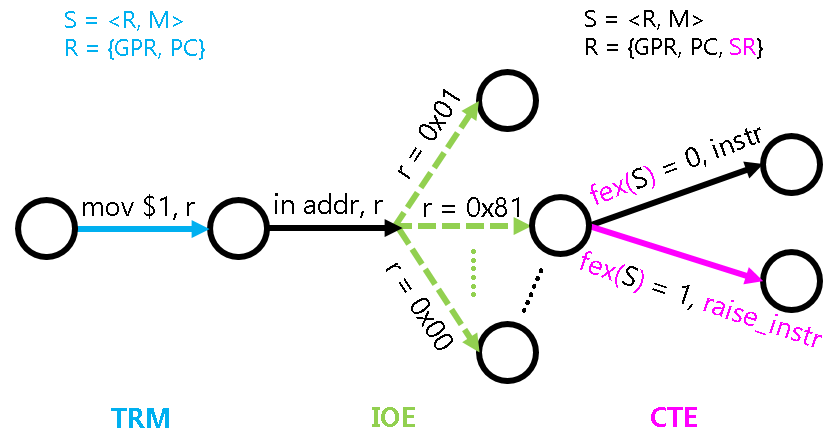

<!-- ## 穿越时空的旅程 -->

## Путешествие сквозь пространство и время

<!-- 有了强大的硬件保护机制, 用户程序将无法把执行流切换到操作系统的任意代码了.
但为了实现最简单的操作系统, 硬件还需要提供一种可以限制入口的执行流切换方式.
这种方式就是自陷指令, 程序执行自陷指令之后, 就会陷入到操作系统预先设置好的跳转目标.
这个跳转目标也称为异常入口地址. -->

Благодаря мощному аппаратному механизму защиты пользовательская программа больше не может переключать поток исполнения на произвольный код операционной системы. Но для реализации простейшей операционной системы аппаратному обеспечению всё же требуется способ переключения потока исполнения с ограниченными точками входа. Таким способом является инструкция самоловушки (trap): после её выполнения программа «проваливается» (traps) в заранее заданную операционной системой цель перехода. Эта цель перехода также называется адресом входа в исключение.

<!-- 这一过程是ISA规范的一部分, 称为中断/异常响应机制.
大部分ISA并不区分CPU的异常和自陷, 甚至是将会在PA4最后介绍的硬件中断, 而是对它们进行统一的响应.
目前我们并未加入硬件中断, 因此先把这个机制简称为"异常响应机制"吧. -->

Этот процесс является частью спецификации ISA и называется механизмом реагирования на прерывания/исключения. Большинство ISA не различают исключения процессора, самоловушки и даже аппаратные прерывания (о которых мы расскажем в конце PA4), а обрабатывают их единообразно. Поскольку сейчас мы ещё не добавили аппаратные прерывания, будем пока для краткости называть этот механизм «механизмом реагирования на исключения».

### x86

<!-- x86提供`int`指令作为自陷指令, 但其异常响应机制和其它ISA相比会复杂一些.
在x86中, 上述的异常入口地址是通过门描述符(Gate Descriptor)来指示的.
门描述符是一个8字节的结构体, 里面包含着不少细节的信息,
我们在NEMU中简化了门描述符的结构, 只保留存在位P和偏移量OFFSET:
```
   31                23                15                7                0
  +-----------------+-----------------+---+-------------------------------+
  |           OFFSET 31..16           | P |          Don't care           |4
  +-----------------------------------+---+-------------------------------+
  |             Don't care            |           OFFSET 15..0            |0
  +-----------------+-----------------+-----------------+-----------------+
```
P位来用表示这一个门描述符是否有效, OFFSET用来指示异常入口地址.
有了门描述符, 用户程序就只能跳转到门描述符中OFFSET所指定的位置,
再也不能随心所欲地跳转到操作系统的任意代码了. -->

В x86 в качестве инструкции самоловушки выступает `int`, однако её механизм реагирования на исключения несколько сложнее по сравнению с другими ISA. В x86 адрес входа в исключение указывается через дескриптор шлюза (Gate Descriptor). Дескриптор шлюза — это 8-байтная структура, содержащая немало детальной информации; в NEMU мы упростили структуру дескриптора шлюза, оставив только бит присутствия P и смещение OFFSET:

```
   31                23                15                7                0
  +-----------------+-----------------+---+-------------------------------+
  |           OFFSET 31..16           | P |          Don't care           |4
  +-----------------------------------+---+-------------------------------+
  |             Don't care            |           OFFSET 15..0            |0
  +-----------------+-----------------+-----------------+-----------------+
```
Бит P используется для обозначения того, действителен ли этот дескриптор шлюза, а OFFSET указывает адрес входа в исключение. Благодаря дескриптору шлюза пользовательская программа может перейти только по адресу, указанному в поле OFFSET дескриптора шлюза, и больше не может произвольно переходить на любой код операционной системы.

<!-- 为了方便管理各个门描述符, x86把内存中的某一段数据专门解释成一个数组,
叫IDT(Interrupt Descriptor Table, 中断描述符表), 数组的一个元素就是一个门描述符.
为了从数组中找到一个门描述符, 我们还需要一个索引.
对于CPU异常来说, 这个索引由CPU内部产生(例如除零异常为0号异常),或者由`int`指令给出(例如`int $0x80`).
最后, 为了在内存中找到IDT, x86使用IDTR寄存器来存放IDT的首地址和长度.
操作系统的代码事先把IDT准备好, 然后执行一条特殊的指令`lidt`,
来在IDTR中设置好IDT的首地址和长度, 这一异常响应机制就可以正常工作了.
现在是万事俱备, 等到程序执行自陷指令或者触发异常的时候, CPU就会按照设定好的IDT跳转到异常入口地址: -->

Чтобы упростить управление отдельными дескрипторами шлюзов, x86 интерпретирует определённый участок памяти как массив, называемый IDT (Interrupt Descriptor Table, таблица дескрипторов прерываний), где один элемент массива — это один дескриптор шлюза. Чтобы найти дескриптор шлюза в массиве, нам ещё нужен индекс. Для исключений процессора этот индекс формируется самим процессором (например, исключение деления на ноль имеет номер 0), либо задаётся инструкцией `int` (например, `int $0x80`). Наконец, чтобы найти IDT в памяти, x86 использует регистр IDTR для хранения начального адреса и длины IDT. Код операционной системы заранее подготавливает IDT, а затем выполняет специальную инструкцию `lidt`, чтобы установить в IDTR начальный адрес и длину IDT — после этого механизм реагирования на исключения может работать нормально. Теперь всё готово: как только программа выполнит инструкцию самоловушки или произойдёт исключение, процессор перейдёт по адресу входа в исключение согласно настроенной IDT:

```
           |               |
           |   Entry Point |<----+
           |               |     |
           |               |     |
           |               |     |
           +---------------+     |
           |               |     |
           |               |     |
           |               |     |
           +---------------+     |
           |offset |       |     |
           |-------+-------|     |
           |       | offset|-----+
  index--->+---------------+
           |               |
           |Gate Descriptor|
           |               |
    IDT--->+---------------+
           |               |
           |               |
```

<!-- 不过, 我们将来还是有可能需要返回到程序的当前状态来继续执行的,
比如通过`int3`触发的断点异常.
这意味着, 我们需要在进行响应异常的时候保存好程序当前的状态.
于是, 触发异常后硬件的响应过程如下:
1. 从IDTR中读出IDT的首地址
1. 根据异常号在IDT中进行索引, 找到一个门描述符
1. 将门描述符中的offset域组合成异常入口地址
1. 依次将eflags, cs(代码段寄存器), eip(也就是PC)寄存器的值压栈
1. 跳转到异常入口地址 -->

Однако в будущем нам всё же может понадобиться вернуться к текущему состоянию программы, чтобы продолжить её выполнение — например, при исключении точки останова, вызванном инструкцией `int3`. Это означает, что при реагировании на исключение необходимо сохранить текущее состояние программы. Итак, процесс реагирования аппаратного обеспечения после возникновения исключения выглядит следующим образом:
1. Прочитать из IDTR начальный адрес IDT.
2. Проиндексировать IDT по номеру исключения и найти дескриптор шлюза.
3. Объединить поле offset из дескриптора шлюза в адрес входа в исключение.
4. По очереди поместить в стек значения регистров eflags, cs (регистр сегмента кода) и eip (то есть PC).
5. Перейти по адресу входа в исключение.

<!-- 在计算机和谐社会中, 大部分门描述符都不能让用户进程随意使用,
否则恶意程序就可以通过`int`指令欺骗操作系统.
例如恶意程序执行`int $0x2`来谎报电源掉电, 扰乱其它进程的正常运行.
因此执行`int`指令也需要进行特权级检查, 但PA中就不实现这一保护机制了,
具体的检查规则我们也就不展开讨论了, 需要了解时RTFM即可. -->

В гармоничном компьютерном обществе большинство дескрипторов шлюзов недоступны пользовательским процессам для произвольного использования — иначе вредоносная программа смогла бы обмануть операционную систему с помощью инструкции `int`. Например, вредоносная программа могла бы выполнить `int $0x2`, ложно сообщив об отключении питания, тем самым нарушив нормальную работу других процессов. Поэтому выполнение инструкции `int` также требует проверки уровня привилегий, но в рамках PA этот механизм защиты не реализуется, и конкретные правила проверки мы подробно не рассматриваем — при необходимости обращайтесь к RTFM.

### mips32

<!-- mips32提供`syscall`指令作为自陷指令, 它的工作过程十分简单.
mips32约定, 上述的异常入口地址总是`0x80000180`.
为了保存程序当前的状态, mips32提供了一些特殊的系统寄存器,
这些寄存器位于0号协处理器(Co-Processor 0)中, 因此也称CP0寄存器.
在PA中, 我们只使用如下3个CP0寄存器:
* epc寄存器 - 存放触发异常的PC
* status寄存器 - 存放处理器的状态
* cause寄存器 - 存放触发异常的原因 -->

В mips32 в качестве инструкции самоловушки выступает `syscall`, и работает она довольно просто. По соглашению mips32 адрес входа в исключение всегда равен `0x80000180`. Чтобы сохранить текущее состояние программы, mips32 предоставляет несколько специальных системных регистров, которые находятся в сопроцессоре номер 0 (Co-Processor 0), поэтому их также называют регистрами CP0. В рамках PA мы используем только следующие 3 регистра CP0:
* регистр `epc` — хранит PC, при выполнении которого возникло исключение;
* регистр `status` — хранит состояние процессора;
* регистр `cause` — хранит причину возникновения исключения.

<!-- mips32触发异常后硬件的响应过程如下:
1. 将当前PC值保存到epc寄存器
1. 在cause寄存器中设置异常号
1. 在status寄存器中设置异常标志, 使处理器进入内核态
1. 跳转到`0x80000180` -->

После возникновения исключения в mips32 процесс реагирования аппаратного обеспечения выглядит следующим образом:
1. Сохранить текущее значение PC в регистр `epc`.
2. Установить номер исключения в регистре `cause`.
3. Установить флаг исключения в регистре `status`, переводя процессор в режим ядра.
4. Перейти по адресу `0x80000180`.

### riscv32

<!-- riscv32提供`ecall`指令作为自陷指令, 并提供一个mtvec寄存器来存放异常入口地址.
为了保存程序当前的状态, riscv32提供了一些特殊的系统寄存器, 叫控制状态寄存器(CSR寄存器).
在PA中, 我们只使用如下3个CSR寄存器:
* mepc寄存器 - 存放触发异常的PC
* mstatus寄存器 - 存放处理器的状态
* mcause寄存器 - 存放触发异常的原因 -->

В riscv32 в качестве инструкции самоловушки выступает `ecall`, а для хранения адреса входа в исключение предоставляется регистр `mtvec`. Чтобы сохранить текущее состояние программы, riscv32 предоставляет несколько специальных системных регистров, называемых регистрами управления и состояния (CSR-регистры). В рамках PA мы используем только следующие три CSR-регистра:

* регистр `mepc` — хранит PC, при выполнении которого возникло исключение;
* регистр `mstatus` — хранит состояние процессора;
* регистр `mcause` — хранит причину возникновения исключения.

<!-- riscv32触发异常后硬件的响应过程如下:
1. 将当前PC值保存到mepc寄存器
1. 在mcause寄存器中设置异常号
1. 从mtvec寄存器中取出异常入口地址
1. 跳转到异常入口地址 -->

После возникновения исключения в RISC-V32 процесс реагирования аппаратного обеспечения выглядит следующим образом:
1. Сохранить текущее значение PC в регистр `mepc`.
2. Установить номер исключения в регистре `mcause`.
3. Извлечь адрес входа в исключение из регистра `mtvec`.
4. Перейти по адресу входа в исключение.

---

<!-- 需要注意的是, 上述保存程序状态以及跳转到异常入口地址的工作,
都是硬件自动完成的, 不需要程序员编写指令来完成相应的内容.
事实上, 这只是一个简化后的过程, 在真实的计算机上还要处理很多细节问题,
比如x86和riscv32的特权级切换等, 在这里我们就不深究了.
ISA手册中还记录了处理器对中断号和异常号的分配情况,
并列出了各种异常的详细解释, 需要了解的时候可以进行查阅. -->

Важно отметить, что описанные выше действия по сохранению состояния программы и переходу по адресу входа в исключение полностью выполняются аппаратно, программисту не нужно писать инструкции для реализации этого. На самом деле это лишь упрощённый процесс — на реальных компьютерах приходится обрабатывать намного больше деталей, например переключение уровней привилегий в x86 и RISC-V32, которые мы здесь не рассматриваем. В руководстве по ISA также описано распределение процессором номеров прерываний и исключений, а также приведены подробные разъяснения по различным исключениям — при необходимости к нему можно обратиться.

<!-- > #### question::特殊的原因? (建议二周目思考)
> 这些程序状态(x86的eflags, cs, eip; mips32的epc, status, cause;
> riscv32的mepc, mstatus, mcause)必须由硬件来保存吗? 能否通过软件来保存? 为什么? -->

> #### question::Особая причина? (рекомендуется обдумать при повторном прохождении)
> Обязательно ли эти состояния программы (в x86 — eflags, cs, eip; в mips32 — epc, status, cause; в riscv32 — mepc, mstatus, mcause) должны сохраняться аппаратно? Можно ли сохранить их программно? Почему?

<!-- 由于异常入口地址是硬件和操作系统约定好的, 接下来的处理过程将会由操作系统来接管,
操作系统将视情况决定是否终止当前程序的运行(例如触发段错误的程序将会被杀死).
若决定无需杀死当前程序, 等到异常处理结束之后, 就根据之前保存的信息恢复程序的状态,
并从异常处理过程中返回到程序触发异常之前的状态.
具体地:
* x86通过`iret`指令从异常处理过程中返回,
它将栈顶的三个元素来依次解释成eip, cs, eflags, 并恢复它们.
* mips32通过`eret`指令从异常处理过程中返回,
它将清除status寄存器中的异常标志, 并根据epc寄存器恢复PC.
* riscv32通过`mret`指令从异常处理过程中返回, 它将根据mepc寄存器恢复PC. -->

Поскольку адрес входа в исключение заранее согласован между аппаратным обеспечением и операционной системой, дальнейшую обработку берёт на себя операционная система. Она решает, в зависимости от ситуации, стоит ли завершать выполнение текущей программы (например, программа, вызвавшая ошибку сегментации, будет уничтожена). Если принято решение не завершать текущую программу, то по окончании обработки исключения состояние программы восстанавливается на основе ранее сохранённой информации, и происходит возврат из процесса обработки исключения к состоянию, предшествовавшему возникновению исключения. А именно:
* x86 возвращается из процесса обработки исключения с помощью инструкции `iret`, которая интерпретирует три верхних элемента стека последовательно как eip, cs, eflags и восстанавливает их.
* mips32 возвращается из процесса обработки исключения с помощью инструкции `eret`, которая сбрасывает флаг исключения в регистре status и восстанавливает PC на основе регистра epc.
* riscv32 возвращается из процесса обработки исключения с помощью инструкции `mret`, которая восстанавливает PC на основе регистра mepc.

<!-- ### 状态机视角下的异常响应机制 -->

### Механизм реагирования на исключения с точки зрения машины состояний

<!-- 程序是个`S = <R, M>`的状态机, 我们之前已经讨论过在TRM和IOE中这个状态机的具体行为.
如果要给计算机添加异常响应机制, 我们又应该如何对这个状态机进行扩充呢? -->

Программа представляет собой машину состояний `S = <R, M>`, и мы уже обсуждали конкретное поведение этой машины состояний в контексте TRM и IOE. Если мы хотим добавить компьютеру механизм реагирования на исключения, как нам следует расширить эту машину состоянии?

<!-- 首先当然是对`R`的扩充, 除了PC和通用寄存器之外, 还需要添加上文提到的一些特殊寄存器.
我们不妨把这些寄存器称为系统寄存器(System Register),
因为这些寄存器的作用都是和系统功能相关的, 平时进行计算的时候不会使用.
扩充之后的寄存器可以表示为`R = {GPR, PC, SR}`.
异常响应机制和内存无关, 因此我们无需对`M`的含义进行修改. -->

Прежде всего, разумеется, нужно расширить `R`: помимо PC и регистров общего назначения, необходимо добавить упомянутые выше специальные регистры. Назовём их системными регистрами (System Register), поскольку их функции связаны с системными возможностями и они не используются при обычных вычислениях. После расширения регистры можно представить как `R = {GPR, PC, SR}`. Механизм реагирования на исключения не связан с памятью, поэтому менять смысл `M` не требуется.

<!-- 对状态转移的扩充就比较有趣了. 我们之前都是认为程序执行的每一条指令都会成功,
从而状态机会根据指令的语义进行状态转移.
添加异常响应机制之后, 我们允许一条指令的执行会"失败".
为了描述指令执行失败的行为, 我们可以假设CPU有一条虚构的指令`raise_intr`,
执行这条虚构指令的行为就是上文提到的异常响应过程.
显然, 这一行为是可以用状态机视角来描述的, 例如在riscv32中可以表示成: -->

Расширение переходов состояний — это уже гораздо интереснее. Раньше мы считали, что каждая выполняемая программой инструкция завершается успешно, и, соответственно, машина состояний переходил из состояния в состояние согласно семантике инструкции. После добавления механизма реагирования на исключения мы допускаем, что выполнение инструкции может «завершиться неудачей». Чтобы описать поведение при неудачном выполнении инструкции, можно предположить, что у процессора есть вымышленная инструкция `raise_intr`, выполнение которой соответствует описанному выше процессу реагирования на исключение. Очевидно, что это поведение можно описать с точки зрения машины состояний, например, для riscv32 это можно представить так:

```
SR[mepc] <- PC
SR[mcause] <- число, описывающее причину неудачи
PC <- SR[mtvec]
```

<!-- 有了这条虚构的指令, 我们就可以从状态机视角来理解异常响应的行为了:
如果一条指令执行成功, 其行为和之前介绍的TRM与IOE相同;
如果一条指令执行失败, 其行为等价于执行了虚构的`raise_intr`指令. -->

Имея эту вымышленную инструкцию, мы теперь можем понять поведение реагирования на исключение с точки зрения машины состояний: если инструкция выполняется успешно, её поведение совпадает с ранее описанным для TRM и IOE; если выполнение инструкции завершается неудачей, её поведение эквивалентно выполнению вымышленной инструкции `raise_intr`.

<!-- 那么, "一条指令的执行是否会失败"这件事是不是确定性的呢?
显然这取决于"失败"的定义, 例如除0就是"除法指令的第二个操作数为0",
非法指令可以定义成"不属于ISA手册描述范围的指令",
而自陷指令可以认为是一种特殊的无条件失败.
不同的ISA手册都有各自对"失败"的定义, 例如RISC-V手册就不认为除0是一种失败,
因此即使除数为0, 在RISC-V处理器中这条指令也会按照指令手册的描述来执行. -->

Так является ли «неудачное выполнение инструкции» детерминированным событием? Очевидно, это зависит от определения понятия «неудача». Например, деление на ноль определяется как «второй операнд инструкции деления равен нулю», недопустимая инструкция может быть определена как «инструкция, не описанная в руководстве ISA», а инструкцию самоловушки можно считать особым случаем безусловной неудачи. Разные руководства по ISA дают свои собственные определения понятия «неудача»: например, руководство RISC-V не считает деление на ноль неудачей, поэтому даже при нулевом делителе процессор RISC-V выполнит эту инструкцию в соответствии с описанием в руководстве.

<!-- 事实上, 我们可以把这些失败的条件表示成一个函数`fex: S -> {0, 1}`,
给定状态机的任意状态`S`, `fex(S)`都可以唯一表示当前PC指向的指令是否可以成功执行.
于是, 给计算机加入异常响应机制并不会增加系统的不确定性,
这大大降低了我们理解异常响应机制的难度, 同时也让调试不至于太困难:
一个程序运行多次, 还是会在相同的地方抛出相同的异常, 从而进行相同的状态转移
(IOE的输入指令会引入一些不确定性, 但目前还是在我们能控制的范围内). -->

На самом деле все эти условия неудачи можно представить в виде функции `fex: S -> {0, 1}`: для любого заданного состояния машины состояний `S` значение `fex(S)` однозначно определяет, может ли инструкция, на которую указывает текущий PC, быть успешно выполнена. Таким образом, добавление компьютеру механизма реагирования на исключения не делает систему более непредсказуемой, что значительно снижает сложность понимания этого механизма, а заодно делает отладку не слишком трудной: при многократном запуске программы она по-прежнему будет выбрасывать одно и то же исключение в одном и том же месте, приводя к одному и тому же переходу состояний (инструкции ввода в IOE вносят некоторую недетерминированность, но пока она остаётся в рамках, которые мы контролируем).



<!-- 最后, 异常响应机制的加入还伴随着一些系统指令的添加,
例如x86的`lidt`, `iret`, riscv32的`csrrw`, `mret`等.
这些指令除了用于专门对状态机中的`SR`进行操作之外, 它们本质上和TRM的计算指令没有太大区别,
因此它们的行为也不难理解. -->

Наконец, добавление механизма реагирования на исключения сопровождается появлением ряда системных инструкций, таких как `lidt`, `iret` в x86 или `csrrw`, `mret` в riscv32. Если не считать того, что эти инструкции специально предназначены для операций над `SR` в машинe состояний, по своей сути они мало чем отличаются от вычислительных инструкций TRM, поэтому их поведение тоже несложно понять.

<!-- ## 将上下文管理抽象成CTE -->

## Абстрагирование управления контекстом в CTE

<!-- 我们刚才提到了程序的状态, 在操作系统中有一个等价的术语, 叫"上下文".
因此, 硬件提供的上述在操作系统和用户程序之间切换执行流的功能,
在操作系统看来, 都可以划入上下文管理的一部分. -->

Мы только что упомянули состояние программы — в операционных системах есть эквивалентный термин, «контекст». Поэтому описанная выше функциональность переключения потока исполнения между операционной системой и пользовательской программой, предоставляемая аппаратным обеспечением, с точки зрения операционной системы может быть отнесена к части управления контекстом.

<!-- 与IOE一样, 上下文管理的具体实现也是架构相关的:
例如上文提到, x86/mips32/riscv32中分别通过`int`/`syscall`/`ecall`指令来进行自陷,
`native`中甚至可以通过一些神奇的库函数来模拟相应的功能;
而上下文的具体内容, 在不同的架构上也显然不一样(比如寄存器就已经不一样了).
于是, 我们可以将上下文管理的功能划入到AM的一类新的API中, 名字叫CTE(ConText Extension). -->

Как и в случае с IOE, конкретная реализация управления контекстом также зависит от архитектуры: как уже упоминалось, в x86/mips32/riscv32 для самоловушки используются, соответственно, инструкции `int`/`syscall`/`ecall`, а в `native` соответствующую функциональность можно даже эмулировать с помощью некоторых «волшебных» библиотечных функций; при этом конкретное содержимое контекста, очевидно, тоже различается для разных архитектур (например, уже сами регистры отличаются). Поэтому мы можем выделить функциональность управления контекстом в новый класс API в AM под названием CTE (ConText Extension).

<!-- 接下来的问题是, 如何将不同架构的上下文管理功能抽象成统一的API呢?
换句话说, 我们需要思考, 操作系统的处理过程其实需要哪些信息?
* 首先当然是引发这次执行流切换的原因, 是程序除0, 非法指令, 还是触发断点,
又或者是程序自愿陷入操作系统? 根据不同的原因, 操作系统都会进行不同的处理.
* 然后就是程序的上下文了, 在处理过程中, 操作系统可能会读出上下文中的一些寄存器,
根据它们的信息来进行进一步的处理.
例如操作系统读出PC所指向的非法指令, 看看其是否能被模拟执行.
事实上, 通过这些上下文, 操作系统还能实现一些神奇的功能, 你将会在PA4中了解更详细的信息. -->

Следующий вопрос: как абстрагировать функциональность управления контекстом разных архитектур в единый API? Другими словами, нужно подумать, какая информация на самом деле требуется процессу обработки в операционной системе?
* Прежде всего, разумеется, это причина, вызвавшая данное переключение потока исполнения: деление на ноль, недопустимая инструкция, срабатывание точки останова, или же программа добровольно провалилась в операционную систему? В зависимости от причины операционная система будет действовать по-разному.
* Далее — контекст программы. В процессе обработки операционная система может считывать некоторые регистры из контекста и использовать их информацию для дальнейшей обработки. Например, операционная система считывает недопустимую инструкцию, на которую указывает PC, и проверяет, можно ли эмулировать её выполнение. На самом деле, опираясь на этот контекст, операционная система может реализовывать и некоторые «волшебные» возможности — подробнее об этом вы узнаете в PA4.

<!-- > #### comment::用软件模拟指令
> 在一些嵌入式场景中, 处理器对低功耗的要求非常严格, 很多时候都会去掉浮点处理单元FPU来节省功耗.
> 这时候如果软件要执行一条浮点指令, 处理器就会抛出一个非法指令的异常.
> 有了异常响应机制, 我们就可以在异常处理的过程中模拟这条非法指令的执行了,
> 原理和PA2中的指令执行过程非常类似.
> 在不带FPU的各种处理器中, 都可以通过这种方式来执行浮点指令. -->

> #### comment::Эмуляция инструкций программным способом
> В некоторых встраиваемых сценариях к процессору предъявляются очень строгие требования по низкому энергопотреблению, и во многих случаях блок обработки чисел с плавающей точкой (FPU) вообще убирают ради экономии энергии. В этом случае, если программное обеспечение попытается выполнить инструкцию с плавающей точкой, процессор выбросит исключение недопустимой инструкции. Имея механизм реагирования на исключения, мы можем эмулировать выполнение этой недопустимой инструкции в процессе обработки исключения — принцип очень похож на процесс выполнения инструкций из PA2. Таким способом инструкции с плавающей точкой можно выполнять на самых разных процессорах без FPU.

<!-- > #### comment::在AM中执行浮点指令是UB
> 换句话说, AM的运行时环境不支持浮点数. 这听上去太暴力了.
> 之所以这样决定, 是因为IEEE 754是个工业级标准,
> 为了形式化逻辑上的soundness和completeness, 标准里面可能会有各种奇怪的设定,
> 例如不同的舍入方式, inf和nan的引入等等, 作为教学其实没有必要去理解它们的所有细节;
> 但如果要去实现一个正确的FPU, 你就没法摆脱这些细节了.
>
> 和PA2中的定点指令不同, 浮点指令在PA中用到的场合比较少, 而且我们有别的方式可以绕开,
> 所以就怎么简单怎么来了, 于是就UB吧.
> 当然, 如果你感兴趣, 你也可以考虑实现一个简化版的FPU.
> 毕竟是UB, 如果你的FPU行为正确, 也不算违反规定. -->

> #### comment::Выполнение инструкций с плавающей точкой в AM — это неопределённое поведение (UB)
> Другими словами, среда исполнения AM не поддерживает числа с плавающей точкой. Звучит слишком радикально. Причина такого решения в том, что IEEE 754 — это промышленный стандарт, и ради формальной логической строгости (soundness) и полноты (completeness) в стандарте могут встречаться самые разные странные особенности, например, разные режимы округления, введение inf и nan и так далее — для учебных целей на самом деле нет необходимости разбираться во всех этих деталях; но если вы хотите реализовать корректный FPU, обойти эти детали не получится.
>
> В отличие от инструкций с фиксированной точкой из PA2, инструкции с плавающей точкой в PA используются довольно редко, и у нас есть другие способы обойти эту проблему, поэтому мы выбрали самый простой путь — объявить это неопределённым поведением (UB). Разумеется, если вам интересно, вы также можете попробовать реализовать упрощённую версию FPU. В конце концов, раз это UB, то если ваш FPU ведёт себя корректно, это тоже не будет нарушением правил.

<!-- > #### comment::另一个UB
> 另一种你可能会碰到的UB是栈溢出, 对, 就是stackoverflow的那个.
> 检测栈溢出需要一个更强大的运行时环境, AM肯定是无能为力了, 于是就UB吧.
>
> 不过, AM究竟给程序提供了多大的栈空间呢?
> 事实上, 如果你在PA2的时候尝试努力了解每一处细节, 你已经知道这个问题的答案了;
> 如果你没有, 你需要反思一下自己了, 还是认真RTFSC吧. -->

> #### comment::Ещё одно неопределённое поведение
> Ещё одно UB, с которым вы можете столкнуться, это переполнение стека, да, тот самый stackoverflow. Для обнаружения переполнения стека требуется гораздо более мощная среда исполнения, и AM, разумеется, на это не способна, так что пусть это будет UB.
>
> Но всё же, какой объём стекового пространства AM на самом деле предоставляет программам? На самом деле, если во время PA2 вы старательно вникали в каждую деталь, вы уже знаете ответ на этот вопрос; если нет — стоит задуматься о себе и как следует изучить RTFSC (Read The F Source Code).

<!-- 所以, 我们只要把这两点信息抽象成一种统一的表示方式, 就可以定义出CTE的API了.
对于切换原因, 我们只需要定义一种统一的描述方式即可.
CTE定义了名为"事件"的如下数据结构(见`abstract-machine/am/include/am.h`): -->

Итак, если абстрагировать эти два вида информации в единое представление, можно определить API для CTE. Для причины переключения достаточно определить единый способ её описания. CTE определяет структуру данных под названием «событие» следующим образом (см. `abstract-machine/am/include/am.h`):

```c
typedef struct Event {
  enum { ... } event;
  uintptr_t cause, ref;
  const char *msg;
} Event;
```

<!-- 其中`event`表示事件编号, `cause`和`ref`是一些描述事件的补充信息,
`msg`是事件信息字符串, 我们在PA中只会用到`event`.
然后, 我们只要定义一些统一的事件编号(上述枚举常量), 让每个架构在实现各自的CTE API时,
都统一通过上述结构体来描述执行流切换的原因, 就可以实现切换原因的抽象了. -->

Здесь `event` обозначает номер события, `cause` и `ref` — дополнительная информация, описывающая событие, а `msg` — строка с информацией о событии; в рамках PA мы будем использовать только `event`. Далее достаточно определить несколько единых номеров событий (вышеупомянутые константы перечисления) и заставить каждую архитектуру при реализации своего CTE API единообразно описывать причину переключения потока исполнения через указанную структуру — так и будет реализована абстракция причины переключения.

<!-- 对于上下文, 我们只能将描述上下文的结构体类型名统一成`Context`,
至于其中的具体内容, 就无法进一步进行抽象了.
这主要是因为不同架构之间上下文信息的差异过大, 比如mips32有32个通用寄存器,
就从这一点来看, mips32和x86的`Context`注定是无法抽象成完全统一的结构的.
所以在AM中, `Context`的具体成员也是由不同的架构自己定义的,
比如`x86-nemu`的`Context`结构体在`abstract-machine/am/include/arch/x86-nemu.h`中定义.
因此, 在操作系统中对`Context`成员的直接引用,
都属于架构相关的行为, 会损坏操作系统的可移植性.
不过大多数情况下, 操作系统并不需要单独访问`Context`结构中的成员.
CTE也提供了一些的接口, 来让操作系统在必要的时候访问它们,
从而保证操作系统的相关代码与架构无关. -->

Что касается контекста, мы можем лишь унифицировать имя типа структуры, описывающей контекст, назвав его `Context`, а вот дальнейшая абстракция его конкретного содержимого невозможна. В первую очередь это связано с тем, что различия в информации о контексте между разными архитектурами слишком велики — например, в mips32 имеется 32 регистра общего назначения, и уже одного этого факта достаточно, чтобы `Context` для mips32 и x86 в принципе не могли быть абстрагированы в полностью единую структуру. Поэтому в AM конкретные члены `Context` определяются каждой архитектурой самостоятельно — например, структура `Context` для `x86-nemu` определена в `abstract-machine/am/include/arch/x86-nemu.h`. Из этого следует, что прямое обращение к членам `Context` в коде операционной системы является архитектурно-зависимым поведением, которое подрывает переносимость операционной системы. Однако в большинстве случаев операционной системе не требуется по отдельности обращаться к членам структуры `Context`. CTE также предоставляет ряд интерфейсов, позволяющих операционной системе обращаться к ним при необходимости, тем самым обеспечивая архитектурную независимость соответствующего кода операционной системы.

<!-- 最后还有另外两个统一的API:
* `bool cte_init(Context* (*handler)(Event ev, Context *ctx))`用于进行CTE相关的初始化操作.
其中它还接受一个来自操作系统的事件处理回调函数的指针, 当发生事件时,
CTE将会把事件和相关的上下文作为参数, 来调用这个回调函数, 交由操作系统进行后续处理.
* `void yield()`用于进行自陷操作, 会触发一个编号为`EVENT_YIELD`事件.
不同的ISA会使用不同的自陷指令来触发自陷操作, 具体实现请RTFSC. -->

Наконец, есть ещё два унифицированных API:
* `bool cte_init(Context* (*handler)(Event ev, Context *ctx))` используется для выполнения инициализации, связанной с CTE. Он также принимает указатель на функцию обратного вызова для обработки событий со стороны операционной системы: при возникновении события CTE вызовет эту функцию обратного вызова, передав ей событие и связанный с ним контекст в качестве аргументов, поручая дальнейшую обработку операционной системе.
* `void yield()` используется для выполнения операции самоловушки, вызывая событие с номером `EVENT_YIELD`. Разные ISA используют разные инструкции самоловушки для запуска операции самоловушки — за подробностями реализации обращайтесь к RTFSC.

<!-- CTE中还有其它的API, 目前不使用, 故暂不介绍它们. -->

В CTE есть и другие API, которые пока не используются, поэтому мы не будем их сейчас рассматривать.

<!-- 接下来, 我们尝试通过`am-tests`中的`yield test`测试触发一次自陷操作, 来梳理过程中的细节.
这个测试还支持时钟中断和外部中断, 但这还需要硬件提供中断相关的功能, 目前我们暂时不关心它们. -->

Далее попробуем запустить операцию самоловушки через тест `yield test` из `am-tests`, чтобы разобраться в деталях этого процесса. Этот тест также поддерживает таймерные и внешние прерывания, но для этого требуется аппаратная поддержка функциональности, связанной с прерываниями, — пока мы не будем этим заниматься.

<!-- > #### danger::更新am-kernels
> 我们在2023年10月3日15:35:00更新了`yield test`的代码.
> 如果你在此时间前获取`am-kernels`的代码, 请通过以下命令获取更新后的代码:
> ```bash
> cd am-kernels
> git pull origin master
> ``` -->

> #### danger::Обновление am-kernels
> Мы обновили код `yield test` 3 октября 2023 года в 15:35:00.
> Если вы получили код `am-kernels` до этого момента, пожалуйста, получите обновлённый код с помощью следующих команд:
> ```bash
> cd am-kernels
> git pull origin master
> ```

<!-- ### 设置异常入口地址 -->

### Установка адреса входа в исключение

<!-- 在触发自陷操作前, 首先需要按照ISA的约定来设置异常入口地址, 将来切换执行流时才能跳转到正确的异常入口.
这显然是架构相关的行为, 因此我们把这一行为放入CTE中, 而不是让`am-tests`直接来设置异常入口地址.
当我们选择`yield test`时, `am-tests`会通过`cte_init()`函数对CTE进行初始化, 其中包含一些简单的宏展开代码.
这最终会调用位于`abstract-machine/am/src/$ISA/nemu/cte.c`中的`cte_init()`函数.
`cte_init()`函数会做两件事情, 第一件就是设置异常入口地址:
* 对x86来说, 就是要准备一个有意义的IDT
  1. 代码定义了一个结构体数组`idt`, 它的每一个元素是一个门描述符结构体
  1. 在相应的数组元素中填写有意义的门描述符, 例如编号为`0x81`的门描述符中就包含自陷操作的入口地址.
    需要注意的是, 框架代码中还是填写了完整的门描述符(包括上文中提到的don't care的域),
    这主要是为了进行DiffTest时让KVM也能跳转到正确的入口地址.
    KVM实现了完整的x86异常响应机制, 如果只填写简化版的门描述符, 代码就无法在其中正确运行.
    但我们无需了解其中的细节, 只需要知道代码已经填写了正确的门描述符即可.
  1. 通过`lidt`指令在IDTR中设置`idt`的首地址和长度
* 对于mips32来说, 由于异常入口地址是固定在`0x80000180`,
  因此我们需要在`0x80000180`放置一条无条件跳转指令,
  使得这一指令的跳转目标是我们希望的真正的异常入口地址即可.
* 对于riscv32来说, 直接将异常入口地址设置到mtvec寄存器中即可. -->

Перед запуском операции самоловушки сначала необходимо установить адрес входа в исключение в соответствии с соглашением ISA, чтобы в будущем при переключении потока исполнения можно было перейти по корректному входу в исключение. Очевидно, это архитектурно-зависимое поведение, поэтому мы помещаем его в CTE, а не поручаем `am-tests` напрямую устанавливать адрес входа в исключение. Когда мы выбираем `yield test`, `am-tests` инициализирует CTE через функцию `cte_init()`, которая содержит несложный код с раскрытием макросов. В конечном счёте это приводит к вызову функции `cte_init()`, расположенной в `abstract-machine/am/src/$ISA/nemu/cte.c`. Функция `cte_init()` выполняет два действия, первое из которых — установка адреса входа в исключение:
* Для x86 необходимо подготовить осмысленную IDT:
  1. В коде определяется массив структур `idt`, каждый элемент которого — это структура дескриптора шлюза.
  2. В соответствующие элементы массива заносятся осмысленные дескрипторы шлюзов — например, дескриптор шлюза номер `0x81` содержит адрес входа операции самоловушки. Обратите внимание, что в коде фреймворка всё равно заполняется полный дескриптор шлюза (включая упомянутые выше поля don't care) — в первую очередь для того, чтобы при DiffTest KVM тоже мог перейти по корректному адресу входа. KVM реализует полный механизм реагирования на исключения x86, и если заполнить только упрощённую версию дескриптора шлюза, код в нём не сможет корректно работать. Но нам не нужно разбираться в этих деталях — достаточно знать, что код уже заполнил корректные дескрипторы шлюзов.
  3. С помощью инструкции `lidt` устанавливаются начальный адрес и длина `idt` в IDTR.
* Для mips32, поскольку адрес входа в исключение зафиксирован по адресу `0x80000180`, нужно разместить по адресу `0x80000180` инструкцию безусловного перехода, целью которой будет уже настоящий, нужный нам адрес входа в исключение.
* Для riscv32 достаточно просто установить адрес входа в исключение непосредственно в регистр `mtvec`.

<!-- `cte_init()`函数做的第二件事是注册一个事件处理回调函数,
这个回调函数由`yield test`提供, 更多信息会在下文进行介绍. -->

Второе, что делает функция `cte_init()`, — регистрирует функцию обратного вызова для обработки событий; эта функция обратного вызова предоставляется `yield test`, подробнее об этом будет рассказано ниже.

<!-- ### 触发自陷操作 -->

### Запуск операции самоловушки

<!-- 从`cte_init()`函数返回后, `yield test`将会调用测试主体函数`hello_intr()`,
首先输出一些信息, 然后通过`io_read(AM_INPUT_CONFIG)`启动输入设备,
不过在NEMU中, 这一启动并无实质性操作.
接下来`hello_intr()`将通过`iset(1)`打开中断,
不过我们目前还没有实现中断相关的功能, 因此同样可以忽略这部分的代码.
最后`hello_intr()`将进入测试主循环: 代码将不断调用`yield()`进行自陷操作,
为了防止调用频率过高导致输出过快, 测试主循环中还添加了一个空循环用于空转. -->

После возврата из функции `cte_init()` `yield test` вызовет основную тестовую функцию `hello_intr()`, которая сначала выведет некоторую информацию, а затем через `io_read(AM_INPUT_CONFIG)` запустит устройство ввода — впрочем, в NEMU этот запуск не выполняет никаких реальных действий. Далее `hello_intr()` включит прерывания через `iset(1)`, но поскольку мы пока не реализовали функциональность, связанную с прерываниями, эту часть кода тоже можно игнорировать. Наконец, `hello_intr()` войдёт в основной тестовый цикл: код будет непрерывно вызывать `yield()` для выполнения операции самоловушки, а чтобы слишком высокая частота вызовов не приводила к слишком быстрому выводу, в основной тестовый цикл добавлен пустой цикл для холостого хода.

<!-- 为了支撑自陷操作, 同时测试异常入口地址是否已经设置正确, 你需要在NEMU中实现`isa_raise_intr()`函数
(在`nemu/src/isa/$ISA/system/intr.c`中定义)来模拟上文提到的异常响应机制. -->

Чтобы поддержать операцию самоловушки, а заодно проверить, правильно ли установлен адрес входа в исключение, вам нужно реализовать в NEMU функцию `isa_raise_intr()` (определена в `nemu/src/isa/$ISA/system/intr.c`), эмулирующую описанный выше механизм реагирования на исключения.

<!-- 需要注意的是:
* PA不涉及特权级的切换, RTFM的时候你不需要关心和特权级切换相关的内容.
* 你需要在自陷指令的实现中调用`isa_raise_intr()`,
而不要把异常响应机制的代码放在自陷指令的helper函数中实现,
因为在后面我们会再次用到`isa_raise_intr()`函数.
* 如果你选择的是x86, 通过IDTR中的地址对IDT进行索引的时候, 需要使用`vaddr_read()`. -->

Обратите внимание:
* PA не затрагивает переключение уровней привилегий, поэтому при чтении RTFM можно не обращать внимания на содержимое, связанное с переключением уровней привилегий.
* Функцию `isa_raise_intr()` нужно вызывать именно в реализации инструкции самоловушки, а не реализовывать код механизма реагирования на исключения во вспомогательной функции (helper) для инструкции самоловушки, поскольку далее функция `isa_raise_intr()` понадобится нам снова.
* Если вы выбрали x86, при индексации IDT по адресу из IDTR необходимо использовать `vaddr_read()`.

<!-- > #### todo::实现异常响应机制
> 你需要实现上文提到的新指令, 并实现`isa_raise_intr()`函数.
> 然后阅读`cte_init()`的代码, 找出相应的异常入口地址.
>
> 如果你选择mips32和riscv32, 你会发现status/mstatus寄存器中有非常多状态位,
> 不过目前完全不实现这些状态位的功能也不影响程序的执行,
> 因此目前只需要将status/mstatus寄存器看成一个只用于存放32位数据的寄存器即可.
>
> 实现后, 重新运行`yield test`, 如果你发现NEMU确实跳转到你找到的异常入口地址,
> 说明你的实现正确(NEMU也可能因为触发了未实现指令而终止运行). -->

> #### todo::Реализация механизма реагирования на исключения
> Вам нужно реализовать упомянутые выше новые инструкции, а также функцию `isa_raise_intr()`. Затем изучите код `cte_init()` и найдите соответствующий адрес входа в исключение.
>
> Если вы выбрали mips32 или riscv32, вы обнаружите, что в регистре status/mstatus очень много битов состояния. Однако на данный момент отсутствие реализации функциональности этих битов состояния никак не влияет на выполнение программы, поэтому пока достаточно рассматривать регистр status/mstatus просто как регистр для хранения 32-битных данных.
>
> После реализации заново запустите `yield test`. Если вы обнаружите, что NEMU действительно переходит по найденному вами адресу входа в исключение, значит, ваша реализация верна (NEMU также может завершить работу из-за срабатывания нереализованной инструкции).

<!-- > #### option::让DiffTest支持异常响应机制
> 为了让DiffTest机制正确工作, 你需要
> * 针对x86:
>   * NEMU中不实现分段机制, 没有cs寄存器的概念. 但为了顺利进行DiffTest,
>     你还是需要在cpu结构体中添加一个cs寄存器, 并在将其初始化为`8`.
>   * 由于x86的异常响应机制需要对eflags进行压栈, 你还需要将eflags初始化为`0x2`.
> * 针对riscv32, 你需要将mstatus初始化为`0x1800`.
> * 针对riscv64, 你需要将mstatus初始化为`0xa00001800`. -->

> #### option::Обеспечить поддержку механизма реагирования на исключения в DiffTest
> Чтобы механизм DiffTest работал корректно, вам нужно:
> * Для x86:
>   * В NEMU не реализован механизм сегментации, и понятия регистра cs не существует. Но чтобы DiffTest проходил без сбоев, вам всё же нужно добавить регистр cs в структуру cpu и инициализировать его значением `8`.
>   * Поскольку механизм реагирования на исключения x86 требует помещения eflags в стек, вам также нужно инициализировать eflags значением `0x2`.
> * Для riscv32 нужно инициализировать `mstatus` значением `0x1800`.
> * Для riscv64 нужно инициализировать `mstatus` значением `0xa00001800`.

<!-- ### 保存上下文 -->

### Сохранение контекста

<!-- 成功跳转到异常入口地址之后, 我们就要在软件上开始真正的异常处理过程了.
但是, 进行异常处理的时候不可避免地需要用到通用寄存器,
然而看看现在的通用寄存器, 里面存放的都是执行流切换之前的内容.
这些内容也是上下文的一部分, 如果不保存就覆盖它们, 将来就无法恢复这一上下文了.
但通常硬件并不负责保存它们, 因此需要通过软件代码来保存它们的值.
x86提供了`pusha`指令, 用于把通用寄存器的值压栈;
而mips32和riscv32则通过`sw`指令将各个通用寄存器依次压栈. -->

После успешного перехода по адресу входа в исключение мы начинаем настоящий процесс обработки исключения уже программно. Однако при обработке исключения неизбежно приходится использовать регистры общего назначения, а если посмотреть на текущие регистры общего назначения, в них хранится содержимое, оставшееся до переключения потока исполнения. Это содержимое тоже является частью контекста, и если перезаписать его без сохранения, в будущем восстановить этот контекст будет невозможно. Но обычно аппаратное обеспечение не занимается их сохранением, поэтому их значения нужно сохранять программным кодом. В x86 для этого предусмотрена инструкция `pusha`, помещающая значения регистров общего назначения в стек; а в mips32 и riscv32 каждый регистр общего назначения по очереди помещается в стек с помощью инструкции `sw`.

<!-- 除了通用寄存器之外, 上下文还包括:
* 触发异常时的PC和处理器状态.
对于x86来说就是eflags, cs和eip, x86的异常响应机制已经将它们保存在堆栈上了;
对于mips32和riscv32来说, 就是epc/mepc和status/mstatus寄存器,
异常响应机制把它们保存在相应的系统寄存器中, 我们还需要将它们从系统寄存器中读出,
然后保存在堆栈上.
* 异常号. 对于x86, 异常号由软件保存; 而对于mips32和riscv32,
异常号已经由硬件保存在cause/mcause寄存器中, 我们还需要将其保存在堆栈上.
* 地址空间. 这是为PA4准备的, 在x86中对应的是`CR3`寄存器, 代码通过一条`pushl $0`指令在堆栈上占位,
mips32和riscv32则是将地址空间信息与0号寄存器共用存储空间,
反正0号寄存器的值总是0, 也不需要保存和恢复.
不过目前我们暂时不使用地址空间信息, 你目前可以忽略它们的含义. -->

Помимо регистров общего назначения, контекст также включает:
* PC и состояние процессора на момент возникновения исключения. Для x86 это eflags, cs и eip — механизм реагирования на исключения x86 уже сохранил их в стеке; для mips32 и riscv32 это регистры epc/mepc и status/mstatus — механизм реагирования на исключения сохраняет их в соответствующих системных регистрах, и нам ещё нужно считать их оттуда, а затем сохранить в стеке.
* Номер исключения. Для x86 номер исключения сохраняется программно; а для mips32 и riscv32 номер исключения уже сохранён аппаратно в регистре cause/mcause, и нам ещё нужно сохранить его в стеке.
* Адресное пространство. Это подготовка для PA4: в x86 ему соответствует регистр `CR3`, и код резервирует место в стеке с помощью инструкции `pushl $0`; в mips32 и riscv32 информация об адресном пространстве использует то же место хранения, что и регистр номер 0, — поскольку значение регистра 0 всегда равно 0, его в любом случае не нужно сохранять и восстанавливать. Однако сейчас мы пока не используем информацию об адресном пространстве, так что можно пока не вдаваться в её смысл.

<!-- > #### question::异常号的保存
> x86通过软件来保存异常号, 没有类似cause的寄存器.
> mips32和riscv32也可以这样吗? 为什么? -->

> #### question::Сохранение номера исключения
> x86 сохраняет номер исключения программно, у него нет регистра, подобного cause. Могут ли mips32 и riscv32 поступить так же? Почему?

<!-- 于是, 这些内容构成了完整的上下文信息, 异常处理过程可以根据上下文来诊断并进行处理,
同时, 将来恢复上下文的时候也需要这些信息. -->

Итак, всё это вместе составляет полную информацию о контексте: процесс обработки исключения может опираться на контекст для диагностики и обработки, а также эта информация понадобится в будущем при восстановлении контекста.

<!-- > #### question::对比异常处理与函数调用
> 我们知道进行函数调用的时候也需要保存调用者的状态:
> 返回地址, 以及calling convention中需要调用者保存的寄存器.
> 而CTE在保存上下文的时候却要保存更多的信息.
> 尝试对比它们, 并思考两者保存信息不同是什么原因造成的. -->

> #### question::Сравнение обработки исключений и вызова функций
> Мы знаем, что при вызове функции тоже нужно сохранять состояние вызывающей стороны: адрес возврата и регистры, которые согласно calling convention должна сохранять вызывающая сторона. При этом CTE при сохранении контекста сохраняет намного больше информации. Попробуйте сравнить эти два случая и подумайте, чем вызвано различие в объёме сохраняемой информации.

<!-- 接下来代码会调用C函数`__am_irq_handle()`(在`abstract-machine/am/src/$ISA/nemu/cte.c`中定义),
来进行异常的处理. -->

Далее код вызовет C-функцию `__am_irq_handle()` (определена в `abstract-machine/am/src/$ISA/nemu/cte.c`) для обработки исключения.

<!-- > #### question::诡异的x86代码
> x86的`trap.S`中有一行`pushl %esp`的代码, 乍看之下其行为十分诡异.
> 你能结合前后的代码理解它的行为吗?
> Hint: 程序是个状态机. -->

> #### question::Странный код x86
> В `trap.S` для x86 есть строка кода `pushl %esp`, поведение которой на первый взгляд выглядит весьма странно. Сможете ли вы, глядя на окружающий её код, понять её поведение?
> Подсказка: программа — машина состояний.

<!-- > #### todo::重新组织Context结构体
> 你的任务如下:
> * 实现这一过程中的新指令, 详情请RTFM.
> * 理解上下文形成的过程并RTFSC, 然后重新组织`abstract-machine/am/include/arch/$ISA-nemu.h`
> 中定义的`Context`结构体的成员, 使得这些成员的定义顺序和
> `abstract-machine/am/src/$ISA/nemu/trap.S`中构造的上下文保持一致.
>
> 需要注意的是, 虽然我们目前暂时不使用上文提到的地址空间信息,
> 但你在重新组织`Context`结构体时仍然需要正确地处理地址空间信息的位置,
> 否则你可能会在PA4中遇到难以理解的错误.
>
> 实现之后, 你可以在`__am_irq_handle()`中通过`printf`输出上下文`c`的内容,
> 然后通过简易调试器观察触发自陷时的寄存器状态, 从而检查你的`Context`实现是否正确. -->

> #### todo::Реорганизация структуры Context
> Ваши задачи следующие:
> * Реализовать новые инструкции, необходимые в этом процессе. Подробности см. в RTFM.
> * Разобраться в процессе формирования контекста и изучить исходный код (RTFSC), а затем реорганизовать члены структуры `Context`, определённой в `abstract-machine/am/include/arch/$ISA-nemu.h`, так, чтобы порядок их объявления совпадал с контекстом, формируемым в `abstract-machine/am/src/$ISA/nemu/trap.S`.
>
> Обратите внимание: хотя мы пока временно не используем упомянутую выше информацию об адресном пространстве, при реорганизации структуры `Context` вам всё равно нужно правильно обработать её положение — иначе в PA4 вы можете столкнуться с труднообъяснимыми ошибками.
>
> После реализации вы можете вывести содержимое контекста `c` в `__am_irq_handle()` с помощью `printf`, а затем с помощью простого отладчика понаблюдать за состоянием регистров в момент срабатывания самоловушки, чтобы проверить корректность вашей реализации `Context`.

<!-- > #### hint::给一些提示吧
> "实现新指令"没什么好说的, 你已经在PA2中实现了很多指令了.
> "重新组织结构体"是一个非常有趣的题目, 如果你不知道要做什么, 不妨从读懂题目开始.
> 题目大概的意思就是, 根据`trap.S`里面的内容, 来定义`$ISA-nemu.h`里面的一个结构体.
> `trap.S`明显是汇编代码, 而`$ISA-nemu.h`里面则是一个用C语言定义的结构体.
> 汇编代码和C语言... 等等, 你好像想起了ICS课本的某些内容... -->

> #### hint::Пара подсказок
> Про «реализацию новых инструкций» сказать особо нечего — вы уже реализовали немало инструкций в PA2. «Реорганизация структуры» — очень интересная задача, и если вы не знаете, с чего начать, попробуйте для начала как следует вникнуть в саму формулировку. Смысл задачи примерно таков: на основе содержимого `trap.S` определить структуру внутри `$ISA-nemu.h`. `trap.S` — это явно ассемблерный код, а в `$ISA-nemu.h` — структура, определённая на языке C. Ассемблерный код и язык C... Постойте, вам, кажется, вспомнилось что-то из учебника ICS...

<!-- > #### caution::我乱改一通, 居然过了, 嘿嘿嘿
> 如果你还抱着这种侥幸心态, 你在PA3中会过得非常痛苦.
> 事实上, "明白如何正确重新组织结构体"是PA3中非常重要的内容.
> 所以我们还是加一道必答题吧. -->

> #### caution::Я всё поменял наугад, и, надо же, заработало, хе-хе
> Если у вас всё ещё сохраняется такой настрой на авось, в PA3 вам придётся очень тяжело. На самом деле «понимание того, как правильно реорганизовать структуру» — крайне важная часть PA3. Поэтому добавим ещё один обязательный вопрос.

<!-- > #### todo::必答题(需要在实验报告中回答) - 理解上下文结构体的前世今生
> 你会在`__am_irq_handle()`中看到有一个上下文结构指针`c`,
> `c`指向的上下文结构究竟在哪里? 这个上下文结构又是怎么来的?
> 具体地, 这个上下文结构有很多成员, 每一个成员究竟在哪里赋值的?
> `$ISA-nemu.h`, `trap.S`, 上述讲义文字, 以及你刚刚在NEMU中实现的新指令,
> 这四部分内容又有什么联系?
>
> 如果你不是脑袋足够灵光, 还是不要眼睁睁地盯着代码看了,
> 理解程序的细节行为还是要从状态机视角入手. -->

> #### todo::Обязательный вопрос (нужно ответить в отчёте о лабораторной работе) — понимание прошлого и настоящего структуры контекста
> В `__am_irq_handle()` вы увидите указатель на структуру контекста `c`. Где именно находится структура контекста, на которую указывает `c`? Как вообще возникает эта структура контекста? Конкретнее: у этой структуры контекста много членов — где именно присваивается значение каждому из них? Какая связь существует между этими четырьмя составляющими: `$ISA-nemu.h`, `trap.S`, приведённым выше текстом методички и новыми инструкциями, которые вы только что реализовали в NEMU?
>
> Если вы не настолько сообразительны, лучше не пытайтесь просто пристально смотреть на код — чтобы понять детали поведения программы, всё же стоит подходить к этому с точки зрения машины состояний.

<!-- ### 事件分发 -->

### Диспетчеризация событий

<!-- `__am_irq_handle()`的代码会把执行流切换的原因打包成事件,
然后调用在`cte_init()`中注册的事件处理回调函数, 将事件交给`yield test`来处理.
在`yield test`中, 这一回调函数是`am-kernels/tests/am-tests/src/tests/intr.c`中的`simple_trap()`函数.
`simple_trap()`函数会根据事件类型再次进行分发.
不过我们在这里会触发一个未处理的事件:
```
AM Panic: Unhandled event @ am-kernels/tests/am-tests/src/tests/intr.c:12
```
这是因为CTE的`__am_irq_handle()`函数并未正确识别出自陷事件.
根据`yield()`的定义, `__am_irq_handle()`函数需要将自陷事件打包成编号为`EVENT_YIELD`的事件. -->

Код `__am_irq_handle()` упаковывает причину переключения потока исполнения в событие, а затем вызывает функцию обратного вызова для обработки событий, зарегистрированную в `cte_init()`, передавая событие для обработки `yield test`. В `yield test` этой функцией обратного вызова является функция `simple_trap()` из `am-kernels/tests/am-tests/src/tests/intr.c`. Функция `simple_trap()` выполняет дальнейшую диспетчеризацию в зависимости от типа события. Однако здесь мы столкнёмся с необработанным событием:
```
AM Panic: Unhandled event @ am-kernels/tests/am-tests/src/tests/intr.c:12
```
Это происходит потому, что функция `__am_irq_handle()` в CTE ещё не распознаёт корректно событие самоловушки. Согласно определению `yield()`, функция `__am_irq_handle()` должна упаковывать событие самоловушки в событие с номером `EVENT_YIELD`.

<!-- > #### todo::识别自陷事件
> 你需要在`__am_irq_handle()`中通过异常号识别出自陷异常, 并打包成编号为`EVENT_YIELD`的自陷事件.
> 重新运行`yield test`, 如果你的实现正确, 你会看到识别到自陷事件之后输出一个字符`y`. -->

> #### todo::Распознавание события самоловушки
> Вам нужно в `__am_irq_handle()` по номеру исключения распознать исключение самоловушки и упаковать его в событие самоловушки с номером `EVENT_YIELD`.
> Заново запустите `yield test`. Если ваша реализация верна, вы увидите, что после распознавания события самоловушки выводится символ `y`.

<!-- ### 恢复上下文 -->

### Восстановление контекста

<!-- 代码将会一路返回到`trap.S`的`__am_asm_trap()`中, 接下来的事情就是恢复程序的上下文.
`__am_asm_trap()`将根据之前保存的上下文内容, 恢复程序的状态,
最后执行"异常返回指令"返回到程序触发异常之前的状态. -->

Код вернётся обратно вплоть до `__am_asm_trap()` в `trap.S`, и следующим шагом будет восстановление контекста программы. `__am_asm_trap()` восстановит состояние программы на основе ранее сохранённого содержимого контекста, а затем выполнит «инструкцию возврата из исключения», чтобы вернуться к состоянию программы, предшествовавшему возникновению исключения.

<!-- 不过这里需要注意之前自陷指令保存的PC, 对于x86的`int`指令,
保存的是指向其下一条指令的PC, 这有点像函数调用;
而对于mips32的`syscall`和riscv32的`ecall`, 保存的是自陷指令的PC,
因此软件需要在适当的地方对保存的PC加上4, 使得将来返回到自陷指令的下一条指令. -->

Однако здесь нужно обратить внимание на то, какой именно PC сохраняется инструкцией самоловушки: для инструкции `int` в x86 сохраняется PC, указывающий на следующую инструкцию, — это немного похоже на вызов функции; а для `syscall` в mips32 и `ecall` в riscv32 сохраняется PC самой инструкции самоловушки, поэтому программному обеспечению нужно в подходящем месте прибавить 4 к сохранённому PC, чтобы в будущем вернуться к инструкции, следующей за инструкцией самоловушки.

<!-- > #### question::从加4操作看CISC和RISC
> 事实上, 自陷只是其中一种异常类型.
> 有一种故障类异常, 它们返回的PC和触发异常的PC是同一个, 例如缺页异常,
> 在系统将故障排除后, 将会重新执行相同的指令进行重试, 因此异常返回的PC无需加4.
> 所以根据异常类型的不同, 有时候需要加4, 有时候则不需要加.
>
> 这时候, 我们就可以考虑这样的一个问题了:
> 决定要不要加4的, 是硬件还是软件呢?
> CISC和RISC的做法正好相反, CISC都交给硬件来做, 而RISC则交给软件来做.
> 思考一下, 这两种方案各有什么取舍? 你认为哪种更合理呢? 为什么? -->

> #### question::Взгляд на операцию «прибавить 4» с точки зрения CISC и RISC
> На самом деле самоловушка — это лишь один из типов исключений. Существует ещё тип исключений-сбоев (fault), у которых возвращаемый PC совпадает с PC, вызвавшим исключение, — например, исключение отсутствия страницы (page fault): после того как система устранит сбой, будет заново выполнена та же самая инструкция для повторной попытки, поэтому к PC при возврате из исключения не нужно прибавлять 4. Таким образом, в зависимости от типа исключения иногда нужно прибавлять 4, а иногда — нет.
>
> В связи с этим стоит задуматься над таким вопросом: кто решает, прибавлять 4 или нет — аппаратное обеспечение или программное? Подходы CISC и RISC здесь прямо противоположны: в CISC это целиком отдаётся на откуп аппаратному обеспечению, а в RISC — программному. Подумайте, какие компромиссы есть у каждого из этих двух подходов? Какой из них вы считаете более разумным? Почему?

<!-- 代码最后会返回到`yield test`触发自陷的代码位置, 然后继续执行.
在它看来, 这次时空之旅就好像没有发生过一样. -->

В конце концов код вернётся к тому месту в `yield test`, где была запущена самоловушка, и продолжит выполнение. С его точки зрения, это путешествие сквозь пространство и время как будто и не происходило вовсе.

<!-- > #### todo::恢复上下文
> 你需要实现这一过程中的新指令. 重新运行`yield test`.
> 如果你的实现正确, `yield test`将不断输出`y`. -->

> #### todo::Восстановление контекста
> Вам нужно реализовать новые инструкции, задействованные в этом процессе. Заново запустите `yield test`.
> Если ваша реализация верна, `yield test` будет непрерывно выводить `y`.

<!-- > #### todo::必答题(需要在实验报告中回答) - 理解穿越时空的旅程
> 从`yield test`调用`yield()`开始, 到从`yield()`返回的期间, 这一趟旅程具体经历了什么?
> 软(AM, `yield test`)硬(NEMU)件是如何相互协助来完成这趟旅程的? 你需要解释这一过程中的每一处细节,
> 包括涉及的每一行汇编代码/C代码的行为, 尤其是一些比较关键的指令/变量.
> 事实上, 上文的必答题"理解上下文结构体的前世今生"已经涵盖了这趟旅程中的一部分,
> 你可以把它的回答包含进来.
>
> 别被"每一行代码"吓到了, 这个过程也就大约50行代码, 要完全理解透彻并不是不可能的.
> 我们之所以设置这道必答题, 是为了强迫你理解清楚这个过程中的每一处细节.
> 这一理解是如此重要, 以至于如果你缺少它, 接下来你面对bug几乎是束手无策. -->

> #### todo::Обязательный вопрос (нужно ответить в отчёте о лабораторной работе) — понимание путешествия сквозь пространство и время
> С момента вызова `yield()` в `yield test` и до момента возврата из `yield()` — что именно происходит в этом путешествии? Как программное обеспечение (AM, `yield test`) и аппаратное обеспечение (NEMU) взаимодействуют друг с другом, чтобы совершить это путешествие? Вам нужно объяснить каждую деталь этого процесса, включая поведение каждой задействованной строки ассемблерного/C-кода, особенно некоторых ключевых инструкций/переменных. На самом деле предыдущий обязательный вопрос «понимание прошлого и настоящего структуры контекста» уже охватывает часть этого путешествия, и вы можете включить его ответ сюда.
>
> Не пугайтесь фразы «каждая строка кода» — этот процесс занимает всего около 50 строк кода, и полностью и досконально его понять вполне реально. Мы включили этот обязательный вопрос именно для того, чтобы заставить вас чётко разобраться в каждой детали этого процесса. Это понимание настолько важно, что без него в дальнейшем вы будете практически бессильны перед багами.

<!-- > #### question::mips32延迟槽和异常
> 我们在PA2中提到, 标准的mips32处理器采用了分支延迟槽技术.
> 思考一下, 如果标准的mips32处理器在执行延迟槽指令的时候触发了异常,
> 从异常返回之后可能会造成什么问题? 该如何解决?
> 尝试RTFM对比你的解决方案. -->

> #### question::Задержанные слоты mips32 и исключения
> В PA2 мы упоминали, что стандартные процессоры mips32 используют технологию задержанного слота ветвления (branch delay slot). Подумайте: если стандартный процессор mips32 вызовет исключение при выполнении инструкции в задержанном слоте, какие проблемы могут возникнуть после возврата из исключения? Как это можно решить? Попробуйте сверить своё решение с RTFM.

<!-- ### 异常处理的踪迹 - etrace -->

### Следы обработки исключений — etrace

<!-- 处理器抛出异常也可以反映程序执行的行为, 因此我们也可以记录异常处理的踪迹(exception trace).
你也许认为在CTE中通过`printf()`输出信息也可以达到类似的效果,
但这一方案和在NEMU中实现的etrace还是有如下区别:
* 打开etrace不改变程序的行为(对程序来说是非侵入式的): 你将来可能会遇到一些bug,
  当你尝试插入一些`printf()`之后, bug的行为就会发生变化.
  对于这样的bug, etrace还是可以帮助你进行诊断, 因为它是在NEMU中输出的, 不会改变程序的行为.
* etrace也不受程序行为的影响: 如果程序包含一些致命的bug导致无法进入异常处理函数,
  那就无法在CTE中调用`printf()`来输出; 在这种情况下, etrace仍然可以正常工作 -->

Исключения, выбрасываемые процессором, тоже отражают поведение выполнения программы, поэтому мы можем вести журнал следов обработки исключений (exception trace). Возможно, вам кажется, что вывод информации через `printf()` в CTE может дать похожий эффект, но у этого подхода всё же есть следующие отличия от etrace, реализованного в NEMU:
* Включение etrace не меняет поведение программы (для программы это неинвазивно): в будущем вы можете столкнуться с багами, поведение которых изменится, стоит вам вставить `printf()`. Для таких багов etrace всё равно поможет вам с диагностикой, поскольку вывод происходит внутри NEMU и не меняет поведение программы.
* etrace также не зависит от поведения программы: если программа содержит какой-то фатальный баг, из-за которого не удаётся войти в функцию обработки исключения, то вызвать `printf()` в CTE для вывода будет невозможно; в этом случае etrace продолжит работать нормально.

<!-- 事实上, QEMU和Spike也实现了类似etrace的功能, 如果在上面运行的系统软件发生错误,
开发者也可以通过这些功能快速地进行bug的定位和诊断. -->

На самом деле QEMU и Spike тоже реализуют функциональность, аналогичную etrace: если в работающем на них системном программном обеспечении возникает ошибка, разработчики также могут с помощью этих функций быстро локализовать и диагностировать баг.

<!-- > #### todo::实现etrace
> 你已经在NEMU中实现了很多trace工具了, 要实现etrace自然也难不倒你啦. -->

> #### todo::Реализация etrace
> Вы уже реализовали в NEMU немало инструментов трассировки, так что реализовать etrace для вас, естественно, не составит труда.

<!-- > #### hint::温馨提示
> PA3阶段1到此结束. -->

> #### hint::Дружеское напоминание
> На этом первый этап PA3 завершён.