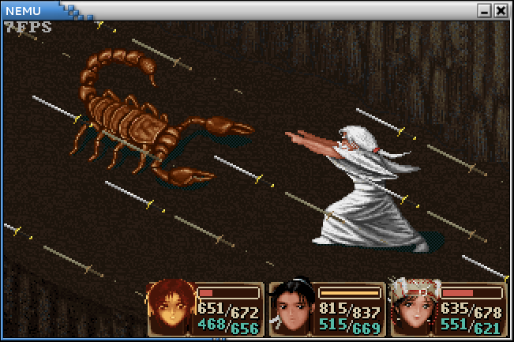

<!-- ## 精彩纷呈的应用程序 -->
## Ослепительное разнообразие приложений

<!-- ### 更丰富的运行时环境 -->
### Более богатая среда выполнения

<!-- 我们已经通过系统调用和文件的形式向用户程序提供IOE的访问方式, 并通过NDL进行了一些底层的封装.
但对于一些较为复杂的程序, 直接使用NDL进行编程还是比较困难.
为了更好地支持这些复杂程序的开发和运行, 我们需要提供更高层次的库. -->
Мы уже предоставили пользовательским программам доступ к IOE в виде системных вызовов и файлов, а также выполнили низкоуровневую инкапсуляцию через NDL. Однако для некоторых более сложных программ программирование напрямую с использованием NDL всё ещё довольно затруднительно. Чтобы лучше поддерживать разработку и выполнение таких сложных программ, нам необходимо предоставить библиотеки более высокого уровня.

<!-- #### 多媒体库 -->
#### Мультимедийная библиотека

<!-- 在Linux中, 有一批GUI程序是使用SDL库来开发的.
在Navy中有一个miniSDL库, 它可以提供一些兼容SDL的API,
这样这批GUI程序就可以很容易地移植到Navy中了.
miniSDL的代码位于`navy-apps/libs/libminiSDL/`目录下, 它由6个模块组成:
* `timer.c`: 时钟管理
* `event.c`: 事件处理
* `video.c`: 绘图接口
* `file.c`: 文件抽象
* `audio.c`: 音频播放
* `general.c`: 常规功能, 包括初始化, 错误管理等 -->
В Linux существует целый ряд GUI-программ, разработанных с использованием библиотеки SDL. В Navy есть библиотека miniSDL, которая предоставляет некоторые API, совместимые с SDL, благодаря чему эти GUI-программы можно легко перенести в Navy. Код miniSDL находится в каталоге `navy-apps/libs/libminiSDL/` и состоит из 6 модулей:

* `timer.c`: управление таймером
* `event.c`: обработка событий
* `video.c`: интерфейс отрисовки
* `file.c`: абстракция файлов
* `audio.c`: воспроизведение аудио
* `general.c`: общие функции, включая инициализацию, обработку ошибок и т.д.

<!-- 我们可以通过NDL来支撑miniSDL的底层实现, 让miniSDL向用户程序提供更丰富的功能,
这样我们就可以在Navy上运行更复杂的程序了.
miniSDL中的API和SDL同名, 你可以通过[RTFM][sdl1.2-doc]来查阅这些API的具体行为.
另外miniSDL中的大部分API都没有实现, 你最好想个办法让程序用到某个未实现API的时候提醒你,
否则你可能难以理解由此导致的复杂程序非预期行为. -->
Мы можем использовать NDL для поддержки низкоуровневой реализации miniSDL, чтобы miniSDL предоставляла пользовательским программам более богатую функциональность — тогда мы сможем запускать в Navy более сложные программы. API в miniSDL называются так же, как в SDL, и вы можете обратиться к [RTFM][sdl1.2-doc], чтобы узнать точное поведение этих API. Кроме того, большая часть API в miniSDL не реализована, поэтому лучше придумать способ, чтобы программа предупреждала вас, когда используется нереализованный API — иначе вам будет сложно понять вызванное этим непредсказуемое поведение сложных программ.

[sdl1.2-doc]: https://www.libsdl.org/release/SDL-1.2.15/docs/

<!-- > #### danger::一定要通过RTFM了解SDL API的行为
> 我们在讲义中只会概括地介绍这些API的作用, 请你务必查阅SDL手册来理解它们的具体行为. -->

> #### danger:: Обязательно изучите поведение SDL API через RTFM
> В методичке мы лишь кратко опишем назначение этих API — обязательно обратитесь к руководству SDL, чтобы понять их точное поведение.

<!-- #### 定点算术 -->
#### Арифметика с фиксированной точкой

<!-- 有一些程序的逻辑会使用实数, 目前真实的计算机系统一般都带有FPU,
因此开发者一般也会选择使用浮点数来表示这些实数.
但浮点数标准对一个面向教学的计算机系统来说实在太复杂了,
尤其是考虑到自制处理器的情况: 在硬件上实现一个正确的FPU对大家来说是一件非常困难的事情.
因此我们在Project-N的整个体系中都不打算引入浮点数:
NEMU没有FPU, 在AM中执行浮点操作是UB, Nanos-lite认为浮点寄存器不属于上下文的一部分,
Navy中也不提供浮点数相关的运行时环境(我们在编译Newlib的时候定义了宏`NO_FLOATING_POINT`). -->
В логике некоторых программ используются вещественные числа. Современные реальные компьютерные системы, как правило, оснащены FPU, поэтому разработчики обычно тоже выбирают числа с плавающей точкой для представления таких чисел. Однако стандарт чисел с плавающей точкой слишком сложен для учебной компьютерной системы, особенно если учесть ситуацию с самодельными процессорами: корректно реализовать FPU в железе — крайне трудная задача. Поэтому во всей системе Project-N мы не планируем вводить числа с плавающей точкой: в NEMU нет FPU, выполнение операций с плавающей точкой в AM является неопределённым поведением (UB), Nanos-lite считает регистры с плавающей точкой не входящими в контекст, а Navy не предоставляет среду выполнения, связанную с числами с плавающей точкой (при компиляции Newlib мы определили макрос `NO_FLOATING_POINT`).

<!-- 如果我们能够用其它方式来实现程序的逻辑, 那么这些酷炫的程序都将有机会在你自己设计的处理器上运行.
事实上, 浮点数并不是实数的唯一表示, 用定点数也可以实现实数!
而且定点数的运算可以通过整数运算来实现, 这意味着,
我们可以通过整数运算指令来实现实数的逻辑, 而无需在硬件上引入FPU来运行这些程序.
这样的一个算术体系称为[定点算术][fixed point]. -->
Если мы сможем реализовать логику программы другим способом, то у всех этих крутых программ появится шанс запуститься на спроектированном вами самими процессоре. На самом деле числа с плавающей точкой — не единственный способ представления вещественных чисел, для этого подходят и числа с фиксированной точкой! Более того, арифметику с фиксированной точкой можно реализовать через целочисленную арифметику, а значит, мы можем реализовать логику вещественных чисел с помощью инструкций целочисленной арифметики, не вводя FPU в железо для запуска таких программ. Такая система арифметики называется [арифметикой с фиксированной точкой][fixed point].

[fixed point]: http://en.wikipedia.org/wiki/Fixed-point_arithmetic

<!-- Navy中提供了一个fixedptc的库, 专门用于进行定点算术.
fixedptc库默认采用32位整数来表示实数, 其具体格式为"24.8"
(见`navy-apps/libs/libfixedptc/include/fixedptc.h`),
表示整数部分占24位, 小数部分占8位, 也可以认为实数的小数点总是固定位于第8位二进制数的左边.
库中定义了`fixedpt`的类型, 用于表示定点数, 可以看到它的本质是`int32_t`类型. -->
В Navy предоставляется библиотека fixedptc, специально предназначенная для арифметики с фиксированной точкой. По умолчанию библиотека fixedptc использует 32-битное целое число для представления вещественных чисел в формате «24.8» (см. `navy-apps/libs/libfixedptc/include/fixedptc.h`): целая часть занимает 24 бита, дробная — 8 бит. Можно также считать, что десятичная точка вещественного числа всегда зафиксирована слева от 8-го двоичного разряда. В библиотеке определён тип `fixedpt` для представления чисел с фиксированной точкой — как видно, по сути это тип `int32_t`.

```
31  30                           8          0
+----+---------------------------+----------+
|sign|          integer          | fraction |
+----+---------------------------+----------+
```

<!-- 这样, 对于一个实数`a`, 它的`fixedpt`类型表示`A = a * 2^8`(截断结果的小数部分).
例如实数`1.2`和`5.6`用`FLOAT`类型来近似表示, 就是 -->
Таким образом, для вещественного числа `a` его представление в типе `fixedpt` — это `A = a * 2^8` (с усечением дробной части результата). Например, вещественные числа `1.2` и `5.6`, приближённо представленные типом `FLOAT`, выглядят так:

```
1.2 * 2^8 = 307 = 0x133
+----+---------------------------+----------+
| 0  |             1             |    33    |
+----+---------------------------+----------+


5.6 * 2^8 = 1433 = 0x599
+----+---------------------------+----------+
| 0  |             5             |    99    |
+----+---------------------------+----------+
```

<!-- 而实际上, 这两个`fixedpt`类型数据表示的实数(真值)是: -->
На самом же деле вещественные числа (истинные значения), которые представляют эти два значения типа `fixedpt`, равны:

```
0x133 / 2^8 = 1.19921875
0x599 / 2^8 = 5.59765625
```

<!-- 对于负实数, 我们用相应正数的相反数来表示, 例如`-1.2`的`fixedpt`类型表示为: -->
Для отрицательных вещественных чисел мы используем противоположное значение соответствующего положительного числа, например, представление `-1.2` в типе `fixedpt`:

```
-(1.2 * 2^8) = -0x133 = 0xfffffecd
```

<!-- #### Navy作为基础设施 -->
#### Navy как инфраструктура

<!-- 我们在PA2中介绍了AM中的`native`架构, 借助AM API的抽象,
我们可以把自己写的程序先运行在`native`上, 这样就可以有效地把硬件(NEMU)bug和软件bug区分出来.
那么在Navy中, 我们能不能实现类似的效果呢? -->
В PA2 мы рассказали об архитектуре `native` в AM: благодаря абстракции AM API мы можем сначала запускать написанные нами программы на `native`, что позволяет эффективно отделять аппаратные (NEMU) баги от программных. А можем ли мы добиться похожего эффекта в Navy?

<!-- 答案是肯定的, 因为这样的效果就是计算机作为一个抽象层带给我们的礼物.
Navy提供的运行时环境包括libos, libc(Newlib), 一些特殊的文件, 以及各种面向应用程序的库.
我们把前三者称为"操作系统相关的运行时环境", 而面向应用程序的库与操作系统关系不大,
在这个问题的讨论中, 我们甚至可以将它们归到Navy应用程序的类别中.
类似在AM中用Linux native的功能实现AM的API,
我们也可以用Linux native的功能来实现上述运行时环境,
从而支撑相同的Navy应用程序的运行, 来单独对它们进行测试.
这样我们就实现了操作系统相关的运行时环境与Navy应用程序的解耦. -->
Ответ определённо да, потому что подобный эффект — это подарок, который даёт нам представление о компьютере как об абстрактном слое. Среда выполнения, предоставляемая Navy, включает libos, libc (Newlib), некоторые специальные файлы, а также различные библиотеки, ориентированные на приложения. Первые три мы называем «средой выполнения, связанной с операционной системой», в то время как библиотеки, ориентированные на приложения, слабо связаны с операционной системой — в рамках этого обсуждения мы можем даже отнести их к категории приложений Navy. Подобно тому, как в AM с помощью возможностей Linux native реализуется API AM, мы также можем с помощью возможностей Linux native реализовать вышеупомянутую среду выполнения, чтобы поддерживать запуск тех же приложений Navy и тестировать их по отдельности. Так мы добиваемся разделения среды выполнения, связанной с операционной системой, и приложений Navy.

<!-- 我们在Navy中提供了一个特殊的ISA叫`native`来实现上述的解耦, 它和其它ISA的不同之处在于:
* 链接时绕开libos和Newlib, 让应用程序直接链接Linux的glibc
* 通过一些Linux native的机制实现`/dev/events`, `/dev/fb`等特殊文件的功能
(见`navy-apps/libs/libos/src/native.cpp`)
* 编译到Navy native的应用程序可以直接运行, 也可以用gdb来调试(见`navy-apps/scripts/native.mk`),
而编译到其它ISA的应用程序只能在Nanos-lite的支撑下运行 -->
В Navy мы предоставляем специальную ISA под названием `native` для реализации вышеупомянутого разделения. Её отличия от других ISA заключаются в следующем:
* При компоновке она обходит libos и Newlib, позволяя приложению линковаться напрямую с glibc Linux
* Функциональность специальных файлов, таких как `/dev/events`, `/dev/fb`, реализуется через некоторые механизмы Linux native (см. `navy-apps/libs/libos/src/native.cpp`)
* Приложения, скомпилированные под Navy native, можно запускать напрямую и отлаживать с помощью gdb (см. `navy-apps/scripts/native.mk`), в то время как приложения, скомпилированные под другие ISA, могут работать только при поддержке Nanos-lite

<!-- 虽然Navy的`native`和AM中的`native`同名, 但它们的机制是不同的:
在AM native上运行的系统, 需要AM, Nanos-lite, libos, libc这些抽象层来支撑上述的运行时环境,
在AM中的`ARCH=native`, 在Navy中对应的是`ISA=am_native`;
而在Navy native中, 上述运行时环境是直接由Linux native实现的. -->
Хотя `native` в Navy и `native` в AM называются одинаково, механизмы у них разные: система, работающая на AM native, нуждается в таких слоях абстракции, как AM, Nanos-lite, libos, libc, для поддержки упомянутой среды выполнения. `ARCH=native` в AM соответствует `ISA=am_native` в Navy; а в Navy native вышеупомянутая среда выполнения реализуется напрямую средствами Linux native.

<!-- 你可以在`bmp-test`所在的目录下运行`make ISA=native run`,
来把`bmp-test`编译到Navy native上并直接运行, 还可以通过`make ISA=native gdb`对它进行调试.
这样你就可以在Linux native的环境下单独测试Navy中除了libos和Newlib之外的所有代码了(例如NDL和miniSDL).
一个例外是Navy中的dummy, 由于它通过`_syscall_()`直接触发系统调用,
这样的代码并不能直接在Linux native上直接运行, 因为Linux不存在这个系统调用(或者编号不同). -->
В каталоге, где находится `bmp-test`, можно выполнить `make ISA=native run`, чтобы скомпилировать `bmp-test` под Navy native и сразу запустить его, а также отладить через `make ISA=native gdb`. Таким образом, вы можете отдельно протестировать в среде Linux native весь код Navy, кроме libos и Newlib (например, NDL и miniSDL). Исключением является dummy в Navy: поскольку он напрямую вызывает системные вызовы через `_syscall_()`, такой код не может напрямую работать в Linux native, так как в Linux этого системного вызова не существует (либо у него другой номер).

<!-- > #### question::神奇的LD_PRELOAD
> `bmp-test`需要打开一个路径为`/share/pictures/projectn.bmp`的文件,
> 但在Linux native中, 这个路径对应的文件并不存在.
> 但我们还是把`bmp-test`成功运行起来了, 你知道这是如何实现的吗?
> 如果你感兴趣, 可以在互联网上搜索`LD_PRELOAD`相关的内容. -->

> #### question:: Волшебство LD_PRELOAD
> `bmp-test` должен открыть файл по пути `/share/pictures/projectn.bmp`, но в Linux native файла по этому пути не существует. Тем не менее нам всё равно удалось успешно запустить `bmp-test` — знаете ли вы, как это достигается? Если вам интересно, можете поискать в интернете информацию о `LD_PRELOAD`.

<!-- > #### comment::Wine, WSL和运行时环境兼容
> 我们可以通过Linux native来实现Navy的运行时环境, 从而可以让Navy中的应用程序在Linux native上运行.
> 那么我们能不能实现其它操作系统的运行时环境, 比如在Linux中提供一套兼容Windows的运行时环境,
> 从而支持Windows应用程序在Linux上的运行呢?
>
> [Wine][wine]就是这样的一个项目, 它通过Linux的运行时环境实现Windows相关的API.
> 另一个方向相反的项目是[WSL][wsl], 它是通过Windows的运行时环境来实现Linux的API,
> 从而支撑Linux程序在Windows上的运行, 不过WSL还修改了Windows内核, 让它对Linux程序提供专门的支持.
> 但完整的Linux和Windows运行时环境太复杂了,
> 因此一些对运行时环境依赖程度比较复杂的程序至今也很难在Wine或WSL上完美运行,
> 以至于WSL2抛弃了"运行时环境兼容"的技术路线, 转而采用虚拟机的方式来完美运行Linux系统.
> 反观Navy的运行时环境却是非常简单, 我们通过不到300行的`native.cpp`就可以实现它了,
> 不过如果你理解了其中的概念, 你也就明白类似WSL这些身边的技术是如何工作的了. -->

> #### comment:: Wine, WSL и совместимость сред выполнения
> Мы можем реализовать среду выполнения Navy через Linux native, что позволяет приложениям Navy работать в Linux native. А можем ли мы реализовать среду выполнения других операционных систем — например, предоставить в Linux среду выполнения, совместимую с Windows, чтобы поддерживать запуск Windows-приложений в Linux?
>
> Именно таким проектом является [Wine][wine] — он реализует API, связанные с Windows, через среду выполнения Linux. Другой проект противоположного направления — [WSL][wsl]: он реализует API Linux через среду выполнения Windows, поддерживая запуск программ Linux в Windows, при этом WSL ещё и модифицирует ядро Windows, чтобы обеспечить специальную поддержку программ Linux. Однако полноценные среды выполнения Linux и Windows слишком сложны, поэтому некоторые программы со сложными зависимостями от среды выполнения до сих пор с трудом идеально работают под Wine или WSL — настолько, что WSL2 отказался от технического подхода «совместимости среды выполнения» и вместо этого перешёл на виртуальную машину для полноценного запуска системы Linux. Среда же выполнения Navy, напротив, очень проста — мы реализовали её менее чем в 300 строках `native.cpp`. Но если вы поймёте заложенные в ней концепции, вы также поймёте, как работают близкие вам технологии вроде WSL.

[wine]: https://www.winehq.org/
[wsl]: https://docs.microsoft.com/en-us/windows/wsl/about

<!-- ### Navy中的应用程序 -->
### Приложения в Navy

<!-- 有了这些函数库, 我们就可以在Navy中运行更多的程序了.
要运行仙剑奇侠传需要实现较多的功能, 我们先运行一些简单的程序来对你的实现进行测试. -->
Имея эти библиотеки функций, мы можем запускать в Navy больше программ. Для запуска Chinese Paladin потребуется реализовать довольно много функций, поэтому сначала запустим несколько простых программ, чтобы протестировать вашу реализацию.

<!-- #### NSlider (NJU Slider) -->
#### NSlider (NJU Slider)

<!-- NSlider是Navy中最简单的可展示应用程序, 它是一个支持翻页的幻灯片播放器.
在2018年第二届龙芯杯大赛中, 南京大学赛队通过在自己实现的乱序处理器上运行NSlider,
实现了"在自己构建的全栈计算机系统中播放幻灯片进行决赛现场答辩"的目标. -->
NSlider — это простейшее демонстрационное приложение в Navy, представляющее собой слайд-плеер с поддержкой перелистывания страниц. На втором конкурсе Loongson Cup в 2018 году команда Nanjing University, запустив NSlider на разработанном ими самими процессоре с внеочередным исполнением, достигла цели «показать слайды на созданной ими самими полностековой компьютерной системе прямо во время финальной защиты проекта».

<!-- 现在你也可以在自己构建的计算机系统上运行NSlider了, 但你首先需要实现`SDL_UpdateRect()`这个API.
SDL的绘图模块引入了一个`Surface`的概念, 它可以看成一张具有多种属性的画布,
具体可以通过RTFM查阅`Surface`结构体中的成员含义.
`SDL_UpdateRect()`的作用是将画布中的指定矩形区域同步到屏幕上. -->
Теперь вы тоже можете запустить NSlider на созданной вами самими компьютерной системе, но для начала нужно реализовать API `SDL_UpdateRect()`. Модуль отрисовки SDL вводит понятие `Surface`, которое можно рассматривать как холст с различными атрибутами — подробности о значениях полей структуры `Surface` можно узнать через RTFM. Назначение `SDL_UpdateRect()` — синхронизировать указанную прямоугольную область холста с экраном.

<!-- > #### todo::运行NSlider
> 我们提供了一个脚本来把PDF版本的, 比例为4:3的幻灯片转换成BMP图像, 并拷贝到`navy-apps/fsimg/`中.
> 你需要提供一个满足条件的PDF文件, 然后参考相应的README文件进行操作.
> 但你可能会在转换时遇到一些问题, 具体请自行解决.
>
> 然后在miniSDL中实现`SDL_UpdateRect()`, 如果你的实现正确, 运行NSlider时将会显示第一张幻灯片.
> 你很可能是第一次接触SDL的API, 为此你还需要RTFM, 并通过RTFSC来理解已有代码的行为. -->

> #### todo:: Запустите NSlider
> Мы предоставляем скрипт, который конвертирует PDF-версию слайдов с соотношением сторон 4:3 в изображения BMP и копирует их в `navy-apps/fsimg/`. Вам нужно предоставить подходящий PDF-файл, а затем действовать согласно соответствующему README. При конвертации вы можете столкнуться с проблемами — решите их самостоятельно.
>
> Затем реализуйте `SDL_UpdateRect()` в miniSDL. Если реализация верна, при запуске NSlider отобразится первый слайд. Вероятно, это ваше первое знакомство с API SDL, поэтому вам понадобится RTFM, а также RTFSC, чтобы понять поведение уже существующего кода.

<!-- > #### hint::注意ramdisk镜像的大小
> 我们让ramdisk镜像的内容链接到Nanos-lite的数据段, 而又把用户程序加载到内存位置
> `0x3000000`(x86)或`0x83000000`(mips32或riscv32)附近, 这隐含了一个假设:
> ramdisk镜像的大小不能超过48MB. 如果这个假设不满足, ramdisk中的内容就可能被覆盖,
> 造成难以理解的错误. 因此你需要注意ramdisk镜像的大小, 不要放入过多过大的文件. -->

> #### hint:: Обратите внимание на размер образа ramdisk
> Мы линкуем содержимое образа ramdisk в сегмент данных Nanos-lite, а пользовательскую программу загружаем в область памяти около `0x3000000` (x86) или `0x83000000` (mips32 или riscv32) — это подразумевает допущение: размер образа ramdisk не должен превышать 48 МБ. Если это допущение нарушается, содержимое ramdisk может быть перезаписано, что приведёт к труднообъяснимым ошибкам. Поэтому следите за размером образа ramdisk и не помещайте туда слишком много или слишком больших файлов.

<!-- > #### todo::运行NSlider(2)
> 在miniSDL中实现`SDL_WaitEvent()`, 它用于等待一个事件.
> 你需要将NDL中提供的事件封装成SDL事件返回给应用程序,
> 具体可以通过阅读NSlider的代码来理解SDL事件的格式.
> 实现正确后, 你就可以在NSlider中进行翻页了, 翻页的操作方式请RTFSC. -->

> #### todo:: Запустите NSlider (2)
> Реализуйте в miniSDL функцию `SDL_WaitEvent()`, которая используется для ожидания события. Вам нужно упаковать события, предоставляемые NDL, в события SDL и вернуть их приложению — понять формат событий SDL можно, прочитав код NSlider. После правильной реализации вы сможете листать страницы в NSlider; способ перелистывания уточните через RTFSC.

<!-- #### MENU (开机菜单)

开机菜单是另一个行为比较简单的程序, 它会展示一个菜单, 用户可以选择运行哪一个程序.
为了运行它, 你还需要在miniSDL中实现两个绘图相关的API:
* `SDL_FillRect()`: 往画布的指定矩形区域中填充指定的颜色
* `SDL_BlitSurface()`: 将一张画布中的指定矩形区域复制到另一张画布的指定位置

开机菜单还会显示一些英文字体, 这些字体的信息以BDF格式存储,
Navy中提供了一个libbdf库来解析BDF格式, 生成相应字符的像素信息, 并封装成SDL的`Surface`.
实现了`SDL_BlitSurface()`之后, 我们就可以很方便地在屏幕上输出字符串的像素信息了. -->

#### MENU (Загрузочное меню)

Загрузочное меню — ещё одна программа с относительно простым поведением: она показывает меню, в котором пользователь может выбрать, какую программу запустить. Для его работы вам также нужно реализовать в miniSDL два API, связанных с отрисовкой:

* `SDL_FillRect()`: заполнить указанную прямоугольную область холста заданным цветом
* `SDL_BlitSurface()`: скопировать указанную прямоугольную область одного холста в заданную позицию другого холста

Загрузочное меню также отображает некоторые английские шрифты — информация об этих шрифтах хранится в формате BDF, а Navy предоставляет библиотеку libbdf для разбора формата BDF, генерации пиксельной информации соответствующих символов и упаковки её в `Surface` SDL. После реализации `SDL_BlitSurface()` мы сможем удобно выводить на экран пиксельную информацию строк.

<!-- > #### todo::运行开机菜单
> 正确实现上述API后, 你将会看到一个可以翻页的开机菜单.
> 但你尝试选择菜单项的时候将会出现错误, 这是因为开机菜单的运行还需要一些系统调用的支持.
> 我们会在下文进行介绍, 目前通过开机菜单来测试miniSDL即可 -->

> #### todo:: Запустите загрузочное меню
> После правильной реализации указанных выше API вы увидите загрузочное меню, в котором можно перелистывать страницы. Однако при попытке выбрать пункт меню возникнет ошибка — работа загрузочного меню также требует поддержки некоторых системных вызовов, о которых мы расскажем далее. Пока что достаточно протестировать miniSDL с помощью загрузочного меню.

<!-- #### NTerm (NJU Terminal) -->
#### NTerm (NJU Terminal)

<!-- NTerm是一个模拟终端, 它实现了终端的基本功能, 包括字符的键入和回退, 以及命令的获取等.
终端一般会和Shell配合使用, 从终端获取到的命令将会传递给Shell进行处理, Shell又会把信息输出到终端.
NTerm自带一个非常简单的內建Shell(见`builtin-sh.cpp`), 它默认忽略所有的命令.
NTerm也可以和外部程序进行通信, 但这超出了ICS的范围, 我们在PA中不会使用这个功能. -->
NTerm — это эмулятор терминала, реализующий базовую функциональность терминала, включая ввод и удаление символов, а также получение команд. Терминал обычно используется вместе с Shell: команды, полученные от терминала, передаются Shell для обработки, а Shell выводит информацию обратно в терминал. NTerm поставляется с очень простым встроенным Shell (см. `builtin-sh.cpp`), который по умолчанию игнорирует все команды. NTerm также может взаимодействовать с внешними программами, но это выходит за рамки курса ICS, и в PA мы не будем использовать эту возможность.

<!-- 为了运行NTerm, 你还需要实现miniSDL的两个API:
* `SDL_GetTicks()`: 它和`NDL_GetTicks()`的功能类似, 但有一个额外的小要求, 具体请RTFM
* `SDL_PollEvent()`: 它和`SDL_WaitEvent()`不同的是, 如果当前没有任何事件, 就会立即返回 -->
Чтобы запустить NTerm, вам также нужно реализовать два API miniSDL:
* `SDL_GetTicks()`: по функциональности похож на `NDL_GetTicks()`, но с одним дополнительным небольшим требованием — подробности см. RTFM
* `SDL_PollEvent()`: в отличие от `SDL_WaitEvent()`, он немедленно возвращает управление, если в данный момент нет никаких событий

<!-- > #### todo::运行NTerm
> 正确实现上述API后, 你会看到NTerm的光标以每秒一次的频率闪烁, 并且可以键入字符.
> 为了让NTerm可以启动其它程序, 你还需要实现一些系统调用, 我们会在下文进行介绍. -->

> #### todo:: Запустите NTerm
> После правильной реализации указанных выше API вы увидите, что курсор NTerm мигает с частотой раз в секунду, и сможете вводить символы. Чтобы NTerm мог запускать другие программы, вам также нужно реализовать несколько системных вызовов, о которых мы расскажем далее.

<!-- > #### option::实现内建的echo命令
> 在內建Shell中解析命令和你在PA1中实现简易调试器的命令解析非常类似,
> 而且Navy中的Newlib已经提供了标准库函数了, 有兴趣的同学可以实现一个內建的`echo`命令. -->

> #### option:: Реализуйте встроенную команду echo
> Разбор команд во встроенном Shell очень похож на разбор команд, который вы реализовывали для простого отладчика в PA1, а Newlib в Navy уже предоставляет функции стандартной библиотеки. Желающие могут реализовать встроенную команду `echo`.

<!-- #### Flappy Bird -->
#### Flappy Bird

<!-- 网友开发了一款基于SDL库的Flappy Bird游戏[sdlbird][sdlbird], 我们轻松地将它移植到Navy中.
在`navy-apps/apps/bird/`目录下运行`make init`, 将会从github上克隆移植后的项目.
这个移植后的项目仍然可以在Linux native上运行: 在`navy-apps/apps/bird/repo/`目录下运行`make run`即可
(你可能需要安装一些库, 具体请STFW).
这样的运行方式不会链接Navy中的任何库, 因此你还会听到一些音效, 甚至可以通过点击鼠标来进行游戏. -->
Один из энтузиастов разработал игру Flappy Bird на основе библиотеки SDL — [sdlbird][sdlbird], и мы без труда перенесли её в Navy. Выполнив `make init` в каталоге `navy-apps/apps/bird/`, вы склонируете перенесённый проект с github. Этот перенесённый проект по-прежнему можно запустить в Linux native: достаточно выполнить `make run` в каталоге `navy-apps/apps/bird/repo/` (возможно, потребуется установить некоторые библиотеки — уточните через STFW). При таком способе запуска не линкуется ни одна библиотека Navy, поэтому вы даже услышите звуковые эффекты и сможете играть, кликая мышью.

[sdlbird]: https://github.com/CecilHarvey/sdlbird

<!-- 为了在Navy中运行Flappy Bird, 你还需要实现另一个库SDL\_image中的一个API: `IMG_Load()`.
这个库是基于[stb项目][stb]中的图像解码库来实现的, 用于把解码后的像素封装成SDL的`Surface`结构,
这样应用程序就可以很容易地在屏幕上显示图片了.
上述API接受一个图片文件的路径, 然后把图片的像素信息封装成SDL的`Surface`结构并返回.
这个API的一种实现方式如下:
1. 用libc中的文件操作打开文件, 并获取文件大小size
1. 申请一段大小为size的内存区间buf
1. 将整个文件读取到buf中
1. 将buf和size作为参数, 调用`STBIMG_LoadFromMemory()`, 它会返回一个`SDL_Surface`结构的指针
1. 关闭文件, 释放申请的内存
1. 返回`SDL_Surface`结构指针 -->
Чтобы запустить Flappy Bird в Navy, вам также нужно реализовать один API из другой библиотеки — SDL_image: `IMG_Load()`. Эта библиотека реализована на основе библиотеки декодирования изображений из [проекта stb][stb] и служит для упаковки декодированных пикселей в структуру `Surface` SDL, чтобы приложение могло легко отображать изображения на экране. Указанный API принимает путь к файлу изображения, а затем упаковывает информацию о пикселях изображения в структуру `Surface` SDL и возвращает её. Один из способов реализации этого API:
1. Открыть файл с помощью файловых операций libc и получить размер файла size
2. Выделить область памяти buf размером size
3. Прочитать весь файл в buf
4. Вызвать `STBIMG_LoadFromMemory()` с параметрами buf и size — функция вернёт указатель на структуру `SDL_Surface`
5. Закрыть файл, освободить выделенную память
6. Вернуть указатель на структуру `SDL_Surface`

[stb]: https://github.com/nothings/stb

<!-- > #### todo::运行Flappy Bird
> 实现`IMG_Load()`, 在Navy中运行Flappy Bird. 这本质上是一个文件操作的练习.
> 另外, Flappy Bird默认使用400像素的屏幕高度, 但NEMU的屏幕高度默认为300像素,
> 为了在NEMU运行Flappy Bird, 你需要将`navy-apps/apps/bird/repo/include/Video.h`中的
> `SCREEN_HEIGHT`修改为300.
>
> Flappy Bird默认还会尝试打开声卡播放音效, miniSDL默认会让音频相关的API返回0或`NULL`,
> 程序会认为相应操作失败, 但仍然可以在无音效的情况下运行. -->

> #### todo:: Запустите Flappy Bird
> Реализуйте `IMG_Load()` и запустите Flappy Bird в Navy. По сути, это упражнение на файловые операции. Кроме того, по умолчанию Flappy Bird использует высоту экрана 400 пикселей, а высота экрана NEMU по умолчанию — 300 пикселей. Чтобы запустить Flappy Bird в NEMU, нужно изменить `SCREEN_HEIGHT` в `navy-apps/apps/bird/repo/include/Video.h` на 300.
>
> По умолчанию Flappy Bird также попытается открыть звуковую карту для воспроизведения звуковых эффектов; miniSDL по умолчанию заставляет связанные с аудио API возвращать 0 или `NULL`, программа сочтёт соответствующую операцию неудачной, но всё равно сможет работать без звуковых эффектов.

<!-- 此外, Flappy Bird也是一个适合大家阅读的项目: 阅读它不需要了解过多的知识背景,
而且大家很容易熟悉游戏的规则, 然后就可以去了解游戏的效果是如何用代码实现出来的. -->
Кроме того, Flappy Bird — это проект, подходящий для чтения: чтобы разобраться в нём, не требуется много специальных знаний, а правила игры легко усваиваются, после чего можно изучить, как игровые эффекты реализованы в коде.

<!-- > #### comment::"计算机是个抽象层"的应用: 移植和测试
> 我们在移植游戏的时候, 会按顺序在四种环境中运行游戏:
> * 纯粹的Linux native: 和Project-N的组件没有任何关系, 用于保证游戏本身确实可以正确运行.
> 在更换库的版本或者修改游戏代码之后, 都会先在Linux native上进行测试.
> * Navy中的native: 用Navy中的库替代Linux native的库, 测试游戏是否能在Navy库的支撑下正确运行.
> * AM中的native: 用Nanos-lite, libos和Newlib替代Linux的系统调用和glibc,
> 测试游戏是否能在Nanos-lite及其运行时环境的支撑下正确运行.
> * NEMU: 用NEMU替代真机硬件, 测试游戏是否能在NEMU的支撑下正确运行.
>
> 通过这种方法, 我们就可以很快定位到bug所在的抽象层次.
> 我们之所以能这样做, 都是得益于"计算机是个抽象层"这个结论:
> 我们可以把某个抽象层之下的部分替换成一个可靠的实现, 先独立测试一个抽象层的不可靠实现,
> 然后再把其它抽象层的不可靠实现逐个替换进来并测试.
> 不过这要求你编写的代码都是可移植的, 否则将无法支持抽象层的替换. -->

> #### comment:: Применение принципа «компьютер — это абстрактный слой»: перенос и тестирование
> При переносе игры мы последовательно запускаем её в четырёх окружениях:
> * Чистый Linux native: никак не связан с компонентами Project-N, используется для того, чтобы убедиться, что сама игра действительно корректно работает. После смены версий библиотек или изменения кода игры мы сначала тестируем на Linux native.
> * native в Navy: заменяем библиотеки Linux native на библиотеки Navy, проверяем, работает ли игра корректно при поддержке библиотек Navy.
> * native в AM: заменяем системные вызовы и glibc Linux на Nanos-lite, libos и Newlib, проверяем, работает ли игра корректно при поддержке Nanos-lite и его среды выполнения.
> * NEMU: заменяем настоящее железо на NEMU, проверяем, работает ли игра корректно при поддержке NEMU.
>
> С помощью такого метода мы можем быстро найти уровень абстракции, на котором находится баг. Возможность так действовать обеспечивается благодаря выводу «компьютер — это абстрактный слой»: мы можем заменить всё, что находится ниже определённого уровня абстракции, на надёжную реализацию, сначала независимо протестировать ненадёжную реализацию одного уровня абстракции, а затем поочерёдно подставлять и тестировать ненадёжные реализации других уровней абстракции. Однако это требует, чтобы весь написанный вами код был переносимым, иначе замена уровней абстракции окажется невозможной.

<!-- #### PAL (仙剑奇侠传) -->

#### PAL (Chinese Paladin)

<!-- 原版的仙剑奇侠传是针对Windows平台开发的,
因此它并不能在GNU/Linux中运行(你知道为什么吗?), 也不能在Navy-apps中运行.
网友开发了一款基于SDL库, 跨平台的仙剑奇侠传, 工程叫[SDLPAL][sdlpal].
我们已经把SDLPAL移植到Navy中了,
在`navy-apps/apps/pal/`目录下运行`make init`, 将会从github上克隆移植后的项目.
和Flappy Bird一样, 这个移植后的项目仍然可以在Linux native上运行:
把仙剑奇侠传的数据文件(我们在课程群的公告中发布了链接)解压缩并放到`repo/data/`目录下,
在`repo/`目录下执行`make run`即可, 可以最大化窗口来进行游戏.
不过我们把配置文件`sdlpal.cfg`中的音频采样频率`SampleRate`改成了`11025`,
这是为了在Navy中可以较为流畅地运行, 如果你对音质有较高的要求, 在Linux native中体验时可以临时改回`44100`.
更多的信息可以参考README. -->

Оригинальная версия Chinese Paladin была разработана для платформы Windows, поэтому она не может работать в GNU/Linux (знаете почему?), а также не может работать в Navy-apps. Энтузиасты разработали кроссплатформенную версию Chinese Paladin на основе библиотеки SDL — проект называется [SDLPAL][sdlpal]. Мы уже перенесли SDLPAL в Navy: выполнив `make init` в каталоге `navy-apps/apps/pal/`, вы склонируете перенесённый проект с github. Как и в случае с Flappy Bird, этот перенесённый проект по-прежнему можно запустить в Linux native: распакуйте файлы данных Chinese Paladin (ссылку мы опубликовали в объявлении в группе курса) и поместите их в каталог `repo/data/`, затем выполните `make run` в каталоге `repo/` — можно развернуть окно на весь экран, чтобы играть. Однако мы изменили частоту дискретизации аудио `SampleRate` в конфигурационном файле `sdlpal.cfg` на `11025`, чтобы игра работала достаточно плавно в Navy; если у вас повышенные требования к качеству звука, при работе в Linux native можно временно вернуть значение `44100`. Подробнее см. README.

[sdlpal]: https://github.com/SDLPAL/sdlpals

<!-- > #### comment::我不是南京大学的学生, 如何获取仙剑奇侠传的数据文件?
> 由于数据文件的版权属于游戏公司, 我们不便公开.
> 不过作为一款有25年历史的经典游戏, 你应该还是可以通过STFW找到它的.
>
> 此外, 你还需要创建配置文件`sdlpal.cfg`并添加如下内容:
> ```
> OPLSampleRate=11025
> SampleRate=11025
> WindowHeight=200
> WindowWidth=320
> ```
> 更多信息可阅读`repo/docs/README.md`和`repo/docs/sdlpal.cfg.example`. -->

> #### comment:: Я не студент Nanjing University, как мне получить файлы данных Chinese Paladin?
> Поскольку авторские права на файлы данных принадлежат игровой компании, нам неудобно публиковать их открыто. Однако как классическая игра с 25-летней историей, она всё же, скорее всего, найдётся через STFW.
>
> Кроме того, вам нужно создать конфигурационный файл `sdlpal.cfg` и добавить в него следующее содержимое:
> ```
> OPLSampleRate=11025
> SampleRate=11025
> WindowHeight=200
> WindowWidth=320
> ```
> Подробнее см. `repo/docs/README.md` и `repo/docs/sdlpal.cfg.example`.

<!-- 为了在Navy中运行仙剑奇侠传, 你还需要对miniSDL中绘图相关的API进行功能的增强.
具体地, 作为一款上世纪90年代的游戏, 绘图的时候每个像素都是用8位来表示, 而不是目前普遍使用的32位`00RRGGBB`.
而这8位也并不是真正的颜色, 而是一个叫"调色板"(palette)的数组的下标索引,
调色板中存放的才是32位的颜色. 用代码的方式来表达, 就是:
```c
// 现在像素阵列中直接存放32位的颜色信息
uint32_t color_xy = pixels[x][y];

// 仙剑奇侠传中的像素阵列存放的是8位的调色板下标,
// 用这个下标在调色板中进行索引, 得到的才是32位的颜色信息
uint32_t pal_color_xy = palette[pixels[x][y]];
```
仙剑奇侠传中的代码会创建一些8位像素格式的`Surface`结构, 并通过相应的API来对这些结构进行处理.
因此, 你也需要在miniSDL的相应API中添加对这些8位像素格式的`Surface`的支持. -->

Чтобы запустить Chinese Paladin в Navy, вам также нужно расширить функциональность API отрисовки в miniSDL. А именно: поскольку это игра из 90-х годов прошлого века, при отрисовке каждый пиксель представлен 8 битами, а не широко используемым сегодня 32-битным форматом `00RRGGBB`. При этом эти 8 бит — не настоящий цвет, а индекс в массиве, называемом «палитрой» (palette), и уже в самой палитре хранятся 32-битные цвета. В коде это можно выразить так:
```c
// Теперь в массиве пикселей напрямую хранится 32-битная информация о цвете
uint32_t color_xy = pixels[x][y];

// В массиве пикселей Chinese Paladin хранятся 8-битные индексы палитры,
// и только используя этот индекс для поиска в палитре, можно получить 32-битную информацию о цвете
uint32_t pal_color_xy = palette[pixels[x][y]];
```
Код Chinese Paladin создаёт структуры `Surface` в 8-битном пиксельном формате и обрабатывает их через соответствующие API. Поэтому вам также нужно добавить в соответствующие API miniSDL поддержку таких структур `Surface` в 8-битном пиксельном формате.

<!-- > #### todo::运行仙剑奇侠传
> 为miniSDL中的绘图API添加8位像素格式的支持. 实现正确之后, 你就可以看到游戏画面了.
> 为了操作, 你还需要实现其它的API, 具体要实现哪些API, 就交给你来寻找吧.
> 实现正确后, 你就可以在自己实现的NEMU中运行仙剑奇侠传了!
> 游戏操作请阅读[这里][pal-operation].
>
> 你可以在游戏中进行各种操作来对你的实现进行测试,
> 我们提供的数据文件中包含一些游戏存档, 5个存档中的场景分别如下, 可用于进行不同的测试:
> 1. 无敌人的机关迷宫
> 1. 无动画的剧情
> 1. 有动画的剧情
> 1. 已进入敌人视野的迷宫
> 1. 未进入敌人视野的迷宫
>
>  -->

> #### todo:: Запустите Chinese Paladin
> Добавьте в API отрисовки miniSDL поддержку 8-битного пиксельного формата. После правильной реализации вы увидите игровой экран. Для управления вам также нужно реализовать другие API — какие именно, определите самостоятельно. После правильной реализации вы сможете запустить Chinese Paladin на созданном вами самими NEMU! Об управлении в игре читайте [здесь][pal-operation].
>
> Вы можете выполнять в игре различные действия, чтобы протестировать свою реализацию. Предоставленные нами файлы данных содержат несколько игровых сохранений, сцены в 5 сохранениях следующие, их можно использовать для разных видов тестирования:
> 1. Механический лабиринт без врагов
> 1. Сюжет без анимации
> 1. Сюжет с анимацией
> 1. Лабиринт, где герой уже попал в поле зрения врага
> 1. Лабиринт, где герой ещё не попал в поле зрения врага
>
> 

[pal-operation]: https://baike.baidu.com/item/%E4%BB%99%E5%89%91%E5%A5%87%E4%BE%A0%E4%BC%A0/5129500#5

<!-- > #### question::仙剑奇侠传的框架是如何工作的?
> 我们在PA2中讨论过一个游戏的基本框架, 尝试阅读仙剑奇侠传的代码,
> 找出基本框架是通过哪些函数实现的.
> 找到之后, 可能会对你调试仙剑奇侠传带来一定的帮助.
> 虽然仙剑奇侠传的代码很多, 但为了回答这个问题, 你并不需要阅读大量的代码. -->

> #### question:: Как работает каркас Chinese Paladin?
> В PA2 мы обсуждали базовый каркас игры. Попробуйте прочитать код Chinese Paladin и выяснить, какими функциями реализован этот базовый каркас. Найдя их, вы, возможно, получите некоторую помощь при отладке Chinese Paladin. Хотя кода в Chinese Paladin довольно много, чтобы ответить на этот вопрос, вам не нужно читать большой объём кода.

<!-- > #### question::仙剑奇侠传的脚本引擎
> 在`navy-apps/apps/pal/repo/src/game/script.c`中有一个`PAL_InterpretInstruction()`的函数,
> 尝试大致了解这个函数的作用和行为.
> 然后大胆猜测一下, 仙剑奇侠传的开发者是如何开发这款游戏的?
> 你对"游戏引擎"是否有新的认识? -->

> #### question:: Скриптовый движок Chinese Paladin
> В `navy-apps/apps/pal/repo/src/game/script.c` есть функция `PAL_InterpretInstruction()` — попробуйте примерно разобраться в назначении и поведении этой функции. А затем смело предположите, как разработчики Chinese Paladin создавали эту игру? Появилось ли у вас новое понимание «игрового движка»?

<!-- > #### question::不再神秘的秘技
> 网上流传着一些关于仙剑奇侠传的秘技, 其中的若干条秘技如下:
> 1. 很多人到了云姨那里都会去拿三次钱, 其实拿一次就会让钱箱爆满!
> 你拿了一次钱就去买剑把钱用到只剩一千多, 然后去道士那里,
> 先不要上楼, 去掌柜那里买酒, 多买几次你就会发现钱用不完了.
> 1. 不断使用乾坤一掷(钱必须多于五千文)用到财产低于五千文, 钱会暴增到上限, 如此一来就有用不完的钱了
> 1. 当李逍遥等级到达99级时, 用5~10只金蚕王, 经验点又跑出来了,
> 而且升级所需经验会变回初期5~10级内的经验值,
> 然后去打敌人或用金蚕王升级, 可以学到灵儿的法术(从五气朝元开始);
> 升到199级后再用5~10只金蚕王, 经验点再跑出来,
> 所需升级经验也是很低, 可以学到月如的法术(从一阳指开始);
> 到299级后再用10~30只金蚕王, 经验点出来后继续升级, 可学到阿奴的法术(从万蚁蚀象开始).
>
> 假设这些上述这些秘技并非游戏制作人员的本意, 请尝试解释这些秘技为什么能生效. -->

> #### question:: Больше не загадочные читы
> В интернете ходят некоторые читы для Chinese Paladin, вот несколько из них:
> 1. Многие, придя к тётушке Юнь, забирают деньги три раза, хотя на самом деле достаточно забрать один раз, чтобы копилка переполнилась! Заберите деньги один раз, потратьте их на покупку меча, пока не останется чуть больше тысячи, затем идите к даосу — но не поднимайтесь наверх, а зайдите к хозяину лавки купить вина; купив вино несколько раз, вы обнаружите, что деньги больше никогда не заканчиваются.
> 2. Постоянно используйте приём «Цянь Кунь И Чжи» (Qian Kun Yi Zhi, требуется более 5000 вэней) до тех пор, пока состояние не опустится ниже 5000 вэней — деньги резко вырастут до максимума, и так у вас появятся неисчерпаемые средства.
> 3. Когда Ли Сяояо достигнет 99 уровня, используйте 5–10 Королей золотого шелкопряда — очки опыта снова «выбегут», а опыт, необходимый для повышения уровня, вернётся к значениям начальных 5–10 уровней; после этого можно бить врагов или использовать Королей золотого шелкопряда для прокачки и выучить заклинания Лин Эр (начиная с «Пяти стихий, обращённых к первоначалу»); поднявшись до 199 уровня, снова используйте 5–10 Королей золотого шелкопряда — очки опыта снова «выбегут», требуемый опыт также будет очень низким, можно выучить заклинания Юэ Жу (начиная с «Пальца одного ян»); достигнув 299 уровня, используйте 10–30 Королей золотого шелкопряда — после того как очки опыта появятся, продолжайте прокачку, можно выучить заклинания А Ну (начиная с «Десяти тысяч муравьёв, пожирающих слона»).
>
> Предположим, что эти читы не были задуманы разработчиками игры намеренно — попробуйте объяснить, почему они срабатывают.

<!-- #### am-kernels -->

#### am-kernels

<!-- 在PA2中, 你已经在AM上运行过一些应用了, 我们也可以很容易地将它们运行在Navy上.
事实上, 一个环境只要能支撑AM API的实现, AM就可以运行在这一环境之上.
在Navy中有一个libam的库, 它就是用来实现AM的API的.
`navy-apps/apps/am-kernels/Makefile`会把libam加入链接的列表,
这样以后, AM应用中调用的AM API就会被链接到libam中, 而这些API又是通过Navy的运行时环境实现的,
这样我们就可以在Navy上运行各种AM应用了. -->

В PA2 вы уже запускали некоторые приложения на AM, и мы также можем без труда запустить их в Navy. На самом деле AM может работать в любом окружении, лишь бы оно поддерживало реализацию API AM. В Navy есть библиотека libam, которая как раз реализует API AM. `navy-apps/apps/am-kernels/Makefile` добавит libam в список для компоновки, и после этого AM API, вызываемые в AM-приложении, будут линковаться с libam, а эти API, в свою очередь, реализуются через среду выполнения Navy — так мы сможем запускать в Navy различные AM-приложения.

<!-- > #### option::实现Navy上的AM
> 在libam中实现TRM和IOE, 然后在Navy中运行一些AM应用程序.
> 上述Makefile可以将coremark, dhrystone和打字小游戏编译到Navy中,
> 不过你需要先检查其中的`AM_KERNELS_PATH`变量是否正确.
> 你可以像之前运行`cpu-tests`那样通过`ALL`来指定编译的对象,
> 例如`make ISA=native ALL=coremark run`或者`make ISA=x86 ALL=typing-game install`. -->

> #### option:: Реализуйте AM в Navy
> Реализуйте TRM и IOE в libam, а затем запустите в Navy несколько AM-приложений. Указанный выше Makefile может скомпилировать в Navy coremark, dhrystone и мини-игру на набор текста, но сначала нужно проверить, правильно ли задана переменная `AM_KERNELS_PATH`. Как и раньше при запуске `cpu-tests`, вы можете указывать объект компиляции через `ALL`, например `make ISA=native ALL=coremark run` или `make ISA=x86 ALL=typing-game install`.

<!-- > #### question::在Navy中运行microbench
> 尝试把microbench编译到Navy并运行, 你应该会发现运行错误, 请尝试分析原因. -->

> #### question:: Запуск microbench в Navy
> Попробуйте скомпилировать microbench под Navy и запустить его — вы, скорее всего, обнаружите ошибку выполнения. Попробуйте проанализировать причину.

<!-- #### FCEUX -->

#### FCEUX

<!-- 实现了libam之后, FCEUX也可以在Navy上运行了. -->

После реализации libam FCEUX тоже сможет работать в Navy.

<!-- > #### option::运行FCEUX
> 为了成功编译, 你可能需要修改Makefile中的`FCEUX_PATH`变量, 让它指向正确的路径.
> 另外, 我们在通过Navy编译FCEUX时关闭了音效, 你也无需在libam中实现声卡相关的抽象. -->

> #### option:: Запустите FCEUX
> Для успешной компиляции вам, возможно, придётся изменить переменную `FCEUX_PATH` в Makefile, чтобы она указывала на правильный путь. Кроме того, при компиляции FCEUX через Navy мы отключили звуковые эффекты, поэтому вам не нужно реализовывать в libam абстракции, связанные со звуковой картой.

<!-- > #### question::如何在Navy上运行Nanos-lite?
> 既然能在Navy上运行基于AM的FCEUX,
> 那么为了炫耀, 在Navy上运行Nanos-lite也并不是不可能的.
> 思考一下, 如果想在Navy上实现CTE, 我们还需要些什么呢? -->

> #### question:: Как запустить Nanos-lite в Navy?
> Раз уж мы можем запускать в Navy основанный на AM FCEUX, то ради похвастаться запустить Nanos-lite в Navy тоже не является невозможным. Подумайте: что ещё нам понадобится, если мы захотим реализовать CTE в Navy?

<!-- #### oslab0 -->

#### oslab0

<!-- AM的精彩之处不仅在于可以方便地支持架构, 加入新应用也是顺手拈来.
你的学长学姐在他们的OS课上编写了一些基于AM的小游戏,
由于它们的API并未发生改变, 我们可以很容易地把这些小游戏移植到PA中来.
当然下学期的OS课你也可以这样做. -->

Прелесть AM не только в том, что она удобно поддерживает архитектуры, но и в том, что добавление новых приложений даётся легко. Ваши старшекурсники на курсе ОС написали несколько небольших игр на основе AM, и поскольку их API не менялись, мы можем без труда перенести эти игры в PA. Конечно, в следующем семестре на курсе ОС вы тоже сможете сделать так же.

<!-- 我们在
```
https://github.com/NJU-ProjectN/oslab0-collection
```
中收录了部分游戏, 你可以在`navy-apps/apps/oslab0/`目录下通过`make init`获取游戏代码.
你可以将它们编译到AM中并运行, 具体请参考相关的README.
另外也可以将它们编译到Navy, 例如在`navy-apps/apps/oslab0/`目录下执行`make ISA=native ALL=161220016`. -->

Мы собрали часть игр в
```
https://github.com/NJU-ProjectN/oslab0-collection
```
Код игр можно получить, выполнив `make init` в каталоге `navy-apps/apps/oslab0/`. Вы можете скомпилировать их под AM и запустить — подробности см. в соответствующем README. Также их можно скомпилировать под Navy, например, выполнив `make ISA=native ALL=161220016` в каталоге `navy-apps/apps/oslab0/`.

<!-- > #### option::诞生于"未来"的游戏
> 尝试在Navy上运行学长学姐编写的游戏, 游戏介绍和操作方式可以参考相应的README. -->

> #### option:: Игры, «рождённые в будущем»
> Попробуйте запустить в Navy игры, написанные вашими старшекурсниками; описание игр и управление можно найти в соответствующем README.

<!-- > #### question::RTFSC???
> 机智的你也许会想: 哇塞, 下学期的oslab0我不就有优秀代码可以参考了吗?
> 不过我们已经对发布的代码进行了某种特殊的处理.
> 在沮丧之余, 不妨思考一下, 如果要你来实现这一特殊的处理, 你会如何实现?
> 这和PA1中的表达式求值有什么相似之处吗? -->

> #### question:: RTFSC???
> Сообразительный вы, возможно, подумаете: ух ты, значит, в следующем семестре на oslab0 у меня уже будет отличный код для справки? Однако мы уже подвергли опубликованный код особой обработке. Отбросив досаду, подумайте: как бы вы реализовали эту особую обработку, если бы это было нужно сделать вам самим? Есть ли в этом что-то похожее на вычисление выражений из PA1?

<!-- #### NPlayer (NJU Player) -->

#### NPlayer (NJU Player)

<!-- > #### flag::此部分为选做内容
> 前置任务: 在PA2中实现声卡. -->

> #### flag:: Этот раздел необязателен
> Предварительное условие: реализовать звуковую карту в PA2.

<!-- NPlayer是一个音乐播放器(也许将来会支持视频), 它可以认为是Linux上MPlayer的裁剪版,
支持音量调整和音频的可视化显示.
你已经在PA2中实现了声卡设备, 并在AM中提供了相应的IOE抽象.
为了让Navy上的程序可以使用声卡, 我们需要在Navy的运行时环境提供一些相应的功能,
这个过程和绘图相关功能的实现是非常类似的. -->

NPlayer — это музыкальный плеер (возможно, в будущем появится поддержка видео), который можно считать урезанной версией MPlayer для Linux; он поддерживает регулировку громкости и визуализацию аудио. Вы уже реализовали устройство звуковой карты в PA2 и предоставили соответствующую абстракцию IOE в AM. Чтобы программы в Navy могли использовать звуковую карту, нам нужно предоставить в среде выполнения Navy соответствующую функциональность — этот процесс очень похож на реализацию функций, связанных с отрисовкой.

<!-- 音频相关的运行时环境包括以下内容:
* 设备文件. Nanos-lite和Navy约定提供如下设备文件:
  * `/dev/sb`: 该设备文件需要支持写操作, 让应用程序往声卡的流缓冲区中写入解码后的音频数据并播放,
  但不支持`lseek`, 因为音频数据流在播放之后就不存在了, 因此没有"位置"的概念.
  此外, 向该设备的写入操作是阻塞的, 如果声卡的流缓冲区空闲位置不足, 写操作将会等待,
  直到音频数据完全写入流缓冲区之后才会返回.
  * `/dev/sbctl`: 该设备文件用于对声卡进行控制和状态查询.
  写入时用于初始化声卡设备, 应用程序需要一次写入3个`int`整数共12字节,
  3个整数会被依次解释成`freq`, `channels`, `samples`, 来对声卡设备进行初始化;
  读出时用于查询声卡设备的状态, 应用程序可以读出一个`int`整数, 表示当前声卡设备流缓冲区的空闲字节数.
  该设备不支持`lseek`. -->

Среда выполнения, связанная с аудио, включает следующее:
* Файлы устройств. Nanos-lite и Navy договариваются предоставлять следующие файлы устройств:
  * `/dev/sb`: этот файл устройства должен поддерживать операцию записи, позволяя приложению записывать декодированные аудиоданные в потоковый буфер звуковой карты и воспроизводить их, но не поддерживает `lseek`, поскольку поток аудиоданных перестаёт существовать после воспроизведения, а значит, понятия «позиции» здесь нет. Кроме того, запись в это устройство блокирующая: если в потоковом буфере звуковой карты недостаточно свободного места, операция записи будет ждать и вернёт управление только после того, как аудиоданные будут полностью записаны в потоковый буфер.
  * `/dev/sbctl`: этот файл устройства используется для управления звуковой картой и запроса её состояния. При записи он используется для инициализации устройства звуковой карты: приложению нужно за один раз записать 3 целых числа типа `int`, всего 12 байт, эти 3 числа будут интерпретированы по порядку как `freq`, `channels`, `samples` для инициализации устройства звуковой карты; при чтении он используется для запроса состояния устройства звуковой карты: приложение может прочитать одно целое число типа `int`, обозначающее текущее число свободных байт в потоковом буфере устройства звуковой карты. Это устройство не поддерживает `lseek`.

<!-- * NDL API. NDL将上述音频相关的设备文件进行封装, 提供如下的API:

```c
// 打开音频功能, 初始化声卡设备
void NDL_OpenAudio(int freq, int channels, int samples);

// 关闭音频功能
void NDL_CloseAudio();

// 播放缓冲区`buf`中长度为`len`字节的音频数据, 返回成功播放的音频数据的字节数
int NDL_PlayAudio(void *buf, int len);

// 返回当前声卡设备流缓冲区的空闲字节数
int NDL_QueryAudio();
```
* miniSDL API. miniSDL对上述NDL API进行进一步的封装, 提供如下功能:

```c
// 打开音频功能, 并根据`*desired`中的成员来初始化声卡设备
// 初始化成功后, 音频播放处于暂停状态
int SDL_OpenAudio(SDL_AudioSpec *desired, SDL_AudioSpec *obtained);

// 关闭音频功能
void SDL_CloseAudio();

// 暂停/恢复音频的播放
void SDL_PauseAudio(int pause_on)
```
miniSDL的这些API和你在PA2的NEMU中实现声卡设备所使用的API是一样的, 其具体行为可以RTFM. -->

* NDL API. NDL инкапсулирует вышеописанные файлы устройств, связанные с аудио, и предоставляет следующие API:

```c
// Открыть аудио-функциональность, инициализировать устройство звуковой карты
void NDL_OpenAudio(int freq, int channels, int samples);

// Закрыть аудио-функциональность
void NDL_CloseAudio();

// Воспроизвести аудиоданные длиной `len` байт из буфера `buf`, вернуть количество успешно воспроизведённых байт аудиоданных
int NDL_PlayAudio(void *buf, int len);

// Вернуть текущее количество свободных байт в потоковом буфере устройства звуковой карты
int NDL_QueryAudio();
```
* miniSDL API. miniSDL дополнительно инкапсулирует вышеописанные API NDL, предоставляя следующую функциональность:

```c
// Открыть аудио-функциональность и инициализировать устройство звуковой карты согласно полям `*desired`
// После успешной инициализации воспроизведение аудио находится в приостановленном состоянии
int SDL_OpenAudio(SDL_AudioSpec *desired, SDL_AudioSpec *obtained);

// Закрыть аудио-функциональность
void SDL_CloseAudio();

// Приостановить/возобновить воспроизведение аудио
void SDL_PauseAudio(int pause_on)
```
Эти API miniSDL совпадают с теми, что вы использовали при реализации устройства звуковой карты в NEMU в PA2 — их точное поведение можно узнать через RTFM.

<!-- 一个需要解决的问题是如何实现用于填充音频数据的回调函数.
这个回调函数是调用`SDL_OpenAudio()`的应用程序提供的,
miniSDL需要定期调用它, 从而获取新的音频数据来写入到流缓冲区中.
为了实现回调函数的上述功能, 我们需要解决如下问题:
1. 每隔多长时间调用一次回调函数?
这一点可以根据`SDL_AudioSpec`结构中应用程序提供的参数计算出来.
具体地, `freq`是每秒的采样频率, `samples`是回调函数一次向应用程序请求填充的样本数,
这样就可以计算出miniSDL调用回调函数的间隔.
1. 如何让miniSDL定期调用回调函数?
在Linux中有一种叫"[信号(signal)][signal]"的通知机制, 基于信号机制可以实现定时器(类似闹钟)的功能,
在经过若干时间之后可以通知应用程序.
但要在Nanos-lite和Navy中实现信号机制是一件非常复杂的事情,
因此Nanos-lite中并不提供类似信号的通知机制.
为了在缺少通知机制的情况下实现"定期调用回调函数"的效果,
miniSDL只能主动查询"是否已经到了下一次调用回调函数的时间".
因此我们可以实现一个名为`CallbackHelper()`的辅助函数, 其行为如下:
   * 查询当前时间
   * 若当前时间距离上次调用回调函数的时间大于调用间隔, 就调用回调函数, 否则直接返回
   * 若调用了回调函数, 则更新"上次调用的时间"

   这样以后, 我们只要尽可能频繁地调用`CallbackHelper()`, 就可以及时地调用回调函数了.
为了做到这一点, 我们可以在miniSDL中的一些应用程序会频繁调用的API中插入`CallbackHelper()`.
虽然这样的做法并不完美, 不过也不失为一种可行的方法. -->

Одна из проблем, которую нужно решить, — как реализовать callback-функцию для заполнения аудиоданных. Эту callback-функцию предоставляет приложение, вызвавшее `SDL_OpenAudio()`, а miniSDL должна периодически её вызывать, чтобы получать новые аудиоданные для записи в потоковый буфер. Чтобы реализовать указанную функциональность callback-функции, нам нужно решить следующие проблемы:
1. Как часто вызывать callback-функцию? Это можно вычислить на основе параметров, предоставленных приложением в структуре `SDL_AudioSpec`. А именно: `freq` — это частота дискретизации в секунду, `samples` — это количество сэмплов, которые callback-функция запрашивает у приложения за один раз, — так можно вычислить интервал, с которым miniSDL вызывает callback-функцию.
2. Как заставить miniSDL периодически вызывать callback-функцию? В Linux есть механизм уведомлений под названием «[сигнал (signal)][signal]», на основе которого можно реализовать функциональность таймера (наподобие будильника), уведомляющего приложение по истечении некоторого времени. Но реализовать механизм сигналов в Nanos-lite и Navy — крайне сложная задача, поэтому Nanos-lite не предоставляет механизма уведомлений, аналогичного сигналам. Чтобы добиться эффекта «периодического вызова callback-функции» в отсутствие механизма уведомлений, miniSDL остаётся только самостоятельно опрашивать, «не настало ли уже время для очередного вызова callback-функции». Поэтому мы можем реализовать вспомогательную функцию под названием `CallbackHelper()`, поведение которой таково:
   * Запросить текущее время
   * Если текущее время превышает время последнего вызова callback-функции плюс интервал вызова, вызвать callback-функцию, иначе просто вернуть управление
   * Если callback-функция была вызвана, обновить «время последнего вызова»

   После этого, если мы будем вызывать `CallbackHelper()` как можно чаще, мы сможем своевременно вызывать callback-функцию. Для этого можно вставить `CallbackHelper()` в некоторые API miniSDL, которые приложения вызывают часто. Хотя такой подход не идеален, он всё же является рабочим способом.

[signal]: http://en.wikipedia.org/wiki/Signal_(IPC)

<!-- miniSDL调用回调函数获得新的音频数据之后, 就可以通过NDL的API来播放这些音频了.
不过按照约定, 往`/dev/sb`里面写入是阻塞的, 我们最好避免往流缓冲区中写入过多的音频数据导致等待,
把等待的时间用在程序的运行上会更值得. 因此, 我们可以先查询目前流缓冲区中的空闲空间,
保证每次向回调函数获取的音频数据长度不超过空闲空间, 就可以避免等待了. -->

После того как miniSDL вызвала callback-функцию и получила новые аудиоданные, их можно воспроизвести через API NDL. Однако, согласно договорённости, запись в `/dev/sb` блокирующая, поэтому лучше избегать записи в потоковый буфер слишком большого объёма аудиоданных, приводящей к ожиданию, — время ожидания выгоднее потратить на выполнение программы. Поэтому мы можем сначала запросить текущий объём свободного места в потоковом буфере и следить за тем, чтобы длина аудиоданных, получаемых от callback-функции за раз, не превышала это свободное место, — тогда ожидания можно избежать.

<!-- 实现这些功能之后, 我们就可以运行NPlayer了.
NPlayer除了调用miniSDL之外, 还调用了一个名为`vorbis`的库,
它是基于[stb项目][stb]中的OGG音频解码库来实现的, 可以把一个OGG音频文件解码成PCM格式的音频数据. -->

После реализации этих функций мы сможем запустить NPlayer. Помимо вызовов miniSDL, NPlayer также использует библиотеку под названием `vorbis`, реализованную на основе библиотеки декодирования аудио OGG из [проекта stb][stb], которая может декодировать аудиофайл OGG в аудиоданные формата PCM.

[stb]: https://github.com/nothings/stb

<!-- > #### option::运行NPlayer
> 实现上述音频相关的功能后, 尝试在Navy中运行NPlayer.
> NPlayer默认会播放一首完整的"小星星".
> 播放过程中还可以调整音量, 具体操作可以RTFSC.
>
> 我们也建议你阅读NPlayer的代码, 它通过不到150行的代码就实现了一个非常简单的音频播放器.
> 关于`vorbis`库的API功能, 可以阅读`navy-apps/libs/libvorbis/include/vorbis.h`中的文档. -->

> #### option:: Запустите NPlayer
> После реализации вышеописанной аудио-функциональности попробуйте запустить NPlayer в Navy. По умолчанию NPlayer проигрывает целиком песню «Twinkle Twinkle Little Star» («Мерцай, звёздочка»). Во время воспроизведения также можно регулировать громкость — подробности управления уточните через RTFSC.
>
> Мы также советуем прочитать код NPlayer: он реализует очень простой аудиоплеер менее чем в 150 строках кода. О функциях API библиотеки `vorbis` можно прочитать в документации `navy-apps/libs/libvorbis/include/vorbis.h`.

<!-- > #### comment::播放自己喜欢的音乐
> 由于Navy的库中没有提供其它音频格式的解码器, 目前NPlayer只能播放OGG格式的音乐.
> 不过你可以通过`ffmpeg`把你喜欢的音乐转换成OGG格式, 放到`navy-apps/fsimg/`目录中,
> 就可以让NPlayer来播放它了. -->

> #### comment:: Проигрываем свою любимую музыку
> Поскольку в библиотеках Navy не предоставлены декодеры для других аудиоформатов, на данный момент NPlayer умеет воспроизводить музыку только в формате OGG. Однако вы можете с помощью `ffmpeg` конвертировать понравившуюся вам музыку в формат OGG, поместить её в каталог `navy-apps/fsimg/`, и тогда NPlayer сможет её воспроизвести.

<!-- #### PAL (带音乐和音效) -->
#### PAL (с музыкой и звуковыми эффектами)

<!-- 仙剑奇侠传的音乐使用的是公司自定义的RIX格式, SDLPAL中已经集成了RIX格式的音频解码器.
不过为了让仙剑奇侠传可以在Navy上成功播放音乐, 你还需要解决以下两个问题. -->

Музыка в Chinese Paladin использует собственный формат RIX, разработанный компанией, а декодер аудио формата RIX уже интегрирован в SDLPAL. Однако, чтобы Chinese Paladin мог успешно воспроизводить музыку в Navy, вам нужно решить ещё две следующие проблемы.

<!-- 第一个问题和RIX解码器的初始化有关.
解码器用到了一个叫`Adplug`的库(见`navy-apps/apps/pal/repo/src/sound/adplug/`),
它是使用C++编写的, 其中定义了一些全局对象.
对全局对象来说, 构造函数的调用需要运行时环境的支持, 但Navy的默认运行时环境并没有提供这样的支持. -->

Первая проблема связана с инициализацией декодера RIX. Декодер использует библиотеку под названием `Adplug` (см. `navy-apps/apps/pal/repo/src/sound/adplug/`), написанную на C++, в которой определены некоторые глобальные объекты. Для глобальных объектов вызов конструктора требует поддержки со стороны среды выполнения, но среда выполнения Navy по умолчанию такой поддержки не предоставляет.

<!-- 为了帮助你进一步理解这个问题, Navy准备了一个测试`cpp-test`.
这个测试程序做的事情非常简单: 代码中定义了一个类,
在构造函数和析构函数中进行输出, 并通过这个类定义了一个全局对象.
在Navy的native上直接运行它, 你可以看到程序按照构造函数->`main()`->析构函数的顺序来运行,
这是因为Navy的native会链接Linux的glibc, 它提供的运行时环境已经支持全局对象的构造和销毁.
但如果你通过Nanos-lite来运行它, 你会发现程序并没有调用构造函数和析构函数,
这样就会使得全局对象中的成员处于未初始化的状态, 程序访问这个全局对象就会造成非预期的结果. -->

Чтобы помочь вам глубже разобраться в этой проблеме, в Navy подготовлен тест `cpp-test`. Эта тестовая программа делает очень простую вещь: в коде определён класс с выводом в конструкторе и деструкторе, и через этот класс определён глобальный объект. При прямом запуске на Navy native вы увидите, что программа выполняется в порядке конструктор -> `main()` -> деструктор — это потому, что Navy native линкуется с glibc Linux, а предоставляемая ею среда выполнения уже поддерживает конструирование и уничтожение глобальных объектов. Но если запустить её через Nanos-lite, вы обнаружите, что программа не вызывает ни конструктор, ни деструктор — это оставляет поля глобального объекта в неинициализированном состоянии, и обращение программы к этому глобальному объекту приведёт к непредсказуемым результатам.

<!-- 实际上, C++的标准规定, "全局对象的构造函数调用是否位于main()函数执行之前"
是和编译器的实现相关的(implementation-defined behavior),
g++会把全局对象构造函数的初始化包装成一个类型为`void (*)(void)`的辅助函数,
然后把这个辅助函数的地址填写到一个名为`.init_array`的节(section)中.
这个特殊的节可以看做是一个`void (*)(void)`类型的函数指针数组,
专门用于收集那些需要在`main()`函数执行之前执行的函数.
这样以后, CRT就可以遍历这个数组, 逐个调用这些函数了. -->

На самом деле стандарт C++ определяет, что вопрос «вызывается ли конструктор глобального объекта до выполнения функции main()» зависит от реализации компилятора (implementation-defined behavior). g++ оборачивает инициализацию конструктора глобального объекта во вспомогательную функцию типа `void (*)(void)`, а затем записывает адрес этой вспомогательной функции в секцию под названием `.init_array`. Эту особую секцию можно рассматривать как массив указателей на функции типа `void (*)(void)`, специально предназначенный для сбора функций, которые нужно выполнить до выполнения функции `main()`. После этого CRT может обойти этот массив и вызвать эти функции одну за другой.

<!-- > #### option::让运行时环境支持C++全局对象的初始化
> Newlib中已经包含了一个遍历上述数组的函数`__libc_init_array()`
> (在`navy-apps/libs/libc/src/misc/init.c`中定义), 但框架代码的运行时环境并没有调用它,
> 你只需要在调用`main()`之前调用这个函数即可.
> 通过Nanos-lite来运行`cpp-test`, 如果你的实现正确, 你会看到构造函数会比`main()`函数先执行. -->

> #### option:: Добавьте в среду выполнения поддержку инициализации глобальных объектов C++
> В Newlib уже есть функция `__libc_init_array()`, обходящая указанный выше массив (определена в `navy-apps/libs/libc/src/misc/init.c`), но среда выполнения в каркасном коде её не вызывает — вам нужно лишь вызвать эту функцию перед вызовом `main()`. Запустите `cpp-test` через Nanos-lite: если ваша реализация верна, вы увидите, что конструктор выполняется раньше функции `main()`.

<!-- > #### question::理解全局对象构造函数的调用过程
> 尝试阅读上述`__libc_init_array()`函数的代码, 并结合`objdump`和`readelf`的结果,
> 理解编译器, 链接器和运行时环境是如何相互协助, 从而实现"全局对象构造函数的调用"这一功能的.
> 为了看到`.init_array`节的内容, 你需要给`objdump`添加`-D`参数. -->

> #### question:: Разберитесь в процессе вызова конструкторов глобальных объектов
> Попробуйте прочитать код указанной выше функции `__libc_init_array()` и, сопоставив его с результатами `objdump` и `readelf`, разберитесь, как компилятор, компоновщик и среда выполнения совместно реализуют функциональность «вызова конструкторов глобальных объектов». Чтобы увидеть содержимое секции `.init_array`, добавьте к `objdump` параметр `-D`.

<!-- 为了让仙剑奇侠传可以在Navy上成功播放音乐, 你还需要解决的第二个问题是回调函数的重入.
为了让miniSDL尽可能及时地调用回调函数, 我们在miniSDL的一些常用API中调用`CallbackHelper()`.
但如果回调函数又调用了这些API, 就会导致死递归.
解决问题的一种方式是通过一个标志来指示当前的函数调用是否属于重入, 若是则直接返回. -->

Чтобы Chinese Paladin мог успешно воспроизводить музыку в Navy, вам также нужно решить вторую проблему — повторный вход (reentrancy) в callback-функцию. Чтобы miniSDL вызывала callback-функцию как можно своевременнее, мы вызываем `CallbackHelper()` в некоторых часто используемых API miniSDL. Но если callback-функция сама снова вызовет эти API, это приведёт к бесконечной рекурсии. Один из способов решить эту проблему — использовать флаг, указывающий, является ли текущий вызов функции повторным входом, и если да, сразу возвращать управление.

<!-- > #### option::运行带音乐和音效的仙剑奇侠传
> 解决上述重入问题, 你就可以在仙剑奇侠传中播放音乐了. -->

> #### option:: Запустите Chinese Paladin с музыкой и звуковыми эффектами
> Решив описанную выше проблему повторного входа, вы сможете воспроизводить музыку в Chinese Paladin.

<!-- #### Flappy Bird (带音效) -->

#### Flappy Bird (со звуковыми эффектами)

<!-- Flappy Bird的音效播放需要实现miniSDL中另外3个和音频相关的API:
```c
// 打开`file`所指向的WAV文件并进行解析, 将其相关格式填写到spec中,
// 并申请一段与音频数据总长度一致的内存, 将WAV文件中的音频数据读到申请的内存中,
// 通过audio_buf返回内存的首地址, 并通过audio_len返回音频数据的字节数
SDL_AudioSpec *SDL_LoadWAV(const char *file, SDL_AudioSpec *spec, uint8_t **audio_buf, uint32_t *audio_len);

// 释放通过SDL_LoadWAV()申请的内存
void SDL_FreeWAV(uint8_t *audio_buf);

// 将缓冲区`src`中的`len`字节音频数据以`volume`的音量混合到另一个缓冲区`dst`中
void SDL_MixAudio(uint8_t *dst, uint8_t *src, uint32_t len, int volume);
```

为了实现`SDL_LoadWAV()`, 你需要了解[WAV文件格式][wav file format].
"PCM和WAV的关系"与"BIN和ELF的关系"非常接近: 我们在PA2中直接播放PCM格式的音频数据,
而WAV文件可以看成是PCM音频数据和一些组织信息的组合, 解析WAV的过程就是在WAV的文件头部读出这些信息.
这个过程和你之前实现ELF loader是非常相似的.
此外, WAV文件也支持音频数据的压缩, 但在PA中使用的WAV文件都是非压缩的PCM格式,
因此你无需识别并处理压缩的情况. -->

Для воспроизведения звуковых эффектов в Flappy Bird нужно реализовать в miniSDL ещё 3 API, связанных с аудио:
```c
// Открыть WAV-файл, на который указывает `file`, и разобрать его, заполнив соответствующий формат в spec,
// выделить память объёмом, равным общей длине аудиоданных, прочитать аудиоданные из WAV-файла в выделенную память,
// вернуть начальный адрес памяти через audio_buf и количество байт аудиоданных через audio_len
SDL_AudioSpec *SDL_LoadWAV(const char *file, SDL_AudioSpec *spec, uint8_t **audio_buf, uint32_t *audio_len);

// Освободить память, выделенную через SDL_LoadWAV()
void SDL_FreeWAV(uint8_t *audio_buf);

// Смешать `len` байт аудиоданных из буфера `src` с громкостью `volume` в другой буфер `dst`
void SDL_MixAudio(uint8_t *dst, uint8_t *src, uint32_t len, int volume);
```

Чтобы реализовать `SDL_LoadWAV()`, вам нужно разобраться в [формате файла WAV][wav file format]. Отношение «PCM к WAV» очень похоже на отношение «BIN к ELF»: в PA2 мы напрямую воспроизводили аудиоданные в формате PCM, а WAV-файл можно рассматривать как комбинацию аудиоданных PCM и некоторой организационной информации — процесс разбора WAV заключается именно в чтении этой информации из заголовка WAV-файла. Этот процесс очень похож на то, как вы ранее реализовывали ELF loader. Кроме того, WAV-файлы также поддерживают сжатие аудиоданных, но WAV-файлы, используемые в PA, все в несжатом формате PCM, поэтому вам не нужно распознавать и обрабатывать случаи сжатия.

[wav file format]: http://soundfile.sapp.org/doc/WaveFormat/

<!-- 最后来看看`SDL_MixAudio()`, 它用来对两段音频数据进行混合, 以达到同时播放它们的目的.
在混合之前, 还可以对其中一段音频数据的音量进行调整.
我们知道, 声音是若干正弦波的叠加, PCM编码就是对叠加后的曲线进行采样和量化得到的.
由于音量和曲线的振幅成正比, 因此调整音量就是按比例调整每一个采样点数据的值的大小.
我们在`navy-apps/libs/libminiSDL/include/sdl-audio.h`中定义了最大音量`SDL_MIX_MAXVOLUME`,
若`volume`参数为`SDL_MIX_MAXVOLUME`的1/4, 则表示将音频的音量调整为原来的1/4.
而要对两段音频进行混合, 就是将两者的曲线直接叠加. 不过叠加后还需要进行裁剪处理,
对于16位有符号数的格式来说, 叠加后的结果最大值为`32767`, 最小值为`-32768`,
这是为了防止叠加后的数据溢出导致音频的失真
(例如对于曲线上位于x轴上方的样本, 可能因溢出变成位于x轴下方).
理解这些内容之后, 就很容易实现`SDL_MixAudio()`了. -->

Наконец рассмотрим `SDL_MixAudio()` — она используется для смешивания двух фрагментов аудиоданных с целью их одновременного воспроизведения. Перед смешиванием можно также скорректировать громкость одного из фрагментов аудиоданных. Как известно, звук — это суперпозиция нескольких синусоидальных волн, а кодирование PCM получается путём выборки и квантования результирующей кривой. Поскольку громкость пропорциональна амплитуде кривой, регулировка громкости — это пропорциональное изменение значения каждой отсчётной точки. В `navy-apps/libs/libminiSDL/include/sdl-audio.h` мы определили максимальную громкость `SDL_MIX_MAXVOLUME`: если параметр `volume` равен 1/4 от `SDL_MIX_MAXVOLUME`, это означает регулировку громкости аудио до 1/4 от исходной. А смешивание двух фрагментов аудио — это прямое сложение их кривых. Однако после сложения требуется ещё и обрезка: для формата 16-битных знаковых чисел максимальное значение результата после сложения — `32767`, минимальное — `-32768`; это нужно, чтобы предотвратить переполнение данных после сложения, приводящее к искажению звука (например, отсчёт, расположенный на кривой выше оси x, может из-за переполнения оказаться ниже оси x). Разобравшись во всём этом, реализовать `SDL_MixAudio()` будет несложно.

<!-- > #### option::运行带音效的Flappy Bird
> 实现上述API, 在Navy中运行带音效的Flappy Bird. -->

> #### option:: Запустите Flappy Bird со звуковыми эффектами
> Реализуйте указанные выше API и запустите в Navy Flappy Bird со звуковыми эффектами.

<!-- ## 基础设施(3) -->

## Инфраструктура (3)

<!-- 如果你的仙剑奇侠传无法正确运行, 借助不同层次的native, 你应该可以很快定位到bug所在的层次.
如果是硬件bug, 你也许会陷入绝望之中: DiffTest速度太慢了, 尤其是基于QEMU的DiffTest!
有什么方法可以加快DiffTest的速度呢? -->

Если ваш Chinese Paladin не работает корректно, с помощью разных уровней native вы должны быстро найти уровень, на котором находится баг. Если баг аппаратный, вы можете впасть в отчаяние: DiffTest работает слишком медленно, особенно DiffTest на основе QEMU! Есть ли способ ускорить работу DiffTest?

<!-- ### 自由开关DiffTest模式 -->

### Свободное включение и выключение режима DiffTest

<!-- 目前每次DiffTest都是从一开始进行, 但如果这个bug在很久之后才触发,
那么每次都从一开始进行DiffTest是没有必要的.
如果我们怀疑bug在某个函数中触发, 那么我们更希望DUT首先按照正常模式运行到这个函数,
然后开启DiffTest模式, 再进入这个函数.
这样, 我们就节省了前期大量的不必要的比对开销了. -->

На данный момент DiffTest каждый раз выполняется с самого начала, но если этот баг проявляется лишь спустя долгое время, то каждый раз запускать DiffTest с начала не нужно. Если мы подозреваем, что баг возникает в какой-то определённой функции, нам хотелось бы, чтобы DUT сначала выполнялся в обычном режиме вплоть до этой функции, а затем включался режим DiffTest перед входом в эту функцию. Так мы сэкономим огромные затраты на ненужное сравнение на начальном этапе.

<!-- 为了实现这个功能, 关键是要在DUT运行中的某一时刻开始进入DiffTest模式.
而进入DiffTest模式的一个重要前提, 就是让DUT和REF的状态保持一致,
否则进行比对的结果就失去了意义.
我们又再次提到了状态的概念, 你应该再熟悉不过了:
计算机的状态就是计算机中的时序逻辑部件的状态.
这样, 我们只要在进入DiffTest模式之前, 把REF的寄存器和内存设置成和DUT一样,
它们就可以从一个相同的状态开始进行对比了. -->

Чтобы реализовать эту функцию, ключевым является вход в режим DiffTest в определённый момент выполнения DUT. А важным условием для входа в режим DiffTest является приведение состояний DUT и REF в соответствие друг другу, иначе результат сравнения теряет смысл. Мы снова обращаемся к понятию состояния, которое вам уже давно знакомо: состояние компьютера — это состояние последовательностных логических компонентов в компьютере. Таким образом, достаточно перед входом в режим DiffTest установить регистры и память REF такими же, как у DUT, и они смогут начать сравнение с одинакового состояния.

<!-- 为了控制DUT是否开启DiffTest模式, 我们还需要在简易调试器中添加如下两个命令:
* `detach`命令用于退出DiffTest模式, 之后DUT执行的所有指令将不再与REF进行比对.
实现方式非常简单, 只需要让`difftest_step()`,
`difftest_skip_dut()`和`difftest_skip_ref()`直接返回即可.
* `attach`命令用于进入DiffTest模式, 之后DUT执行的所有指令将逐条与REF进行比对.
为此, 你还需要将DUT中物理内存的内容同步到REF相应的内存区间中,
并将DUT的寄存器状态也同步到REF中.
特别地, 如果你选择x86, 你需要绕过REF中`0x7c00`附近的内存区域,
这是因为REF在`0x7c00`附近会有GDT相关的代码, 覆盖这段代码会使得REF无法在保护模式下运行,
导致后续无法进行DiffTest. 事实上, 我们只需要同步`[0x100000, PMEM_SIZE)`的内存就足够了,
因为在NEMU中运行的程序不会使用`[0, 0x100000)`中的内存空间. -->

Чтобы управлять тем, включён ли у DUT режим DiffTest, нам также нужно добавить в простой отладчик следующие две команды:
* Команда `detach` используется для выхода из режима DiffTest, после чего все инструкции, выполняемые DUT, больше не будут сравниваться с REF. Реализация очень простая — достаточно заставить `difftest_step()`, `difftest_skip_dut()` и `difftest_skip_ref()` немедленно возвращать управление.
* Команда `attach` используется для входа в режим DiffTest, после чего все инструкции, выполняемые DUT, будут по одной сравниваться с REF. Для этого вам также нужно синхронизировать содержимое физической памяти DUT с соответствующей областью памяти REF, а также синхронизировать состояние регистров DUT с REF. В частности, если вы выбрали x86, вам нужно обойти область памяти в REF около `0x7c00`, поскольку у REF рядом с `0x7c00` находится код, связанный с GDT, — перезапись этого кода приведёт к тому, что REF не сможет работать в защищённом режиме, и дальнейший DiffTest станет невозможным. На самом деле достаточно синхронизировать память `[0x100000, PMEM_SIZE)`, поскольку программа, выполняемая в NEMU, не использует область памяти `[0, 0x100000)`.

<!-- 这样以后, 你就可以通过以下方式来在客户程序运行到某个目标位置的时候开启DiffTest了:
1. 去掉运行NEMU的`-b`参数, 使得我们可以在客户程序开始运行前键入命令
1. 键入`detach`命令, 退出DiffTest模式
1. 通过单步执行, 监视点, 断点等方式, 让客户程序通过正常模式运行到目标位置
1. 键入`attach`命令, 进入DiffTest模式, 注意设置REF的内存需要花费约数十秒的时间
1. 之后就可以在DiffTest模式下继续运行客户程序了 -->

После этого вы сможете включать DiffTest в момент, когда клиентская программа достигает нужной целевой позиции, следующим образом:
1. Уберите параметр `-b` при запуске NEMU, чтобы можно было вводить команды до начала выполнения клиентской программы
2. Введите команду `detach`, чтобы выйти из режима DiffTest
3. С помощью пошагового выполнения, точек наблюдения, точек останова и т.п. дайте клиентской программе в обычном режиме дойти до целевой позиции
4. Введите команду `attach`, чтобы войти в режим DiffTest — учтите, что настройка памяти REF занимает около десятков секунд
5. После этого можно продолжать выполнение клиентской программы в режиме DiffTest

<!-- 不过上面的方法还有漏网之鱼, 具体来说, 我们还需要处理一些特殊的寄存器,
因为它们也属于机器状态的一部分. 以x86为例, 我们还需要处理EFLAGS和IDTR这两个寄存器,
否则, 不一致的EFLAGS会导致接下来的`jcc`或者`setcc`指令在REF中的执行产生非预期结果,
而不一致的IDTR将会导致在REF中执行的系统调用因无法找到正确的目标位置而崩溃.
这里面的一个挑战是, REF中有的寄存器很难直接设置,
例如和QEMU通信的GDB协议中就没有定义IDTR的访问方式.
不过DiffTest提供的API已经可以解决这些问题了:
我们可以通过`difftest_memcpy_from_dut()`往REF中的空闲内存拷贝一段指令序列,
然后通过`difftest_setregs()`来让REF的pc指向这段指令序列,
接着通过`difftest_exec()`来让REF执行这段指令序列.
通过这种方式, 我们就可以让REF执行任意的程序了,
例如我们可以让REF来执行`lidt`指令, 这样就可以间接地设置IDTR了.
要设置EFLAGS寄存器, 可以通过执行`popf`指令来实现. -->

Впрочем, у описанного выше метода всё ещё есть упущения. А именно: нам также нужно обработать некоторые специальные регистры, поскольку они тоже являются частью состояния машины. На примере x86 нам нужно также обработать регистры EFLAGS и IDTR, иначе несогласованный EFLAGS приведёт к непредсказуемым результатам при выполнении последующих инструкций `jcc` или `setcc` в REF, а несогласованный IDTR приведёт к падению системных вызовов, выполняемых в REF, из-за невозможности найти правильную целевую позицию. Одна из трудностей здесь в том, что некоторые регистры в REF сложно установить напрямую — например, в GDB-протоколе для связи с QEMU не определён способ доступа к IDTR. Однако API, предоставляемые DiffTest, уже позволяют решить эти проблемы: с помощью `difftest_memcpy_from_dut()` можно скопировать последовательность инструкций в свободную память REF, затем с помощью `difftest_setregs()` заставить pc REF указывать на эту последовательность инструкций, а затем с помощью `difftest_exec()` заставить REF выполнить эту последовательность инструкций. Таким образом мы можем заставить REF выполнить любую программу — например, заставить REF выполнить инструкцию `lidt`, что позволит косвенно установить IDTR. Чтобы установить регистр EFLAGS, можно выполнить инструкцию `popf`.

<!-- > #### option::实现可自由开关的DiffTest
> 根据上述内容, 在简易调试器中添加`detach`和`attach`命令,
> 实现正常模式和DiffTest模式的自由切换.
>
> 上述文字基本上把实现的思路介绍清楚了, 如果你遇到具体的问题, 就尝试自己分析解决吧. -->

> #### option:: Реализуйте свободно переключаемый DiffTest
> Основываясь на изложенном выше, добавьте в простой отладчик команды `detach` и `attach`, реализовав свободное переключение между обычным режимом и режимом DiffTest.
>
> Приведённый выше текст в целом ясно описывает идею реализации. Если вы столкнётесь с конкретными проблемами, попробуйте проанализировать и решить их самостоятельно.

<!-- ### 快照 -->

### Снимки состояния

<!-- 更进一步的, 其实连NEMU也没有必要每次都从头开始执行.
我们可以像仙剑奇侠传的存档系统一样, 把NEMU的状态保存到文件中,
以后就可以直接从文件中恢复到这个状态继续执行了.
在虚拟化领域中, 这样的机制有一个专门的名字, 叫[快照][snapshot].
如果你用虚拟机来做PA, 相信你对这个名词应该不会陌生.
在NEMU中实现快照是一件非常简单的事情, 我们只需要在简易调试器中添加如下命令即可:
* `save [path]`, 将NEMU的当前状态保存到`path`指示的文件中
* `load [path]`, 从`path`指示的文件中恢复NEMU的状态 -->

Идём дальше: на самом деле даже NEMU не обязательно каждый раз выполняться с самого начала. Подобно системе сохранений в Chinese Paladin, мы можем сохранять состояние NEMU в файл, а затем сразу восстанавливать это состояние из файла и продолжать выполнение. В области виртуализации такой механизм имеет специальное название — [снимок состояния (snapshot)][snapshot]. Если вы выполняете PA с помощью виртуальной машины, этот термин наверняка вам знаком. Реализовать снимки состояния в NEMU очень просто — достаточно добавить в простой отладчик следующие команды:
* `save [path]` — сохранить текущее состояние NEMU в файл, указанный `path`
* `load [path]` — восстановить состояние NEMU из файла, указанного `path`

[snapshot]: https://en.wikipedia.org/wiki/Virtualization#Snapshots

<!-- > #### option::在NEMU中实现快照
> 关于NEMU的状态, 我们已经强调过无数次了, 快去实现吧.
> 另外, 由于我们可能会在不同的目录中执行NEMU,
> 因此使用快照的时候, 建议你通过绝对路径来指示快照文件. -->

> #### option:: Реализуйте снимки состояния в NEMU
> О состоянии NEMU мы уже говорили бесчисленное количество раз — скорее приступайте к реализации. Кроме того, поскольку мы можем запускать NEMU из разных каталогов, при использовании снимков состояния рекомендуется указывать файл снимка через абсолютный путь.

<!-- ## 展示你的批处理系统 -->

## Продемонстрируйте свою систему пакетной обработки

<!-- 在PA3的最后, 你将会向Nanos-lite中添加一些简单的功能, 来展示你的批处理系统. -->

В конце PA3 вы добавите в Nanos-lite несколько простых функций, чтобы продемонстрировать свою систему пакетной обработки.

<!-- 你之前已经在Navy上执行了开机菜单和NTerm, 但它们都不支持执行其它程序.
这是因为"执行其它程序"需要一个新的系统调用来支持,
这个系统调用就是`SYS_execve`, 它的作用是结束当前程序的运行, 并启动一个指定的程序.
这个系统调用比较特殊, 如果它执行成功, 就不会返回到当前程序中, 具体信息可以参考`man execve`.
为了实现这个系统调用, 你只需要在相应的系统调用处理函数中调用`naive_uload()`就可以了.
目前我们只需要关心`filename`即可, `argv`和`envp`这两个参数可以暂时忽略. -->

Ранее вы уже запускали в Navy загрузочное меню и NTerm, но ни то, ни другое не поддерживает запуск других программ. Это потому, что «запуск других программ» требует поддержки нового системного вызова — это `SYS_execve`, назначение которого — завершить выполнение текущей программы и запустить указанную программу. Этот системный вызов несколько особенный: при успешном выполнении он не возвращает управление в текущую программу — подробности см. `man execve`. Чтобы реализовать этот системный вызов, вам достаточно вызвать `naive_uload()` в соответствующей функции-обработчике системного вызова. Пока нам нужно заботиться только о `filename`, а параметры `argv` и `envp` можно временно проигнорировать.

<!-- > #### todo::可以运行其它程序的开机菜单
> 你需要实现`SYS_execve`系统调用, 然后通过开机菜单来运行其它程序.
> 你已经实现过很多系统调用了, 需要注意哪些细节, 这里就不啰嗦了. -->

> #### todo:: Загрузочное меню, способное запускать другие программы
> Вам нужно реализовать системный вызов `SYS_execve`, а затем запускать через загрузочное меню другие программы. Вы уже реализовали немало системных вызовов, поэтому не будем повторяться, на какие детали нужно обратить внимание.

<!-- > #### todo::展示你的批处理系统
> 有了开机菜单程序之后, 就可以很容易地实现一个有点样子的批处理系统了.
> 你只需要修改`SYS_exit`的实现, 让它调用`SYS_execve`来再次运行`/bin/menu`,
> 而不是直接调用`halt()`来结束整个系统的运行.
> 这样以后, 在一个用户程序结束的时候, 操作系统就会自动再次运行开机菜单程序,
> 让用户选择一个新的程序来运行. -->

> #### todo:: Продемонстрируйте свою систему пакетной обработки
> Имея программу загрузочного меню, можно легко реализовать хоть сколько-то похожую на настоящую систему пакетной обработки. Вам нужно лишь изменить реализацию `SYS_exit`, чтобы она вызывала `SYS_execve` для повторного запуска `/bin/menu`, а не напрямую вызывала `halt()` для завершения работы всей системы. После этого при завершении пользовательской программы операционная система будет автоматически снова запускать программу загрузочного меню, позволяя пользователю выбрать новую программу для запуска.

<!-- 随着应用程序数量的增加, 使用开机菜单来运行程序就不是那么方便了:
你需要不断地往开机菜单中添加新的应用程序.
一种比较方便的做法是通过NTerm来运行这些程序, 你只要键入程序的路径, 例如`/bin/pal`. -->

По мере роста числа приложений запускать программы через загрузочное меню становится не так удобно: вам приходится постоянно добавлять в загрузочное меню новые приложения. Более удобный способ — запускать эти программы через NTerm: достаточно просто ввести путь к программе, например `/bin/pal`.

<!-- > #### todo::展示你的批处理系统(2)
> 在NTerm的內建Shell中实现命令解析, 把键入的命令作为参数调用`execve()`.
> 然后把NTerm作为Nanos-lite第一个启动的程序, 并修改`SYS_exit`的实现, 让它再次运行`/bin/nterm`.
> 目前我们暂不支持参数的传递, 你可以先忽略命令的参数. -->

> #### todo:: Продемонстрируйте свою систему пакетной обработки (2)
> Реализуйте разбор команд во встроенном Shell NTerm: введённую команду используйте как аргумент при вызове `execve()`. Затем сделайте NTerm первой программой, которую запускает Nanos-lite, и измените реализацию `SYS_exit`, чтобы она снова запускала `/bin/nterm`. Пока мы не поддерживаем передачу аргументов, так что можете пока игнорировать аргументы команды.

<!-- 键入命令的完整路径是一件相对繁琐的事情. 回想我们使用`ls`的时候, 并不需要键入`/bin/ls`.
这是因为系统中定义了`PATH`这个环境变量, 你可以通过`man execvp`来阅读相关的行为.
我们也可以让NTerm中的內建Shell支持这一功能, 你只需要通过`setenv()`函数来设置`PATH=/bin`,
然后调用`execvp()`来执行新程序即可.
调用`setenv()`时需要将`overwrite`参数设置为`0`, 这是为了可以在Navy native上实现同样的效果. -->

Вводить полный путь к команде — дело довольно утомительное. Вспомните, что при использовании `ls` нам не нужно вводить `/bin/ls`. Это потому, что в системе определена переменная окружения `PATH` — о соответствующем поведении можно прочитать через `man execvp`. Мы также можем добавить эту функциональность во встроенный Shell NTerm: вам достаточно установить `PATH=/bin` через функцию `setenv()`, а затем вызвать `execvp()` для выполнения новой программы. При вызове `setenv()` параметр `overwrite` нужно установить в `0` — это нужно, чтобы добиться того же эффекта на Navy native.

<!-- > #### todo::为NTerm中的內建Shell添加环境变量的支持
> 这是一个非常简单的任务, 你只需要RTFM了解`setenv()`和`execvp()`的行为,
> 并对內建Shell的代码进行少量修改, 就可以得到一个和你平时的使用体验非常相似的Shell了. -->

> #### todo:: Добавьте поддержку переменных окружения во встроенный Shell NTerm
> Это очень простая задача: вам достаточно узнать через RTFM поведение `setenv()` и `execvp()` и внести небольшие изменения в код встроенного Shell, чтобы получить Shell, очень похожий по ощущениям на тот, которым вы пользуетесь ежедневно.

<!-- > #### question::终极拷问
> 自古以来, 计算机系统方向的课程就有一个终极拷问:
> > 当你在终端键入`./hello`运行Hello World程序的时候, 计算机究竟做了些什么?
>
> 你已经实现了批处理系统, 并且成功通过NTerm来运行其它程序.
> 尽管我们的批处理系统经过了诸多简化, 但还是保留了计算机发展史的精髓.
> 实现了批处理系统之后, 你对上述的终极拷问有什么新的认识? -->

> #### question:: Главный вопрос
> С незапамятных времён в курсах по компьютерным системам существует один главный, «коронный» вопрос:
> > Когда вы вводите в терминале `./hello`, чтобы запустить программу Hello World, что именно делает компьютер?
>
> Вы уже реализовали систему пакетной обработки и успешно запускали через NTerm другие программы. Хотя наша система пакетной обработки во многом упрощена, она всё же сохраняет суть истории развития компьютеров. Появилось ли у вас после реализации системы пакетной обработки новое понимание вышеупомянутого главного вопроса?

<!-- > #### option::添加开机音乐
> 你可以准备一段时长几秒钟的音乐(例如某著名的XP开机音乐), 在NTerm中播放它,
> 这样系统启动进入NTerm的时候就会自动播放这段音乐.
> 播放音乐的实现可以参考NPlayer的代码. -->

> #### option:: Добавьте музыку при загрузке
> Вы можете подготовить музыкальный фрагмент длительностью в несколько секунд (например, знаменитую мелодию загрузки Windows XP) и воспроизводить его в NTerm — тогда при запуске системы и переходе в NTerm эта музыка будет автоматически проигрываться. Для реализации воспроизведения музыки можно обратиться к коду NPlayer.

<!-- 到这里为止, 我们基本上实现了一个"现代风"的批处理系统了:
我们刚才运行的开机菜单MENU, 就类似红白机中类似"100合1"的游戏选择菜单;
而NTerm的行为也和我们平时使用的终端和Shell非常接近.
重要的是, 这一切都是你亲手构建的: NEMU, AM, Nanos-lite, Navy的运行时环境, 最后到应用程序,
"计算机是个抽象层"这一宏观视角已经完全展现在你的眼前,
你终于理解像仙剑奇侠传这样的复杂程序, 是如何经过计算机系统的层层抽象,
最终分解成最基本的硬件操作, 以状态机的方式在硬件上运行.
当你了解到这一真相并为之感到震撼的时候,
PA让大家明白"程序如何在计算机上运行"的终极目标也已经实现大半了. -->

На этом мы, по сути, реализовали «современную» систему пакетной обработки: только что запущенное нами загрузочное меню MENU похоже на меню выбора игр вроде «100-в-1» на приставке NES, а поведение NTerm очень близко к тем терминалам и Shell, которыми мы пользуемся каждый день. Важно то, что всё это построено вашими собственными руками: NEMU, AM, Nanos-lite, среда выполнения Navy и, наконец, приложения — макроскопический взгляд на «компьютер как абстрактный слой» теперь полностью открылся перед вами. Вы наконец понимаете, как такая сложная программа, как Chinese Paladin, проходит через слои абстракции компьютерной системы и в итоге раскладывается на простейшие аппаратные операции, выполняемые на железе в виде конечного автомата. Когда вы осознаёте эту истину и она вас поражает, главная цель PA — дать всем понять, «как программа работает на компьютере», — можно считать в значительной мере достигнутой.

<!-- > #### todo::必答题 - 理解计算机系统
> * 理解上下文结构体的前世今生 (见PA3.1阶段)
> * 理解穿越时空的旅程 (见PA3.1阶段)
> * hello程序是什么, 它从而何来, 要到哪里去 (见PA3.2阶段)
>
> * <u>仙剑奇侠传究竟如何运行</u>
> 运行仙剑奇侠传时会播放启动动画, 动画里仙鹤在群山中飞过.
> 这一动画是通过`navy-apps/apps/pal/repo/src/main.c`中的`PAL_SplashScreen()`函数播放的.
> 阅读这一函数, 可以得知仙鹤的像素信息存放在数据文件`mgo.mkf`中.
> 请回答以下问题: 库函数, libos, Nanos-lite, AM, NEMU是如何相互协助,
> 来帮助仙剑奇侠传的代码从`mgo.mkf`文件中读出仙鹤的像素信息, 并且更新到屏幕上?
> 换一种PA的经典问法: 这个过程究竟经历了些什么?
> (Hint: 合理使用各种trace工具, 可以帮助你更容易地理解仙剑奇侠传的行为) -->

> #### todo:: Обязательный вопрос — понимание компьютерных систем
> * Разберитесь в прошлом и настоящем структуры контекста (см. этап PA3.1)
> * Разберитесь в путешествии сквозь пространство и время (см. этап PA3.1)
> * Что такое программа hello, откуда она берётся и куда направляется (см. этап PA3.2)
>
> * <u>Как на самом деле работает Chinese Paladin</u>
> При запуске Chinese Paladin проигрывается заставочная анимация: на ней журавль пролетает над горами. Эта анимация воспроизводится через функцию `PAL_SplashScreen()` в `navy-apps/apps/pal/repo/src/main.c`. Прочитав эту функцию, можно узнать, что пиксельная информация журавля хранится в файле данных `mgo.mkf`. Пожалуйста, ответьте на следующий вопрос: как библиотечные функции, libos, Nanos-lite, AM и NEMU совместно помогают коду Chinese Paladin прочитать пиксельную информацию журавля из файла `mgo.mkf` и обновить ею экран? Другими словами, в классической формулировке PA: что именно происходит в этом процессе? (Подсказка: разумное использование различных инструментов трассировки поможет вам легче понять поведение Chinese Paladin)

<!-- > #### hint::温馨提示
> PA3到此结束. 请你编写好实验报告(不要忘记在实验报告中回答必答题),
> 然后把命名为`学号.pdf`的实验报告文件放置在工程目录下,
> 执行`make submit`将工程提交到指定网站. -->

> #### hint:: Дружеское напоминание
> На этом PA3 завершается. Пожалуйста, напишите отчёт по лабораторной работе (не забудьте ответить в нём на обязательные вопросы), затем поместите файл отчёта с именем `student_id.pdf` в каталог проекта и выполните `make submit`, чтобы отправить проект на указанный сайт.