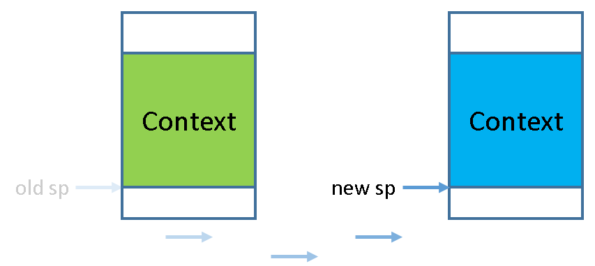

<!-- > #### caution::甩锅声明
> 从PA4开始, 讲义中就不再提供滴水不漏的代码指导了,
> 部分关键的代码细节需要你自己去思考和尝试(我们故意省略的).
> 我们会在讲义中将技术的原理阐述清楚,
> 你需要首先理解这些原理, 然后根据理解来阅读并编写相应的代码.
>
> 一句话总结, 与其抱怨讲义写得不清楚, 还不如自己多多思考.
> 现在都到PA4了, 为了让成绩符合正态分布, 拿高分总需要多付出点努力吧.
> 如果你之前都是想办法投机取巧而不去深入理解系统如何工作, 现在应该已经没戏了. -->
> #### caution:: Заявление о снятии с себя ответственности
> Начиная с PA4 методичка больше не будет давать безупречно подробные указания по коду —
> некоторые ключевые детали кода вам нужно будет обдумать и опробовать самостоятельно (мы намеренно их опустили).
> В методичке мы чётко изложим принципы соответствующих технологий,
> и вам сначала нужно понять эти принципы, а затем на основе понимания читать и писать соответствующий код.
>
> Одной фразой: вместо того чтобы жаловаться на неясность методички, лучше побольше думать самостоятельно.
> Раз уж мы дошли до PA4, то ради того, чтобы оценки соответствовали нормальному распределению, за высокий балл в любом случае придётся приложить больше усилий.
> Если раньше вы искали способы схитрить, а не пытались глубоко понять, как работает система, — сейчас у вас, скорее всего, уже не получится.


<!-- ## 多道程序 -->
## Мультипрограммирование

<!-- 通过Nanos-lite的支撑, 我们已经在NEMU中成功运行了一个批处理系统, 并把仙剑奇侠传跑起来了!
这说明我们亲自构建的NEMU这个看似简单的机器, 同样能支撑真实程序的运行, 丝毫不逊色于真实的机器!
不过, 这个批处理系统目前还是只能同时运行一个程序,
只有当一个程序结束执行之后, 才会开始执行下一个程序. -->
При поддержке Nanos-lite мы уже успешно запустили в NEMU систему пакетной обработки и заставили работать Chinese Paladin! Это показывает, что построенная нами собственными руками NEMU — с виду простая машина — способна поддерживать выполнение настоящих программ ничуть не хуже настоящей машины! Однако эта система пакетной обработки пока что может выполнять только одну программу одновременно: следующая программа начинает выполняться лишь после того, как завершится предыдущая.

<!-- 这也正是批处理系统的一个缺陷:
如果当前程序正在等待输入输出, 那么整个系统都会因此而停顿.
在真实的计算机中, 和CPU的性能相比, 输入输出是非常缓慢的:
以磁盘为例, 磁盘进行一次读写需要花费大约5毫秒的时间,
但对于一个2GHz的CPU来说, 它需要花费10,000,000个周期来等待磁盘操作的完成.
但事实上, 与其让系统陷入无意义的等待, 还不如用这些时间来进行一些有意义的工作.
一个简单的想法就是, 在系统一开始的时候加载多个程序, 然后运行第一个;
当第一个程序需要等待输入输出的时候, 就切换到第二个程序来运行;
当第二个程序也需要等待的时候, 就继续切换到下一个程序来运行, 如此类推. -->
Это как раз и есть один из недостатков системы пакетной обработки: если текущая программа ожидает ввода-вывода, вся система из-за этого простаивает. В реальных компьютерах ввод-вывод очень медленный по сравнению с производительностью CPU: например, одна операция чтения/записи на диске занимает около 5 миллисекунд, но для процессора с частотой 2 ГГц это означает ожидание завершения дисковой операции в течение 10 000 000 тактов. Однако вместо того, чтобы позволять системе бессмысленно простаивать, гораздо лучше использовать это время для какой-то полезной работы. Простая идея: в начале работы системы загрузить сразу несколько программ, затем запустить первую; когда первой программе нужно ждать ввода-вывода, переключиться на вторую программу для выполнения; когда второй программе тоже нужно ждать, переключиться на следующую программу, и так далее.

<!-- 这就是[多道程序(multiprogramming)][multiprogramming]系统的基本思想.
多道程序的想法听上去很简单, 但它也是一种多任务系统,
这是因为它已经包含了多任务系统的基本要素.
换句话说, 要实现一个多道程序操作系统,
我们只需要实现以下两点就可以了:
* 在内存中可以同时存在多个进程
* 在满足某些条件的情况下, 可以让执行流在这些进程之间切换 -->
Это и есть базовая идея системы [мультипрограммирования (multiprogramming)][multiprogramming]. Идея мультипрограммирования звучит просто, но это уже разновидность многозадачной системы, поскольку она уже содержит базовые элементы многозадачной системы. Другими словами, чтобы реализовать операционную систему с мультипрограммированием, нам достаточно реализовать следующие два пункта:
* В памяти могут одновременно существовать несколько процессов
* При выполнении определённых условий поток исполнения можно переключать между этими процессами


[multiprogramming]: https://en.wikipedia.org/wiki/Computer_multitasking#Multiprogramming

<!-- > #### hint::术语变更
> 既然是多任务系统, 系统中就运行的程序就不止一个了.
> 现在我们就可以直接使用"进程"的概念了. -->
> #### hint:: Смена терминологии
> Раз уж это многозадачная система, то в ней работает не одна программа.
> Теперь мы можем напрямую использовать понятие «процесс».


<!-- 要实现第一点并不难, 我们只要让loader把不同的进程加载到不同的内存位置就可以了,
加载进程的过程本质上就是一些内存拷贝的操作, 因此并没有什么困难的地方. -->
Реализовать первый пункт несложно: достаточно, чтобы загрузчик (loader) загружал разные процессы в разные области памяти. Процесс загрузки процесса по сути сводится к нескольким операциям копирования памяти, так что здесь нет ничего сложного.

<!-- > #### comment::其实我在骗你!
> 对我们目前实现的计算机系统来说, "把不同的进程加载到不同的内存位置"其实是一件很麻烦的事情,
> 你能想明白为什么吗? 如果想不明白也没关系, 我们会在下一阶段详细讨论这个问题. -->
> #### comment:: На самом деле я вас обманываю!
> Для нашей текущей реализации компьютерной системы «загрузка разных процессов в разные области памяти» на самом деле довольно хлопотное дело. Можете понять почему? Если не получается — не страшно, мы подробно обсудим этот вопрос на следующем этапе.


<!-- 为了简单起见, 我们可以在操作系统中直接定义一些测试函数来作为程序,
因为程序本质上就是一些有意义的指令序列, 目前我们不必在意这些指令序列到底从何而来.
不过, 一个需要注意的地方是栈, 我们需要为每个进程分配各自的栈空间. -->
Для простоты мы можем прямо в операционной системе определить несколько тестовых функций и использовать их в качестве программ, ведь программа по сути — это осмысленная последовательность инструкций, и пока нас не волнует, откуда эта последовательность взялась. Однако есть один момент, на который стоит обратить внимание, — стек: нам нужно выделить каждому процессу собственное стековое пространство.

<!-- > #### question::为什么需要使用不同的栈空间?
> 如果不同的进程共享同一个栈空间, 会发生什么呢? -->
> #### question:: Почему нужно использовать разные стековые пространства?
> Что произойдёт, если разные процессы будут использовать общее стековое пространство?

<!-- 反而需要深思熟虑的是第二点: 表面上看, "怎么让执行流在进程之间切换"并不是一件直观的事情. -->
На самом деле, гораздо большего размышления требует второй пункт: на первый взгляд, «как переключать поток исполнения между процессами» — дело совсем не интуитивное.

<!-- ## 上下文切换 -->
## Переключение контекста

<!-- 在PA3中, 我们已经提到了操作系统和用户进程之间的执行流切换,
并介绍了"上下文"的概念: 上下文的本质就是进程的状态.
换句话说, 我们现在需要考虑的是, 如何在多个用户进程之间进行上下文切换. -->
В PA3 мы уже упоминали переключение потока исполнения между операционной системой и пользовательским процессом и вводили понятие «контекста»: по сути, контекст — это состояние процесса. Другими словами, сейчас нам нужно подумать, как переключать контекст между несколькими пользовательскими процессами.

<!-- 为了帮助大家理解这个问题, 我们在`am-kernels`中为大家准备了一个约30行的操作系统`yield-os`,
它创建了两个执行流, 在CTE的支撑下交替输出`A`和`B`.
你可以在`native`上运行`yield-os`来查看它的行为. -->
Чтобы помочь вам разобраться в этом вопросе, мы подготовили в `am-kernels` небольшую операционную систему `yield-os` примерно на 30 строк. Она создаёт два потока исполнения, которые при поддержке CTE поочерёдно выводят `A` и `B`.
Вы можете запустить `yield-os` на `native`, чтобы посмотреть на её поведение.

<!-- > #### danger::更新am-kernels
> 我们在2023年10月3日15:35:00在`am-kernels`中添加了`yield-os`的代码.
> 如果你在此时间前获取`am-kernels`的代码, 请通过以下命令获取更新后的代码: -->
> #### danger:: Обновите am-kernels
> Мы добавили код `yield-os` в `am-kernels` 3 октября 2023 года в 15:35:00.
> Если вы получили код `am-kernels` раньше этого времени, пожалуйста, получите обновлённый код следующей командой:
> ```bash
> cd am-kernels
> git pull origin master
> ```

<!-- ### 基本原理 -->
### Основной принцип

<!-- 事实上, 有了CTE, 我们就有一种很巧妙的方式来实现上下文切换了.
具体地, 假设进程A运行的过程中触发了系统调用, 通过自陷指令陷入到内核.
根据`__am_asm_trap()`的代码, A的上下文结构(`Context`)将会被保存到A的栈上.
在PA3中, 系统调用处理完毕之后, `__am_asm_trap()`会根据栈上保存的上下文结构来恢复A的上下文.
神奇的地方来了, 如果我们先不着急恢复A的上下文,
而是先将栈顶指针切换到另一个进程B的栈上, 那会发生什么呢?
由于B的栈上存放了之前B保存的上下文结构, 接下来的操作就会根据这一结构来恢复B的上下文.
从`__am_asm_trap()`返回之后, 我们已经在运行进程B了! -->
На самом деле, имея CTE, у нас появляется очень изящный способ реализовать переключение контекста.
А именно: предположим, что во время выполнения процесса A происходит системный вызов, который через инструкцию самозахвата (trap) уводит выполнение в ядро.
Согласно коду `__am_asm_trap()`, структура контекста A (`Context`) будет сохранена на стеке A.
В PA3 после обработки системного вызова `__am_asm_trap()` восстанавливает контекст A на основе структуры контекста, сохранённой на стеке.
А вот и волшебство: что произойдёт, если мы не будем спешить восстанавливать контекст A,
а вместо этого сначала переключим указатель вершины стека на стек другого процесса B?
Поскольку на стеке B хранится структура контекста, ранее сохранённая самим B, последующие операции восстановят контекст B именно на основе этой структуры.
После возврата из `__am_asm_trap()` мы уже выполняем процесс B!




<!-- 那进程A到哪里去了呢? 别担心, 它只是被暂时"挂起"了而已.
在被挂起之前, 它已经把上下文结构保存到自己的栈上了,
如果将来的某一时刻栈顶指针被切换到A的栈上,
代码将会根据栈上的上下文结构来恢复A的上下文, A将得以唤醒并执行.
所以, 上下文切换其实就是不同进程之间的栈切换! -->
Так куда же делся процесс A? Не переживайте, он просто временно «приостановлен».
Перед тем как быть приостановленным, он уже сохранил структуру контекста на своём стеке.
Если в какой-то момент в будущем указатель вершины стека переключат обратно на стек A,
код восстановит контекст A на основе структуры контекста на стеке, и A будет разбужен и продолжит выполнение.
Таким образом, переключение контекста — это, по сути, переключение стека между разными процессами!

<!-- ### 进程控制块 -->
### Блок управления процессом

<!-- 但是, 我们要如何找到别的进程的上下文结构呢?
注意到上下文结构是保存在栈上的, 但栈空间那么大,
受到函数调用形成的栈帧的影响, 每次保存上下文结构的位置并不是固定的.
自然地, 我们需要一个`cp`指针(context pointer)来记录上下文结构的位置,
当想要找到其它进程的上下文结构的时候, 只要寻找这个进程相关的`cp`指针即可. -->
Но как нам найти структуру контекста другого процесса?
Заметьте, что структура контекста хранится на стеке, а стековое пространство довольно велико.
Из-за влияния стековых кадров, формируемых вызовами функций, позиция сохранения структуры контекста каждый раз не фиксирована.
Естественно, нам нужен указатель `cp` (context pointer), чтобы запоминать позицию структуры контекста.
Когда нужно найти структуру контекста другого процесса, достаточно найти относящийся к этому процессу указатель `cp`.


<!-- 事实上, 有不少信息都是进程相关的,
除了刚才提到的上下文指针`cp`之外, 上文提到的栈空间也是如此.
为了方便对这些进程相关的信息进行管理,
操作系统使用一种叫进程控制块(PCB, process control block)的数据结构, 为每一个进程维护一个PCB.
`yield-os`的代码中已经定义了我们所需要使用的PCB结构: -->
На самом деле, довольно много информации связано именно с процессом:
помимо только что упомянутого указателя контекста `cp`, это относится и к упомянутому выше стековому пространству.
Чтобы удобно управлять всей этой связанной с процессом информацией,
операционная система использует структуру данных под названием блок управления процессом (PCB, process control block), поддерживая по одному PCB для каждого процесса.
В коде `yield-os` уже определена нужная нам структура PCB:
```c
typedef union {
  uint8_t stack[STACK_SIZE];
  struct {
    Context *cp;
  };
} PCB;
```

<!-- 代码使用一个联合体来把其它信息放置在进程堆栈的底部.
代码为每一个进程分配了一个32KB的堆栈, 已经足够使用了, 不会出现栈溢出导致UB.
在进行上下文切换的时候, 只需要把PCB中的`cp`指针返回给CTE的`__am_irq_handle()`函数即可,
剩余部分的代码会根据上下文结构恢复上下文.
我们只要稍稍借助数学归纳法, 就可以让我们相信这个过程对于正在运行的进程来说总是正确的.

那么, 对于刚刚加载完的进程, 我们要怎么切换到它来让它运行起来呢? -->
Код использует объединение (union), чтобы разместить прочую информацию в самом низу стека процесса.
Код выделяет каждому процессу стек размером 32 КБ, чего вполне достаточно — переполнения стека, приводящего к неопределённому поведению (UB), не возникнет.
При переключении контекста достаточно вернуть указатель `cp` из PCB функции `__am_irq_handle()` в CTE,
а оставшаяся часть кода восстановит контекст на основе структуры контекста.
Прибегнув лишь к небольшой доле математической индукции, мы можем убедиться, что этот процесс всегда корректен для выполняющегося процесса.

Так как же нам переключиться на только что загруженный процесс, чтобы заставить его выполняться?


<!-- ### 内核线程 -->
### Поток ядра

<!-- #### 创建内核线程上下文 -->
#### Создание контекста потока ядра

<!-- 答案很简单, 我们只需要在进程的栈上人工创建一个上下文结构,
使得将来切换的时候可以根据这个结构来正确地恢复上下文即可. -->
Ответ прост: нам достаточно вручную создать структуру контекста на стеке процесса, чтобы при будущем переключении можно было корректно восстановить контекст на её основе.

<!-- 上文提到, 我们先把操作系统中直接定义的一些测试函数作为程序.
`yield-os`提供了一个测试函数`f()`,
我们接下来的任务就是为它创建一个上下文, 然后切换到它来执行.
这样的执行流有一个专门的名称, 叫"内核线程"(kernel thread). -->
Как упоминалось выше, мы сначала используем несколько напрямую определённых в операционной системе тестовых функций в качестве программ.
`yield-os` предоставляет тестовую функцию `f()`,
и наша следующая задача — создать для неё контекст, а затем переключиться на неё для выполнения.
У такого потока исполнения есть специальное название — «поток ядра» (kernel thread).


<!-- > #### comment::为什么不叫"内核进程"?
> 这个问题其实等价于"进程和线程有什么区别", 是个不错的问题.
> 而且这还属于考研八股的内容呢, 于是你肯定可以通过STFW找到很多五花八门的答案,
> 比如"线程更加轻量级", "线程没有独立的资源"等等.
>
> 如果要进一步解释"什么是轻量级", "独立的资源是什么意思", 在PA中可能比较困难.
> 不过在PA中也不必深究这个问题, 目前你只需要把它们都看成执行流就可以了,
> 更重要的是, 这两者你都将会实现, 在代码中亲自去感受它们的区别不是一个更好的选择吗?
> 另外, 带着这个问题去修读下学期的操作系统课也不错. -->
> #### comment:: Почему не называется «процесс ядра»?
> Этот вопрос по сути эквивалентен вопросу «в чём разница между процессом и потоком» — неплохой вопрос.
> К тому же это ещё и типичный «шаблонный» вопрос для вступительных экзаменов в аспирантуру, так что через STFW вы наверняка найдёте множество самых разных ответов,
> например: «поток более лёгковесный», «у потока нет отдельных ресурсов» и так далее.
>
> Если пытаться подробнее объяснить, «что значит лёгковесный» и «что подразумевается под отдельными ресурсами», в рамках PA это может оказаться непросто.
> Однако в PA углубляться в этот вопрос не обязательно — пока достаточно рассматривать оба этих понятия как потоки исполнения.
> Что важнее, вы реализуете и то, и другое — разве не лучше почувствовать разницу между ними прямо в коде, на собственном опыте?
> Кроме того, неплохо будет пойти с этим вопросом на курс операционных систем в следующем семестре.


<!-- 创建内核线程的上下文是通过CTE提供的`kcontext()`函数
(在`abstract-machine/am/src/$ISA/nemu/cte.c`中定义)来实现的,
其中的"k"代表内核. `kcontext()`的原型是 -->
Создание контекста для потока ядра реализуется через функцию `kcontext()`, предоставляемую CTE
(определена в `abstract-machine/am/src/$ISA/nemu/cte.c`),
где «k» означает «kernel» (ядро). Прототип `kcontext()`:
```c
Context* kcontext(Area kstack, void (*entry)(void *), void *arg);
```
<!-- 其中`kstack`是栈的范围, `entry`是内核线程的入口, `arg`则是内核线程的参数.
此外, `kcontext()`要求内核线程不能从`entry`返回, 否则其行为是未定义的.
你需要在`kstack`的底部创建一个以`entry`为入口的上下文结构(目前你可以先忽略`arg`参数),
然后返回这一结构的指针. -->
Здесь `kstack` — это диапазон стека, `entry` — точка входа потока ядра, а `arg` — параметр потока ядра.
Кроме того, `kcontext()` требует, чтобы поток ядра не возвращался из `entry`, иначе поведение будет неопределённым.
Вам нужно создать структуру контекста в самом низу `kstack` с точкой входа `entry` (пока можете игнорировать параметр `arg`),
а затем вернуть указатель на эту структуру.


<!-- `yield-os`会调用`kcontext()`来创建上下文, 并把返回的指针记录到PCB的`cp`中: -->
`yield-os` вызывает `kcontext()` для создания контекста и записывает возвращённый указатель в поле `cp` структуры PCB:
```
|               |
+---------------+ <---- kstack.end
|               |
|    context    |
|               |
+---------------+ <--+
|               |    |
|               |    |
|               |    |
|               |    |
+---------------+    |
|       cp      | ---+
+---------------+ <---- kstack.start
|               |
```

<!-- #### 线程/进程调度 -->
#### Планирование потоков/процессов

<!-- 上下文的创建和切换是CTE的工作, 而具体切换到哪个上下文,
则是由操作系统来决定的, 这项任务叫做进程调度.
进程调度是由`schedule()`函数来完成的, 它用于返回将要调度的进程上下文.
因此, 我们需要一种方式来记录当前正在运行哪一个进程,
这样我们才能在`schedule()`中返回另一个进程的上下文, 以实现多任务的效果.
这一工作是通过`current`指针来实现的, 它用于指向当前运行进程的PCB.
这样, 我们就可以在`schedule()`中通过`current`来决定接下来要调度哪一个进程了.
不过在调度之前, 我们还需要把当前进程的上下文指针保存在PCB当中: -->
Создание и переключение контекста — задача CTE, а вот выбор того, на какой именно контекст переключиться, определяет операционная система — эта задача называется планированием процессов (process scheduling).
Планирование процессов выполняется функцией `schedule()`, которая возвращает контекст процесса, подлежащего планированию.
Поэтому нам нужен способ отслеживать, какой процесс сейчас выполняется,
чтобы в `schedule()` мы могли вернуть контекст другого процесса и добиться эффекта многозадачности.
Эта задача решается с помощью указателя `current`, который указывает на PCB текущего выполняемого процесса.
Таким образом, в `schedule()` мы можем с помощью `current` решить, какой процесс планировать следующим.
Однако перед планированием нам также нужно сохранить указатель контекста текущего процесса в его PCB:

```c
// save the context pointer
current->cp = prev;

// switch between pcb[0] and pcb[1]
current = (current == &pcb[0] ? &pcb[1] : &pcb[0]);

// then return the new context
return current->cp;
```
<!-- 目前我们让`schedule()`总是切换到另一个进程.
注意所选进程的上下文是通过`kcontext()`创建的,
在`schedule()`中才决定要切换到它, 然后在CTE的`__am_asm_trap()`中才真正地恢复这一上下文. -->
Пока мы заставляем `schedule()` всегда переключаться на другой процесс.
Обратите внимание, что контекст выбранного процесса создаётся через `kcontext()`,
а решение переключиться на него принимается уже в `schedule()`, и лишь затем в `__am_asm_trap()` CTE происходит фактическое восстановление этого контекста.

<!-- > #### comment::机制和策略解耦
> 这其实体现了系统设计中的一种重要原则: 机制和策略解耦.
> 机制解决的是"能不能做"的问题, 而策略解决的则是"怎么做好"的问题.
> 显然, 策略需要机制的支撑, 机制需要策略来发挥最大的效果.
>
> 解耦的好处就很明显了: 代码重用率高, 而且容易理解.
> 在Project-N中, 这一解耦几乎做到了极致: 机制和策略被分离到两个子项目中.
> 比如, "上下文切换"这一机制是在AM的CTE中实现的, 它让系统可以做到"执行流的切换"这件事;
> 而具体要切换到哪一个执行流, 则是在操作系统中实现的.
>
> AM的另外一个好处是将底层硬件的行为抽象成系统级机制,
> AM上的应用(包括OS)只需要调用这些系统级机制, 并实现相应的策略即可.
> 当然目前`schedule()`中的策略非常简单, 下学期的操作系统实验,
> 甚至是现实中更复杂的进程调度策略, 都可以在AM提供的同一个机制之上实现. -->
> #### comment:: Разделение механизма и политики
> На самом деле это отражает важный принцип проектирования систем: разделение (декомпозицию) механизма и политики.
> Механизм решает вопрос «можно ли это сделать», а политика решает вопрос «как сделать это хорошо».
> Очевидно, что политика опирается на механизм, а механизму нужна политика, чтобы проявить свой эффект максимально полно.
>
> Польза от такого разделения очевидна: высокая переиспользуемость кода и лёгкость понимания.
> В Project-N это разделение доведено почти до предела: механизм и политика разнесены по двум разным подпроектам.
> Например, механизм «переключения контекста» реализован в CTE в AM — он позволяет системе делать «переключение потоков исполнения»;
> а вот на какой именно поток исполнения переключаться — это уже реализовано в операционной системе.
>
> Другое преимущество AM — то, что она абстрагирует поведение нижележащего железа в системные механизмы,
> а приложениям на AM (включая ОС) достаточно вызывать эти системные механизмы и реализовывать соответствующие политики.
> Разумеется, сейчас политика в `schedule()` очень простая, но лабораторные работы по ОС в следующем семестре,
> и даже более сложные политики планирования процессов из реального мира, можно реализовать поверх того же самого механизма, предоставляемого AM.


<!-- > #### todo::实现上下文切换
> 根据讲义的上述内容, 实现以下功能:
> * CTE的`kcontext()`函数
> * 修改CTE中`__am_asm_trap()`的实现, 使得从`__am_irq_handle()`返回后,
> 先将栈顶指针切换到新进程的上下文结构, 然后才恢复上下文, 从而完成上下文切换的本质操作
>
> 正确实现后, 你将看到`yield-os`不断输出`?`, 这是因为我们还没有为`kcontext()`实现参数功能,
> 不过这些输出的`?`至少说明了CTE目前可以正确地从`yield-os`的`main()`函数切换到其中一个内核线程. -->
> #### todo:: Реализуйте переключение контекста
> Основываясь на изложенном выше содержании методички, реализуйте следующую функциональность:
> * Функцию `kcontext()` в CTE
> * Измените реализацию `__am_asm_trap()` в CTE так, чтобы после возврата из `__am_irq_handle()`
>   сначала указатель вершины стека переключался на структуру контекста нового процесса, и только затем восстанавливался контекст — так завершается сущностная операция переключения контекста
>
> После правильной реализации вы увидите, что `yield-os` непрерывно выводит `?` — это потому, что мы ещё не реализовали функциональность параметров для `kcontext()`,
> но вывод этих `?` уже показывает, что CTE в текущем состоянии корректно переключается из функции `main()` `yield-os` в один из потоков ядра.


<!-- > #### hint::关于kcontext()的提示
> 我们希望代码将来从``__am_asm_trap()``返回之后, 就会开始执行`f()`.
> 换句话说, 我们需要在`kcontext()`中构造一个上下文, 它指示了一个状态,
> 从这个状态开始, 可以正确地开始执行`f()`.
> 所以你需要思考的是, 为了可以正确地开始执行`f()`,
> 这个状态究竟需要满足什么样的条件?
>
> 至于"先将栈顶指针切换到新进程的上下文结构", 很自然的问题就是,
> 新进程的上下文结构在哪里? 怎么找到它? 又应该怎么样把栈顶指针切换过去?
> 如果你发现代码跑飞了, 不要忘记, 程序是个状态机. -->
> #### hint:: Подсказка о kcontext()
> Мы хотим, чтобы код после возврата из `__am_asm_trap()` в будущем начинал выполнять `f()`.
> Другими словами, нам нужно построить в `kcontext()` контекст, который обозначает некое состояние,
> начиная с которого можно корректно начать выполнение `f()`.
> Поэтому вам нужно подумать: чтобы можно было корректно начать выполнение `f()`,
> каким именно условиям должно удовлетворять это состояние?
>
> Что касается «сначала переключить указатель вершины стека на структуру контекста нового процесса» — естественный вопрос:
> где находится структура контекста нового процесса? Как её найти? И как именно нужно переключить туда указатель вершины стека?
> Если вы обнаружите, что код «улетел» в неизвестном направлении, не забывайте: программа — это конечный автомат.


<!-- > #### hint::配合DiffTest
> 为了保证DiffTest的正确运行, 根据你选择的ISA, 你还需要进行一些额外的设置:
> * x86: 把上下文结构中的`cs`设置为`8`.
> * riscv32: 把上下文结构中的`mstatus`设置为`0x1800`.
> * riscv64, 把上下文结构中的`mstatus`设置为`0xa00001800`. -->
> #### hint:: Для совместимости с DiffTest
> Чтобы гарантировать корректную работу DiffTest, в зависимости от выбранной вами ISA вам также нужно выполнить дополнительные настройки:
> * x86: установить `cs` в структуре контекста равным `8`.
> * riscv32: установить `mstatus` в структуре контекста равным `0x1800`.
> * riscv64: установить `mstatus` в структуре контекста равным `0xa00001800`.

<!-- #### 内核线程的参数 -->
#### Параметры потока ядра

<!-- 为了让`yield-os`的内核线程可以正确输出字符, 我们需要通过`kcontext()`给`f()`传参.
于是我们需要继续思考, `f()`将会如何读出它的参数?
噢, 这不就是调用约定的内容吗? 你已经非常熟悉了.
我们只需要让`kcontext()`按照调用约定将`arg`放置在正确的位置,
将来`f()`执行的时候就可以获取正确的参数了. -->
Чтобы потоки ядра `yield-os` могли корректно выводить символы, нам нужно передать параметр в `f()` через `kcontext()`.
Значит, нужно продолжить думать: как `f()` будет считывать свой параметр?
О, разве это не про соглашения о вызовах? Вы уже прекрасно с ними знакомы.
Нам достаточно заставить `kcontext()` разместить `arg` в правильном месте согласно соглашению о вызовах,
и тогда при выполнении `f()` сможет получить корректный параметр.

<!-- > #### question::mips32和riscv32的调用约定
> 我们没有给出mips32和riscv32的调用约定, 你需要查阅相应的ABI手册.
> 当然, 你也可以自己动手实践来总结传参的规则. -->

> #### question:: Соглашения о вызовах для mips32 и riscv32
> Мы не привели соглашения о вызовах для MIPS32 и RISC-V32. Вам нужно обратиться к соответствующим руководствам ABI.
> Конечно, вы также можете самостоятельно поэкспериментировать, чтобы вывести правила передачи параметров.

<!-- > #### todo::实现上下文切换(2)
> 根据讲义的上述内容, 修改CTE的`kcontext()`函数, 使其支持参数`arg`的传递.
>
> 因为`f()`中每次输出完信息都会调用`yield()`, 因此只要我们正确实现内核线程的参数传递,
> 就可以观察到`yield-os`在两个内核线程之间来回切换的现象.

在真实的操作系统中, 内核中的很多后台任务, 守护服务和驱动程序都是以内核线程的形式存在的.
如果你执行`ps aux`, 你就会看到系统中有很多COMMAND中带有中括号的内核线程(例如`[kthreadd]`).
而创建和执行它们的原理, 也是和上面的实验内容非常相似(当然具体实现肯定会有所不同). -->
> #### todo:: Реализуйте переключение контекста (2)
> Основываясь на изложенном выше содержании методички, измените функцию `kcontext()` в CTE так, чтобы она поддерживала передачу параметра `arg`.
>
> Поскольку `f()` каждый раз после вывода сообщения вызывает `yield()`, как только мы правильно реализуем передачу параметров потокам ядра,
> мы сможем наблюдать, как `yield-os` переключается туда-обратно между двумя потоками ядра.

В реальных операционных системах многие фоновые задачи, службы-демоны и драйверы в ядре существуют именно в форме потоков ядра.
Если вы выполните `ps aux`, вы увидите в системе множество потоков ядра, у которых в столбце COMMAND название заключено в квадратные скобки (например, `[kthreadd]`).
А принципы их создания и выполнения очень похожи на содержание описанного выше упражнения (хотя конкретная реализация, конечно же, будет отличаться).

<!-- > #### option::保持kcontext()的特性
> AM在定义`kcontext()`的行为时, 还要求`kcontext()`只能在栈上放置一个上下文结构,
> 而不能放置更多的内容. 这样的要求有两点好处:
> * `kcontext()`对栈的写入只有一个上下文结构的内容, 而不会产生其它的副作用
> * OS可以预测调用`kcontext()`之后的返回值, 并且利用这一确定的特性进行一些检查或者简化某些实现 -->
> #### option:: Сохраните свойства kcontext()
> Определяя поведение `kcontext()`, AM также требует, чтобы `kcontext()` размещала на стеке только одну структуру контекста
> и не могла размещать что-либо ещё. У такого требования есть два преимущества:
> * `kcontext()` записывает на стек только содержимое одной структуры контекста, не вызывая других побочных эффектов
> * ОС может предсказать возвращаемое значение после вызова `kcontext()` и использовать это детерминированное свойство для некоторых проверок или упрощения отдельных реализаций
>
<!-- > 我们知道x86是通过栈来传递参数的, 如果`kcontext()`需要支持`arg`的传递,
> 它就需要往栈上放置更多的内容, 这样就违反了上述确定性了.
> 但在PA中, 这并不会导致致命的问题, 因此我们并不要求你的`kcontext()`实现严格遵守这一确定性.
> 但你还是可以思考如何在遵守确定性的情况下实现参数的传递. -->
> Мы знаем, что x86 передаёт параметры через стек. Если `kcontext()` нужно поддерживать передачу `arg`,
> ей придётся разместить на стеке дополнительное содержимое, что нарушит указанную выше детерминированность.
> Однако в PA это не приведёт к фатальным проблемам, поэтому мы не требуем, чтобы ваша реализация `kcontext()` строго соблюдала эту детерминированность.
> Тем не менее вы всё же можете подумать, как реализовать передачу параметров, соблюдая детерминированность.
>
<!-- > 一个解决方案是通过引入一个辅助函数来将真正的参数传递从`kcontext()`推迟到内核线程的运行时刻.
> 具体地, 我们可以在`kcontext()`中先把内核线程的入口设置为辅助函数,
> 并把参数设置到某个可用的寄存器中. 这样以后, 内核线程就会从辅助函数开始执行,
> 此时让辅助函数来把之前设置的参数从寄存器中放置到栈上, 再调用真正的线程入口函数(`f()`).
> 这一方案和Linux中加载用户程序还是有一些相似之处的:
> 用户程序在运行的时候也并不是直接把`main()`函数作为入口,
> 而是先从CRT定义的``_start()``开始运行, 进行包括设置参数在内的一系列初始化操作,
> 最后才调用`main()`函数. -->
> Одно из решений — ввести вспомогательную функцию, чтобы отложить фактическую передачу параметров с момента вызова `kcontext()` до момента выполнения потока ядра.
> А именно: мы можем в `kcontext()` сначала установить точкой входа потока ядра вспомогательную функцию,
> а параметр разместить в каком-нибудь доступном регистре. После этого поток ядра начнёт выполняться со вспомогательной функции,
> и уже она переложит ранее установленный параметр из регистра на стек, а затем вызовет настоящую функцию входа потока (`f()`).
> Это решение имеет некоторое сходство с загрузкой пользовательских программ в Linux:
> пользовательская программа при запуске тоже не начинает напрямую с функции `main()`,
> а сначала выполняется, начиная с `_start()`, определённой в CRT, выполняя ряд операций инициализации, включая установку параметров,
> и лишь затем вызывает функцию `main()`.
>
<!-- > 如果你选择的ISA是x86, 你可以尝试在CTE中实现上述辅助函数.
> 考虑到要直接操作寄存器和栈, 这个辅助函数还是通过汇编代码来编写比较合适.
> 不过由于这个辅助函数的功能比较简单, 你只需要编写几条指令就可以实现它了. -->
> Если выбранная вами ISA — x86, можете попробовать реализовать указанную выше вспомогательную функцию в CTE.
> Учитывая, что требуется напрямую манипулировать регистрами и стеком, эту вспомогательную функцию уместнее написать на ассемблере.
> Впрочем, поскольку функциональность этой вспомогательной функции довольно простая, вам понадобится всего несколько инструкций, чтобы её реализовать.

<!-- ## OS中的上下文切换

`yield-os`是一个很小的OS, 除了上下文切换之外, 不具备其他功能,
但它可以帮助我们专注于理解上下文切换的核心细节.
理解这些细节后, 我们也可以很快将这些原理迁移到更大的OS中. -->
## Переключение контекста в ОС

`yield-os` — это очень маленькая ОС, у которой, помимо переключения контекста, нет других функций, но она помогает нам сосредоточиться на понимании ключевых деталей переключения контекста. Разобравшись в этих деталях, мы также сможем быстро перенести эти принципы на более крупные ОС.

<!-- ### RT-Thread(选做)

RT-Thread是一个流行的商业级嵌入式实时OS, 具备完善的OS功能模块,
可以适配各种不同的开发板, 并支撑各种应用程序的运行. -->
### RT-Thread (необязательно)

RT-Thread — это популярная коммерческая встраиваемая ОС реального времени с полноценными функциональными модулями ОС. Она может адаптироваться к самым разным платам для разработки и поддерживать выполнение различных приложений.

<!-- RT-Thread中有两个抽象层, 一个是BSP(Board Support Package), 另一个是libcpu.
BSP为各种型号的板卡定义了一套公共的API, 并基于这套API实现RT-Thread内核;
而对于一款板卡, 只需要实现相应的API, 就可以将RT-Thread内核运行在这款板卡上.
libcpu则是为各种CPU架构定义了一套公共的API, RT-Thread内核也会调用其中的某些API.
这一思想和AM非常类似. 当然, BSP也不仅仅是针对真实的板卡, 也可以对应QEMU等模拟器,
毕竟RT-Thread内核无需关心底层是否是一个真实的板卡. -->
В RT-Thread есть два слоя абстракции: BSP (Board Support Package, пакет поддержки платы) и libcpu.
BSP определяет общий набор API для плат самых разных моделей и реализует ядро RT-Thread на основе этого набора API;
а для конкретной платы достаточно реализовать соответствующий API, чтобы запустить ядро RT-Thread на этой плате.
libcpu, в свою очередь, определяет общий набор API для различных архитектур CPU, и ядро RT-Thread тоже вызывает некоторые API из него.
Эта идея очень похожа на AM. Конечно, BSP предназначен не только для реальных плат, но также может соответствовать эмуляторам вроде QEMU,
ведь ядру RT-Thread не нужно заботиться о том, является ли нижележащая платформа реальной платой.

<!-- 我们把RT-Thread移植到AM上, 编译运行这个RT-Thread的步骤如下:
1. 以通过以下命令获取移植之后的RT-Thread:
   ```bash
   cd ~/Templates  # 在另一个目录下克隆代码, 因为RT-Thread的代码无需打包提交
   git clone git@github.com:NJU-ProjectN/rt-thread-am.git
   ```
1. 为了编译代码, 你还需要安装项目构建工具`scons`:
   ```bash
   apt-get install scons
   ```
1. 在`rt-thread-am/bsp/abstract-machine/`目录下执行`make init`, 进行一些编译前的准备工作,
   此命令只需执行一次即可, 后续编译运行前无需再次执行
1. 在相同目录下通过`make ARCH=native`等方式编译或运行RT-Thread, 默认的运行输出如下: -->
Мы перенесли RT-Thread на AM; шаги для компиляции и запуска этого RT-Thread следующие:

1. Склонируйте перенесённый репозиторий RT-Thread, выполнив следующую команду в другом каталоге, поскольку код RT-Thread не нужно упаковывать и отправлять на проверку:
   ```bash
   cd ~/Templates
   git clone git@github.com:NJU-ProjectN/rt-thread-am.git
   ```

2. Для компиляции кода вам также нужно установить инструмент сборки проекта `scons`:
   ```bash
   apt-get install scons
   ```

3. Выполните `make init` в каталоге `rt-thread-am/bsp/abstract-machine/`, чтобы выполнить некоторые подготовительные действия перед компиляцией. Эту команду нужно выполнить только один раз, повторно выполнять её перед последующими компиляциями и запусками не требуется.

4. Скомпилируйте или запустите RT-Thread в том же каталоге командой вроде `make ARCH=native`. Вывод по умолчанию выглядит так:
   ```
   heap: [0x01000000 - 0x09000000]

    \ | /
   - RT -     Thread Operating System
    / | \     5.0.1 build Oct  2 2023 20:51:10
    2006 - 2022 Copyright by RT-Thread team
   Assertion fail at rt-thread-am/bsp/abstract-machine/src/context.c:29
   ```
   <!-- 运行后触发了assertion, 这是因为代码中有部分功能需要大家实现. -->
   После запуска срабатывает assertion — это потому, что часть функциональности в коде нужно реализовать вам самим.

<!-- 我们去掉了原项目中所有BSP和libcpu, 然后添加了一个特殊的BSP,
并用AM的API来实现BSP的API, 具体见`rt-thread-am/bsp/abstract-machine/`目录下的代码.
用到的AM API如下:
* 用TRM的heap实现RT-Thread中的堆
* 用TRM的`putch()`实现RT-Thread中的串口输出功能
* 暂不使用IOE
* 用CTE的`iset()`实现RT-Thread中开/关中断功能
* 通过CTE实现RT-Thread中上下文的创建和切换功能.
  此部分代码并未实现, 我们将它作为选做作业. -->
Мы убрали из оригинального проекта все BSP и libcpu, а затем добавили специальный BSP,
реализовав API BSP через API AM — подробности см. в коде в каталоге `rt-thread-am/bsp/abstract-machine/`.
Использованные API AM таковы:
* Куча (heap) TRM используется для реализации кучи в RT-Thread
* `putch()` из TRM используется для реализации вывода через последовательный порт в RT-Thread
* IOE пока не используется
* `iset()` из CTE используется для реализации включения/выключения прерываний в RT-Thread
* Через CTE реализуется функциональность создания и переключения контекста в RT-Thread.
Эта часть кода не реализована — мы оставили её в качестве необязательного задания.

<!-- 对于上下文的创建, 你需要实现`rt-thread-am/bsp/abstract-machine/src/context.c`中的`rt_hw_stack_init()`函数: -->
Для создания контекста вам нужно реализовать функцию `rt_hw_stack_init()` в `rt-thread-am/bsp/abstract-machine/src/context.c`:
```c
rt_uint8_t *rt_hw_stack_init(void *tentry, void *parameter, rt_uint8_t *stack_addr, void *texit);
```
<!-- 它的功能是以`stack_addr`为栈底创建一个入口为`tentry`, 参数为`parameter`的上下文,
并返回这个上下文结构的指针. 此外, 若上下文对应的内核线程从`tentry`返回, 则调用`texit`,
RT-Thread会保证代码不会从`texit`中返回. -->
Её функция — создать контекст с точкой входа `tentry` и параметром `parameter`, используя `stack_addr` как дно стека, и вернуть указатель на эту структуру контекста. Кроме того, если поток ядра, соответствующий контексту, вернётся из `tentry`, будет вызван `texit`, и RT-Thread гарантирует, что код не вернётся из `texit`.
<!-- 需要注意:
1. 传入的`stack_addr`可能没有任何对齐限制, 最好将它对齐到`sizeof(uintptr_t)`再使用.
2. CTE的`kcontext()`要求不能从入口返回, 因此需要一种新的方式来支持`texit`的功能.
   一种方式是构造一个包裹函数, 让包裹函数来调用`tentry`, 并在`tentry`返回后调用`texit`,
   然后将这个包裹函数作为`kcontext()`的真正入口, 不过这还要求我们将`tentry`,
   `parameter`和`texit`这三个参数传给包裹函数, 应该如何解决这个传参问题呢? -->
Обратите внимание:
1. Переданный `stack_addr` может не иметь никаких ограничений по выравниванию, поэтому лучше сначала выровнять его по `sizeof(uintptr_t)`, а затем уже использовать.
2. `kcontext()` в CTE требует, чтобы возврат из точки входа был невозможен, поэтому для поддержки функциональности `texit` нужен новый способ.
Один из способов — построить функцию-обёртку, которая будет вызывать `tentry`, а после возврата из `tentry` вызывать `texit`,
а затем использовать эту функцию-обёртку в качестве настоящей точки входа для `kcontext()`. Однако для этого также требуется передать функции-обёртке три параметра — `tentry`,
`parameter` и `texit`. Как решить эту проблему передачи параметров?

<!-- 对于上下文的切换, 你需要实现`rt-thread-am/bsp/abstract-machine/src/context.c`中的`rt_hw_context_switch_to()`函数和`rt_hw_context_switch()`函数: -->
Для переключения контекста вам нужно реализовать функции `rt_hw_context_switch_to()` и `rt_hw_context_switch()` в `rt-thread-am/bsp/abstract-machine/src/context.c`:
```c
void rt_hw_context_switch_to(rt_ubase_t to);
void rt_hw_context_switch(rt_ubase_t from, rt_ubase_t to);
```
<!-- 其中`rt_ubase_t`类型其实是`unsigned long`, `to`和`from`都是指向上下文指针变量的指针(二级指针).
`rt_hw_context_switch_to()`用于切换到`to`指向的上下文指针变量所指向的上下文,
而`rt_hw_context_switch()`还需要额外将当前上下文的指针写入`from`指向的上下文指针变量中.
为了进行切换, 我们可以通过`yield()`触发一次自陷,
在事件处理回调函数`ev_handler()`中识别出`EVENT_YIELD`事件后, 再处理`to`和`from`.
同样地, 我们需要思考如何将`to`和`from`这两个参数传给`ev_handler()`.
在`rt-thread-am/bsp/abstract-machine/src/context.c`中还有一个`rt_hw_context_switch_interrupt()`函数,
不过目前RT-Thread的运行过程不会调用它, 因此目前可以忽略它. -->
Здесь тип `rt_ubase_t` на самом деле является `unsigned long`, а `to` и `from` — это указатели на переменные-указатели контекста (указатели второго уровня).
`rt_hw_context_switch_to()` используется для переключения на контекст, на который указывает переменная-указатель контекста, на которую указывает `to`,
а `rt_hw_context_switch()` дополнительно должна записать указатель текущего контекста в переменную-указатель контекста, на которую указывает `from`.
Для переключения мы можем через `yield()` вызвать самозахват,
а после распознавания события `EVENT_YIELD` в функции обратного вызова обработчика событий `ev_handler()` обработать `to` и `from`.
Аналогично, нам нужно подумать, как передать эти два параметра, `to` и `from`, в `ev_handler()`.
В `rt-thread-am/bsp/abstract-machine/src/context.c` есть ещё функция `rt_hw_context_switch_interrupt()`,
но в текущей работе RT-Thread она не вызывается, так что пока её можно игнорировать.

<!-- 根据分析, 上面两个功能的实现都需要处理一些特殊的参数传递问题.
对于上下文的切换, 以`rt_hw_context_switch()`为例,
我们需要在`rt_hw_context_switch()`中调用`yield()`, 然后在`ev_handler()`中获得`from`和`to`.
`rt_hw_context_switch()`和`ev_handler()`是两个不同的函数, 但由于CTE机制的存在,
使得`rt_hw_context_switch()`不能直接调用`ev_handler()`.
因此, 一种直接的方式就是借助全局变量来传递信息. -->
Как показывает анализ, реализация обеих указанных выше функций требует решения некоторых специфических проблем передачи параметров.
Для переключения контекста, на примере `rt_hw_context_switch()`,
нам нужно вызвать `yield()` внутри `rt_hw_context_switch()`, а затем получить `from` и `to` в `ev_handler()`.
`rt_hw_context_switch()` и `ev_handler()` — это две разные функции, но из-за наличия механизма CTE
`rt_hw_context_switch()` не может напрямую вызвать `ev_handler()`.
Поэтому один из прямых способов — передавать информацию через глобальные переменные.

<!-- > #### danger::危险的全局变量
> 全局变量在整个系统中只有一个副本, 如果整个系统中只有一个线程, 这通常是安全的.
> 我们在C语言课上编写的程序都属于这种情况, 所以使用全局变量并不会造成明显的正确性问题.
> 但如果系统中存在多个线程, 并且它们使用同一个全局变量的时间段有重叠, 就可能会造成问题.
>
> 不过目前我们的硬件既未实现中断, 也不支持多处理器,
> 从编程模型来看和C语言课差不多, 因此使用全局变量解决这个问题还是可以的. -->
> #### danger:: Опасные глобальные переменные
> У глобальной переменной во всей системе есть только одна копия, и если во всей системе только один поток, это обычно безопасно.
> Все программы, которые мы писали на курсе языка C, относятся именно к такому случаю, поэтому использование глобальных переменных не вызывает явных проблем с корректностью.
> Но если в системе есть несколько потоков и периоды их использования одной и той же глобальной переменной пересекаются, могут возникнуть проблемы.
>
> Впрочем, наше текущее железо пока не реализует прерывания и не поддерживает несколько процессоров,
> так что с точки зрения модели программирования это похоже на курс языка C, поэтому использовать глобальные переменные для решения этой задачи пока допустимо.


<!-- > #### question::危险的全局变量(2)
> 如果使用全局变量来传递信息, 考虑以下场景, 可能会出现什么问题?
> * 在多处理器系统中, 两个处理器同时调用`rt_hw_context_switch()`
> * 一个线程调用`rt_hw_context_switch()`后写入了全局变量, 但马上到来了时钟中断,
>   使得系统切换到另一个线程, 但这个线程也调用了`rt_hw_context_switch()` -->
> #### question:: Опасные глобальные переменные (2)
> Если для передачи информации используются глобальные переменные, рассмотрите следующие сценарии — какие проблемы могут возникнуть?
> * В многопроцессорной системе два процессора одновременно вызывают `rt_hw_context_switch()`
> * Один поток вызвал `rt_hw_context_switch()` и записал значение в глобальную переменную, но тут же наступает таймерное прерывание,
>   заставляющее систему переключиться на другой поток, а этот поток тоже вызывает `rt_hw_context_switch()`

<!-- 但对于上下文的创建, 问题就更复杂了: 调用`rt_hw_stack_init()`和执行包裹函数的两个线程并不相同. -->
Но для создания контекста проблема ещё сложнее: поток, вызывающий `rt_hw_stack_init()`, и поток, выполняющий функцию-обёртку, — это не один и тот же поток.

<!-- > #### question::危险的全局变量(3)
> 如果使用全局变量来传递信息, 而代码连续调用了两次`rt_hw_stack_init()`, 会造成什么问题? -->
> #### question:: Опасные глобальные переменные (3)
> Если для передачи информации используются глобальные переменные, а код подряд дважды вызывает `rt_hw_stack_init()`, к каким проблемам это приведёт?

<!-- 因此, 我们需要寻找另一种解决方案.
回过头来看, 全局变量造成问题的原因是它会被多个线程共享,
为了得到正确的解决方案, 我们应该反其道而行之: 使用一种不会被多个线程共享的存储空间.
嘿嘿, 其实前文已经提到过它了, 那就是栈!
我们只需要让`rt_hw_stack_init()`将包裹函数的三个参数放在上下文的栈中,
将来包裹函数执行的时候就可以从栈中取出这三个参数, 而且系统中的其他线程都不能访问它们. -->
Поэтому нам нужно найти другое решение.
Оглядываясь назад: причина, по которой глобальные переменные создают проблемы, в том, что они разделяются между несколькими потоками.
Чтобы получить правильное решение, нужно поступить наоборот: использовать хранилище, которое не разделяется между несколькими потоками.
Хе-хе, на самом деле оно уже упоминалось ранее — это стек!
Нам достаточно заставить `rt_hw_stack_init()` разместить три параметра функции-обёртки на стеке контекста,
и в будущем, когда функция-обёртка будет выполняться, она сможет извлечь эти три параметра со стека, при этом другие потоки в системе не смогут получить к ним доступ.

<!-- 最后还需要考虑参数数量的问题, `kcontext()`要求入口函数只能接受一个类型为`void *`的参数.
不过我们可以自行约定用何种类型来解析这个参数(整数, 字符, 字符串, 指针等皆可),
于是这就成了一个C语言的编程题了. -->
Наконец, нужно учесть и проблему количества параметров: `kcontext()` требует, чтобы функция входа принимала только один параметр типа `void *`.
Однако мы можем сами договориться, каким типом интерпретировать этот параметр (целое число, символ, строка, указатель — что угодно подойдёт),
и тогда это становится обычной задачей по программированию на C.

<!-- > #### option::通过CTE实现RT-Thread的上下文创建和切换
> 根据上述内容实现相关代码.
> 对于`rt_hw_stack_init()`的实现, 我们已经给出了解决问题的正确方向,
> 但我们并没有指出所有实现相关的细节问题, 剩下的就交给你来分析解决吧,
> 这也是考察你是否已经了解这个过程中的每一处细节. -->
> #### option:: Реализуйте создание и переключение контекста RT-Thread через CTE
> Реализуйте соответствующий код на основе изложенного выше.
> Для реализации `rt_hw_stack_init()` мы уже указали верное направление решения проблемы,
> но не указали все детали, связанные с реализацией, — остальное оставляем вам для анализа и решения,
> это также проверка того, поняли ли вы каждую деталь этого процесса.
>
<!-- > 实现后, 尝试在NEMU中运行RT-Thread. 我们已经在移植后的RT-Thread中内置了一些Shell命令,
> 如果你的代码实现正确, 将能看到RT-Thread启动后依次执行这些命令, 最后输出命令提示符`msh >`: -->
> После реализации попробуйте запустить RT-Thread в NEMU. Мы уже встроили в перенесённый RT-Thread несколько команд Shell.
> Если ваш код реализован верно, вы увидите, что RT-Thread после запуска последовательно выполнит эти команды и в конце выведет приглашение командной строки `msh >`:
> ```
> heap: [0x01000000 - 0x09000000]
>
>  \ | /
> - RT -     Thread Operating System
>  / | \     5.0.1 build Oct  2 2023 20:51:10
>  2006 - 2022 Copyright by RT-Thread team
> [I/utest] utest is initialize success.
> [I/utest] total utest testcase num: (0)
> Hello RISC-V!
> msh />help
> RT-Thread shell commands:
> date       - get date and time or set (local timezone) [year month day hour min sec]
>
> ......
>
> msh />utest_list
> [I/utest] Commands list :
> msh />
> ```
<!-- > 由于NEMU目前还不支持通过串口进行交互, 因此我们无法将终端上的输入传送到RT-Thread, -->
<!-- > 所有内置命令运行结束后, RT-Thread将进入空闲状态, 此时退出NEMU即可. -->
> Поскольку NEMU пока не поддерживает взаимодействие через последовательный порт, мы не можем передать ввод с терминала в RT-Thread.
> После завершения выполнения всех встроенных команд RT-Thread перейдёт в состояние простоя — в этот момент можно просто выйти из NEMU.

<!-- > #### hint::在native上进行上下文切换
> 由于native的AM在创建上下文的时候默认会打开中断, 为了成功运行native创建的内核线程,
> 你还需要在事件处理回调函数中识别出时钟中断事件. 我们会在PA4的最后介绍时钟中断相关的内容,
> 目前识别出时钟中断事件之后什么都不用做, 直接返回相应的上下文结构即可. -->
> #### hint:: Переключение контекста на native
> Поскольку native-версия AM по умолчанию включает прерывания при создании контекста, чтобы успешно запустить поток ядра, созданный на native,
> вам также нужно распознавать событие таймерного прерывания в функции обратного вызова обработки событий. Мы расскажем о таймерных прерываниях в конце PA4.
> Пока после распознавания события таймерного прерывания ничего делать не нужно — просто верните соответствующую структуру контекста.


<!-- > #### option::危险的全局变量(4)
> 能否不使用全局变量来实现上下文的切换呢?
>
> 同样地, 我们需要寻找一种不会被多个线程共享的存储空间.
> 不过对于调用`rt_hw_context_switch()`的线程来说, 它的栈正在被使用,
> 往其中写入数据可能会被覆盖, 甚至可能会覆盖已有数据, 使当前线程崩溃.
> `to`的栈虽然当前不使用, 也不会被其他线程共享,
> 但需要考虑如何让`ev_handler()`访问到`to`的栈, 这又回到了我们一开始想要解决的问题. -->
> #### option:: Опасные глобальные переменные (4)
> Можно ли реализовать переключение контекста, не используя глобальные переменные?
>
> Аналогично, нам нужно найти хранилище, которое не разделяется между несколькими потоками.
> Однако для потока, вызывающего `rt_hw_context_switch()`, его стек как раз используется,
> и запись данных в него может быть перезаписана, а то и вовсе может перезаписать уже существующие данные, обрушив текущий поток.
> Хотя стек `to` сейчас не используется и не разделяется с другими потоками,
> нужно подумать, как дать `ev_handler()` доступ к стеку `to`, а это снова возвращает нас к проблеме, которую мы хотели решить с самого начала.
>
<!-- > 除了栈之外, 还有没有其他不会被多个线程共享的存储空间呢?
> 嘿嘿, 其实前文也已经提到过它了, 那就是PCB!
> 因为每个线程对应一个PCB, 而一个线程不会被同时调度多次,
> 所以通过PCB来传递信息也是一个可行的方案.
> 要获取当前线程的PCB, 自然是用`current`指针了. -->
> Помимо стека, есть ли ещё какое-нибудь хранилище, которое не разделяется между несколькими потоками?
> Хе-хе, на самом деле оно тоже уже упоминалось ранее — это PCB!
> Поскольку каждому потоку соответствует свой PCB, а один поток не может быть запланирован одновременно несколько раз,
> передача информации через PCB тоже является рабочим решением.
> Чтобы получить PCB текущего потока, естественно, используется указатель `current`.
>
<!-- > 在RT-Thread中, 可以通过调用`rt_thread_self()`返回当前线程的PCB.
> 阅读RT-Thread中PCB结构体的定义, 我们发现其中有一个成员`user_data`, 它用于存放线程的私有数据,
> 这意味着RT-Thread中调度相关的代码必定不会使用这个成员, 因此它很适合我们用来传递信息.
> 不过为了避免覆盖`user_data`中的已有数据, 我们可以先把它保存在一个临时变量中,
> 在下次切换回当前线程并从`rt_hw_context_switch()`返回之前再恢复它.
> 至于这个临时变量, 当然是使用局部变量了, 毕竟局部变量是在栈上分配的, 完美! -->
> В RT-Thread можно получить PCB текущего потока, вызвав `rt_thread_self()`.
> Прочитав определение структуры PCB в RT-Thread, мы обнаруживаем в ней поле `user_data`, которое используется для хранения приватных данных потока.
> Это означает, что связанный с планированием код в RT-Thread точно не использует это поле, поэтому оно отлично подходит нам для передачи информации.
> Однако, чтобы избежать перезаписи уже существующих данных в `user_data`, мы можем сначала сохранить их во временной переменной,
> а затем восстановить перед следующим переключением обратно на текущий поток и возвратом из `rt_hw_context_switch()`.
> Что касается этой временной переменной — конечно же, используется локальная переменная, ведь локальные переменные выделяются на стеке, идеально!

<!-- 不过, 目前AM提供的功能不如其他BSP那么丰富,
RT-Thread中一些更复杂的功能还需要底层硬件提供支持, 如网络, 存储等.
因此, 目前我们只能在AM上运行RT-Thread的一个子集, 但这对我们测试和展示来说也足够了. -->
Впрочем, функциональность, предоставляемая AM на данный момент, не так богата, как у других BSP. Некоторым более сложным функциям в RT-Thread требуется поддержка со стороны нижележащего железа — например, сеть, хранилище и т.д. Поэтому на данный момент мы можем запускать на AM лишь подмножество RT-Thread, но для наших целей тестирования и демонстрации этого вполне достаточно.

### Nanos-lite

<!-- RT-Thread固然是一个完整的OS, 但其内核代码也有约16000行代码,
相比之下Nanos-lite的代码量不到1000行, 更适合大家学习核心原理.
因此, 后续的实验还是会基于Nanos-lite进行. -->
RT-Thread, безусловно, полноценная ОС, однако код её ядра составляет около 16 000 строк.
Для сравнения, объём кода Nanos-lite — меньше 1000 строк, что больше подходит для изучения ключевых принципов.
Поэтому дальнейшие эксперименты будут по-прежнему основаны на Nanos-lite.

<!-- Nanos-lite上下文切换需要用到的函数和数据结构和`yield-os`非常类似,
只不过由于Nanos-lite的代码规模更大, 它们分散在不同的文件中, 你需要RTFSC找到它们.
此外, Nanos-lite的框架代码已经定义了PCB结构体,
其中还包含其他目前暂不使用的成员, 我们会在将来介绍它们. -->
Функции и структуры данных, нужные для переключения контекста в Nanos-lite, очень похожи на аналогичные в `yield-os`,
только из-за большего размера кода Nanos-lite они разбросаны по разным файлам, и вам нужно найти их через RTFSC.
Кроме того, в каркасном коде Nanos-lite уже определена структура PCB,
в которой также есть другие поля, пока не используемые, — мы расскажем о них в будущем.

<!-- > #### todo::在Nanos-lite中实现上下文切换
> 实现以下功能:
> * Nanos-lite的`context_kload()`函数(框架代码未给出该函数的原型),
>   它进一步封装了创建内核上下文的过程: 调用`kcontext()`来创建上下文, 并把返回的指针记录到PCB的`cp`中
> * Nanos-lite的`schedule()`函数
> * 在Nanos-lite收到`EVENT_YIELD`事件后, 调用`schedule()`并返回新的上下文
>
> Nanos-lite提供了一个测试函数`hello_fun()`(在`nanos-lite/src/proc.c`中定义),
> 你需要在`init_proc()`中创建两个以`hello_fun`为入口的上下文: -->
> #### todo:: Реализуйте переключение контекста в Nanos-lite
> Реализуйте следующую функциональность:
> * Функцию `context_kload()` в Nanos-lite (прототип этой функции не приведён в каркасном коде) —
>   она дополнительно инкапсулирует процесс создания контекста ядра: вызывает `kcontext()` для создания контекста и записывает возвращённый указатель в поле `cp` PCB
> * Функцию `schedule()` в Nanos-lite
> * После получения Nanos-lite события `EVENT_YIELD` — вызов `schedule()` и возврат нового контекста
>
> Nanos-lite предоставляет тестовую функцию `hello_fun()` (определена в `nanos-lite/src/proc.c`).
> Вам нужно создать в `init_proc()` два контекста с точкой входа `hello_fun`:
> ```c
> void init_proc() {
>   context_kload(&pcb[0], hello_fun, ???);
>   context_kload(&pcb[1], hello_fun, ???);
>   switch_boot_pcb();
> }
> ```
<!-- > 其中调用`switch_boot_pcb()`是为了初始化`current`指针. -->
<!-- > 你可以自行约定用何种类型来解析参数`arg`(整数, 字符, 字符串, 指针等皆可), -->
<!-- > 然后修改`hello_fun()`中的输出代码, 来按照你约定的方式解析`arg`. -->
<!-- > 如果你的实现正确, 你将会看到`hello_fun()`会轮流输出不同参数的信息. -->
> Вызов `switch_boot_pcb()` здесь нужен для инициализации указателя `current`.
> Вы можете сами договориться, каким типом интерпретировать параметр `arg` (целое число, символ, строка, указатель — что угодно подойдёт),
> затем измените код вывода в `hello_fun()`, чтобы он интерпретировал `arg` согласно вашей договорённости.
> Если ваша реализация верна, вы увидите, что `hello_fun()` будет поочерёдно выводить информацию с разными параметрами.


<!-- > #### hint::在native上进行上下文切换
> 由于native的AM在创建上下文的时候默认会打开中断, 为了成功运行native创建的内核线程,
> 你还需要在事件处理回调函数中识别出时钟中断事件. 我们会在PA4的最后介绍时钟中断相关的内容,
> 目前识别出时钟中断事件之后什么都不用做, 直接返回相应的上下文结构即可. -->
> #### hint:: Переключение контекста на native
> Поскольку native-версия AM по умолчанию включает прерывания при создании контекста, чтобы успешно запустить поток ядра, созданный на native,
> вам также нужно распознавать событие таймерного прерывания в функции обратного вызова обработки событий. Мы расскажем о таймерных прерываниях в конце PA4.
> Пока после распознавания события таймерного прерывания ничего делать не нужно — просто верните соответствующую структуру контекста.

<!-- ## 用户进程 -->
## Пользовательский процесс

<!-- ### 创建用户进程上下文 -->
### Создание контекста пользовательского процесса

<!-- 创建用户进程的上下文则需要一些额外的考量.
在PA3的批处理系统中, 我们在`naive_uload()`中直接通过函数调用转移到用户进程的代码,
那时候使用的还是内核区的栈, 万一发生了栈溢出, 确实会损坏操作系统的数据,
不过当时也只有一个用户进程在运行, 我们也就不追究了.
但在多道程序操作系统中, 系统中运行的进程就不止一个了,
如果让用户进程继续使用内核区的栈, 万一发生了栈溢出,
就会影响到其它进程的运行, 这是我们不希望看到的. -->
Создание контекста пользовательского процесса требует некоторых дополнительных соображений.
В системе пакетной обработки из PA3 мы в `naive_uload()` напрямую передавали управление коду пользовательского процесса через вызов функции.
Тогда всё ещё использовался стек в области ядра, и в случае переполнения стека действительно были бы повреждены данные операционной системы,
но в тот момент выполнялся только один пользовательский процесс, так что мы это упустили.
Однако в операционной системе с мультипрограммированием в системе выполняется уже не один процесс.
Если позволить пользовательскому процессу и дальше использовать стек в области ядра, то при переполнении стека
это затронуло бы работу других процессов, а этого нам бы не хотелось.

<!-- > #### comment::如果内核线程发生了栈溢出, 怎么办?
> 如果能检测出来, 最好的方法就是触发kernel panic, 因为这时候内核的数据已经不再可信,
> 如果将一个被破坏的数据写回磁盘, 将会造成无法恢复的毁灭性损坏.
>
> 好消息是, 内核线程的正确性可以由内核开发人员来保证,
> 这至少要比保证那些来路不明的用户进程的正确性要简单多了.
> 而坏消息则是, 大部分的内核bug都是第三方驱动程序导致的:
> 栈溢出算是少见的了, 更多的是use-after-free, double-free, 还有难以捉摸的并发bug.
> 而面对海量的第三方驱动程序, 内核开发人员也难以逐一保证其正确性.
> 如果你想到一个可以提升驱动程序代码质量的方法, 那就是为计算机系统领域作出贡献了. -->
> #### comment:: Что делать, если у потока ядра переполнился стек?
> Если это удаётся обнаружить, лучший способ — вызвать kernel panic, потому что в этот момент данным ядра уже нельзя доверять.
> Если повреждённые данные будут записаны обратно на диск, это приведёт к невосстановимому катастрофическому повреждению.
>
> Хорошая новость в том, что корректность потоков ядра может гарантироваться разработчиками ядра,
> а это как минимум гораздо проще, чем гарантировать корректность пользовательских процессов неизвестного происхождения.
> А плохая новость в том, что большинство багов ядра вызваны сторонними драйверами:
> переполнение стека встречается редко, гораздо чаще это use-after-free, double-free, а также трудноуловимые баги, связанные с параллелизмом.
> А в условиях огромного количества сторонних драйверов разработчикам ядра сложно поручиться за корректность каждого из них по отдельности.
> Если вы придумаете способ повысить качество кода драйверов — это уже будет вклад в область компьютерных систем.

<!-- 因此, 和内核线程不同, 用户进程的代码, 数据和堆栈都应该位于用户区,
而且需要保证用户进程能且只能访问自己的代码, 数据和堆栈.
为了区别开来, 我们把PCB中的栈称为内核栈, 位于用户区的栈称为用户栈.
于是我们需要一个有别于`kcontext()`的方式来创建用户进程的上下文,
为此AM额外准备了一个API `ucontext()`(在`abstract-machine/am/src/nemu/isa/$ISA/vme.c`中定义),
它的原型是 -->
Поэтому, в отличие от потока ядра, код, данные и стек пользовательского процесса должны находиться в пользовательской области, и нужно гарантировать, что пользовательский процесс может — и должен мочь — обращаться только к своему собственному коду, данным и стеку. Чтобы различать их, мы называем стек в PCB стеком ядра, а стек в пользовательской области — пользовательским стеком. Значит, нам нужен способ создания контекста пользовательского процесса, отличный от `kcontext()`. Для этого AM подготовила дополнительный API `ucontext()` (определён в `abstract-machine/am/src/nemu/isa/$ISA/vme.c`), его прототип:
```c
Context* ucontext(AddrSpace *as, Area kstack, void *entry);
```
<!-- 其中, 参数`as`用于限制用户进程可以访问的内存, 我们在下一阶段才会使用, 目前可以忽略它;
`kstack`是内核栈, 用于分配上下文结构, `entry`则是用户进程的入口.
由于目前我们忽略了`as`参数, 所以`ucontext()`的实现和`kcontext()`几乎一样,
甚至比`kcontext()`更简单: 连参数都不需要传递.
不过你还是需要思考, 对于用户进程来说, 它需要一个什么样的状态来开始执行呢? -->
Здесь параметр `as` используется для ограничения памяти, которую может использовать пользовательский процесс — мы начнём использовать его только на следующем этапе, пока его можно игнорировать;
`kstack` — это стек ядра, используемый для размещения структуры контекста, а `entry` — точка входа пользовательского процесса.
Поскольку сейчас мы игнорируем параметр `as`, реализация `ucontext()` почти такая же, как у `kcontext()`,
и даже проще, чем `kcontext()`: не нужно даже передавать параметр.
Однако вам всё же нужно подумать: какое состояние нужно пользовательскому процессу, чтобы начать выполнение?

<!-- 咦, 说好的用户栈呢? 事实上, 用户栈的分配是ISA无关的,
所以用户栈相关的部分就交给Nanos-lite来进行, `ucontext()`无需处理.
目前我们让Nanos-lite把`heap.end`作为用户进程的栈顶,
然后把这个栈顶赋给用户进程的栈指针寄存器就可以了. -->
Хм, а как же обещанный пользовательский стек? На самом деле выделение пользовательского стека не зависит от ISA,
поэтому связанную с пользовательским стеком часть мы поручим Nanos-lite, `ucontext()` заниматься этим не нужно.
Пока что мы позволим Nanos-lite использовать `heap.end` как вершину стека пользовательского процесса,
а затем присвоить эту вершину стека регистру указателя стека пользовательского процесса.

<!-- 哎呀, 栈指针寄存器可是ISA相关的, 在Nanos-lite里面不方便处理.
别着急, 还记得用户进程的那个``_start``吗? 在那里可以进行一些ISA相关的操作.
于是Nanos-lite和Navy作了一项约定: Nanos-lite把栈顶位置设置到GPRx中,
然后由Navy里面的``_start``来把栈顶位置真正设置到栈指针寄存器中. -->
Ай, но ведь регистр указателя стека зависит от ISA, и в Nanos-lite обрабатывать его неудобно.
Не переживайте, помните тот `_start` пользовательского процесса? Там как раз можно выполнить некоторые операции, зависящие от ISA.
Поэтому Nanos-lite и Navy договорились: Nanos-lite устанавливает позицию вершины стека в GPRx,
а уже `_start` внутри Navy реально устанавливает позицию вершины стека в регистр указателя стека.

<!-- Nanos-lite可以把上述工作封装到`context_uload()`函数中, 这样我们就可以加载用户进程了.
我们把其中一个`hello_fun()`内核线程替换成仙剑奇侠传: -->
Nanos-lite может инкапсулировать описанную выше работу в функцию `context_uload()`, и тогда мы сможем загружать пользовательские процессы.
Заменим один из потоков ядра `hello_fun()` на Chinese Paladin:
```c
context_uload(&pcb[1], "/bin/pal");
```
<!-- 然后我们还需要在`serial_write()`, `events_read()`
和`fb_write()`的开头调用`yield()`, 来模拟设备访问缓慢的情况.
添加之后, 访问设备时就要进行上下文切换, 从而实现多道程序系统的功能. -->
Затем нам также нужно вызвать `yield()` в начале `serial_write()`, `events_read()`
и `fb_write()`, чтобы смоделировать ситуацию медленного доступа к устройству.
После добавления этого при обращении к устройству будет происходить переключение контекста, тем самым реализуя функциональность системы мультипрограммирования.

<!-- > #### todo::实现多道程序系统
> 根据讲义的上述内容, 实现以下功能, 从而实现多道程序系统:
> * VME的`ucontext()`函数
> * Nanos-lite的`context_uload()`函数(框架代码未给出该函数的原型)
> * 在Navy的``_start``中设置正确的栈指针
>
> 如果你的实现正确, 你将可以一边运行仙剑奇侠传的同时, 一边输出hello信息.
> 需要注意的是, 为了让AM native正确运行, 你也需要在Navy的``_start``中设置正确的栈指针.
>
> 思考一下, 如何验证仙剑奇侠传确实在使用用户栈而不是内核栈? -->
> #### todo:: Реализуйте систему мультипрограммирования
> Основываясь на изложенном выше содержании методички, реализуйте следующую функциональность, чтобы получить систему мультипрограммирования:
> * Функцию `ucontext()` в VME
> * Функцию `context_uload()` в Nanos-lite (прототип этой функции не приведён в каркасном коде)
> * Установку правильного указателя стека в `_start` Navy
>
> Если ваша реализация верна, вы сможете одновременно запускать Chinese Paladin и выводить сообщения hello.
> Обратите внимание: чтобы AM native работал корректно, вам также нужно установить правильный указатель стека в `_start` Navy.
>
> Подумайте: как проверить, что Chinese Paladin действительно использует пользовательский стек, а не стек ядра?


<!-- > #### question::一山不能藏二虎?
> 尝试把`hello_fun()`换成Navy中的`hello`: -->
> #### question:: Два тигра на одной горе не уживутся?
> Попробуйте заменить `hello_fun()` на `hello` из Navy:
> ```diff
> -context_kload(&pcb[0], (void *)hello_fun, NULL);
> +context_uload(&pcb[0], "/bin/hello");
>  context_uload(&pcb[1], "/bin/pal");
> ```
<!-- > 你发现了什么问题? 为什么会这样? -->
<!-- > 思考一下, 答案会在下一阶段揭晓! -->
> Какую проблему вы обнаружили? Почему так происходит?
> Подумайте — ответ раскроется на следующем этапе!

<!-- ### 用户进程的参数 -->
### Параметры пользовательского процесса

<!-- 我们在实现内核线程的时候, 给它传递了一个`arg`参数.
事实上, 用户进程也可以有自己的参数, 那就是你在程序设计课上学习过的`argc`和`argv`了,
还有一个你也许不怎么熟悉的`envp`. `envp`是环境变量指针, 它指向一个字符串数组,
字符串的格式都是形如`xxx=yyy`, 表示有一个名为`xxx`的变量, 它的值为`yyy`.
我们在PA0中通过`init.sh`初始化PA项目的时候, 它会在`.bashrc`文件中定义一些环境变量, 比如`AM_HOME`.
当我们编译FCEUX的时候, `make`程序就会解析`fceux-am/Makefile`中的内容,
当遇到 -->
Когда мы реализовывали поток ядра, мы передавали ему параметр `arg`.
На самом деле у пользовательского процесса тоже могут быть собственные параметры — это `argc` и `argv`, которые вы изучали на курсе программирования,
а ещё есть, возможно, не очень знакомый вам `envp`. `envp` — это указатель на переменные окружения, он указывает на массив строк,
формат строк — `xxx=yyy`, что означает наличие переменной с именем `xxx`, значение которой равно `yyy`.
Когда мы инициализируем проект PA через `init.sh` в PA0, скрипт определяет несколько переменных окружения в файле `.bashrc`, например `AM_HOME`.
Когда мы компилируем FCEUX, программа `make` разбирает содержимое `fceux-am/Makefile`,
и когда встречает
```make
include $(AM_HOME)/Makefile
```
<!-- 的时候, 就会尝试通过`getenv()`这个库函数在`envp`指向的字符串数组里面寻找是否有形如
`AM_HOME=yyy`的字符串, 如果有, 就返回`yyy`. 如果`AM_HOME`指向了正确的路径,
`make`程序就可以找到`abstract-machine`项目中的`Makefile`文件并包含进来. -->
— она пытается через библиотечную функцию `getenv()` найти в массиве строк, на который указывает `envp`, строку вида `AM_HOME=yyy`. Если такая находится, возвращается `yyy`. Если `AM_HOME` указывает на правильный путь, программа `make` может найти файл `Makefile` в проекте `abstract-machine` и включить его.

<!-- 事实上, `main()`函数完整的原型应该是 -->
На самом деле полный прототип функции `main()` должен быть таким:
```c
int main(int argc, char *argv[], char *envp[]);
```
<!-- 那么, 当我们在终端里面键入 -->
Так вот, когда мы набираем в терминале
```bash
make ARCH=x86-nemu run
```
<!-- 的时候, `ARCH=x86-nemu`和`run`这两个参数以及环境变量都是怎么传递给`make`程序的`main()`函数的呢? -->
— как параметры `ARCH=x86-nemu` и `run`, а также переменные окружения передаются в функцию `main()` программы `make`?

<!-- 既然用户进程是操作系统来创建的, 很自然参数和环境变量的传递就需要由操作系统来负责.
最适合存放参数和环境变量的地方就是用户栈了, 因为在首次切换到用户进程的时候,
用户栈上的内容就已经可以被用户进程访问. 于是操作系统在加载用户进程的时候,
还需要负责把`argc/argv/envp`以及相应的字符串放在用户栈中,
并把它们的存放方式和位置作为和用户进程的约定之一,
这样用户进程在``_start``中就可以根据约定访问它们了. -->
Поскольку пользовательский процесс создаётся операционной системой, естественно, что передача параметров и переменных окружения тоже должна быть заботой операционной системы.
Наиболее подходящее место для хранения параметров и переменных окружения — пользовательский стек, ведь при первом переключении на пользовательский процесс
содержимое пользовательского стека уже доступно пользовательскому процессу. Поэтому при загрузке пользовательского процесса операционная система
также должна разместить `argc/argv/envp` и соответствующие строки на пользовательском стеке,
и способ и место их хранения становятся частью договорённости с пользовательским процессом,
чтобы пользовательский процесс мог получить к ним доступ в `_start` согласно этой договорённости.

<!-- 这项约定其实属于ABI的内容, ABI手册有一节Process Initialization的内容,
里面详细约定了操作系统需要为用户进程的初始化提供哪些信息.
不过在我们的Project-N系统里面, 我们只需要一个简化版的Process Initialization就够了:
操作系统将`argc/argv/envp`及其相关内容放置到用户栈上, 然后将GPRx设置为`argc`所在的地址. -->
Эта договорённость на самом деле относится к содержимому ABI. В руководстве ABI есть раздел Process Initialization,
в котором подробно оговаривается, какую информацию операционная система должна предоставить для инициализации пользовательского процесса.
Однако в нашей системе Project-N нам достаточно упрощённой версии Process Initialization:
операционная система размещает `argc/argv/envp` и связанное с ними содержимое на пользовательском стеке, а затем устанавливает GPRx равным адресу, где находится `argc`.
```
|               |
+---------------+ <---- ustack.end
|  Unspecified  |
+---------------+
|               | <----------+
|    string     | <--------+ |
|     area      | <------+ | |
|               | <----+ | | |
|               | <--+ | | | |
+---------------+    | | | | |
|  Unspecified  |    | | | | |
+---------------+    | | | | |
|     NULL      |    | | | | |
+---------------+    | | | | |
|    ......     |    | | | | |
+---------------+    | | | | |
|    envp[1]    | ---+ | | | |
+---------------+      | | | |
|    envp[0]    | -----+ | | |
+---------------+        | | |
|     NULL      |        | | |
+---------------+        | | |
| argv[argc-1]  | -------+ | |
+---------------+          | |
|    ......     |          | |
+---------------+          | |
|    argv[1]    | ---------+ |
+---------------+            |
|    argv[0]    | -----------+
+---------------+
|      argc     |
+---------------+ <---- cp->GPRx
|               |
```
<!-- 上图把这些参数分成两部分, 一部分是字符串区域(string area),
另一部分是`argv/envp`这两个字符串指针数组, 数组中的每一个元素是一个字符串指针,
而这些字符串指针都会指向字符串区域中的某个字符串.
此外, 上图中的`Unspecified`表示一段任意长度(也可为0)的间隔,
字符串区域中各个字符串的顺序也不作要求, 只要用户进程可以通过`argv/envp`访问到正确的字符串即可.
这些参数的放置格式与ABI手册中的描述非常类似, 你也可以参考ICS课本第七章的某个图. -->
На приведённой выше схеме эти параметры разделены на две части: одна — область строк (string area),
другая — два массива строковых указателей `argv/envp`, каждый элемент массива — это строковый указатель,
и все эти строковые указатели указывают на определённую строку в области строк.
Кроме того, `Unspecified` на схеме выше обозначает промежуток произвольной длины (может быть и 0),
порядок строк в области строк тоже не регламентируется — достаточно, чтобы пользовательский процесс мог получить доступ к правильной строке через `argv/envp`.
Формат размещения этих параметров очень похож на описание в руководстве ABI, вы также можете обратиться к одной из схем в 7-й главе учебника ICS.

<!-- > #### comment::阅读ABI手册, 理解计算机系统
> 事实上, ABI手册是ISA, OS, 编译器, 运行时环境, C语言和用户进程的桥梁, 非常值得大家去阅读.
> ICS课本上那些让你摸不着头脑的约定, 大部分也是出自ABI手册.
> Linux上遵守的ABI是System V ABI, 它又分为两部分,
> 一部分是和处理器无关的generic ABI(gABI), 例如ELF格式, 动态连接, 文件系统结构等;
> 另一部分是和处理器相关的processor specific ABI(psABI), 例如调用约定, 操作系统接口, 程序加载等.
> 你至少也应该去看看ABI手册的目录, 翻一下正文部分的图, 这样你就会对ABI手册有一个大致的了解.
> 如果你愿意深入推敲一下"为什么这样约定", 那就是真正的"深入理解计算机系统了". -->
> #### comment:: Читайте руководство ABI, понимайте компьютерную систему
> На самом деле руководство ABI — это мост между ISA, ОС, компилятором, средой выполнения, языком C и пользовательским процессом, его определённо стоит почитать всем.
> Многие непонятные вам договорённости из учебника ICS также взяты из руководства ABI.
> ABI, которого придерживается Linux, — это System V ABI, который делится на две части:
> одна — не зависящий от процессора generic ABI (gABI), например формат ELF, динамическое связывание, структура файловой системы и т.д.;
> другая — зависящий от процессора processor specific ABI (psABI), например соглашения о вызовах, интерфейс операционной системы, загрузка программ и т.д.
> Вам стоит как минимум просмотреть оглавление руководства ABI, полистать схемы в основном тексте — тогда у вас появится общее представление о руководстве ABI.
> А если вы захотите глубоко разобраться, «почему договорились именно так», это и будет настоящее «глубокое понимание компьютерных систем».

<!-- 根据这一约定, 你还需要修改Navy中``_start``的代码, 把`argc`的地址作为参数传递给`call_main()`.
然后修改`call_main()`的代码, 让它解析出真正的`argc/argv/envp`, 并调用`main()`: -->
Согласно этой договорённости, вам также нужно изменить код `_start` в Navy, чтобы передать адрес `argc` в качестве параметра в `call_main()`.
Затем измените код `call_main()`, чтобы он разбирал настоящие `argc/argv/envp` и вызывал `main()`:
```c
void call_main(uintptr_t *args) {
  argc = ???
  argv = ???
  envp = ???
  environ = envp;
  exit(main(argc, argv, envp));
  assert(0);
}
```
<!-- 这样以后, 用户进程就可以接收到属于它的参数了. -->
После этого пользовательский процесс сможет получать принадлежащие ему параметры.

<!-- > #### todo::给用户进程传递参数
> 这个任务的本质是一个指针相关的编程练习,
> 不过你需要注意编写可移植的代码, 因为`call_main()`是被各种ISA所共享的.
> 然后修改仙剑奇侠传的少量代码, 如果它接收到一个`--skip`参数,
> 就跳过片头商标动画的播放, 否则不跳过. 实现这个功能将有利于加速仙剑奇侠传的测试.
> 商标动画的播放从代码逻辑上距离`main()`函数并不远, 于是就交给你来RTFSC吧.
>
> 不过为了给用户进程传递参数, 你还需要修改`context_uload()`的原型: -->
> #### todo:: Передайте параметры пользовательскому процессу
> По сути, эта задача — упражнение на работу с указателями,
> но вам нужно следить за переносимостью кода, поскольку `call_main()` используется совместно разными ISA.
> Затем измените небольшую часть кода Chinese Paladin: если она получает параметр `--skip`,
> пропускайте воспроизведение заставочной анимации с товарным знаком, иначе не пропускайте. Реализация этой функции поможет ускорить тестирование Chinese Paladin.
> Воспроизведение анимации с товарным знаком по логике кода находится не так уж далеко от функции `main()`, так что предоставляем вам самим разобраться через RTFSC.
>
> Однако, чтобы передать параметры пользовательскому процессу, вам также нужно изменить прототип `context_uload()`:
> ```c
> void context_uload(PCB *pcb, const char *filename, char *const argv[], char *const envp[]);
> ```
<!-- > 这样你就可以在`init_proc()`中直接给出用户进程的参数来测试了: -->
<!-- > 在创建仙剑奇侠传用户进程的时候给出`--skip`参数, 你需要观察到仙剑奇侠传确实跳过了商标动画. -->
<!-- > 目前我们的测试程序中不会用到环境变量, 所以不必传递真实的环境变量字符串. -->
<!-- > 至于实参应该写什么, 这又是一个指针相关的问题, 就交给你来解决吧. -->
> Так вы сможете напрямую задавать параметры пользовательского процесса в `init_proc()` для тестирования:
> Задайте параметр `--skip` при создании пользовательского процесса Chinese Paladin — вы должны увидеть, что Chinese Paladin действительно пропускает анимацию с товарным знаком.
> Пока в наших тестовых программах переменные окружения не используются, так что передавать настоящие строки переменных окружения не обязательно.
> Что касается того, какие именно фактические аргументы писать — это опять же вопрос, связанный с указателями, оставляем его вам для решения.

<!-- 让操作系统为每一个用户进程手动设定参数是一件不现实的事情,
因为用户进程的参数还是应该由用户来指定的.
于是最好能有一个方法能把用户指定的参数告诉操作系统,
让操作系统来把指定的参数放到新进程的用户栈里面.
这个方法当然就是系统调用`SYS_execve`啦, 如果你去看`man`, 你会发现它的原型是 -->
Заставлять операционную систему вручную задавать параметры для каждого пользовательского процесса нереалистично,
ведь параметры пользовательского процесса всё же должны указываться самим пользователем.
Поэтому лучше всего иметь способ сообщить операционной системе параметры, указанные пользователем,
чтобы операционная система разместила указанные параметры на пользовательском стеке нового процесса.
Этот способ, конечно же, — системный вызов `SYS_execve`. Если посмотреть `man`, вы обнаружите, что его прототип такой:
```c
int execve(const char *filename, char *const argv[], char *const envp[]);
```

<!-- > #### question::为什么少了一个const?
> 在`main()`函数中, `argv`和`envp`的类型是`char * []`,
> 而在`execve()`函数中, 它们的类型则是``char *const []``.
> 从这一差异来看, `main()`函数中`argv`和`envp`所指向的字符串是可写的,
> 你知道为什么会这样吗? -->
> #### question:: Почему пропал один const?
> В функции `main()` типы `argv` и `envp` — `char * []`,
> а в функции `execve()` их тип — `char *const []`.
> Судя по этому различию, строки, на которые указывают `argv` и `envp` в функции `main()`, доступны для записи —
> знаете ли вы, почему так происходит?

<!-- 为了实现带参数的`SYS_execve`, 我们可以在`sys_execve()`中直接调用`context_uload()`.
但我们还需要考虑如下的一些细节, 为了方便描述,
我们假设用户进程A将要通过`SYS_execve`来执行另一个新程序B.
* 如何在A的执行流中创建用户进程B?
* 如何结束A的执行流? -->
Чтобы реализовать `SYS_execve` с параметрами, мы можем напрямую вызвать `context_uload()` в `sys_execve()`.
Но нам также нужно учесть несколько деталей ниже; для удобства описания
предположим, что пользовательский процесс A собирается через `SYS_execve` выполнить новую программу B.
* Как создать пользовательский процесс B в потоке исполнения A?
* Как завершить поток исполнения A?

<!-- 为了回答第一个问题, 我们需要回顾创建用户进程B需要进行哪些操作.
首先是在PCB的内核栈中创建B的上下文结构, 这个过程是安全的, 因为当前进程的内核栈是空的.
接下来就是要在用户栈中放置用户进程B的参数.
但这会涉及到一个新的问题: 我们是否还能复用位于`heap.end`附近的同一个用户栈? -->
Чтобы ответить на первый вопрос, нам нужно вспомнить, какие операции требуются для создания пользовательского процесса B.
Сначала — создание структуры контекста B в стеке ядра PCB, этот процесс безопасен, поскольку стек ядра текущего процесса пуст.
Далее — размещение параметров пользовательского процесса B на пользовательском стеке.
Но это влечёт за собой новый вопрос: можем ли мы по-прежнему переиспользовать тот же пользовательский стек, расположенный рядом с `heap.end`?

<!-- 为了探究这个问题, 我们需要了解当Nanos-lite尝试通过`SYS_execve`加载B时, A的用户栈里面已经有什么内容.
我们可以从栈底(`heap.end`)到栈顶(栈指针`sp`当前的位置)列出用户栈中的内容:
* Nanos-lite之前为A传递的用户进程参数(`argc/argv/envp`)
* A从``_start``开始进行函数调用的栈帧, 这个栈帧会一直生长, 直到调用了libos中的`execve()`
* CTE保存的上下文结构, 这是由于A在`execve()`中执行了系统调用自陷指令导致的
* Nanos-lite从``__am_irq_handle()``开始进行函数调用的栈帧,
  这个栈帧会一直生长, 直到调用了`SYS_execve`的系统调用处理函数 -->
Чтобы разобраться в этом вопросе, нам нужно понять, что уже содержится в пользовательском стеке A на момент, когда Nanos-lite пытается загрузить B через `SYS_execve`.
Мы можем перечислить содержимое пользовательского стека от дна стека (`heap.end`) до вершины стека (текущей позиции указателя стека `sp`):
* Параметры пользовательского процесса (`argc/argv/envp`), ранее переданные Nanos-lite для A
* Стековый кадр вызовов функций A, начиная с `_start` — этот кадр будет расти до тех пор, пока не будет вызван `execve()` в libos
* Структура контекста, сохранённая CTE, — она возникает из-за того, что A выполнил инструкцию самозахвата системного вызова внутри `execve()`
* Стековый кадр вызовов функций Nanos-lite, начиная с `__am_irq_handle()`,
  этот кадр будет расти до тех пор, пока не будет вызвана функция-обработчик системного вызова `SYS_execve`

<!-- 通过上述分析, 我们得出一个重要的结论: 在加载B时, Nanos-lite使用的是A的用户栈!
这意味着在A的执行流结束之前, A的用户栈是不能被破坏的.
因此`heap.end`附近的用户栈是不能被B复用的, 我们应该申请一段新的内存作为B的用户栈,
来让Nanos-lite把B的参数放置到这个新分配的用户栈里面. -->
Проведя такой анализ, мы приходим к важному выводу: при загрузке B Nanos-lite использует пользовательский стек A!
Это означает, что пока поток исполнения A не завершился, пользовательский стек A нельзя разрушать.
Поэтому пользовательский стек около `heap.end` не может быть переиспользован B — нам следует запросить новый участок памяти под пользовательский стек B,
чтобы Nanos-lite мог разместить параметры B в этом заново выделенном пользовательском стеке.

<!-- 为了实现这一点, 我们可以让`context_uload()`统一通过调用`new_page()`函数来获得用户栈的内存空间.
`new_page()`函数在`nanos-lite/src/mm.c`中定义, 它会通过一个`pf`指针来管理堆区,
用于分配一段大小为`nr_page * 4KB`的连续内存区域, 并返回这段区域的首地址.
我们让`context_uload()`通过`new_page()`来分配32KB的内存作为用户栈,
这对PA中的用户程序来说已经足够使用了.
此外为了简化, 我们在PA中无需实现`free_page()`. -->
Чтобы этого добиться, мы можем заставить `context_uload()` единообразно получать память под пользовательский стек через вызов функции `new_page()`.
Функция `new_page()` определена в `nanos-lite/src/mm.c`, она управляет областью кучи через указатель `pf`,
используется для выделения непрерывной области памяти размером `nr_page * 4KB` и возвращает начальный адрес этой области.
Мы заставим `context_uload()` выделять 32 КБ памяти через `new_page()` под пользовательский стек,
чего вполне достаточно для пользовательских программ в PA.
Кроме того, для упрощения нам не нужно реализовывать `free_page()` в PA.

<!-- > #### comment::操作系统的内存管理
> 我们知道klib中的`malloc()`函数也可以进行堆区的管理, 使得AM应用可以方便地进行动态内存申请.
> 但操作系统作为一个特殊的AM应用, 很多时候对动态内存申请却有更严格的要求,
> 例如申请一段起始地址是4KB整数倍的内存区域, `malloc()`通常不能满足这样的要求.
> 因此操作系统一般都会自己来管理堆区, 而不会调用klib中的`malloc()`.
> 在操作系统中管理堆区是MM(Memory Manager)模块的工作, 我们会在后续内容中进一步介绍它. -->
> #### comment:: Управление памятью в операционной системе
> Мы знаем, что функция `malloc()` в klib тоже может управлять областью кучи, позволяя приложениям на AM удобно запрашивать динамическую память.
> Однако операционная система, как особое приложение AM, часто предъявляет более строгие требования к запросу динамической памяти —
> например, запрос области памяти, начальный адрес которой кратен 4 КБ, — `malloc()` обычно не может удовлетворить такое требование.
> Поэтому операционная система обычно управляет областью кучи самостоятельно, не вызывая `malloc()` из klib.
> Управление областью кучи в операционной системе — это работа модуля MM (Memory Manager), мы расскажем о нём подробнее в дальнейшем.

<!-- 最后, 为了结束A的执行流, 我们可以在创建B的上下文之后,
通过`switch_boot_pcb()`修改当前的`current`指针, 然后调用`yield()`来强制触发进程调度.
这样以后, A的执行流就不会再被调度, 等到下一次调度的时候, 就可以恢复并执行B了. -->
Наконец, чтобы завершить поток исполнения A, мы можем после создания контекста B
изменить текущий указатель `current` через `switch_boot_pcb()`, а затем вызвать `yield()`, чтобы принудительно запустить планирование процессов.
После этого поток исполнения A больше не будет планироваться, и при следующем планировании можно будет восстановить и выполнить B.

<!-- > #### todo::实现带参数的execve()
> 根据上述讲义内容, 实现带参数的`execve()`. 有一些细节我们并没有完全给出,
> 例如调用`context_uload()`的`pcb`参数应该传入什么内容, 这个问题就交给你来思考吧!
>
> 实现后, 运行以下程序:
> * 测试程序`navy-apps/tests/exec-test`, 它会以参数递增的方式不断地执行自身.
>   不过由于我们没有实现堆区内存的回收, `exec-test`在运行一段时间之后,
>   `new_page()`就会把`0x3000000`/`0x83000000`附近的内存分配出去, 导致用户进程的代码段被覆盖.
>   目前我们无法修复这一问题, 你只需要看到`exec-test`可以正确运行一段时间即可.
> * MENU开机菜单.
> * 完善NTerm的內建Shell, 使得它可以解析输入的参数, 并传递给启动的程序.
>   例如可以在NTerm中键入`pal --skip`来运行仙剑奇侠传并跳过商标动画. -->
> #### todo:: Реализуйте execve() с параметрами
> Основываясь на изложенном выше содержании методички, реализуйте `execve()` с параметрами. Некоторые детали мы привели не полностью,
> например, что именно нужно передавать в параметр `pcb` при вызове `context_uload()` — этот вопрос оставляем вам на размышление!
>
> После реализации запустите следующие программы:
> * Тестовую программу `navy-apps/tests/exec-test`, которая непрерывно запускает саму себя с возрастающим параметром.
>   Однако, поскольку мы не реализовали освобождение памяти области кучи, после того как `exec-test` поработает некоторое время,
>   `new_page()` начнёт выделять память рядом с `0x3000000`/`0x83000000`, что приведёт к перезаписи сегмента кода пользовательского процесса.
>   На данный момент мы не можем это исправить — вам достаточно увидеть, что `exec-test` может корректно работать некоторое время.
> * Загрузочное меню MENU.
> * Доработайте встроенный Shell NTerm так, чтобы он мог разбирать введённые параметры и передавать их запускаемой программе.
>   Например, можно ввести в NTerm `pal --skip`, чтобы запустить Chinese Paladin и пропустить анимацию с товарным знаком.

<!-- ### 运行Busybox -->
### Запуск Busybox

<!-- 我们已经成功运行了NTerm, 但却没多少Shell工具可以运行.
[Busybox][busybox]正是用来解决这个问题的, 它是一个精简版Shell工具的集合,
包含了大部分常用命令的常用功能.
噢, 你平时在Linux中使用命令行的经历, 很快就可以在你自己构建的计算机系统里面呈现了! -->
Мы уже успешно запустили NTerm, но пока для него нет почти никаких Shell-инструментов, которые можно запускать. [Busybox][busybox] как раз и предназначен для решения этой проблемы — это набор урезанных Shell-инструментов, содержащий часто используемую функциональность большинства распространённых команд.
О, ваш повседневный опыт использования командной строки в Linux скоро сможет проявиться и в построенной вами компьютерной системе!

[busybox]: https://www.busybox.net/about.html

<!-- Navy的框架代码已经准备了Busybox的编译脚本, 首次编译Busybox时脚本会自动克隆项目,
并使用框架代码提供的配置文件. Busybox中包含很多小工具, 你可以通过 -->
Каркасный код Navy уже подготовил скрипт сборки Busybox: при первой сборке Busybox скрипт автоматически склонирует проект
и использует конфигурационный файл, предоставленный каркасным кодом. Busybox содержит множество небольших утилит, которые можно посмотреть, выполнив
```
make menuconfig
```
<!-- 来打开一个配置菜单来查看它们(但不要保存对配置的修改).
框架代码提供的配置文件默认只选中了很少的工具,
这是因为大部分工具都需要更多系统调用的支持才能运行, 因此我们无法在Nanos-lite上运行它们. -->
чтобы открыть меню конфигурации (но не сохраняйте изменения конфигурации).
Конфигурационный файл, предоставленный каркасным кодом, по умолчанию выбирает лишь очень немногие инструменты —
это потому, что большинству инструментов для работы требуется поддержка большего числа системных вызовов, поэтому мы не можем запускать их на Nanos-lite.

<!-- Busybox会把其中的Shell工具链接成一个ELF可执行文件, 而不是像Ubuntu/Debian等发行版中的Shell工具那样,
每个工具都是独立的ELF可执行文件. Busybox的`main()`函数会根据传入的参数来调用相应工具的功能: -->
Busybox линкует входящие в него Shell-инструменты в единый ELF-исполняемый файл, в отличие от Shell-инструментов в дистрибутивах вроде Ubuntu/Debian,
где каждый инструмент — отдельный ELF-исполняемый файл. Функция `main()` в Busybox вызывает функциональность соответствующего инструмента в зависимости от переданных параметров:
```c
if (strcmp(argv[1], "cat") == 0) return cat_main(argc, argv);
else if (strcmp(argv[1], "ls") == 0) return ls_main(argc, argv);
else if (strcmp(argv[1], "wc") == 0) return wc_main(argc, argv);
// ......
```

<!-- Busybox提供了一个简单的安装脚本, 通过创建一系列的软链接来让用户方便地使用这些小工具: -->
Busybox предоставляет простой скрипт установки, который создаёт серию символических ссылок, чтобы пользователь мог удобно пользоваться этими небольшими утилитами:
```
$ ls -lh navy-apps/fsimg/bin
total 1.6M
lrwxrwxrwx 1 yzh yzh    7 Dec  9 12:12 base64 -> busybox
-rwxr-xr-x 1 yzh yzh 161K Oct 21 12:11 bird
-rwxr-xr-x 1 yzh yzh 126K Dec  9 12:12 busybox
lrwxrwxrwx 1 yzh yzh    7 Dec  9 12:12 cat -> busybox
-rwxr-xr-x 1 yzh yzh  33K Oct 20 20:43 cpp-test
-rwxr-xr-x 1 yzh yzh  29K Dec  9 12:12 dummy
lrwxrwxrwx 1 yzh yzh    7 Dec  9 12:12 echo -> busybox
lrwxrwxrwx 1 yzh yzh    7 Dec  9 12:12 ed -> busybox
lrwxrwxrwx 1 yzh yzh    7 Dec  9 12:12 false -> busybox
-rwxr-xr-x 1 yzh yzh  33K Dec  9 12:12 hello
-rwxr-xr-x 1 yzh yzh  81K Dec  9 12:12 menu
-rwxr-xr-x 1 yzh yzh  91K Dec  9 12:12 nterm
-rwxr-xr-x 1 yzh yzh 586K Dec  9 12:12 onscripter
-rwxr-xr-x 1 yzh yzh 390K Dec  9 12:12 pal
lrwxrwxrwx 1 yzh yzh    7 Dec  9 12:12 printenv -> busybox
lrwxrwxrwx 1 yzh yzh    7 Dec  9 12:12 sleep -> busybox
lrwxrwxrwx 1 yzh yzh    7 Dec  9 12:12 true -> busybox
```
<!-- 这样以后, 我们键入`cat`命令, 实际上是执行`/bin/busybox`, 来让它执行链接到Busybox的`cat_main()`函数. -->
После этого, вводя команду `cat`, мы на самом деле выполняем `/bin/busybox`, заставляя его выполнить функцию `cat_main()`, слинкованную в Busybox.

<!-- > #### todo::运行Busybox
> 尝试通过NTerm运行Busybox中的一些简单命令, 比如`cat`和`printenv`等.
> 如果你不清楚这些命令的用法, 可以通过`man`来查阅它们.
> 注意不要让这些命令的输出淹没在`hello_fun()`打印的信息中,
> 为此你可能需要调整`hello_fun()`打印信息的频率. -->
> #### todo:: Запустите Busybox
> Попробуйте запустить через NTerm несколько простых команд из Busybox, например `cat` и `printenv`.
> Если вы не знаете, как пользоваться этими командами, можете свериться с ними через `man`.
> Следите за тем, чтобы вывод этих команд не тонул в информации, выводимой `hello_fun()`,
> для этого вам, возможно, придётся скорректировать частоту вывода информации в `hello_fun()`.

<!-- 有一些工具并不是放在`/bin`目录下, 而是放在`/usr/bin`目录下, 例如`wc`.
为了不必输入完整的路径, 我们可以把`/usr/bin`也加入到`PATH`环境变量中.
不同的路径通过`:`进行分隔, 具体格式可以参考在Linux上运行`echo $PATH`命令的结果.
这样以后, 我们就可以通过一个库函数`execvp()`来尝试遍历`PATH`中的所有路径,
直到找到一个存在的可执行文件为止, 找到之后就会调用`SYS_execve`.
你可以通过阅读`navy-apps/libs/libc/src/posix/execvp.c`来了解这一功能是如何实现的. -->
Некоторые инструменты хранятся не в каталоге `/bin`, а в каталоге `/usr/bin`, например `wc`.
Чтобы не вводить полный путь, мы также можем добавить `/usr/bin` в переменную окружения `PATH`.
Разные пути разделяются символом `:`, точный формат можно посмотреть по результату выполнения команды `echo $PATH` в Linux.
После этого мы сможем через библиотечную функцию `execvp()` пытаться перебирать все пути в `PATH`,
пока не будет найден существующий исполняемый файл, и после его нахождения будет вызван `SYS_execve`.
Вы можете прочитать `navy-apps/libs/libc/src/posix/execvp.c`, чтобы понять, как реализована эта функциональность.

<!-- 不过为了遍历`PATH`中的路径, `execvp()`可能会尝试执行一个不存在的用户程序, 例如`/bin/wc`.
因此Nanos-lite在处理`SYS_execve`系统调用的时候就需要检查将要执行的程序是否存在,
如果不存在, 就需要返回一个错误码.
我们可以通过`fs_open()`来进行检查, 如果需要打开的文件不存在,
就返回一个错误的值, 此时`SYS_execve`返回`-2`.
另一方面, libos中的`execve()`还需要检查系统调用的返回值:
如果系统调用的返回值小于0, 则通常表示系统调用失败, 此时需要将系统调用返回值取负,
作为失败原因设置到一个全局的外部变量`errno`中, 然后返回`-1`. -->
Однако, перебирая пути в `PATH`, `execvp()` может попытаться выполнить несуществующую пользовательскую программу, например `/bin/wc`.
Поэтому Nanos-lite при обработке системного вызова `SYS_execve` должна проверять, существует ли программа, которую предстоит выполнить.
Если она не существует, нужно вернуть код ошибки.
Мы можем выполнить эту проверку через `fs_open()`: если открываемого файла не существует,
возвращается ошибочное значение, и в этом случае `SYS_execve` возвращает `-2`.
С другой стороны, `execve()` в libos также должна проверять возвращаемое значение системного вызова:
если возвращаемое значение системного вызова меньше 0, это обычно означает, что системный вызов завершился неудачей, и в этом случае нужно взять возвращаемое значение системного вызова со знаком минус,
установить его как причину ошибки в глобальную внешнюю переменную `errno`, а затем вернуть `-1`.

<!-- > #### comment::-2和errno
> `errno`是C标准定义的, 运行时环境中的一个全局变量,
> 用于存放最近一次失败的系统调用或库函数调用的错误码.
> 你可以通过运行`errno -l`命令(需要通过`apt-get`安装`moreutils`包)
> 来查看所有的错误码及其含义, 你应该能看到错误码`2`是你比较熟悉的一种错误.
> 关于`errno`全局变量的更多信息, 可以参考`man 3 errno`. -->
> #### comment:: -2 и errno
> `errno` — это глобальная переменная в среде выполнения, определённая стандартом C,
> используемая для хранения кода ошибки последнего неудавшегося системного вызова или вызова библиотечной функции.
> Вы можете посмотреть все коды ошибок и их значения, выполнив команду `errno -l` (для этого нужно установить пакет `moreutils` через `apt-get`).
> Вы должны увидеть, что код ошибки `2` — это довольно знакомая вам ошибка.
> Подробнее о глобальной переменной `errno` можно узнать через `man 3 errno`.


<!-- > #### todo::运行Busybox(2)
> 实现上述内容, 让`execvp()`支持`PATH`的遍历.
> 然后尝试通过NTerm运行`wc`等位于`/usr/bin`目录下的命令,
> 例如`wc /share/games/bird/atlas.txt`.
> 你可以通过在Linux上运行相应命令来查看结果是否正确.
> 此外, 你可以通过阅读`execvp()`的代码来帮助你判断返回值的设置是否正确. -->
> #### todo:: Запустите Busybox (2)
> Реализуйте описанное выше, чтобы `execvp()` поддерживала перебор `PATH`.
> Затем попробуйте запустить через NTerm команды вроде `wc`, находящиеся в каталоге `/usr/bin`,
> например `wc /share/games/bird/atlas.txt`.
> Вы можете проверить правильность результата, выполнив соответствующую команду в Linux.
> Кроме того, вы можете прочитать код `execvp()`, чтобы понять, правильно ли установлено возвращаемое значение.

<!-- 虽然目前我们只能在Nanos-lite上运行很少部分的Busybox工具,
但你基本上在自己构建的计算机系统里面呈现了与你平时使用Linux命令行工具非常相似的一幕.
我们把这件事放到Project-N的系统栈里面, 就是为了能够让你明白,
你平时键入命令的时候计算机系统的各个抽象层都做了些什么:
* 终端如何读取用户的按键?
* Shell如何进行命令的解析?
* 库函数如何根据命令解析出的字符串搜索到可执行文件?
* 操作系统如何加载执行一个可执行文件?
* ...... -->
Хотя пока мы можем запускать на Nanos-lite лишь очень небольшую часть инструментов Busybox, вы, по сути, воспроизвели в построенной вами компьютерной системе картину, очень похожую на ваше повседневное использование инструментов командной строки в Linux. Мы включили это в системный стек Project-N именно для того, чтобы вы поняли, что делают различные слои абстракции компьютерной системы, когда вы обычно вводите команды:
* Как терминал считывает нажатия клавиш пользователя?
* Как Shell выполняет разбор команды?
* Как библиотечная функция ищет исполняемый файл по строке, разобранной из команды?
* Как операционная система загружает и выполняет исполняемый файл?
* ......

<!-- 虽然Project-N和真实的Linux系统还有很大的差异,
但独立完成PA已经可以很大程度上帮助你消除对"程序如何在计算机上运行"的神秘感. -->
Хотя между Project-N и реальной системой Linux всё ещё есть большие различия, самостоятельное выполнение PA уже во многом помогает вам развеять ореол таинственности вокруг вопроса «как программа работает на компьютере».

<!-- > #### hint::温馨提示
> PA4阶段1到此结束. -->
> #### hint:: Дружеское напоминание
> На этом этап 1 PA4 завершается.