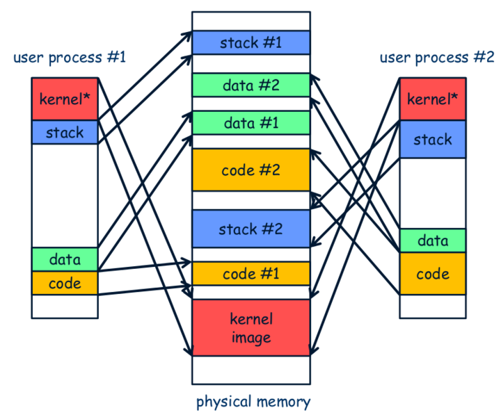
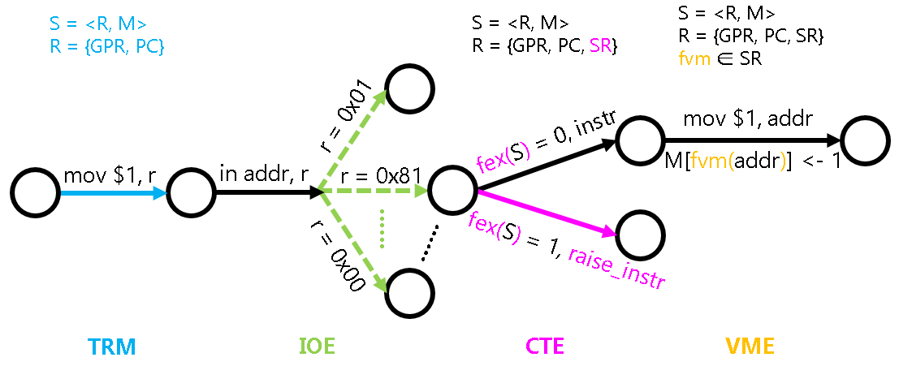

<!-- ## 超越容量的界限 -->

## За пределами ограничений ёмкости

<!-- 现代操作系统不使用分段还是有一定的道理的.
有[研究表明][interference], Google数据中心中的1000台服务器在7分钟内就运行了上千个不同的程序,
其中有的是巨大无比的家伙(Google内部开发程序的时候为了避免不同计算机上的动态库不兼容的问题,
用到的所有库都以静态链接的方式成为程序的一部分, 光是程序的代码段就有几百MB甚至上GB的大小,
感兴趣的同学可以阅读[这篇文章][warehouse scale computer]), 有的只是一些很小的测试程序. -->

У того, что современные операционные системы не используют сегментацию, есть свои резоны.
[Исследование][interference] показывает, что 1000 серверов в дата-центрах Google за 7 минут выполнили тысячи разных программ,
среди которых есть настоящие гиганты (при внутренней разработке программ в Google, чтобы избежать проблем несовместимости динамических библиотек на разных машинах,
все используемые библиотеки становятся частью программы через статическое связывание — один только сегмент кода программы может занимать сотни мегабайт, а то и гигабайты;
желающие могут прочитать [эту статью][warehouse scale computer]), а есть и совсем небольшие тестовые программы.

<!-- 让这些特征各异的程序都占用连续的存储空间并不见得有什么好处:
一方面, 那些巨大无比的家伙们在一次运行当中只会触碰到很小部分的代码,
其实没有必要分配那么多内存把它们全部加载进来;
另一方面, 小程序运行结束之后, 它占用的存储空间就算被释放了,
也很容易成为"碎片空洞" - 只有比它更小的程序才能把碎片空洞用起来.
分段机制的简单朴素, 在现实中也许要付出巨大的代价. -->

Заставлять все эти программы с настолько разными характеристиками занимать непрерывное пространство памяти — не такая уж хорошая идея:
с одной стороны, те самые гиганты за один запуск затрагивают лишь очень небольшую часть своего кода,
и на самом деле нет никакой необходимости выделять столько памяти, чтобы загрузить их целиком;
с другой стороны, после завершения работы маленькой программы освобождённое ею пространство памяти
легко превращается в «дыру-фрагмент» — использовать её сможет только программа ещё меньшего размера.
Простота и незамысловатость механизма сегментации в реальности может оборачиваться огромной ценой.

[interference]: http://arcade.cs.columbia.edu/interference-sc12.pdf
[warehouse scale computer]: https://static.googleusercontent.com/media/research.google.com/en//pubs/archive/44271.pdf

<!-- 事实上, 我们需要一种按需分配的虚存管理机制.
之所以分段机制不好实现按需分配, 就是因为段的粒度太大了,
为了实现这一目标, 我们需要反其道而行之:
把连续的存储空间分割成小片段, 以这些小片段为单位进行组织, 分配和管理.
这正是分页机制的核心思想. -->

На самом деле нам нужен механизм управления виртуальной памятью с выделением по требованию.
Причина, по которой механизму сегментации трудно реализовать выделение по требованию, — в том, что гранулярность сегмента слишком велика.
Чтобы достичь этой цели, нужно действовать наоборот:
разбить непрерывное пространство памяти на небольшие фрагменты и организовывать, выделять и управлять ими именно такими небольшими единицами.
Это и есть базовая идея механизма страничной организации (paging).

<!-- ### 分页 -->
### Страничная организация памяти

<!-- 在分页机制中, 这些小片段称为页面, 在虚拟地址空间和物理地址空间中也分别称为虚拟页和物理页.
分页机制做的事情, 就是把一个个的虚拟页分别映射到相应的物理页上.
显然, 这一映射关系并不像分段机制中只需要一个段基址寄存器就可以描述的那么简单.
分页机制引入了一个叫"页表"的结构, 页表中的每一个表项记录了一个虚拟页到物理页的映射关系,
来把不必连续的物理页面重新组织成连续的虚拟地址空间. -->

В механизме страничной организации эти небольшие фрагменты называются страницами, а в виртуальном и физическом адресном пространстве их называют соответственно виртуальными и физическими страницами.
Механизм страничной организации занимается тем, что отображает каждую виртуальную страницу на соответствующую физическую.
Очевидно, что эта связь отображения не так проста, как в механизме сегментации, который описывается всего одним регистром базового адреса сегмента.
Механизм страничной организации вводит структуру под названием «таблица страниц»: каждая запись в таблице страниц фиксирует связь отображения одной виртуальной страницы на физическую,
позволяя переорганизовать необязательно непрерывные физические страницы в непрерывное виртуальное адресное пространство.

<!-- 因此, 为了让分页机制支撑多任务操作系统的运行, 操作系统首先需要以物理页为单位对内存进行管理.
每当加载程序的时候, 就给程序分配相应的物理页(注意这些物理页之间不必连续),
并为程序准备一个新的页表, 在页表中填写程序用到的虚拟页到这些物理页的映射关系.
等到程序运行的时候, 操作系统就把之前为这个程序填写好的页表设置到MMU中,
MMU就会根据页表的内容进行地址转换, 把程序的虚拟地址空间映射到操作系统所希望的物理地址空间上. -->

Поэтому, чтобы механизм страничной организации мог поддерживать работу многозадачной операционной системы, ОС в первую очередь должна управлять памятью в единицах физических страниц.
При загрузке каждой программы ей выделяются соответствующие физические страницы (обратите внимание, что эти физические страницы не обязаны быть непрерывными),
и для программы готовится новая таблица страниц, в которую записывается отображение используемых программой виртуальных страниц на эти физические страницы.
Когда программа начинает выполняться, операционная система устанавливает заранее заполненную для неё таблицу страниц в MMU,
и MMU уже выполняет трансляцию адресов на основе содержимого таблицы страниц, отображая виртуальное адресное пространство программы на желаемое операционной системой физическое адресное пространство.



<!-- > #### question::虚存管理中PIC的好处
> 我们之前提到, PIC的其中一个好处是可以将代码加载到任意内存位置执行.
> 如果配合虚存管理, PIC还有什么新的好处呢? (Hint: 动态库已经在享受这些好处了) -->

> #### question:: Преимущества PIC в управлении виртуальной памятью
> Мы упоминали ранее, что одно из преимуществ PIC — возможность загружать код для выполнения в любом месте памяти.
> Если сочетать это с управлением виртуальной памятью, какие новые преимущества появятся у PIC? (Подсказка: динамические библиотеки уже пользуются этими преимуществами)

<!-- i386是x86史上首次引进分页机制的处理器, 它把物理内存划分成以4KB为单位的页面,
同时也采用了二级页表的结构.
为了方便叙述, i386给第一级页表取了个新名字叫"页目录".
虽然听上去很厉害, 但其实原理都是一样的.
每一张页目录和页表都有1024个表项, 每个表项的大小都是4字节,
除了包含页表(或者物理页)的基地址, 还包含一些标志位信息. -->

i386 — первый процессор в истории x86, введший механизм страничной организации: он делит физическую память на страницы по 4 КБ,
а также использует структуру двухуровневой таблицы страниц.
Для удобства описания i386 дал первому уровню таблицы страниц новое название — «каталог страниц» (page directory).
Звучит впечатляюще, но по сути принцип тот же самый.
У каждого каталога страниц и каждой таблицы страниц по 1024 записи, размер каждой записи — 4 байта;
помимо базового адреса таблицы страниц (или физической страницы), запись также содержит некоторую информацию в виде флаговых битов.

<!-- 因此, 一张页目录或页表的大小是4KB, 要放在寄存器中是不可能的, 因此它们要放在内存中.
为了找到页目录, i386提供了一个CR3(control register 3)寄存器, 专门用于存放页目录的基地址.
这样, 页级地址转换就从CR3开始一步一步地进行, 最终将虚拟地址转换成真正的物理地址,
这个过程称为一次page table walk. -->

Поэтому размер одного каталога страниц или таблицы страниц составляет 4 КБ — разместить их в регистре невозможно, значит, они должны находиться в памяти.
Чтобы найти каталог страниц, i386 предоставляет регистр CR3 (control register 3), специально предназначенный для хранения базового адреса каталога страниц.
Таким образом, постраничная трансляция адреса выполняется пошагово начиная с CR3 и в итоге преобразует виртуальный адрес в настоящий физический;
этот процесс называется page table walk (обход таблицы страниц).
```
                                                              PAGE FRAME
              +-----------+-----------+----------+         +---------------+
              |    DIR    |   PAGE    |  OFFSET  |         |               |
              +-----+-----+-----+-----+-----+----+         |               |
                    |           |           |              |               |
      +-------------+           |           +------------->|    PHYSICAL   |
      |                         |                          |    ADDRESS    |
      |   PAGE DIRECTORY        |      PAGE TABLE          |               |
      |  +---------------+      |   +---------------+      |               |
      |  |               |      |   |               |      +---------------+
      |  |               |      |   |---------------|              ^
      |  |               |      +-->| PG TBL ENTRY  |--------------+
      |  |---------------|          |---------------|
      +->|   DIR ENTRY   |--+       |               |
         |---------------|  |       |               |
         |               |  |       |               |
         +---------------+  |       +---------------+
                 ^          |               ^
+-------+        |          +---------------+
|  CR3  |--------+
+-------+
```

<!-- 我们不打算给出分页过程的详细解释, 请你结合i386手册的内容和课堂上的知识,
尝试理解i386分页机制, 这也是作为分页机制的一个练习.
i386手册中包含你想知道的所有信息, 包括这里没有提到的表项结构, 地址如何划分等. -->

Мы не собираемся давать подробного объяснения процесса постраничной трансляции — попробуйте, опираясь на содержание руководства по i386 и знания, полученные на занятиях,
разобраться в механизме страничной организации i386 самостоятельно, это тоже своего рода упражнение по страничной организации.
Руководство по i386 содержит всю информацию, которая может вам понадобиться, включая не упомянутую здесь структуру записей таблицы, способ деления адреса и так далее.

<!-- > #### question::理解分页细节
> * i386不是一个32位的处理器吗, 为什么表项中的基地址信息只有20位, 而不是32位?
> * 手册上提到表项(包括CR3)中的基地址都是物理地址, 物理地址是必须的吗? 能否使用虚拟地址?
> * 为什么不采用一级页表? 或者说采用一级页表会有什么缺点? -->

> #### question:: Разберитесь в деталях страничной организации
> * Разве i386 не 32-битный процессор? Почему информация о базовом адресе в записи составляет всего 20 бит, а не 32?
> * В руководстве упоминается, что базовые адреса в записях (включая CR3) — это физические адреса. Обязательно ли использовать физический адрес? Можно ли использовать виртуальный?
> * Почему не используется одноуровневая таблица страниц? Или какие недостатки были бы у одноуровневой таблицы страниц?

<!-- 页级转换的过程并不总是成功的, 因为i386也提供了页级保护机制, 实现保护功能就要靠表项中的标志位了.
我们对一些标志位作简单的解释:
* present位表示物理页是否可用, 不可用的时候又分两种情况:
  1. 物理页面由于交换技术被交换到磁盘中了, 这就是你在课堂上最熟悉的Page fault的情况之一了,
     这时候可以通知操作系统内核将目标页面换回来, 这样就能继续执行了
  1. 进程试图访问一个未映射的线性地址, 并没有实际的物理页与之相对应, 因此这就是一个非法操作咯
* R/W位表示物理页是否可写, 如果对一个只读页面进行写操作, 就会被判定为非法操作
* U/S位表示访问物理页所需要的权限, 如果一个ring 3的进程尝试访问一个ring 0的页面, 当然也会被判定为非法操作 -->

Процесс постраничной трансляции не всегда завершается успешно, поскольку i386 также предоставляет механизм защиты на уровне страниц, и реализация функций защиты опирается как раз на флаговые биты в записях.
Дадим краткое объяснение некоторым флаговым битам:
* Бит present показывает, доступна ли физическая страница; когда она недоступна, различают два случая:
  1. Физическая страница была вытеснена на диск с помощью технологии свопинга — это одна из самых знакомых вам по занятиям ситуаций Page fault (отказа страницы);
     в этом случае можно уведомить ядро операционной системы, чтобы оно вернуло целевую страницу обратно, после чего выполнение продолжится
  1. Процесс пытается обратиться к неотображённому линейному адресу, которому не соответствует никакая реальная физическая страница, — и это, соответственно, недопустимая операция
* Бит R/W показывает, доступна ли физическая страница для записи; если производится запись в страницу, доступную только для чтения, это будет расценено как недопустимая операция
* Бит U/S показывает уровень привилегий, необходимый для обращения к физической странице; если процесс с ring 3 попытается обратиться к странице ring 0, это, разумеется, тоже будет расценено как недопустимая операция

<!-- > #### todo::理解分页机制
> 上文只介绍了i386的分页机制, 事实上, 其它ISA的分页机制也是大同小异,
> 理解了i386分页机制之后, mips32和riscv32的分页机制也就不难理解了.
>
> 当然, 具体细节还是得RTFM. -->

> #### todo:: Разберитесь в механизме страничной организации
> Выше был описан только механизм страничной организации i386; на самом деле механизмы страничной организации других ISA во многом схожи —
> разобравшись в механизме страничной организации i386, вы без труда разберётесь и в механизмах страничной организации mips32 и riscv32.
>
> Разумеется, за конкретными деталями всё равно нужно обращаться к RTFM.

<!-- -->
<!-- > #### comment::riscv64需要实现三级页表
> riscv32的Sv32机制只能对32位的虚拟地址进行地址转换, 但riscv64的虚拟地址最长是64位,
> 因此需要有另外的机制来支持更长的虚拟地址的地址转换.
> 在PA中, 如果你选择了riscv64, 那只需要实现Sv39三级页表的分页机制即可,
> 而且PA只会使用4KB小页面, 不会使用2MB的大页面, 因此你无需实现Sv39的大页面功能.
> 具体细节请RTFM. -->

> #### comment:: riscv64 требует реализации трёхуровневой таблицы страниц
> Механизм Sv32 в riscv32 может транслировать только 32-битные виртуальные адреса, но у riscv64 виртуальный адрес может достигать 64 бит,
> поэтому нужен другой механизм для трансляции более длинных виртуальных адресов.
> В PA, если вы выбрали riscv64, вам достаточно реализовать механизм страничной организации Sv39 с трёхуровневой таблицей страниц,
> при этом в PA будут использоваться только маленькие страницы по 4 КБ, а не большие страницы по 2 МБ, так что реализовывать функциональность больших страниц Sv39 не нужно.
> За конкретными деталями обращайтесь к RTFM.

<!-- -->
<!-- > #### question::空指针真的是"空"的吗?
> 程序设计课上老师告诉你, 当一个指针变量的值等于NULL时, 代表空, 不指向任何东西.
> 仔细想想, 真的是这样吗? 当程序对空指针解引用的时候, 计算机内部具体都做了些什么?
> 你对空指针的本质有什么新的认识? -->

> #### question:: А правда ли нулевой указатель — «пустой»?
> На курсе программирования преподаватель говорил вам, что когда значение переменной-указателя равно NULL, это означает «пусто», указатель никуда не указывает.
> Подумайте внимательно — действительно ли это так? Что именно происходит внутри компьютера, когда программа разыменовывает нулевой указатель?
> Появилось ли у вас новое понимание сущности нулевого указателя?

<!-- 和分段机制相比, 分页机制更灵活, 甚至可以使用超越物理地址上限的虚拟地址.
现在我们从数学的角度来理解这两点.
撇去存储保护机制不谈, 我们可以把这分段和分页的过程分别抽象成两个数学函数: -->

По сравнению с механизмом сегментации, механизм страничной организации более гибкий — можно даже использовать виртуальные адреса, превышающие верхнюю границу физического адреса.
Сейчас мы разберёмся с этими двумя моментами с математической точки зрения.
Оставив в стороне механизм защиты памяти, мы можем абстрагировать процессы сегментации и страничной организации в виде двух математических функций:
```
  y = seg(x) = seg.base + x
  y = page(x)
```

<!-- 可以看到, `seg()`函数只不过是做加法.
如果仅仅使用分段机制, 我们还要求段级地址转换的结果不能超过物理地址上限: -->

Как видно, функция `seg()` — это просто сложение.
Если использовать только механизм сегментации, мы дополнительно требуем, чтобы результат сегментной трансляции адреса не превышал верхнюю границу физического адреса:
```
   y = seg(x) = seg.base + x < PMEM_MAX
=> x < PMEM_MAX - seg.base
=> x <= PMEM_MAX
```

<!-- 我们可以得出这样的结论: 仅仅使用分段机制, 虚拟地址是无法超过物理地址上限的.
而分页机制就不一样了, 我们无法给出`page()`具体的解析式,
是因为填写页目录和页表实际上就是在用枚举自变量的方式定义`page()`函数,
这就是分页机制比分段机制灵活的根本原因. -->

Отсюда можно сделать вывод: используя только механизм сегментации, виртуальный адрес не может превышать верхнюю границу физического адреса.
С механизмом страничной организации всё иначе — мы не можем дать для `page()` конкретную аналитическую формулу,
потому что заполнение каталога страниц и таблицы страниц по сути и есть определение функции `page()` путём перечисления значений аргумента.
Это и есть коренная причина, по которой механизм страничной организации гибче механизма сегментации.

<!-- 虽然"页级地址转换结果不能超过物理地址上限"的约束仍然存在,
但我们只要保证每一个函数值都不超过物理地址上限即可,
并没有对自变量的取值作明显的限制, 当然自变量本身也就可以比函数值还大.
这就已经把分页的"灵活"和"允许使用超过物理地址上限"这两点特性都呈现出来了. -->

Хотя ограничение «результат постраничной трансляции адреса не может превышать верхнюю границу физического адреса» по-прежнему действует,
нам достаточно гарантировать, что каждое значение функции не превышает эту верхнюю границу;
явных ограничений на значения аргумента при этом нет, и, разумеется, сам аргумент вполне может быть больше значения функции.
Тем самым уже проявляются обе особенности страничной организации — «гибкость» и «возможность использовать значения, превышающие верхнюю границу физического адреса».

<!-- i386采用段页式存储管理机制.
不过仔细想想, 这只不过是把分段和分页结合起来罢了, 用数学函数来理解, 也只不过是个复合函数: -->

i386 использует сегментно-страничный механизм управления памятью.
Впрочем, если подумать, это лишь сочетание сегментации и страничной организации — с точки зрения математических функций это просто сложная (композитная) функция:
```
paddr = page(seg(vaddr))
```

<!-- 而"虚拟地址空间"和"物理地址空间"这两个在操作系统中无比重要的概念,
也只不过是这个复合函数的定义域和值域而已. -->

А такие бесконечно важные в операционных системах понятия, как «виртуальное адресное пространство» и «физическое адресное пространство», —
это, по сути, всего лишь область определения и область значений этой сложной функции.

<!-- 最后, 支持分页机制的处理器能识别什么是页表吗?
我们以一个页面大小为1KB的一级页表的地址转换例子来认识这个问题: -->

Наконец, распознаёт ли процессор, поддерживающий механизм страничной организации, что такое таблица страниц?
Разберёмся в этом вопросе на примере трансляции адреса при одноуровневой таблице страниц с размером страницы 1 КБ:
```c
pa = (pg_table[va >> 10] & ~0x3ff) | (va & 0x3ff);
```

<!-- 可以看到, 处理器并没有表的概念: 地址转换的过程只不过是一些访存和位操作而已.
这再次向我们展示了计算机的本质:
一堆美妙的, 蕴含着深刻数学智慧和工程原理的... 门电路!
然而这些小小的门电路操作却成为了今天多任务操作系统的根基,
支撑着千千万万程序的运行, 归根到底还是离不开计算机系统抽象的核心思想. -->

Как видно, у процессора нет никакого понятия «таблица»: процесс трансляции адреса — это всего лишь несколько операций обращения к памяти и битовых операций.
Это снова показывает нам суть компьютера:
кучу изумительных, наполненных глубокой математической мудростью и инженерными принципами... логических вентилей!
И всё же эти крошечные операции логических вентилей стали фундаментом сегодняшних многозадачных операционных систем,
на которых держится работа бесчисленных программ, — и в конечном счёте всё это неотделимо от главной идеи абстракции компьютерных систем.

<!-- ### 状态机视角下的虚存管理机制 -->

### Механизм управления виртуальной памятью с точки зрения конечного автомата

<!-- 从状态机视角来看, 虚存管理机制是什么呢? -->

С точки зрения конечного автомата, что же такое механизм управления виртуальной памятью?

<!-- 为了描述虚存管理机制在状态机视角的行为, 我们需要对状态机`S = <R, M>`的访存行为进行扩展.
具体地, 我们需要增加一个函数`fvm: M -> M`, 它就是我们上文讨论的地址转换的映射,
然后把状态机中所有对`M`的访问`M[addr]`替换成`M[fvm(addr)]`, 就是虚存管理机制的行为.
例如指令`mov $1, addr`, 在虚存机制关闭时, 它的行为是TRM定义的: -->

Чтобы описать поведение механизма управления виртуальной памятью с точки зрения конечного автомата, нам нужно расширить поведение обращения к памяти конечного автомата `S = <R, M>`.
А именно: нужно добавить функцию `fvm: M -> M`, которая как раз и есть обсуждавшееся выше отображение трансляции адреса,
и затем заменить все обращения `M[addr]` к `M` в конечном автомате на `M[fvm(addr)]` — это и есть поведение механизма управления виртуальной памятью.
Например, инструкция `mov $1, addr` при выключенном механизме виртуальной памяти ведёт себя так, как определено в TRM:
```
M[addr] <- 1
```
<!-- 而在虚存机制打开时, 它的行为则是: -->

А при включённом механизме виртуальной памяти её поведение таково:
```
M[fvm(addr)] <- 1
```

<!-- 我们刚才已经讨论过, 地址转换的过程可以通过访存和位操作来实现,
这说明`fvm()`函数的行为也是可以通过状态机视角来描述的. -->

Мы только что обсудили, что процесс трансляции адреса можно реализовать через операции обращения к памяти и битовые операции —
это показывает, что поведение функции `fvm()` тоже можно описать с точки зрения конечного автомата.



<!-- 比较特殊的是`fvm()`这个函数. 回顾PA3介绍的状态机模型中引入的`fex()`函数,
它实际上并不属于状态机的一部分, 因为抛出异常的判断方式是和状态机的具体状态无关的.
而`fvm()`函数则有所不同, 它可以看做是是状态机的一部分,
这是因为`fvm()`函数是可以通过程序进行修改的: 操作系统可以决定如何建立虚拟地址和物理地址之间的映射.
具体地, `fvm()`函数可以认为是系统寄存器`SR`的一部分, 操作系统通过修改`SR`来对虚存进行管理. -->

Особый случай — функция `fvm()`. Вспомним функцию `fex()`, введённую в модели конечного автомата из PA3:
на самом деле она не является частью конечного автомата, поскольку способ определения того, выбрасывается ли исключение, не зависит от конкретного состояния конечного автомата.
А вот функция `fvm()` отличается — её можно считать частью конечного автомата,
поскольку функцию `fvm()` можно изменять программно: операционная система может решать, как выстроить отображение между виртуальными и физическими адресами.
Если конкретнее, функцию `fvm()` можно считать частью системного регистра `SR`, и операционная система управляет виртуальной памятью, изменяя `SR`.

<!-- ### TLB - 地址转换的加速 -->

### TLB — ускорение трансляции адреса

<!-- 细心的你会发现, 在不改变页目录基地址, 页目录和页表的情况下,
如果连续访问同一个虚拟页的内容, 页级地址转换的结果都是一样的.
事实上, 这种情况太常见了, 例如程序执行的时候需要取指令,
而指令的执行一般都遵循局部性原理, 大多数情况下都在同一个虚拟页中执行.
但进行page table walk是要访问内存的, 如果有方法可以避免这些没有必要的page table walk,
就可以提高处理器的性能了. -->

Внимательный читатель заметит: если не менять базовый адрес каталога страниц, сам каталог страниц и таблицу страниц, а несколько раз подряд обращаться к содержимому одной и той же виртуальной страницы, результат постраничной трансляции адреса будет одним и тем же.
На самом деле такая ситуация встречается очень часто — например, при выполнении программы нужно выбирать инструкции,
а выполнение инструкций обычно подчиняется принципу локальности, и в большинстве случаев выполняется в пределах одной и той же виртуальной страницы.
Но выполнение page table walk требует обращения к памяти, и если найти способ избежать таких ненужных page table walk,
можно повысить производительность процессора.

<!-- 一个很自然的想法就是将页级地址转换的结果存起来,
在进行下一次的页级地址转换之前, 看看这个虚拟页是不是已经转换过了,
如果是, 就直接取出之前的结果, 这样就可以节省不必要的page table walk了.
这不正好是cache的思想吗? 这样一个特殊的cache, 叫TLB.
我们可以从CPU cache的知识来理解TLB的组织: -->

Естественная идея — сохранять результаты постраничной трансляции адреса,
и перед выполнением следующей постраничной трансляции проверять, не была ли эта виртуальная страница уже транслирована;
если да — просто взять готовый прежний результат, тем самым избежав ненужного page table walk.
Разве это не в точности идея кэша? Такой особый кэш называется TLB.
Организацию TLB можно понять, опираясь на знания о кэше CPU:

<!-- * TLB的基本单元是项, 一项存放了一次页级地址转换的结果
(其实就是一个页表项, 包括物理页号和一些和物理页相关的标志位), 功能上相当于一个cache block.
* TLB项的tag由虚拟页号来充当, 表示这一项对应于哪一个虚拟页号.
* TLB的项数一般不多, 为了提高命中率, TLB一般采用全相联或者组相联的组织方式.
* 由于页目录和页表一旦建立之后, 一般不会随意修改其中的表项, 因此TLB不存在写策略和写分配方式的问题. -->

* Базовая единица TLB — запись (item), одна запись хранит результат одной постраничной трансляции адреса
(на самом деле это просто запись таблицы страниц, включающая номер физической страницы и некоторые флаговые биты, связанные с ней); функционально она соответствует блоку кэша (cache block).
* Роль тега записи TLB играет номер виртуальной страницы, показывающий, какому номеру виртуальной страницы соответствует эта запись.
* Количество записей в TLB обычно невелико; чтобы повысить процент попаданий, TLB обычно организуют по полностью ассоциативной либо множественно-ассоциативной схеме.
* Поскольку после создания каталога страниц и таблицы страниц их записи обычно не меняются произвольно, для TLB не возникает вопроса стратегии записи и способа выделения при записи.

<!-- 实践表明, 大小64项的TLB, 命中率可以高达90%, 有了TLB之后, 果然大大节省了不必要的page table walk. -->

Практика показывает, что TLB на 64 записи может давать процент попаданий вплоть до 90%; с появлением TLB действительно удаётся сильно сэкономить на ненужных page table walk.

<!-- 听上去真不错!
不过在现代的多任务操作系统中, 如果仅仅简单按照上述方式来使用TLB, 却会导致致命的后果.
我们知道, 操作系统会为每个进程分配不同的页目录和页表, 虽然两个进程可能都会从0x8048000开始执行,
但分页机制会把它们映射到不同的物理页, 从而做到存储空间的隔离.
当然, 操作系统进行进程切换的时候也需要更新CR3的内容,
使得CR3寄存器指向新进程的页目录, 这样才能保证分页机制将虚拟地址映射到新进程的物理存储空间. -->

Звучит и правда неплохо!
Однако в современных многозадачных операционных системах, если использовать TLB просто по описанной выше схеме без каких-либо доработок, это приведёт к фатальным последствиям.
Мы знаем, что операционная система выделяет каждому процессу отдельные каталог страниц и таблицу страниц; хотя оба процесса могут начинать выполнение с адреса 0x8048000,
механизм страничной организации отображает их на разные физические страницы, тем самым обеспечивая изоляцию пространства памяти.
Разумеется, при переключении процессов операционная система также должна обновлять содержимое CR3,
заставляя регистр CR3 указывать на каталог страниц нового процесса, — только так можно гарантировать, что механизм страничной организации отобразит виртуальный адрес на физическое пространство памяти нового процесса.

<!-- 现在问题来了, 假设有两个进程, 对于同一个虚拟地址0x8048000,
操作系统已经设置好正确的页目录和页表, 让1号进程映射到物理地址0x1234000,
2号进程映射到物理地址0x5678000, 同时假设TLB一开始所有项都被置为无效.
这时1号进程先运行, 访问虚拟地址0x8048000, 查看TLB发现未命中, 于是进行page table walk,
根据1号进程的页目录和页表进行页级地址转换, 得到物理地址0x1234000, 并填充TLB.
假设此时发生了进程切换, 轮到2号进程来执行, 它也要访问虚拟地址0x8048000, 查看TLB,
发现命中, 于是不进行page table walk, 而是直接使用TLB中的物理页号, 得到物理地址0x1234000.
2号进程竟然访问了1号进程的存储空间, 但2号进程和操作系统对此都毫不知情! -->

А теперь вот в чём проблема: предположим, есть два процесса, и для одного и того же виртуального адреса 0x8048000
операционная система уже настроила правильные каталог страниц и таблицу страниц, так что процесс №1 отображается на физический адрес 0x1234000,
а процесс №2 — на физический адрес 0x5678000; при этом предположим, что изначально все записи TLB помечены как недействительные.
В этот момент сначала выполняется процесс №1: он обращается к виртуальному адресу 0x8048000, проверяет TLB — промах, поэтому выполняется page table walk,
на основе каталога страниц и таблицы страниц процесса №1 выполняется постраничная трансляция адреса, получается физический адрес 0x1234000, и TLB заполняется этой записью.
Предположим, в этот момент происходит переключение процессов, и настаёт очередь выполняться процессу №2: ему тоже нужно обратиться к виртуальному адресу 0x8048000, он проверяет TLB —
обнаруживается попадание, поэтому page table walk не выполняется, а напрямую используется номер физической страницы из TLB, получая физический адрес 0x1234000.
Процесс №2, оказывается, обратился к пространству памяти процесса №1, но ни процесс №2, ни операционная система об этом даже не подозревают!

<!-- 出现这个致命错误的原因是, TLB没有维护好进程和虚拟地址映射关系的一致性:
TLB只知道有一个从虚拟地址0x8048000到物理地址0x1234000的映射关系,
但它并不知道这个映射关系是属于哪一个进程的.
找到问题的原因之后, 解决它也就很容易了, 只要在TLB项中增加一个域ASID(address space ID),
用于指示映射关系所属的进程即可, mips32就是这样做的.
x86的做法则比较"野蛮", 在每次更新CR3时强制冲刷TLB的内容,
由于进程切换必定伴随着CR3的更新, 因此一个进程运行的时候, TLB中不会存在其它进程的映射关系.
当然, 为了防止冲刷过猛, 页表项中有一个Global位, 那些Global位为1的映射关系则不会被冲刷,
比如可以把内核中`do_syscall()`所在的页面的Global位设置为1,
这样系统调用的处理过程就不会出现TLB miss了. -->

Причина этой фатальной ошибки — в том, что TLB не поддерживает согласованность между процессом и связью отображения виртуального адреса:
TLB знает лишь, что существует связь отображения от виртуального адреса 0x8048000 к физическому адресу 0x1234000,
но не знает, какому процессу принадлежит эта связь.
Найдя причину проблемы, решить её несложно — достаточно добавить в запись TLB поле ASID (address space ID, идентификатор адресного пространства),
указывающее, какому процессу принадлежит связь отображения; именно так поступает mips32.
Подход x86 более «варварский» — при каждом обновлении CR3 принудительно сбрасывать (flush) содержимое TLB целиком.
Поскольку переключение процессов обязательно сопровождается обновлением CR3, во время работы одного процесса в TLB не будет связей отображения других процессов.
Разумеется, чтобы не сбрасывать слишком агрессивно, в записи таблицы страниц есть бит Global — связи отображения с битом Global равным 1 не сбрасываются;
например, можно установить бит Global равным 1 для страницы, где находится `do_syscall()` в ядре,
и тогда при обработке системных вызовов TLB miss происходить не будет.

<!-- ### 软件管理的TLB -->

### TLB, управляемый программно

<!-- 对于x86和riscv32来说, TLB一般都是由硬件来负责管理的:
当TLB miss时, 硬件逻辑会自动进行page table walk, 并将地址转换结果填充到TLB中,
软件不知道也无需知道这一过程的细节.
对PA来说, 这是一个好消息: 既然对软件透明, 那么就可以简化了.
因此如果你选择了x86或者riscv32, 你不必在NEMU中实现TLB. -->

Для x86 и riscv32 TLB обычно управляется аппаратно:
при TLB miss аппаратная логика автоматически выполняет page table walk и заполняет TLB результатом трансляции адреса,
а программное обеспечение не знает и не должно знать детали этого процесса.
Для PA это хорошая новость: раз это прозрачно для программного обеспечения, значит, можно упростить задачу.
Поэтому если вы выбрали x86 или riscv32, реализовывать TLB в NEMU вам не нужно.

<!-- 但mips32就不一样了, 为了降低硬件设计的复杂度,
mips32规定, page table walk和TLB填充都由软件来负责.
很自然地, 在mips32中, TLB miss被设计成一种异常:
当TLB miss时, CPU将会抛出异常, 由软件来进行page table walk和TLB填充. -->

А вот mips32 отличается: чтобы снизить сложность аппаратного проектирования,
mips32 определяет, что и page table walk, и заполнение TLB — забота программного обеспечения.
Естественно, что в mips32 TLB miss оформлен как исключение:
при TLB miss CPU выбрасывает исключение, а page table walk и заполнение TLB выполняет программное обеспечение.

<!-- 于是mips32需要把TLB的状态暴露给软件, 让软件可以来对TLB进行管理.
为了实现这一点, mips32至少需要添加以下内容:
* CP0寄存器, 包括entryhi, entrylo0, entrylo1, index这四个寄存器.
其中entryhi寄存器存放虚拟页号相关的信息, entrylo0寄存器和entrylo1寄存器存放物理页号相关的信息.
* CP0指令
  * tlbp, 用于寻找与entryhi寄存器中匹配的TLB项, 若找到, 则将index寄存器设置为该TLB项的序号
  * tlbwi, 用于将entryhi, entrylo0和entrylo1这三个寄存器的内容写入到index序号所指示的TLB项中
  * tlbwr, 用于将entryhi, entrylo0和entrylo1这三个寄存器的内容写入到随机一个TLB项中
  * 让mtc0和mfc0支持上述四个CP0寄存器的访问 -->

Поэтому mips32 нужно предоставить состояние TLB программному обеспечению, чтобы оно могло управлять TLB.
Чтобы этого добиться, mips32 требует добавить как минимум следующее:
* Регистр CP0, включающий четыре регистра: entryhi, entrylo0, entrylo1, index.
Регистр entryhi хранит информацию, связанную с номером виртуальной страницы, а регистры entrylo0 и entrylo1 хранят информацию, связанную с номером физической страницы.
* Инструкции CP0
  * tlbp — используется для поиска записи TLB, совпадающей с содержимым регистра entryhi; если найдена, регистр index устанавливается равным порядковому номеру этой записи TLB
  * tlbwi — используется для записи содержимого трёх регистров entryhi, entrylo0 и entrylo1 в запись TLB, на которую указывает порядковый номер index
  * tlbwr — используется для записи содержимого трёх регистров entryhi, entrylo0 и entrylo1 в случайную запись TLB
  * заставить mtc0 и mfc0 поддерживать доступ к указанным выше четырём регистрам CP0

<!-- > #### question::mips32的TLB管理是否更简单?
> 有一种观点认为, mips32的分页机制更简单. 你认同吗?
> 尝试分别在现在, 以及完成这部分内容之后回答这个问题. -->

> #### question:: Проще ли управление TLB в mips32?
> Есть мнение, что механизм страничной организации в mips32 проще. Согласны ли вы с этим?
> Попробуйте ответить на этот вопрос как сейчас, так и после завершения этого раздела.

<!-- TLB管理是一个考量软硬件tradeoff的典型例子,
mips32把这件事交给软件来做, 毫无疑问会引入额外的性能开销.
在一些性能不太重要的嵌入式场景中, 这并不会有什么大问题;
但如果是在一些面向高性能的场景中, 这种表面上简单的机制就成为了性能瓶颈的来源:
例如在数据中心场景中, 程序需要访问的数据非常多, 局部性也很差,
TLB miss是非常常见的现象, 这种情况下, 软件管理TLB的性能开销就会被进一步放大. -->

Управление TLB — типичный пример компромисса (tradeoff) между программным и аппаратным подходом.
mips32 поручает эту задачу программному обеспечению, что, безусловно, вносит дополнительные накладные расходы на производительность.
В некоторых встраиваемых сценариях, где производительность не так критична, это не создаёт больших проблем;
но в сценариях, ориентированных на высокую производительность, этот с виду простой механизм становится источником узкого места:
например, в сценариях дата-центров программам нужно обращаться к очень большому объёму данных, локальность там довольно плохая,
TLB miss — весьма частое явление, и в таких условиях накладные расходы на программное управление TLB ещё больше усиливаются.

<!-- 在mips32中, 为了进一步降低page table walk带来的性能开销,
一个TLB表项其实管理的是连续两个虚拟页面的映射关系,
于是物理页号相关的寄存器有entrylo0和entrylo1两个,
分别用于表示这两个虚拟页面对应的物理页号.
具体地, 假设虚拟地址和物理地址的长度都是32位, 并采用4KB页面大小,
那么entryhi寄存器中的虚拟页号则是19位, entrylo0和entrylo1寄存器中的物理页号为20位.
这样的好处是, 在一次page table walk中可以同时填充两个虚拟页面的地址转换结果,
期望通过程序的局部性获得一些性能收益.
不过在数据中心场景面前, 这都是杯水车薪了. -->

В mips32, чтобы дополнительно снизить накладные расходы на производительность из-за page table walk,
одна запись TLB на самом деле управляет связью отображения сразу двух соседних виртуальных страниц,
поэтому регистров, связанных с номером физической страницы, тоже два — entrylo0 и entrylo1,
каждый из которых показывает номер физической страницы, соответствующий одной из этих двух виртуальных страниц.
Если конкретнее: если предположить, что и виртуальный, и физический адрес имеют длину 32 бита, а размер страницы — 4 КБ,
то номер виртуальной страницы в регистре entryhi занимает 19 бит, а номера физических страниц в регистрах entrylo0 и entrylo1 — по 20 бит каждый.
Преимущество такого подхода в том, что за один page table walk можно одновременно заполнить результаты трансляции адреса для двух виртуальных страниц,
в надежде получить некоторую выгоду в производительности за счёт локальности программы.
Впрочем, перед лицом сценариев дата-центров всё это — капля в море.

<!-- ## 将虚存管理抽象成VME -->

## Абстрагируем управление виртуальной памятью в VME

<!-- 虚存管理的具体实现自然是架构相关的, 比如在x86中用于存放页目录基地址的CR3,
在riscv32上并不叫这个名字, 访问这个寄存器的指令自然也各不相同.
再者, 不同架构中的页面大小可能会有差异, 页表项的结构也不尽相同,
更不用说有的架构还可能有多于两级的页表结构了.
于是, 我们可以将虚存管理的功能划入到AM的一类新的API中,
名字叫VME(Virtual Memory Extension). -->

Конкретная реализация управления виртуальной памятью, естественно, зависит от архитектуры: например, в x86 регистр CR3 используется для хранения базового адреса каталога страниц,
а в riscv32 он называется иначе, и, соответственно, инструкции для доступа к этому регистру тоже разные.
Кроме того, размер страницы в разных архитектурах может различаться, структура записи таблицы страниц тоже не одинакова,
не говоря уже о том, что в некоторых архитектурах структура таблицы страниц может иметь больше двух уровней.
Поэтому мы можем отнести функциональность управления виртуальной памятью к новой категории API в AM,
называемой VME (Virtual Memory Extension).

<!-- 老规矩, 我们来考虑如何将虚存管理的功能抽象成统一的API.
换句话说, 虚存机制的本质究竟是什么呢?
我们在上文已经讨论过这个问题了: 虚存机制, 说白了就是个映射(或函数).
也就是说, 本质上虚存管理要做的事情, 就是在维护这个映射.
但这个映射应该是每个进程都各自维护一份, 因此我们需要如下的两个API: -->

По заведённой традиции подумаем, как абстрагировать функциональность управления виртуальной памятью в единый API.
Другими словами, в чём же на самом деле заключается суть механизма виртуальной памяти?
Мы уже обсуждали этот вопрос выше: механизм виртуальной памяти, попросту говоря, — это отображение (или функция).
То есть по сути задача управления виртуальной памятью сводится к поддержанию этого отображения.
Но такое отображение должно поддерживаться отдельно для каждого процесса, поэтому нам нужны следующие два API:

<!-- ```c
// 创建一个默认的地址空间
void protect(AddrSpace *as);

// 销毁指定的地址空间
void unprotect(AddrSpace *as);
``` -->

```c
// Create a default address space
void protect(AddrSpace *as);

// Destroy a default address space
void unprotect(AddrSpace *as);
```

<!-- 其中`AddrSpace`是一个结构体类型, 定义了地址空间描述符的结构(在`abstract-machine/am/include/am.h`中定义): -->

Здесь `AddrSpace` — структурный тип, определяющий структуру дескриптора адресного пространства (определён в `abstract-machine/am/include/am.h`):

```c
typedef struct AddrSpace {
  int pgsize;
  Area area;
  void *ptr;
} AddrSpace;
```
<!-- 其中`pgsize`用于指示页面的大小, `area`表示虚拟地址空间中用户态的范围,
`ptr`是一个ISA相关的地址空间描述符指针, 用于指示具体的映射. -->

Здесь `pgsize` указывает размер страницы, `area` обозначает диапазон пользовательского режима в виртуальном адресном пространстве,
а `ptr` — это зависящий от ISA указатель дескриптора адресного пространства, используемый для указания конкретного отображения.

<!-- 有了地址空间, 我们还需要有相应的API来维护它们. 于是很自然就有了如下的API: -->

Раз есть адресное пространство, нам также нужны соответствующие API для его поддержания. Отсюда естественным образом появляется следующий API:
```c
void map(AddrSpace *as, void *va, void *pa, int prot);
```
<!-- 它用于将地址空间`as`中虚拟地址`va`所在的虚拟页,
以`prot`的权限映射到`pa`所在的物理页.
当`prot`中的present位为`0`时, 表示让`va`的映射无效.
由于我们不打算实现保护机制, 因此权限`prot`暂不使用. -->

Он используется для того, чтобы отобразить виртуальную страницу, в которой находится виртуальный адрес `va` в адресном пространстве `as`,
на физическую страницу, в которой находится `pa`, с правами `prot`.
Когда бит present в `prot` равен `0`, это означает, что отображение `va` становится недействительным.
Поскольку мы не планируем реализовывать механизм защиты, права `prot` пока не используются.

<!-- VME的主要功能已经通过上述三个API抽象出来了.
最后还有另外两个统一的API: -->

Основная функциональность VME уже абстрагирована через три указанных выше API.
И наконец, есть ещё два унифицированных API:

* `bool vme_init(void *(*pgalloc_f)(int), void (*pgfree_f)(void *))`
<!-- 用于进行VME相关的初始化操作. 其中它还接受两个来自操作系统的页面分配回调函数的指针,
让AM在必要的时候通过这两个回调函数来申请/释放一页物理页. -->

Используется для выполнения инициализационных операций, связанных с VME. Кроме того, он принимает два указателя на функции обратного вызова для выделения страниц, предоставленные операционной системой,
позволяя AM при необходимости через эти два обратных вызова запрашивать/освобождать физическую страницу.

* `Context* ucontext(AddrSpace *as, Area kstack, void *entry)`
<!-- 用于创建用户进程上下文. 我们之前已经介绍过这个API, 但加入虚存管理之后,
我们需要对这个API的实现进行一些改动, 具体改动会在下文介绍. -->

Используется для создания контекста пользовательского процесса. Мы уже рассматривали этот API ранее, но после добавления управления виртуальной памятью
нам нужно внести некоторые изменения в его реализацию — конкретные изменения будут описаны ниже.

<!-- 下面我们来介绍Nanos-lite如何使用VME提供的机制. -->

Далее мы расскажем, как Nanos-lite использует механизм, предоставляемый VME.

<!-- ### 在分页机制上运行Nanos-lite -->

### Запуск Nanos-lite поверх механизма страничной организации

<!-- 由于页表位于内存中, 但计算机启动的时候, 内存中并没有有效的数据,
因此我们不可能让计算机启动的时候就开启分页机制.
操作系统为了启动分页机制, 首先需要准备一些内核页表.
框架代码已经为我们实现好这一功能了(见`abstract-machine/am/src/$ISA/nemu/vme.c`的`vme_init()`函数).
只需要在`nanos-lite/include/common.h`中定义宏`HAS_VME`,
Nanos-lite在初始化的时候首先就会调用`init_mm()`函数(在`nanos-lite/src/mm.c`中定义)来初始化MM.
这里的MM是指存储管理器(Memory Manager)模块, 它专门负责分页相关的存储管理. -->

Поскольку таблица страниц находится в памяти, а в момент запуска компьютера в памяти нет никаких действительных данных,
мы не можем включить механизм страничной организации сразу при запуске компьютера.
Чтобы включить механизм страничной организации, операционная система сначала должна подготовить некоторые таблицы страниц ядра.
Каркасный код уже реализовал для нас эту функциональность (см. функцию `vme_init()` в `abstract-machine/am/src/$ISA/nemu/vme.c`).
Достаточно определить макрос `HAS_VME` в `nanos-lite/include/common.h`,
и при инициализации Nanos-lite сначала вызовет функцию `init_mm()` (определена в `nanos-lite/src/mm.c`) для инициализации MM.
Здесь MM обозначает модуль менеджера памяти (Memory Manager), который специально отвечает за управление памятью, связанное со страничной организацией.

<!-- 目前初始化MM的工作有两项, 第一项工作是将TRM提供的堆区起始地址作为空闲物理页的首地址,
这样以后, 将来就可以通过`new_page()`函数来分配空闲的物理页了.
为了简化实现, MM可以采用顺序的方式对物理页进行分配, 而且分配后无需回收.
第二项工作是调用AM的`vme_init()`函数.
以riscv32为例, `vme_init()`将设置页面分配和回收的回调函数,
然后调用`map()`来填写内核虚拟地址空间(`kas`)的页目录和页表,
最后设置一个叫satp(Supervisor Address Translation and Protection)的CSR寄存器来开启分页机制.
这样以后, Nanos-lite就运行在分页机制之上了. -->

На данный момент инициализация MM состоит из двух задач. Первая — использовать начальный адрес области кучи, предоставленный TRM, как начальный адрес свободной физической страницы,
чтобы в дальнейшем можно было выделять свободные физические страницы через функцию `new_page()`.
Для упрощения реализации MM может выделять физические страницы последовательно, при этом после выделения освобождать их не требуется.
Вторая задача — вызвать функцию `vme_init()` из AM.
На примере riscv32: `vme_init()` установит функции обратного вызова для выделения и освобождения страниц,
затем вызовет `map()`, чтобы заполнить каталог страниц и таблицу страниц виртуального адресного пространства ядра (`kas`),
и наконец установит CSR-регистр под названием satp (Supervisor Address Translation and Protection), чтобы включить механизм страничной организации.
После этого Nanos-lite будет работать поверх механизма страничной организации.

<!-- `map()`是VME中的核心API, 它需要在虚拟地址空间`as`的页目录和页表中填写正确的内容,
使得将来在分页模式下访问一个虚拟页(参数`va`)时, 硬件进行page table walk后得到的物理页,
正是之前在调用`map()`时给出的目标物理页(参数`pa`).
这再次体现了分页是一个软硬协同才能工作的机制: 如果`map()`没有正确地填写这些内容,
将来硬件进行page table walk的时候就无法取得正确的物理页. -->

`map()` — ключевой API в VME, ему нужно заполнить правильным содержимым каталог страниц и таблицу страниц виртуального адресного пространства `as`,
так чтобы при последующем обращении к виртуальной странице (параметр `va`) в режиме страничной организации физическая страница, полученная аппаратурой после page table walk,
была именно той целевой физической страницей (параметр `pa`), которая была указана ранее при вызове `map()`.
Это снова показывает, что страничная организация — это механизм, работающий только благодаря совместной работе программной и аппаратной части: если `map()` заполнит эти данные неправильно,
аппаратура в дальнейшем не сможет получить правильную физическую страницу при выполнении page table walk.

<!-- 对于x86和riscv32, `vme_init()`会通过`map()`来填写内核虚拟地址空间的映射.
这些映射十分特殊, 它们的`va`和`pa`是相同的, 我们将它们称为"恒等映射"(identical mapping).
在硬件开启分页机制之后, CPU访问的物理地址就跟分页机制关闭时相同,
从而在无需修改其它代码的情况下, 达到"Nanos-lite看起来像是直接运行在物理内存上"的效果.
建立这样一个映射也有利于Nanos-lite进行内存管理:
即使在分页模式下, Nanos-lite可以把内存的物理地址直接当做虚拟地址来访问,
访问的结果正好是相应的物理地址. -->

Для x86 и riscv32 `vme_init()` через `map()` заполняет отображение для виртуального адресного пространства ядра.
Эти отображения весьма особые — их `va` и `pa` совпадают, и мы называем их «тождественным отображением» (identical mapping).
После включения механизма страничной организации в аппаратуре физический адрес, к которому обращается CPU, оказывается таким же, как при выключенном механизме страничной организации,
что позволяет, не меняя остальной код, добиться эффекта «Nanos-lite как будто выполняется напрямую поверх физической памяти».
Установление такого отображения также помогает Nanos-lite в управлении памятью:
даже в режиме страничной организации Nanos-lite может напрямую использовать физические адреса памяти в качестве виртуальных адресов для обращения,
и результат обращения будет как раз соответствующим физическим адресом.

<!-- 为了让`map()`填写的映射生效, 我们还需要在NEMU中实现分页机制.
具体地, 我们需要实现以下两点:
* 如何判断CPU当前是否处于分页模式?
* 分页地址转换的具体过程应该如何实现? -->

Чтобы отображение, заполненное `map()`, вступило в силу, нам также нужно реализовать механизм страничной организации в NEMU.
Конкретно нужно реализовать следующие два момента:
* Как определить, находится ли CPU в данный момент в режиме страничной организации?
* Как именно реализовать конкретный процесс постраничной трансляции адреса?

<!-- 但这两点都是ISA相关的, 于是NEMU将它们抽象成相应的API: -->

Но оба этих момента зависят от ISA, поэтому NEMU абстрагирует их в соответствующие API:

<!-- ```c
// 检查当前系统状态下对内存区间为[vaddr, vaddr + len), 类型为type的访问是否需要经过地址转换.
int isa_mmu_check(vaddr_t vaddr, int len, int type);

// 对内存区间为[vaddr, vaddr + len), 类型为type的内存访问进行地址转换
paddr_t isa_mmu_translate(vaddr_t vaddr, int len, int type);
``` -->

```c
// Check whether memory access for the current system state within the range [vaddr, vaddr + len) and of type 'type' requires address translation.
int isa_mmu_check(vaddr_t vaddr, int len, int type);

// Perform address translation for memory access within the range [vaddr, vaddr + len) and of type 'type'.
paddr_t isa_mmu_translate(vaddr_t vaddr, int len, int type);
```

<!-- 为了使用这些API, 你需要对NEMU中虚拟地址访问的函数进行一些修改.
具体地, 首先需要通过`isa_mmu_check()`来根据当前的系统状态判断一次虚拟地址的访问应该如何进行:
* 如果`isa_mmu_check()`返回`MMU_DIRECT`, 表示可以直接把该地址作为物理地址来访问,
  此时直接调用`paddr_read()`或`paddr_write()`即可
* 如果`isa_mmu_check()`返回`MMU_TRANSLATE`, 表示该访问需要通过MMU进行地址转换,
  此时需要先调用`isa_mmu_translate()`进行地址转换,
  然后再通过地址转换后的物理地址来调用`paddr_read()`或`paddr_write()`
* 根据API的定义, `isa_mmu_check()`还可以返回`MMU_FAIL`,
  表示访问失败, 需要抛出异常, 不过这种情况在PA中不会出现 -->

Чтобы использовать эти API, вам нужно внести некоторые изменения в функции доступа к виртуальным адресам в NEMU.
Конкретно: сначала нужно через `isa_mmu_check()` определить на основе текущего состояния системы, как должен выполняться данный доступ к виртуальному адресу:
* Если `isa_mmu_check()` возвращает `MMU_DIRECT`, это означает, что этот адрес можно напрямую использовать в качестве физического;
  в этом случае достаточно просто вызвать `paddr_read()` или `paddr_write()`
* Если `isa_mmu_check()` возвращает `MMU_TRANSLATE`, это означает, что для данного доступа требуется трансляция адреса через MMU;
  в этом случае сначала нужно вызвать `isa_mmu_translate()` для трансляции адреса,
  а затем уже вызвать `paddr_read()` или `paddr_write()`, используя транслированный физический адрес
* Согласно определению API, `isa_mmu_check()` также может вернуть `MMU_FAIL`,
  что означает неудачу доступа и необходимость выбросить исключение, однако такая ситуация в PA не встретится

<!-- 如果你选择的是x86, 你需要添加CR3寄存器和CR0寄存器, 以及相应的操作它们的指令.
对于CR0寄存器, 我们只需要实现PG位即可. 如果发现CR0的PG位为1, 则说明CPU处于分页模式,
从此所有虚拟地址的访问都需要经过分页地址转换. -->

Если вы выбрали x86, вам нужно добавить регистры CR3 и CR0, а также соответствующие инструкции для работы с ними.
Для регистра CR0 нам достаточно реализовать только бит PG. Если обнаруживается, что бит PG регистра CR0 равен 1, это означает, что CPU находится в режиме страничной организации,
и с этого момента все обращения к виртуальным адресам должны проходить через постраничную трансляцию адреса.

<!-- riscv32的Sv32分页机制和x86非常类似, 只不过寄存器的名字和页表项结构有所不同:
在riscv32中, 页目录基地址和分页使能位都是位于satp寄存器中.
至于页表项结构的差异, 这里就不详细说明了, 还是RTFM吧. -->

Механизм страничной организации Sv32 в riscv32 очень похож на x86, за исключением названий регистров и структуры записи таблицы страниц:
в riscv32 и базовый адрес каталога страниц, и бит включения страничной организации находятся в регистре satp.
Что касается различий в структуре записи таблицы страниц — здесь мы не будем расписывать подробно, лучше обратитесь к RTFM.

<!-- mips32的情况就大不一样了.
mips32简单地规定了虚拟地址空间的划分, 在PA中我们只会用到以下三段地址空间,
mips32还规定了其余空间的性质, 具体可查阅手册:
* `[0x80000000, 0xa0000000)`属于内核空间, 不进行地址转换
* `[0xa0000000, 0xb0000000)`属于I/O空间, 不进行地址转换
* `[0x00000000, 0x80000000)`属于用户空间, 需要进行地址转换 -->

Ситуация с mips32 сильно отличается.
mips32 просто определяет разбиение виртуального адресного пространства; в PA мы будем использовать только следующие три сегмента адресного пространства,
mips32 также определяет свойства остальных пространств — за подробностями обращайтесь к руководству:
* `[0x80000000, 0xa0000000)` относится к пространству ядра, трансляция адреса не выполняется
* `[0xa0000000, 0xb0000000)` относится к пространству ввода-вывода, трансляция адреса не выполняется
* `[0x00000000, 0x80000000)` относится к пользовательскому пространству, требуется трансляция адреса

<!-- 既然mips32的内核空间不需要进行地址转换, 那么就不需要维护所谓的内核映射了;
此外, mips32是以地址空间来决定是否需要进行地址转换,
那么也就不存在"分页机制是否开启"的状态了, 所以mips32中并没有类似CR0.PG这样的状态位.
所以`mips32-nemu`的`vme_init()`非常简单, 只需要注册页面管理的回调函数即可. -->

Поскольку в пространстве ядра mips32 трансляция адреса не требуется, поддерживать так называемое отображение ядра тоже не нужно;
кроме того, в mips32 необходимость трансляции адреса определяется самим адресным пространством,
поэтому состояния «включена ли страничная организация» тоже не существует, и в mips32 нет статусного бита, подобного CR0.PG.
Поэтому `vme_init()` в `mips32-nemu` очень простой — достаточно лишь зарегистрировать функции обратного вызова для управления страницами.

<!-- 你需要理解分页地址转换的过程,
然后实现`isa_mmu_check()`(在`nemu/src/isa/$ISA/include/isa-def.h`中定义)
和`isa_mmu_translate()`(在`nemu/src/isa/$ISA/system/mmu.c`中定义),
你可以查阅NEMU的ISA相关API说明文档来了解它们的行为.
另外由于我们不打算实现保护机制, 在`isa_mmu_translate()`的实现中,
你务必使用assertion检查页目录项和页表项的present/valid位,
如果发现了一个无效的表项, 及时终止NEMU的运行, 否则调试将会非常困难.
这通常是由于你的实现错误引起的, 请检查实现的正确性. -->

Вам нужно понять процесс постраничной трансляции адреса,
а затем реализовать `isa_mmu_check()` (определена в `nemu/src/isa/$ISA/include/isa-def.h`)
и `isa_mmu_translate()` (определена в `nemu/src/isa/$ISA/system/mmu.c`).
Вы можете обратиться к документации по API NEMU, связанным с ISA, чтобы разобраться в их поведении.
Кроме того, поскольку мы не планируем реализовывать механизм защиты, в реализации `isa_mmu_translate()`
обязательно используйте assertion для проверки битов present/valid записи каталога страниц и записи таблицы страниц;
если обнаружена недействительная запись, своевременно прекратите выполнение NEMU, иначе отладка будет крайне затруднена.
Обычно это вызвано ошибкой в вашей реализации — проверьте её корректность.

<!-- 最后提醒一下x86页级地址转换时出现的一种特殊情况.
由于x86并没有严格要求数据对齐, 因此可能会出现数据跨越虚拟页边界的情况,
例如一条很长的指令的首字节在一个虚拟页的最后, 剩下的字节在另一个虚拟页的开头.
如果这两个虚拟页被映射到两个不连续的物理页, 就需要进行两次页级地址转换,
分别读出这两个物理页中需要的字节, 然后拼接起来组成一个完成的数据返回.
不过根据KISS法则, 你现在可以暂时不实现这种特殊情况的处理,
在判断出数据跨越虚拟页边界的情况之后, 先使用`assert(0)`终止NEMU,
等到真的出现这种情况的时候再进行处理.
而mips32和riscv32作为RISC架构, 指令和数据都严格按照4字节对齐, 因此不会发生这样的情况,
否则CPU将会抛出异常, 可见软件灵活性和硬件复杂度是计算机系统中又一对tradeoff. -->

Напоследок напомним об одном особом случае, возникающем при постраничной трансляции адреса в x86.
Поскольку x86 не требует строгого выравнивания данных, может возникнуть ситуация, когда данные пересекают границу виртуальной страницы,
например, первый байт длинной инструкции находится в конце одной виртуальной страницы, а остальные байты — в начале другой.
Если эти две виртуальные страницы отображаются на две непоследовательные физические страницы, потребуется выполнить постраничную трансляцию адреса дважды,
считать нужные байты из каждой из этих двух физических страниц по отдельности, а затем склеить их в единое возвращаемое значение.
Однако согласно принципу KISS, пока можно временно не реализовывать обработку этого особого случая:
после определения, что данные пересекают границу виртуальной страницы, сначала завершайте работу NEMU через `assert(0)`,
а обрабатывать эту ситуацию будете, когда она действительно возникнет.
А вот mips32 и riscv32, будучи RISC-архитектурами, строго выравнивают инструкции и данные по 4 байта, поэтому такая ситуация у них не возникает —
иначе CPU выбросил бы исключение; как видим, гибкость программного обеспечения и сложность аппаратуры — ещё одна пара компромиссов (tradeoff) в компьютерных системах.

<!-- > #### todo::在分页机制上运行Nanos-lite
> 实现以下内容:
> * Nanos-lite的`pg_alloc()`. `pg_alloc()`的参数是分配空间的字节数,
>   但我们保证AM通过回调函数调用`pg_alloc()`时申请的空间总是页面大小的整数倍,
>   因此可以通过调用`new_page()`来实现`pg_alloc()`.
>   此外`pg_alloc()`还需要对分配的页面清零.
> * VME的`map()`. 你可以通过`as->ptr`获取页目录的基地址.
>   若需要申请新的页表, 可以通过回调函数`pgalloc_usr()`向Nanos-lite获取一页空闲的物理页.
> * 在NEMU中实现分页机制.
>
> 由于此时Nanos-lite运行在内核的虚拟地址空间中, 而这些映射又是恒等映射,
> 因此NEMU的地址转换结果`pa`必定与`va`相同.
> 你可以把这一条件作为assertion加入到NEMU的代码中, 从而帮助你捕捉实现上的bug.
>
> 如果你的实现正确, 你会看到仙剑奇侠传也可以成功运行.
> 如果你对分页机制的细节有疑问, 请RTFM.
>
> 对于x86和riscv32, 你无需实现TLB.
>
> 对于mips32, 此时并不能检查你的实现是否正确, 这是因为在mips32中,
> 程序需要访问用户空间才会触发地址转换的过程.
> 因此如果你选择了mips32, 你需要完成下文的内容才能测试你的实现. -->

> #### todo:: Запустите Nanos-lite поверх механизма страничной организации
> Реализуйте следующее:
> * `pg_alloc()` в Nanos-lite. Параметром `pg_alloc()` служит количество байт для выделения,
>   но мы гарантируем, что AM через функцию обратного вызова всегда запрашивает у `pg_alloc()` объём, кратный размеру страницы,
>   поэтому `pg_alloc()` можно реализовать через вызов `new_page()`.
>   Кроме того, `pg_alloc()` должна обнулять выделенные страницы.
> * `map()` в VME. Базовый адрес каталога страниц можно получить через `as->ptr`.
>   Если требуется запросить новую таблицу страниц, можно получить свободную физическую страницу у Nanos-lite через функцию обратного вызова `pgalloc_usr()`.
> * Реализуйте механизм страничной организации в NEMU.
>
> Поскольку в данный момент Nanos-lite выполняется в виртуальном адресном пространстве ядра, а эти отображения — тождественные,
> результат трансляции адреса NEMU `pa` обязательно должен совпадать с `va`.
> Вы можете добавить это условие в код NEMU как assertion, чтобы помочь себе выявлять баги реализации.
>
> Если ваша реализация верна, вы увидите, что Chinese Paladin тоже успешно запускается.
> Если у вас есть вопросы по деталям механизма страничной организации, обратитесь к RTFM.
>
> Для x86 и riscv32 реализовывать TLB не нужно.
>
> Для mips32 на данном этапе нельзя проверить, верна ли ваша реализация, поскольку в mips32
> процесс трансляции адреса запускается только при обращении к пользовательскому пространству.
> Поэтому если вы выбрали mips32, вам нужно выполнить содержание ниже, чтобы протестировать свою реализацию.

<!-- -->
<!-- > #### option::让DiffTest支持分页机制
> 为了让DiffTest机制正确工作, 你需要
> * 对于x86:
>   * 在`restart()`函数中我们需要对CR0寄存器初始化为`0x60000011`, 但我们不必关心其含义.
>   * 实现分页机制中accessed位和dirty位的功能
> * 处理`attach`命令时, 需要将分页机制相关的寄存器同步到REF中
> * 对快照功能进行更新
>
> 这毕竟是个选做题而已, 实现细节就不提示了, 遇到困难就自己思考一下解决方案吧.
>
> 但对于mips32来说, 引入的TLB也属于机器状态, 因此要完美地进行DiffTest,
> 则需要考虑如何将TLB同步到REF中. 这确实不是一件轻松的事情,
> 你可以思考一下如何解决, 不过放弃进行DiffTest也不失为一种解决方案. -->

> #### option:: Пусть DiffTest поддерживает механизм страничной организации
> Чтобы механизм DiffTest работал корректно, вам нужно:
> * Для x86:
>   * В функции `restart()` нам нужно инициализировать регистр CR0 значением `0x60000011`, но вникать в смысл этого значения не обязательно.
>   * Реализовать функциональность битов accessed и dirty в механизме страничной организации
> * При обработке команды `attach` нужно синхронизировать регистры, связанные с механизмом страничной организации, в REF
> * Обновить функциональность снимков состояния
>
> Это всё же необязательное задание, поэтому подробности реализации мы не подсказываем — столкнувшись с трудностями, подумайте над решением самостоятельно.
>
> А вот для mips32 введённый TLB тоже относится к состоянию машины, поэтому для идеального выполнения DiffTest
> нужно подумать, как синхронизировать TLB с REF. Это действительно непростая задача,
> вы можете подумать, как её решить, хотя отказ от выполнения DiffTest тоже является допустимым решением.

<!-- -->
<!-- > #### comment::RISC-V的分页机制
> 如果你仔细RTFM, 你会发现标准RISC-V的分页机制需要在S模式及U模式下才能开启,
> 而在M模式下的访存并不会进行MMU的地址转换.
> 但我们在NEMU中进行了简化, 允许M模式的访存也进行地址转换,
> 这样可以避免引入S模式相关的细节, 让大家把注意力集中在分页机制本身. -->

> #### comment:: Механизм страничной организации RISC-V
> Если внимательно изучить RTFM, вы обнаружите, что стандартный механизм страничной организации RISC-V может быть включён только в режимах S и U,
> а обращения к памяти в режиме M не проходят через трансляцию адреса MMU.
> Однако в NEMU мы упростили это, разрешив трансляцию адреса и для обращений в режиме M —
> так можно избежать введения деталей, связанных с режимом S, и позволить всем сосредоточиться на самом механизме страничной организации.

<!--
### 地址转换的踪迹 - vmtrace

> #### todo::实现vmtrace
-->

<!-- ### 在分页机制上运行用户进程 -->
### Запуск пользовательских процессов поверх механизма страничной организации

<!-- 成功实现分页机制之后, 你会发现仙剑奇侠传也同样成功运行了.
但仔细想想就会发现这其实不太对劲:
我们在`vme_init()`中创建了内核的虚拟地址空间, 之后就再也没有切换过这一虚拟地址空间.
也就是说, 我们让仙剑奇侠传也运行在内核的虚拟地址空间之上!
这太不合理了, 毕竟用户进程还是应该有自己的一套虚拟地址空间.
更可况, Navy-apps之前让用户程序链接到`0x3000000`/`0x83000000`的位置,
是因为之前Nanos-lite并没有对空闲的物理内存进行管理;
现在引入了分页机制, 由MM来负责所有物理页的分配.
这意味着, 如果将来MM把`0x3000000`/`0x83000000`所在的物理页分配出去,
仙剑奇侠传的内容将会被覆盖(你之前在运行`exec-test`的时候已经遇到过这个问题了)!
因此, 目前仙剑奇侠传看似运行成功, 其实里面暗藏杀机. -->

После успешной реализации механизма страничной организации вы обнаружите, что Chinese Paladin тоже успешно запускается.
Но если подумать внимательнее, становится ясно, что здесь что-то не так:
мы создали виртуальное адресное пространство ядра в `vme_init()` и больше никогда не переключались на другое виртуальное адресное пространство.
Это значит, что мы заставили Chinese Paladin работать поверх виртуального адресного пространства ядра!
Это совершенно неразумно — ведь у пользовательского процесса всё же должно быть собственное виртуальное адресное пространство.
Более того, ранее Navy-apps линковала пользовательскую программу по адресу `0x3000000`/`0x83000000`
именно потому, что Nanos-lite тогда не управляла свободной физической памятью;
теперь же с введением механизма страничной организации за выделение всех физических страниц отвечает MM.
Это означает, что если в дальнейшем MM выделит физическую страницу, где находится `0x3000000`/`0x83000000`,
содержимое Chinese Paladin будет затёрто (вы уже сталкивались с этой проблемой ранее при запуске `exec-test`)!
Поэтому хотя сейчас Chinese Paladin с виду успешно работает, на самом деле внутри затаилась опасность.

<!-- 正确的做法是, 我们应该让用户进程运行在操作系统为其分配的虚拟地址空间之上.
为此, 我们需要对工程作一些变动.
首先, 编译Navy应用程序的时候需要为`make`添加`VME=1`的参数,
这样就可以将应用程序的链接地址改为`0x40000000`,
这是为了避免用户进程的虚拟地址空间与内核相互重叠, 从而产生非预期的错误.
这时, "虚拟地址作为物理地址的抽象"这一好处已经体现出来了:
原则上用户进程可以运行在任意的虚拟地址, 不受物理内存容量的限制.
我们让用户进程的代码从`0x40000000`附近开始,
这个地址已经不在物理内存的地址空间中(NEMU提供的物理内存是128MB),
但分页机制保证了进程能够正确运行.
这样, 链接器和程序都不需要关心程序运行时刻具体使用哪一段物理地址,
它们只要使用虚拟地址就可以了, 而虚拟地址和物理地址之间的映射则全部交给操作系统的MM来管理. -->

Правильный подход — заставить пользовательский процесс выполняться поверх виртуального адресного пространства, выделенного ему операционной системой.
Для этого нам нужно внести некоторые изменения в проект.
Во-первых, при компиляции приложения Navy нужно добавить в `make` параметр `VME=1`,
что позволит изменить адрес компоновки приложения на `0x40000000` —
это нужно, чтобы избежать взаимного пересечения виртуального адресного пространства пользовательского процесса и ядра, приводящего к непредвиденным ошибкам.
В этот момент уже проявляется преимущество «виртуального адреса как абстракции физического адреса»:
в принципе, пользовательский процесс может работать по любому виртуальному адресу, не ограничиваясь ёмкостью физической памяти.
Мы заставляем код пользовательского процесса начинаться около `0x40000000` —
этот адрес уже находится за пределами адресного пространства физической памяти (NEMU предоставляет 128 МБ физической памяти),
но механизм страничной организации гарантирует, что процесс сможет корректно работать.
Таким образом, ни компоновщику, ни самой программе не нужно заботиться о том, какой именно участок физической памяти будет использоваться во время выполнения программы, —
им достаточно использовать виртуальные адреса, а отображение между виртуальными и физическими адресами целиком поручается MM операционной системы.

<!-- 此外, 我们还需要对创建用户进程的过程进行较多的改动.
我们首先需要在加载用户进程之前为其创建地址空间.
由于地址空间是进程相关的, 我们将`AddrSpace`结构体作为PCB的一部分.
这样以后, 我们只需要在`context_uload()`的开头调用`protect()`, 就可以实现地址空间的创建.
目前这个地址空间除了内核映射之外就没有其它内容了,
具体可以参考`abstract-machine/am/src/$ISA/nemu/vme.c`. -->

Кроме того, нам нужно внести довольно много изменений в процесс создания пользовательского процесса.
Сначала нужно создать адресное пространство для пользовательского процесса ещё до его загрузки.
Поскольку адресное пространство привязано к процессу, мы включаем структуру `AddrSpace` как часть PCB.
После этого достаточно вызвать `protect()` в начале `context_uload()`, чтобы создать адресное пространство.
Пока в этом адресном пространстве нет ничего, кроме отображения ядра —
подробности можно посмотреть в `abstract-machine/am/src/$ISA/nemu/vme.c`.

<!-- 不过, 此时`loader()`不能直接把用户进程加载到内存位置`0x40000000`附近了,
因为这个地址并不在内核的虚拟地址空间中, 内核不能直接访问它.
`loader()`要做的事情是, 获取程序的大小之后, 以页为单位进行加载:
* 申请一页空闲的物理页
* 通过`map()`把这一物理页映射到用户进程的虚拟地址空间中.
  由于AM native实现了权限检查, 为了让程序可以在AM native上正确运行,
  你调用`map()`的时候需要将`prot`设置成可读可写可执行
* 从文件中读入一页的内容到这一物理页中 -->

Однако теперь `loader()` не может напрямую загружать пользовательский процесс в область памяти около `0x40000000`,
поскольку этот адрес не находится в виртуальном адресном пространстве ядра, и ядро не может обращаться к нему напрямую.
Задача `loader()` теперь такова: после определения размера программы загружать её постранично:
* Запросить одну свободную физическую страницу
* Через `map()` отобразить эту физическую страницу в виртуальное адресное пространство пользовательского процесса.
  Поскольку AM native реализует проверку прав, чтобы программа могла корректно работать на AM native,
  при вызове `map()` нужно установить `prot` равным «доступно для чтения, записи и выполнения»
* Прочитать из файла содержимое одной страницы в эту физическую страницу


<!-- 这一切都是为了让用户进程在将来可以正确地运行: 用户进程在将来使用虚拟地址访问内存,
在loader为用户进程维护的映射下, 虚拟地址被转换成物理地址,
通过这一物理地址访问到的物理内存, 恰好就是用户进程想要访问的数据. -->

Всё это нужно, чтобы пользовательский процесс в дальнейшем мог корректно работать: пользовательский процесс в будущем обращается к памяти по виртуальным адресам,
и благодаря отображению, поддерживаемому загрузчиком для пользовательского процесса, виртуальный адрес транслируется в физический,
и физическая память, к которой обращаются по этому физическому адресу, оказывается как раз теми данными, которые пользовательский процесс хочет получить.

<!-- 另一个需要考虑的问题是用户栈, 和`loader()`类似,
我们需要把`new_page()`申请得到的物理页通过`map()`映射到用户进程的虚拟地址空间中.
我们把用户栈的虚拟地址安排在用户进程虚拟地址空间的末尾,
你可以通过`as.area.end`来得到末尾的位置,
然后把用户栈的物理页映射到`[as.area.end - 32KB, as.area.end)`这段虚拟地址空间. -->

Ещё один вопрос, который нужно учесть, — пользовательский стек: аналогично `loader()`,
нам нужно через `map()` отобразить физическую страницу, полученную через `new_page()`, в виртуальное адресное пространство пользовательского процесса.
Мы размещаем виртуальный адрес пользовательского стека в конце виртуального адресного пространства пользовательского процесса,
конечную позицию можно получить через `as.area.end`,
а затем отобразить физическую страницу пользовательского стека на участок виртуального адресного пространства `[as.area.end - 32KB, as.area.end)`.

<!-- 最后, 为了让这一地址空间生效, 我们还需要将它落实到MMU中.
具体地, 我们希望在CTE恢复进程上下文的时候来切换地址空间.
为此, 我们需要将进程的地址空间描述符指针`as->ptr`加入到上下文中,
框架代码已经实现了这一功能(见`abstract-machine/am/include/arch/$ISA-nemu.h`),
在x86中这一成员为`cr3`, 而在mips32/riscv32中则为`pdir`. 你还需要
* 修改`ucontext()`的实现, 在创建的用户进程上下文中设置地址空间描述符指针
* 在`__am_irq_handle()`的开头调用`__am_get_cur_as()`
(在`abstract-machine/am/src/$ISA/nemu/vme.c`中定义),
来将当前的地址空间描述符指针保存到上下文中
* 在`__am_irq_handle()`返回前调用`__am_switch()`
(在`abstract-machine/am/src/$ISA/nemu/vme.c`中定义)来切换地址空间,
将被调度进程的地址空间落实到MMU中 -->

Наконец, чтобы это адресное пространство вступило в силу, нам также нужно закрепить его в MMU.
Конкретно: мы хотим переключать адресное пространство именно тогда, когда CTE восстанавливает контекст процесса.
Для этого нужно добавить указатель дескриптора адресного пространства процесса `as->ptr` в контекст;
каркасный код уже реализовал эту функциональность (см. `abstract-machine/am/include/arch/$ISA-nemu.h`),
в x86 это поле называется `cr3`, а в mips32/riscv32 — `pdir`. Вам также нужно:
* Изменить реализацию `ucontext()`, чтобы устанавливать указатель дескриптора адресного пространства в создаваемом контексте пользовательского процесса
* Вызвать `__am_get_cur_as()` в начале `__am_irq_handle()`
(определена в `abstract-machine/am/src/$ISA/nemu/vme.c`),
чтобы сохранить текущий указатель дескриптора адресного пространства в контекст
* Вызвать `__am_switch()` перед возвратом из `__am_irq_handle()`
(определена в `abstract-machine/am/src/$ISA/nemu/vme.c`), чтобы переключить адресное пространство,
закрепив адресное пространство запланированного процесса в MMU

<!-- > #### todo::为mips32实现真正的分页机制
> 如果你选择的是mips32, 现在你需要实现真正的分页机制了;
> 如果不是, 你可以忽略这道题.
>
> 当CPU尝试进行地址转换时, 若TLB发生miss,
> 硬件会将当前的虚拟页号设置到entryhi中, 然后抛出TLB refill异常.
> 这个异常会被CTE捕获, 然后调用`__am_tlb_refill()`函数:
> * 读出当前进程的页目录基地址(思考一下, 该如何获得?)
> * 从entryhi中读出虚拟页号
> * 根据虚拟页号进行page table walk
> * 将两个连续的虚拟页对应的物理页号设置到entrylo0和entrylo1中
> * 执行tlb管理的相关指令更新TLB表项
>
> 从TLB refill异常返回后, CPU会再次执行相同的指令, 这次的地址转换应该可以成功进行.
> 为了让软件来进行page table walk, 你需要实现`__am_tlb_refill()`
> (在`abstract-machine/am/src/mips32/nemu/vme.c`中定义).
>
> 根据上文内容, 我们还需要维护TLB表项和进程的关系, 这应该是通过ASID来完成的.
> 不过我们在这里可以进行简化, 参考x86, 我们也在切换地址空间的时候, 通过清空整个TLB来解决问题.
> 为此你还需要实现`__am_tlb_clear()`(在`abstract-machine/am/src/mips32/nemu/vme.c`中定义). -->

> #### todo:: Реализуйте настоящий механизм страничной организации для mips32
> Если вы выбрали mips32, теперь вам нужно реализовать настоящий механизм страничной организации;
> если нет — можете пропустить это задание.
>
> Когда CPU пытается выполнить трансляцию адреса и происходит TLB miss,
> аппаратура устанавливает текущий номер виртуальной страницы в entryhi, а затем выбрасывает исключение TLB refill.
> Это исключение будет перехвачено CTE, которая затем вызовет функцию `__am_tlb_refill()`:
> * Считать базовый адрес каталога страниц текущего процесса (подумайте, как его получить?)
> * Считать номер виртуальной страницы из entryhi
> * Выполнить page table walk на основе номера виртуальной страницы
> * Установить номера физических страниц, соответствующие двум последовательным виртуальным страницам, в entrylo0 и entrylo1
> * Выполнить соответствующие инструкции управления TLB, чтобы обновить запись TLB
>
> После возврата из исключения TLB refill CPU снова выполнит ту же самую инструкцию, и на этот раз трансляция адреса должна пройти успешно.
> Чтобы программное обеспечение могло выполнять page table walk, вам нужно реализовать `__am_tlb_refill()`
> (определена в `abstract-machine/am/src/mips32/nemu/vme.c`).
>
> Согласно изложенному выше, нам также нужно поддерживать связь между записями TLB и процессами, что должно осуществляться через ASID.
> Однако здесь мы можем упростить задачу: по аналогии с x86, при переключении адресного пространства мы тоже решаем проблему, полностью очищая TLB.
> Для этого вам также нужно реализовать `__am_tlb_clear()` (определена в `abstract-machine/am/src/mips32/nemu/vme.c`).

<!-- -->
<!-- > #### todo::在分页机制上运行用户进程
> 根据上述的讲义内容, 对创建用户进程的过程进行相应改动, 让用户进程在分页机制上成功运行.
> 如果你选择了mips32或riscv32, 请注意地址空间描述符在上下文结构体中的位置,
> 如果你不确定这一位置, 请根据PA3中的讲义内容检查你的代码实现.
>
> 为了测试实现的正确性, 我们先单独运行dummy(别忘记修改调度代码),
> 并先在`exit`的实现中调用`halt()`结束系统的运行,
> 这是因为让其它程序成功运行还需要进行一些额外的改动.
> 如果你的实现正确, 你会看到dummy程序最后输出GOOD TRAP的信息, 说明它确实在分页机制上成功运行了. -->

> #### todo:: Запустите пользовательский процесс поверх механизма страничной организации
> Основываясь на изложенном выше содержании методички, внесите соответствующие изменения в процесс создания пользовательского процесса, чтобы он успешно работал поверх механизма страничной организации.
> Если вы выбрали mips32 или riscv32, обратите внимание на положение дескриптора адресного пространства в структуре контекста;
> если не уверены в этом положении, проверьте реализацию своего кода по содержанию методички из PA3.
>
> Чтобы протестировать корректность реализации, сначала запустим отдельно dummy (не забудьте изменить код планирования)
> и сначала вызовем `halt()` в реализации `exit`, чтобы завершить работу системы, —
> это потому, что для успешного запуска других программ потребуются дополнительные изменения.
> Если ваша реализация верна, вы увидите, что программа dummy в конце выведет сообщение GOOD TRAP, что означает, что она действительно успешно заработала поверх механизма страничной организации.

<!-- -->
<!-- > #### option::让DiffTest支持分页机制(2)
> 如果你选择的是riscv32, 为了让DiffTest机制正确地支持用户进程的运行, 你还需要:
> * 实现`M`和`U`两种特权级模式, 具体地
>   * 在NEMU中实现`mstatus.MPP`位的功能
>   * 执行`ecall`指令时, 根据当前特权级抛出不同号码的异常, 但在CTE中对它们进行统一的处理
>   * 创建内核线程上下文时, 额外将`mstatus.MPP`设置为`M`模式
>   * 创建用户进程上下文时, 额外将`mstatus.MPP`设置为`U`模式
> * 填写页表时, 需要额外设置`R`, `W`, `X`, `U`, `A`, `D`位
> * 创建用户进程上下文时, 为`mstatus`额外设置`MXR`和`SUM`位 -->

> #### option:: Пусть DiffTest поддерживает механизм страничной организации (2)
> Если вы выбрали riscv32, чтобы механизм DiffTest корректно поддерживал работу пользовательского процесса, вам также нужно:
> * Реализовать режимы привилегий `M` и `U`, а именно:
>   * Реализовать функциональность бита `mstatus.MPP` в NEMU
>   * При выполнении инструкции `ecall` выбрасывать исключение с разными номерами в зависимости от текущего уровня привилегий, но обрабатывать их единообразно в CTE
>   * При создании контекста потока ядра дополнительно установить `mstatus.MPP` в режим `M`
>   * При создании контекста пользовательского процесса дополнительно установить `mstatus.MPP` в режим `U`
> * При заполнении таблицы страниц дополнительно установить биты `R`, `W`, `X`, `U`, `A`, `D`
> * При создании контекста пользовательского процесса дополнительно установить биты `MXR` и `SUM` в `mstatus`

<!-- -->
<!-- > #### question::内核映射的作用
> 对于x86和riscv32, 在`protect()`中创建地址空间的时候, 有一处代码用于拷贝内核映射:
> ```c
> // map kernel space
> memcpy(updir, kas.ptr, PGSIZE);
> ```
> 尝试注释这处代码, 重新编译并运行, 你会看到发生了错误.
> 请解释为什么会发生这个错误. -->

> #### question:: Роль отображения ядра
> Для x86 и riscv32, при создании адресного пространства в `protect()`, есть участок кода, используемый для копирования отображения ядра:
> ```c
> // map kernel space
> memcpy(updir, kas.ptr, PGSIZE);
> ```
> Попробуйте закомментировать этот участок кода, перекомпилировать и запустить программу — вы увидите, что произойдёт ошибка.
> Объясните, почему возникает эта ошибка.

<!-- 为了在分页机制上运行仙剑奇侠传, 我们还需要考虑堆区的问题.
之前我们让`mm_brk()`函数直接返回`0`, 表示用户进程的堆区大小修改总是成功,
这是因为在实现分页机制之前, `0x3000000`/`0x83000000`之上的内存都可以让用户进程自由使用.
现在用户进程运行在分页机制之上, 我们还需要在`mm_brk()`中把新申请的堆区映射到虚拟地址空间中,
这样才能保证运行在分页机制上的用户进程可以正确地访问新申请的堆区. -->

Чтобы запустить Chinese Paladin поверх механизма страничной организации, нам также нужно рассмотреть вопрос области кучи.
Раньше мы заставляли функцию `mm_brk()` напрямую возвращать `0`, обозначая, что изменение размера области кучи пользовательского процесса всегда успешно, —
это было потому, что до реализации механизма страничной организации память выше `0x3000000`/`0x83000000` была свободна для использования пользовательским процессом.
Теперь, когда пользовательский процесс работает поверх механизма страничной организации, нам также нужно в `mm_brk()` отображать заново запрошенную область кучи в виртуальное адресное пространство —
только так можно гарантировать, что пользовательский процесс, работающий поверх механизма страничной организации, сможет корректно обращаться к заново запрошенной области кучи.

<!-- 为了识别堆区中的哪些空间是新申请的, 我们还需要记录堆区的位置.
由于每个进程的堆区使用情况是独立的, 我们需要为它们分别维护堆区的位置,
因此我们在PCB中添加成员`max_brk`, 来记录program break曾经达到的最大位置.
引入`max_brk`是为了简化实现: 我们可以不实现堆区的回收功能,
而是只为当前新program break超过`max_brk`部分的虚拟地址空间分配物理页. -->

Чтобы определить, какая часть области кучи является заново запрошенной, нам также нужно отслеживать положение области кучи.
Поскольку использование области кучи у каждого процесса независимо, нам нужно поддерживать положение области кучи отдельно для каждого,
поэтому мы добавляем в PCB поле `max_brk`, чтобы фиксировать максимальную позицию, которой когда-либо достигал program break.
Введение `max_brk` упрощает реализацию: мы можем не реализовывать функциональность освобождения области кучи,
а лишь выделять физические страницы только для той части виртуального адресного пространства текущего нового program break, которая превышает `max_brk`.

<!-- > #### todo::在分页机制上运行仙剑奇侠传
> 根据上述内容, 实现`nanos-lite/src/mm.c`中的`mm_brk()`函数.
> 你需要注意`map()`参数是否需要按页对齐的问题(这取决于你的`map()`实现).
>
> 实现正确后, 仙剑奇侠传就可以正确在分页机制上运行了. -->

> #### todo:: Запустите Chinese Paladin поверх механизма страничной организации
> Основываясь на изложенном выше, реализуйте функцию `mm_brk()` в `nanos-lite/src/mm.c`.
> Обратите внимание на вопрос о том, нужно ли выравнивать параметр `map()` по странице (это зависит от вашей реализации `map()`).
>
> После правильной реализации Chinese Paladin сможет корректно работать поверх механизма страничной организации.

<!-- -->
<!-- > #### comment::一致性问题 - mips32的噩梦来了
> 分页的道理也说得差不多了, 但如果你选择的是mips32,
> 在运行仙剑奇侠传的过程中, 你应该会遇到各种奇怪的问题,
> 而且不少问题可能都是一致性问题导致的.
> 在这里, TLB中的内容可以说是内存页表项的副本...
>
> 噢, 既然你有决心选择mips32, 我们就不透露那么多了,
> 尝试自己把这个问题理清楚, 并思考相应的解决方案吧.
> 解决了一致性问题, 才能说得上对mips32的分页机制有彻底的理解. -->

> #### comment:: Проблема согласованности — кошмар mips32 настиг вас
> С теорией страничной организации мы почти закончили, но если вы выбрали mips32,
> при запуске Chinese Paladin вы, скорее всего, столкнётесь с самыми разными странными проблемами,
> и немало из них могут быть вызваны именно проблемой согласованности.
> Здесь содержимое TLB можно считать копией записей таблицы страниц в памяти...
>
> О, раз уж вы решились выбрать mips32, дальше раскрывать особо не будем —
> попробуйте сами разобраться в этой проблеме и подумать над соответствующим решением.
> Только решив проблему согласованности, можно сказать, что вы по-настоящему поняли механизм страничной организации mips32.

<!-- -->
<!-- > #### option::支持声音
> 如果你之前实现了声卡相关的功能, 此时你可能会遇到错误.
> 尝试RTFSC并解决这个错误. -->

> #### option:: Поддержка звука
> Если вы ранее реализовали функциональность, связанную со звуковой картой, сейчас вы можете столкнуться с ошибкой.
> Попробуйте через RTFSC разобраться и устранить эту ошибку.

<!-- -->
<!-- > #### question::native的VME实现
> 尝试阅读`native`的VME实现, 你发现`native`是如何实现VME的? 为什么可以这样做? -->

> #### question:: Реализация VME для native
> Попробуйте прочитать реализацию VME для `native`. Как `native` реализует VME? Почему это возможно сделать именно так?

<!-- -->
<!-- > #### question::可以在用户栈里面创建用户进程上下文吗?
> `ucontext()`的行为是在内核栈`kstack`中创建用户进程上下文.
> 我们是否可以对`ucontext()`的行为进行修改, 让它在用户栈上创建用户进程上下文? 为什么? -->

> #### question:: Можно ли создавать контекст пользовательского процесса на пользовательском стеке?
> Поведение `ucontext()` — создание контекста пользовательского процесса на стеке ядра `kstack`.
> Можем ли мы изменить поведение `ucontext()` так, чтобы контекст пользовательского процесса создавался на пользовательском стеке? Почему?

<!-- ## 支持虚存管理的多道程序 -->

## Мультипрограммирование с поддержкой управления виртуальной памятью

<!-- 绕了一大圈引入了虚存管理, 现在我们终于回来了: 我们可以支持多个用户进程的并发执行了.
不过我们还是先让运行在分页机制上的用户进程和内核线程并发执行, 来对分页机制进行进一步的测试. -->

Сделав большой крюк через введение управления виртуальной памятью, мы наконец возвращаемся к исходной задаче: теперь мы можем поддерживать параллельное выполнение нескольких пользовательских процессов. Однако сначала давайте позволим пользовательскому процессу, работающему поверх механизма страничной организации, выполняться параллельно с потоком ядра, чтобы дополнительно протестировать механизм страничной организации.

<!-- 为此, 我们需要思考内核线程的调度会对分页机制造成什么样的影响.
内核线程和用户进程最大的不同, 就是它没有用户态的地址空间:
内核线程的代码, 数据和栈都是位于内核的地址空间.
那在启动分页机制之后, 如果``__am_irq_handle()``要返回一个内核线程的现场,
我们是否需要考虑通过``__am_switch()``切换到内核线程的虚拟地址空间呢? -->

Для этого нам нужно подумать, как планирование потоков ядра повлияет на механизм страничной организации. Самое большое отличие потока ядра от пользовательского процесса в том, что у него нет адресного пространства пользовательского режима: код, данные и стек потока ядра находятся в адресном пространстве ядра. Так вот, после включения механизма страничной организации, если `__am_irq_handle()` нужно вернуться в контекст потока ядра, нужно ли нам предусматривать переключение на виртуальное адресное пространство потока ядра через `__am_switch()`?

<!-- 答案是, 不需要. 这是因为AM创建的所有虚拟地址空间都会包含内核映射,
无论在切换之前是位于哪一个虚拟地址空间, 内核线程都可以在这个虚拟地址空间上正确运行.
因此我们只要在`kcontext()`中将上下文的地址空间描述符指针设置为`NULL`,
来进行特殊的标记, 等到将来在``__am_irq_handle()``中调用``__am_switch()``时,
如果发现地址空间描述符指针为`NULL`, 就不进行虚拟地址空间的切换. -->

Ответ: не нужно. Это потому, что все виртуальные адресные пространства, создаваемые AM, содержат отображение ядра, и независимо от того, в каком виртуальном адресном пространстве мы находились до переключения, поток ядра может корректно работать в этом виртуальном адресном пространстве. Поэтому достаточно в `kcontext()` установить указатель дескриптора адресного пространства контекста равным `NULL` в качестве специальной метки, и в дальнейшем, когда `__am_irq_handle()` будет вызывать `__am_switch()`, если обнаруживается, что указатель дескриптора адресного пространства равен `NULL`, переключение виртуального адресного пространства выполняться не будет.

<!-- > #### todo::支持虚存管理的多道程序
> 让Nanos-lite加载运行仙剑奇侠传和内核线程hello.
> 此时的运行效果和上一阶段一样, 但这次整个系统都是运行在分页机制之上的. -->

> #### todo:: Мультипрограммирование с поддержкой управления виртуальной памятью
> Заставьте Nanos-lite загрузить и запустить Chinese Paladin вместе с потоком ядра hello.
> Результат работы на этом этапе будет таким же, как и на предыдущем, но на этот раз вся система будет работать поверх механизма страничной организации.

<!-- 不过我们会发现, 和之前相比, 在分页机制上运行的仙剑奇侠传的性能有了明显的下降.
尽管NEMU在串行模拟MMU的功能, 并不能完全代表硬件MMU的真实运行情况,
但这也说明了虚存机制确实会带来额外的运行时开销.
由于这个原因, 60年代的工程师普遍对虚存机制有所顾虑, 不敢轻易在系统中实现虚存机制.
但"不必修改程序即可让多个程序并发运行"的好处越来越明显,
以至于虚存机制成为了现代计算机系统的标配. -->

Однако мы обнаружим, что по сравнению с прошлым разом производительность Chinese Paladin, работающего поверх механизма страничной организации, заметно снизилась. Хотя NEMU эмулирует функциональность MMU последовательно и не может полностью отразить реальную работу аппаратного MMU, это всё же показывает, что механизм виртуальной памяти действительно вносит дополнительные накладные расходы во время выполнения. Именно поэтому инженеры 60-х годов в целом относились к механизму виртуальной памяти настороженно и не решались легко внедрять его в системы. Но преимущество «позволить нескольким программам выполняться параллельно без изменения самих программ» становилось всё более очевидным — настолько, что механизм виртуальной памяти стал стандартной составляющей современных компьютерных систем.

<!-- > #### question::并发执行多个用户进程
> 让Nanos-lite加载仙剑奇侠传和hello这两个用户进程;
> 或者是加载NTerm和hello内核线程, 然后从NTerm启动仙剑奇侠传,
> 你应该会在运行的时候观察到错误.
> 尝试分析这一错误的原因, 并总结为了支持这一功能, 我们需要满足什么样的条件.
>
> 这可以说是一周目最难的一道思考题了, 虽然我们会在PA4的最后给出分析,
> 喜欢挑战的同学仍然可以在这里尝试独立思考: 如果你能独立解决这个问题,
> 说明你对计算机系统的理解可以说是相当了得了.
>
> Hint: 程序是个状态机. -->

> #### question:: Параллельное выполнение нескольких пользовательских процессов
> Заставьте Nanos-lite загрузить два пользовательских процесса — Chinese Paladin и hello;
> либо загрузите NTerm и поток ядра hello, а затем запустите Chinese Paladin из NTerm —
> при выполнении вы должны заметить ошибку.
> Попробуйте проанализировать причину этой ошибки и подытожить, каким условиям нужно удовлетворить, чтобы поддержать эту функциональность.
>
> Это, пожалуй, самый сложный вопрос для размышления за всё первое прохождение; хотя мы дадим анализ в конце PA4,
> желающие принять вызов всё же могут попробовать подумать самостоятельно уже здесь: если вы сможете решить эту проблему самостоятельно,
> это будет означать, что ваше понимание компьютерных систем можно назвать весьма впечатляющим.
>
> Подсказка: программа — это машина состояний.

<!-- 这一阶段的内容算是整个PA中最难的了, 连选做题的难度和之前比也不是一个量级的.
这也展示了构建系统的挑战: 随着一个系统趋于完善, 模块之间的交互会越来越复杂,
代码看似避繁就简却可谓字字珠玑, 牵一发而动全身.
不过这是项目复杂度上升的必然规律, 等到代码量到了一定程度,
即使是开发一个应用程序, 也会面临类似的困难.
那我们要如何理解和管理规模日趋复杂的项目代码呢? -->

Содержание этого этапа можно считать самым сложным во всём PA — даже сложность необязательных заданий уже не сопоставима с прежней. Это также демонстрирует вызов, связанный с построением систем: по мере того как система становится всё более законченной, взаимодействие между модулями становится всё сложнее, и код, который на первый взгляд кажется упрощённым, на самом деле выверен буквально до каждого слова — тронешь одно, и отзовётся во всём. Однако это неизбежная закономерность роста сложности проекта: как только объём кода достигает определённого уровня, даже разработка обычного приложения сталкивается с похожими трудностями. Так как же нам понимать и управлять проектным кодом, сложность которого постоянно растёт?

<!-- 答案是抽象.
所以你在PA中看到各种各样的API, 我们并不是随随便便定义它们的,
它们确实蕴含了模块行为的本质, 从而帮助我们更容易地从宏观的角度理解整个系统的行为,
就算是调试, 这些API对我们梳理代码的行为也有巨大的帮助.
当你在理解, 实现, 调试这些API的过程中, 你对整个系统的认识也会越来越深刻.
如果你确实独立完成到这里, 就算你以后面对更复杂的项目, 相信你也不会畏惧了. -->

Ответ — абстракция. Поэтому все те разнообразные API, которые вы видите в PA, определены не как попало —
они действительно отражают суть поведения соответствующих модулей, помогая нам легче понимать поведение всей системы с макроскопической точки зрения;
даже при отладке эти API оказывают огромную помощь в том, чтобы разобраться в поведении кода.
По мере того как вы понимаете, реализуете и отлаживаете эти API, ваше понимание всей системы становится всё глубже.
Если вы действительно дошли до этого места самостоятельно, то, столкнувшись в будущем с более сложными проектами, вы, наверное, уже не будете их бояться.

<!-- > #### hint::温馨提示
> PA4阶段2到此结束. -->

> #### hint:: Дружеское напоминание
> На этом этап 2 PA4 завершается.